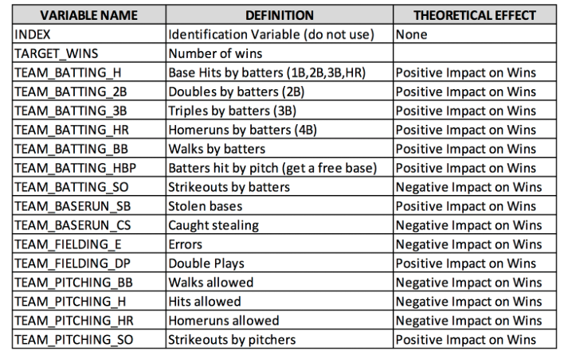

*******

# Overview
In this homework assignment, you will explore, analyze and model a data set containing approximately 2200 records. Each record represents a professional baseball team from the years 1871 to 2006 inclusive. Each record has the performance of the team for the given year, with all of the statistics adjusted to match the performance of a 162 game season.

We have been given a dataset with 2276 records summarizing a major league baseball team's season. The records span 1871 to 2006 inclusive. All statistics have been adjusted to match the performance of a 162 game season.

Your objective is to build a multiple linear regression model on the training data to predict the number of wins for the team. You can only use the variables given to you (or variables that you derive from the variables provided). 

**Glossary of data**
```{r, eval=FALSE}
data.frame(
  `Variable Name` = c("INDEX","TARGET_WINS","TEAM_BATTING_H","TEAM_BATTING_2B","TEAM_BATTING_3B","TEAM_BATTING_HR","TEAM_BATTING_BB","TEAM_BATTING_HBP",
                      "TEAM_BATTING_SO","TEAM_BASERUN_SB","TEAM_BASERUN_CS","TEAM_FIELDING_E","TEAM_FIELDING_DP","TEAM_PITCHING_BB","TEAM_PITCHING_H","TEAM_PITCHING_HR","TEAM_PITCHING_SO"),
  `Definition` = c("Identification Variable (do not use)","Number of wins","Base Hits by batters (1B,2B,3B,HR)","Doubles by batters (2B)","Triples by batters (3B)","Homeruns by batters (4B)","Walks by batters","Batters hit by pitch (get a free base)","Strikeouts by batters","Stolen bases","Caught stealing","Errors","Double Plays","Walks allowed","Hits allowed","Homeruns allowed","Strikeouts by pitchers"),
  `THEORETICAL EFFECT` = c("None","","Positive Impact on Wins","Positive Impact on Wins","Positive Impact on Wins","Positive Impact on Wins","Positive Impact on Wins","Positive Impact on Wins","Negative Impact on Wins","Positive Impact on Wins","Negative Impact on Wins","Negative Impact on Wins","Positive Impact on Wins","Negative Impact on Wins","Negative Impact on Wins","Negative Impact on Wins","Positive Impact on Wins")
) %>%
  kable() %>%
  kable_styling(bootstrap_options = c("striped", "hover", "condensed", "responsive"),full_width = F)
```

Below is a short description of the variables of interest in the data set:


# Deliverables
- A write-up submitted in PDF format. Your write-up should have four sections. Each one is described below. You may assume you are addressing me as a fellow data scientist, so do not need to shy away from technical details.
- Assigned predictions (the number of wins for the team) for the evaluation data set.
- Include your R statistical programming code in an Appendix.

```{r, eval=TRUE, warning=FALSE, message=FALSE, echo=FALSE, results='hide'}
packages <- c("DT","data.table","kableExtra","knitr","stringr","tidyr","tidyverse","dplyr","psych","reshape","mice","caret","e1071","Hmisc","visdat","corrplot","bbmle","DMwR","scatterplot3d","car","broom","corrplot")
install.packages(packages, repos="http://cran.us.r-project.org", dependencies=TRUE)
invisible(lapply(packages, library, character.only = T))
library(DT)
library(data.table)
library(kableExtra)
library(knitr)
library(stringr)
library(tidyr)
library(tidyverse)
library(dplyr)
library(psych)
library(reshape)
library(mice)
library(caret)
library(e1071)
library(Hmisc)
library(visdat)
library(corrplot)
library(bbmle)
library(DMwR)
library(scatterplot3d)
library(car)
library(broom)
library(corrplot)
```

# DATA EXPLORATION
Describe the size and the variables in the moneyball training data set. Consider that too much detail will cause a manager to lose interest while too little detail will make the manager consider that you aren't doing your job. Some suggestions are given below. Please do NOT treat this as a check list of things to do to complete the assignment.

You should have your own thoughts on what to tell the boss. These are just ideas.
a. Mean / Standard Deviation / Median
b. Bar Chart or Box Plot of the data
c. Is the data correlated to the target variable (or to other variables?)
d. Are any of the variables missing and need to be imputed "fixed"?

The data set describes baseball team statistics for the years 1871 to 2006 inclusive. Each record in the data set represents the performance of the team for the given year adjusted to the current length of the season - 162 games. The data set includes 16 variables and the training set includes 2,276 records.

**Load the data and understand the data by using some stats and plots.**
```{r, warning=FALSE, message=FALSE}
mtd <- read.csv("https://raw.githubusercontent.com/Rajwantmishra/DATA621_CR4/master/HW1/Deb/moneyball-training-data.csv")
med <- read.csv("https://raw.githubusercontent.com/Rajwantmishra/DATA621_CR4/master/HW1/Deb/moneyball-evaluation-data.csv")
```

**View rows and columns, variable types**

Glimpse of the data
```{r, warning=FALSE, message=FALSE}
glimpse(mtd)
```
Sample 6 rows with sample 7 columns
```{r, warning=FALSE, message=FALSE}
head(mtd)
```
Show entire dataset
```{r, warning=FALSE, message=FALSE}
DT::datatable(mtd, options = list(pagelength=5))
#DT::datatable(med, options = list(pagelength=5))
```

**Structure of data**
```{r, warning=FALSE, message=FALSE}
paste("Dimension of dataset", dim(mtd))
paste("Count of dataset", count(mtd))
summary(mtd)
describe(mtd)
names(mtd)
str(mtd)

mtd %>%
  summary() %>%
  kable() %>%
  kable_styling()

train <- mtd
test <- med
train$INDEX <- NULL
test$INDEX <- NULL

cleanNames <- function(train) {
    name_list <- names(train)
    name_list <- gsub("TEAM_", "", name_list)
    names(train) <- name_list
    train
}

mtd <- cleanNames(train)
med <- cleanNames(test)
```

**Visualize  the data**

```{r, warning=FALSE, eval=TRUE, include=TRUE, echo=TRUE}
mtd %>%
  gather(variable, value, TARGET_WINS:FIELDING_DP) %>%
  ggplot(., aes(value)) + 
  geom_density(fill = "indianred4", color="indianred4") + 
  facet_wrap(~variable, scales ="free", ncol = 4) +
  labs(x = element_blank(), y = element_blank())
```

In the histogram plot above, we see that the batting, pitching home-run and batting strike-out variables are bi modal. `TARGET_WINS` and `TEAM_BATTING_2B` has most the normal distribution. `PITCHING_H` and `PITCHING_SO` have the most skewed data distribution. The skewed graphs are all rght-skewed except `BATTING_BB`.

```{r}
scatterplot3d(mtd$TARGET_WINS, mtd$BATTING_2B, mtd$BATTING_BB, pch = 20, highlight.3d = TRUE, type = "h", main = "3D ScatterPlots")
```

The above 3-D scatter plot, shows the data variance between the `TARGET_WINS`, `TEAM_BATTING_2B` and `TEAM_BATTING_BB` to provide a comparative view.
 
```{r, warning=FALSE, message=FALSE}
par(mfrow=c(3,2))   
for (i in 1:16) {
      hist(mtd[,i],main=names(mtd[i]),xlab=names(mtd[i]),breaks = 51)
      boxplot(mtd[,i], main=names(mtd[i]), type="l",horizontal = TRUE)
      
      plot(mtd[,i], mtd$TARGET_WINS, main = names(mtd[i]), xlab=names(mtd[i]))
      abline(lm(mtd$TARGET_WINS ~ mtd[,i], data = mtd), col = "blue")
}
```

As can be seen from above histogram, boxplot and scatter plot with regression line shows the spread of the data points. More than half of the variables show skewness. A box-cox transformation may help to mitigate the skewness.

**Missing or NA Values**

We are trying to see how many `NA` is present  in the dataset. 

```{r, warning=FALSE, message=FALSE}
mtd %>% 
  gather(variable, value) %>%
  filter(is.na(value)) %>%
  group_by(variable) %>%
  tally() %>%
  mutate(percent = n / nrow(mtd) * 100) %>%
  mutate(percent = paste0(round(percent, ifelse(percent < 10, 1, 0)), "%")) %>%
  arrange(desc(n)) %>%
#  rename(`Variable Missing Data`=variable,`Number of Records`=n,`Share of Total`=percent) %>%
  kable() %>%
  kable_styling()
```
The variable `BATTING_HBP` (hit by pitcher) is missing over 90% of it's data. 

**Zero Values**

```{r, warning=FALSE, message=FALSE}
mtd %>% 
  gather(variable, value) %>%
  filter(value == 0) %>%
  group_by(variable) %>%
  tally() %>%
  mutate(percent = n / nrow(mtd) * 100) %>%
  mutate(percent = paste0(round(percent, ifelse(percent < 10, 1, 0)), "%")) %>%
  arrange(desc(n)) %>%
#  rename("Variable With Zeros"=variable,"Number of Records"=n,"Share of Total"=percent) %>%
  kable() %>%
  kable_styling()
```
As can be inferred from above, there are Very few zero values exists.

**Checking for outliers**
```{r, warning=FALSE, message=FALSE}
ggplot(stack(mtd), aes(x = ind, y = values)) +
  geom_boxplot() +
  coord_cartesian(ylim = c(0, 2500)) +
  theme(legend.position="none") +
  theme(axis.text.x=element_text(angle=45, hjust=1)) +
  theme(panel.background = element_rect(fill = 'grey'))
```

The box plots reveal that a great majority of the explanatory variables have high variances. Many of the medians and means are also not aligned which demonstrates the outliers' effects.

The variance of some of the explanatory variables greatly exceeds the variance of the response "win" variable. The dataset has many outlines with some observations that are more extreme than the 1.5 * IQR of the box plot whiskers.

**Checking for skewness in the data**
```{r, warning=FALSE, message=FALSE}
melt(mtd) %>%
  ggplot(aes(x= value)) +
    geom_density(fill='red') + facet_wrap(~variable, scales = 'free')
```

As per above, there are several variables like `PITCHING_H`, `PITCHING_BB`, `PITCHING_SO` and `FIELDING_E` are extremely skewed as there are many outliers.

**Finding correlations:**
Below shows the comparative correlations between the 16 variables as it shows the correlation coefficients and thus find correlated variables. Whichever adhere to a fitted straight red line well, ie. change in synch with each other. If the points lie close to the line but the line is curved, it's good nonlinear association and one can still be defined by other. Each individual plot shows the relationship between the variable in the horizontal vs the vertical of the grid. Each individual plot shows the relationship between the variable in the horizontal vs the vertical of the grid, whereas the diagonal is showing a histogram of each variable.

```{r, warning=FALSE, message=FALSE}
DT::datatable(cor(drop_na(mtd[,])), options = list(pagelength=5))
pairs.panels((mtd[,])[1:8])
```

As can be seen from above, `TARGET_WINS` vs `BATTING_2B` is continuous and hence correlated and so is `BATTING_BB` and `BATTING_HR`.

```{r, warning=FALSE, message=FALSE}
pairs.panels((mtd[,])[9:16])
```

As can be seen from above, `BASERUN_CS` vs `BATTING_HBP` is continuous and hence correlated whereas `PITCHING_SO` and `FIELDING_E` is not correlated at all.

```{r, warning=FALSE, message=FALSE}
cor_res <- cor(mtd, use = "complete.obs")
mtd %>% 
  cor(., use = "complete.obs") %>%
  corrplot(., method = "color", type = "upper", tl.col = "black", diag = FALSE)
```

Also, there are some negatively correlated variables. According to the correlation heatmap, the values that correspond most positively are BATTING_H, BATTING_2B, BATTING_HR, BATTING_BB, PITCHING_H, PITCHING_HR, and PITCHING_BB.

```{r, warning=FALSE, message=FALSE}
mtd %>%
  gather(variable, value, -TARGET_WINS) %>%
  ggplot(., aes(value, TARGET_WINS)) + 
  geom_point(fill = "indianred4", color="indianred4") + 
  geom_smooth(method = "lm", se = FALSE, color = "black") + 
  facet_wrap(~variable, scales ="free", ncol = 4) +
  labs(x = element_blank(), y = "Wins")
```
 
Above shows how the data is distributed when compared to the linear regression. Clearly, `PITCHING_H` and `PITCHING_SO` are highly heteroscedastic. Comparatively, `BATTING_HBP` is most homoscedastic.
 
```{r, warning=FALSE, message=FALSE}
cor_res[,1:2]
```

Above shows the correlation coefficient of each variable compared to `TARGET_WINS` and `BATTING_H`.

**Histogram of Variables**
```{r, warning=FALSE, message=FALSE}
hist.data.frame(mtd)

par(mfrow=c(2,3))
plot(TARGET_WINS ~ BATTING_H,mtd)
  abline(lm(TARGET_WINS ~ BATTING_H,data = mtd),col="blue")
plot(TARGET_WINS ~ BATTING_2B,mtd)
  abline(lm(TARGET_WINS ~ BATTING_2B,data = mtd),col="blue")
plot(TARGET_WINS ~ BATTING_3B,mtd)
  abline(lm(TARGET_WINS ~ BATTING_3B,data = mtd),col="blue")
plot(TARGET_WINS ~ BATTING_HR,mtd)
  abline(lm(TARGET_WINS ~ BATTING_HR,data = mtd),col="blue")
plot(TARGET_WINS ~ BATTING_BB,mtd)
  abline(lm(TARGET_WINS ~ BATTING_BB,data = mtd),col="blue")
plot(TARGET_WINS ~ BATTING_SO,mtd)
  abline(lm(TARGET_WINS ~ BATTING_SO,data = mtd),col="blue")
plot(TARGET_WINS ~ BASERUN_SB,mtd)
  abline(lm(TARGET_WINS ~ BASERUN_SB,data = mtd),col="blue")
plot(TARGET_WINS ~ BASERUN_CS,mtd)
  abline(lm(TARGET_WINS ~ BASERUN_CS,data = mtd),col="blue")
plot(TARGET_WINS ~ PITCHING_H,mtd)
  abline(lm(TARGET_WINS ~ PITCHING_H,data = mtd),col="blue")
plot(TARGET_WINS ~ PITCHING_HR,mtd)
  abline(lm(TARGET_WINS ~ PITCHING_HR,data = mtd),col="blue")
plot(TARGET_WINS ~ PITCHING_BB,mtd)
  abline(lm(TARGET_WINS ~ PITCHING_BB,data = mtd),col="blue")
plot(TARGET_WINS ~ PITCHING_SO,mtd)
  abline(lm(TARGET_WINS ~ PITCHING_SO,data = mtd),col="blue")
plot(TARGET_WINS ~ FIELDING_E,mtd)
  abline(lm(TARGET_WINS ~ FIELDING_E,data = mtd),col="blue")
plot(TARGET_WINS ~ FIELDING_DP,mtd)
  abline(lm(TARGET_WINS ~ FIELDING_DP,data = mtd),col="blue")
```

This shows very few variables are normally distributed.

### Missing value by Graph
Here will see how much of data is missing in each predictors. 

```{r, warning=FALSE, message=FALSE}
vis_miss(mtd)
```

Here from the plots we can see  outliers in PITCHING_H,PITCHING_BB and PITCHING_SO 

Also, since BATTING_H is a combination of BATTING_2B, BATTING_3B, BATTING_HR (and also includes batted singles), we will create a new variable BATTING_1B equaling BATTING_H - BATTING_2B - BATTING_3B - BATTING_HR and after creating this we will remove BATTING_H

**Initial Observations**

- Response variable (TARGET_WINS) looks to be normally distributed which means there are good teams, bad teams as well as average teams.
- There are also quite a few variables with missing values. We may need to deal with these in order to have the largest data set possible for modeling.
- A couple variables are bimodal (TEAM_BATTING_HR, TEAM_BATTING_SO, TEAM_PITCHING_HR). This may be a challenge as some of them are missing values and that may be a challenge in filling in missing values.
- Some variables are right skewed (TEAM_BASERUN_CS, TEAM_BASERUN_SB, etc.). This might support the good team theory. It may also introduce non-normally distributed residuals in the model. We shall see.
- Dataset covers a wide time period spanning across multiple "eras" of baseball. 

# DATA PREPARATION
Describe how you have transformed the data by changing the original variables or creating new variables. If you did transform the data or create new variables, discuss why you did this. Here are some possible transformations.
a. Fix missing values (maybe with a Mean or Median value)
b. Create flags to suggest if a variable was missing
c. Transform data by putting it into buckets
d. Mathematical transforms such as log or square root (or use Box-Cox)
e. Combine variables (such as ratios or adding or multiplying) to create new variables

**Fixing Missing/Zero Values**
- Remove the invalid data and prep it for imputation. 
- We could "discard" the TEAM_BATTING_HBP,due to the high percentage of missing data; particularly, replacing it by "ZERO" should not be advisable
since the minimum value recorded is 29 and replacing it with a median value would not be much helpful due to high percentage of missing values. We decided not to consider this variable for our study.
- A typical professional league baseball game has 9 innings (extra innings come to play in the event of a tie) in length, and in each inning one can only pitch 3 strikeouts. There have been a maximum of 27 potential strikeouts upto a maximum of by 162 games for each of the 30 teams in the American League (AL) and National League (NL), played over approximately six months in Major League Baseball (MLB) season. Therefore having more than 4374 strikeouts (9x3x162) is not possible. Incidentally, the maximum strikeouts in any baseball season has been 513 by Matt Kilroy in the year 1886	as part of Baltimore Orioles within American Association League,

```{r, warning=FALSE, message=FALSE}
remove_bad_values <- function(df){
  # Change 0's to NA so they too can be imputed
  df <- df %>% mutate(BATTING_SO = ifelse(BATTING_SO == 0, NA, BATTING_SO))
  
  # Remove the high pitching strikeout values
  df[which(df$PITCHING_SO > 4374),"PITCHING_SO"] <- NA
  
  # Drop the hit by pitcher variable
  df %>% select(-BATTING_HBP)
}
mtd <- remove_bad_values(mtd)
med <- remove_bad_values(med) %>% na.omit()
```

**Imputing the values using KNN**
```{r, eval=TRUE, warning=FALSE, message=FALSE}
set.seed(42)
knn <- mtd %>% DMwR::knnImputation()
impute_values <- function(df, knn){
  impute_me <- is.na(df$BATTING_SO)
  df[impute_me,"BATTING_SO"] <- knn[impute_me,"BATTING_SO"] 
  impute_me <- is.na(df$BASERUN_SB)
  df[impute_me,"BASERUN_SB"] <- knn[impute_me,"BASERUN_SB"] 
  impute_me <- is.na(df$BASERUN_CS)
  df[impute_me,"BASERUN_CS"] <- knn[impute_me,"BASERUN_CS"] 
  impute_me <- is.na(df$PITCHING_SO)
  df[impute_me,"PITCHING_SO"] <- knn[impute_me,"PITCHING_SO"]
  impute_me <- is.na(df$FIELDING_DP)
  df[impute_me,"FIELDING_DP"] <- knn[impute_me,"FIELDING_DP"]
  return(df)
}
imputed_mtd_Data <- impute_values(mtd, knn)

# Including batting singles
add_features <- function(df){
  df %>%
    mutate(BATTING_1B = BATTING_H - BATTING_2B - BATTING_3B - BATTING_HR)
}

mtd <- add_features(mtd)
med <- add_features(med)
```

# BUILD MODELS
Using the training data set, build at least three different multiple linear regression models, using different variables (or the same variables with different transformations). Since we have not yet covered automated variable selection methods, you should select the variables manually (unless you previously learned Forward or Stepwise selection, etc.). Since you manually selected a variable for inclusion into the model or exclusion into the model,
indicate why this was done.

Discuss the coefficients in the models, do they make sense? For example, if a team hits a lot of Home Runs, it would be reasonably expected that such a team would win more games. However, if the coefficient is negative (suggesting that the team would lose more games), then that needs to be discussed. Are you keeping the model even though it is counter intuitive? Why? The boss needs to know.

```{r, eval=TRUE, warning=FALSE, message=FALSE}
set.seed(42)
train_index <- createDataPartition(mtd$TARGET_WINS, p = .7, list = FALSE, times = 1)
moneyball_train <- mtd[train_index,]
moneyball_test <- mtd[-train_index,]
```
  
## Model 1 : Kitchen Sink Model/Backward Elimination 
With all variables to determine the base model provided. This would allow to see which variables are significant in our dataset, and allows to make other models based on that.
```{r, eval=TRUE, warning=FALSE}
# Result to hold all the main info about model
result<- data.frame("ModelName"=NA,"Variables"=NA,"Removed"=NA,"Adjusted R2"=NA,"P-Value" =NA, "AIC"= NA , "Note"= NA)
model1 <- lm(TARGET_WINS ~., data=moneyball_train)
summary(model1)

# Storing data for future ref
result <- rbind(result,
                c("ModelName" = "model1",
                 "Variables" = paste0(formula(model1)[3]),
                 "Removed"= NA,
                 "Adjusted R2" = round(summary(model1)$adj.r.squared,4),
                 "P-Value" = glance(model1)$p.value,
                 "AIC" = glance(model1)$AIC,
                 "Note"= "BATTING_2B,BATTING_3B,BASERUN_SB ,BASERUN_CS,FIELDING_E,FIELDING_DP"))
```

It does a fairly good job predicting, but there are a lot of variables that are not statistically significant. We see the that P-value is less than .05 which makes it one of the possible model but not all the coefficients of the `model1` are significant. 

### PLOT
```{r, warning=FALSE, message=FALSE}
par(mfrow=c(2,2))
plot(model1)
```

## Model 2 : Simple Model
With only the significant variables: Pick variables that had high correlations and include the pitching variables 
```{r, eval=TRUE, warning=FALSE, message=FALSE}
model2 <- lm(TARGET_WINS ~ BATTING_H  + BATTING_3B  + BATTING_HR + BATTING_BB  + BATTING_SO + 
                           BASERUN_SB + PITCHING_SO + PITCHING_H + PITCHING_SO + 
                           FIELDING_E + FIELDING_DP, data=moneyball_train)
summary(model2)

# Storing data for future ref
result <- rbind(result,
                c("ModelName" = "model2",
                 "Variables" = paste0(formula(model2)[3]),
                 "Removed"= NA,
                 "Adjusted R2" = round(summary(model2)$adj.r.squared,4),
                 "P-Value" = glance(model2)$p.value,
                 "AIC" = glance(model2)$AIC,
                 "Note"= "All are significant"))
```
### PLOT
```{r, warning=FALSE, message=FALSE}
par(mfrow=c(2,2))
plot(model2)
```

## Model 3 : Higher Order Stepwise Regression

Only taking the variable from the Model1 that are really significant.

```{r, warning=FALSE, message=FALSE}
model3a <- lm(TARGET_WINS~BATTING_2B+BATTING_3B+BASERUN_SB+BASERUN_CS+FIELDING_E+FIELDING_DP,  data=moneyball_train)
summary(model3a)
# Storing data for future ref

result <- rbind(result,
                c("ModelName" = "model3a",
                 "Variables" = paste0(formula(model3a)[3]),
                 "Removed"= NA,
                 "Adjusted R2" = round(summary(model3a)$adj.r.squared,4),
                 "P-Value" = glance(model3a)$p.value,
                 "AIC" = glance(model3a)$AIC,
                 "Note"= "BATTING_3B,FIELDING_E ,BATTING_2B,FIELDING_DP are significant"))

model3b <- lm(TARGET_WINS~BATTING_3B + FIELDING_E + BATTING_2B + FIELDING_DP,  data=moneyball_train)
summary(model3b)
result <- rbind(result,
                c("ModelName" = "model3b",
                 "Variables" = paste0(formula(model3b)[3]),
                 "Removed"= NA,
                 "Adjusted R2" = round(summary(model3b)$adj.r.squared,4),
                 "P-Value" = glance(model3b)$p.value,
                 "AIC" = glance(model3b)$AIC,
                 "Note"= "All are significant"))
```

Further reducing the variables(TEAM_PITCHING_SO and TEAM_BATTING_SO are having high correlation, TEAM_BATTING_H and TEAM_PITCHING_H are also having high correlation, TEAM_BATTING_SO and TEAM_PITCHING_SO are also having high correlation):
```{r, eval=TRUE, warning=FALSE, message=FALSE}
model3 <- lm(TARGET_WINS ~ BATTING_1B + BATTING_2B + BATTING_3B + BATTING_HR + BATTING_BB + BATTING_SO + 
                           BASERUN_SB + BASERUN_CS + 
                           PITCHING_H + PITCHING_HR + PITCHING_BB + PITCHING_SO + 
                           FIELDING_E + FIELDING_DP, data=moneyball_train)
#+I(BATTING_1B^2) + I(BATTING_2B^2) + I(BATTING_3B^2) + I(BATTING_HR^2) + I(BATTING_BB^2) + I(BATTING_SO^2) + 
#+I(BASERUN_SB^2) + I(BASERUN_CS^2) + 
#+I(PITCHING_H^2) + I(PITCHING_HR^2) + I(PITCHING_BB^2) + I(PITCHING_SO^2) + 
#+I(FIELDING_E^2) + I(FIELDING_DP^2) + 
#+I(BATTING_2B^3) + I(BATTING_3B^3) + I(BATTING_HR^3) + I(BATTING_BB^3) + I(BATTING_SO^3) + 
#+I(BASERUN_SB^3) + I(BASERUN_CS^3) + 
#+I(PITCHING_H^3) + I(PITCHING_HR^3) + I(PITCHING_BB^3) + I(PITCHING_SO^3) + 
#+I(FIELDING_E^3) + I(FIELDING_DP^3) + 
#+I(BATTING_1B^3) + I(BATTING_2B^4) + I(BATTING_3B^4) + I(BATTING_HR^4) + I(BATTING_BB^4) + I(BATTING_SO^4) + 
#+I(BASERUN_SB^4) + I(BASERUN_CS^4) + 
#+I(PITCHING_H^4) + I(PITCHING_HR^4) + I(PITCHING_BB^4) + I(PITCHING_SO^4) + 
#+I(FIELDING_E^4) + I(FIELDING_DP^4) + I(BATTING_1B^4)

summary(model3)
result <- rbind(result,
                c("ModelName" = "model3",
                 "Variables" = paste0(formula(model3)[3]),
                 "Removed"= NA,
                 "Adjusted R2" = round(summary(model3)$adj.r.squared,4),
                 "P-Value" = glance(model3)$p.value,
                 "AIC" = glance(model3)$AIC,
                 "Note"= "Nothing is significant"))

# StepBack Model
step_back <- MASS::stepAIC(model3, direction="backward", trace = F)
poly_call <- summary(step_back)$call
step_back <- lm(poly_call[2], moneyball_train)
summary(step_back)

result <- rbind(result,
                c("ModelName" = "step_back",
                 "Variables" = paste0(formula(step_back)[3]),
                 "Removed"= NA,
                 "Adjusted R2" = round(summary(step_back)$adj.r.squared,4),
                 "P-Value" = glance(step_back)$p.value,
                 "AIC" = glance(step_back)$AIC,
                 "Note"= "more vars significant"))
```

### Plot Model 3
```{r, warning=FALSE, message=FALSE}
par(mfrow=c(2,2))
plot(model3)
plot(model3a)
plot(model3b)
```

# SELECT MODELS 
Decide on the criteria for selecting the best multiple linear regression model. Will you select a model with slightly worse performance if it makes more sense or is more parsimonious? Discuss why you selected your model.

For the multiple linear regression model, will you use a metric such as Adjusted R2, RMSE, etc.? Be sure to explain how you can make inferences from the model, discuss multi-collinearity issues (if any), and discuss other relevant model output. Using the training data set, evaluate the multiple linear regression model based on 
(a) mean squared error, 
(b) R2, 
(c) F-statistic, and 
(d) residual plots. 

Make predictions using the evaluation data set.

Lets review the result for each our our model:

```{r, warning=FALSE, message=FALSE}
datatable(result[,-c(2,3)])
```

### Multicolinearity 

Lets Evaluate if we have any multicolinearity in our model1s.Multicollinearity (also collinearity) is a statistical phenomenon in which two or more predictor variables in a multiple regression model are highly correlated, meaning that one can be linearly predicted from the others with a non-trivial degree of accuracy.

We will user alias function to detect the collinearity of all the predictor in the model1. 

#### Model 1
```{r, warning=FALSE, message=FALSE}
alias(model1)
# vif(lm(TARGET_WINS~.,moneyball_train[,-c(2,3,4,5)]))

corrplot(cor(mtd),type = 'upper')
# dput(model1)
```
Result shows that `BATTING_1B`  is corealted with `BATTING_H` , `BATTING_2B` `BATTING_3B` ,  `BATTING_HR` . Here `+1` and `-1` are indicative of sign of coefecifint of the repstive predictor while stating the value for `BATTING_1B`. 

Corrplot also suggest the same except , it doen't show high correlation between `BATTING_H``BATTING_HR`. In our Model2 , we well just follow the p-value significance test and build the model. 

```{r, warning=FALSE, message=FALSE}
# Make predictions
predictions <- model1 %>% predict(moneyball_test)

# Model performance
data.frame(
  RMSE = RMSE(predictions, moneyball_test$TARGET_WINS,na.rm = TRUE),
  R2 = R2(predictions,moneyball_test$TARGET_WINS,na.rm = TRUE)
)
```

### Model 2

Here `alias` doen't suggest any correlated predictor. Now we can run VIF (variance inflation factor), which measures how much the variance of a regression coefficient is inflated due to multicollinearity in the model.
The smallest possible value of VIF is one (absence of multicollinearity). Here we will look for VIF value, if that exceeds 5 or 10 indicates a problematic amount of collinearity. "Read More"['http://www.sthda.com/english/articles/39-regression-model-diagnostics/160-multicollinearity-essentials-and-vif-in-r/']

```{r, warning=FALSE, message=FALSE}
alias(model2)

vif(model2)
```

VIF output suggest that BATTING_H, PITCHING_H, BATTING_SO,PITCHING_SO are highly impacting model due their colinear relation.

```{r, warning=FALSE, message=FALSE}
# Make predictions
predictions <- model2 %>% predict(moneyball_test)
# Model performance
data.frame(
  RMSE = RMSE(predictions, moneyball_test$TARGET_WINS,na.rm = TRUE),
  R2 = R2(predictions,moneyball_test$TARGET_WINS,na.rm = TRUE)
)
```

#### Model 3

```{r, warning=FALSE, message=FALSE}
# Make predictions
predictions <- model3 %>% predict(moneyball_test)
# Model performance
data.frame(
  RMSE = RMSE(predictions, moneyball_test$TARGET_WINS,na.rm = TRUE),
  R2 = R2(predictions,moneyball_test$TARGET_WINS,na.rm = TRUE)
)
```

#### Model 4
```{r, warning=FALSE, message=FALSE}
# Model 4
model4 <- lm(TARGET_WINS~. -BATTING_H- BATTING_2B -BATTING_3B-  BATTING_HR, data= moneyball_train)
summary(model4)
vif(model4)

# Make predictions
predictions <- model4 %>% predict(moneyball_test)
# Model performance
data.frame(
  RMSE = RMSE(predictions, moneyball_test$TARGET_WINS,na.rm = TRUE),
  R2 = R2(predictions,moneyball_test$TARGET_WINS,na.rm = TRUE)
)
```

#### Model 5
```{r, warning=FALSE, message=FALSE}
model5 <- lm(TARGET_WINS~.   -PITCHING_SO	 -PITCHING_BB -BATTING_H- BATTING_2B -BATTING_3B-  BATTING_HR, data= moneyball_train)

summary(model5)
vif(model5)

predictions <- model5 %>% predict(moneyball_test)

# Model performance
data.frame(
  RMSE = RMSE(predictions, moneyball_test$TARGET_WINS,na.rm = TRUE),
  R2 = R2(predictions,moneyball_test$TARGET_WINS,na.rm = TRUE)
)
```

#### Step back
 VIF result suggest that all the predictors in the model `step_back` have no multicolinearirty exist in them. 
 
```{r, warning=FALSE, message=FALSE}
# model5 <- lm(TARGET_WINS~.   -PITCHING_SO	 -PITCHING_BB -BATTING_H- BATTING_2B -BATTING_3B-  BATTING_HR, data= moneyball_train)

summary(step_back)
vif(step_back)

predictions <- step_back %>% predict(moneyball_test)
# Model performance
data.frame(
  RMSE = RMSE(predictions, moneyball_test$TARGET_WINS,na.rm = TRUE),
  R2 = R2(predictions,moneyball_test$TARGET_WINS,na.rm = TRUE)
)
```

Lets only consider Model with beter RMSE and R2 and check it with AIC test:

| Model Name | RMSE    | R^2     |
|------------|---------|---------|
| model1     | 9.80421 | 0.42556 |
| model2     | 10.2591 | 0.38835 |
| model3     | 10.0631 | 0.40604 |
| model4     | 9.92225 | 0.41098 |
| model5     | 9.99109 | 0.40295 |
| Step Back  | 9.77083 | 0.428734|

```{r, warning=FALSE, message=FALSE}
bbmle::AICctab(step_back,model4,model5,delta=TRUE, weights=TRUE)

```

In Both test  `Model1` is doing well, but since its not a parsomonious model we decided to check among `model4` and `model5` and `step_back`. Which is a parsomonious model, with no multicolnearity among the predictors. 
We also note how multicolinearity in models were impacting its effect on overall perfromcne of the model.

Selected Model = `step_back`

## Run the `step_backward` model on Eval data.
```{r, warning=FALSE, message=FALSE}
model <- lm(BATTING_H~., data=med)

# StepBack Model
#step_backward_model <- MASS::stepAIC(model, direction="backward", trace = F)
#poly_call <- summary(step_backward_model)$call
#step_backward_model <- lm(poly_call[2], moneyball_train)
#summary(step_backward_model)

step_backward_model <- step (model, direction = "backward")
summary(step_backward_model)
```

From the three models, model3 is a more parsimonious model. There is no significant difference in R2, Adjusted R2 and RMSE even when i did the treatment for multi-collinearity.

### Model 1 : Kitchen Sink Model  
```{r, warning=FALSE, message=FALSE}
plot(model1)

moneyball_test$kitchen_sink <- predict(model1, moneyball_test)
moneyball_test <- moneyball_test %>%
                    mutate(kitchen_sink_error = TARGET_WINS - kitchen_sink)

ggplot(moneyball_test, aes(kitchen_sink_error)) +
  geom_histogram(bins = 50) +
  annotate("text",x=0,y=10,
           label = paste("RMSE = ",
                         round(sqrt(mean(moneyball_test$kitchen_sink_error^2)),2)
                         ),
           color="white"
           )
summary(moneyball_test$kitchen_sink_error)
```

### Model 2 : Simple Model
```{r, warning=FALSE, message=FALSE}
plot(model2)

moneyball_test$simple <- predict(model2, moneyball_test)
moneyball_test <- moneyball_test %>%
                    mutate(simple_error = TARGET_WINS - simple)

ggplot(moneyball_test, aes(simple_error)) +
  geom_histogram(bins = 50) +
  annotate("text",x=0,y=10,
           label = paste("RMSE = ",
                         round(sqrt(mean(moneyball_test$simple_error^2)),2)
                         ),
           color="white"
           )
summary(moneyball_test$simple_error)
```

### Model 3 : Higher Order Stepwise Regression
```{r, warning=FALSE, message=FALSE}
plot(step_back)

moneyball_test$step_back <- round(predict(step_back, moneyball_test), 0)
moneyball_test <- moneyball_test %>%
                    mutate(step_back_error = TARGET_WINS - step_back)

moneyball_test %>%
  filter(step_back_error > -100) %>%
  ggplot(., aes(step_back_error)) +
  geom_histogram(bins = 50) +
  labs(caption = "Outlier removed")
summary(moneyball_test$step_back_error)
```

# CONCLUSION

This report covers an attempt to build a model to predict number of wins of a baseball team in a season based on several offensive and deffensive statistics. Resulting model explained about 36% of variability in the target variable and included most of the provided explanatory variables. Some potentially helpful variables were not included in the data set. For instance, number of At Bats can be used to calculate on-base percentage which may correlate strongly with winning percentage. The model can be revised with additional variables or further analysis. 

```{r, warning=FALSE, message=FALSE}
moneyball_test %>%
  select(kitchen_sink_error, simple_error, step_back_error) %>%
  summary() %>%
  kable() %>%
  kable_styling()
```

