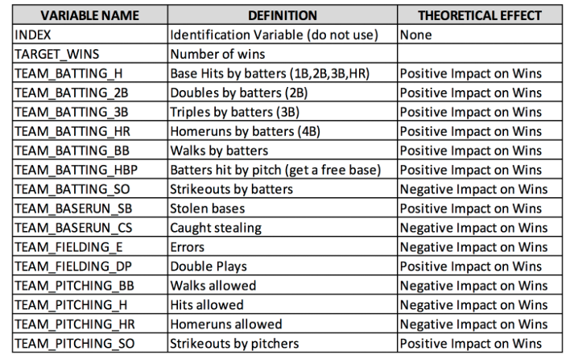

*******

# Overview {.tabset .tabset-fade .tabset-pills}
In this homework assignment, you will explore, analyze and model a data set containing approximately 2200 records. Each record represents a professional baseball team from the years 1871 to 2006 inclusive. Each record has the performance of the team for the given year, with all of the statistics adjusted to match the performance of a 162 game season.

We have been given a dataset with 2276 records summarizing a major league baseball team's season. The records span 1871 to 2006 inclusive. All statistics have been adjusted to match the performance of a 162 game season.

Your objective is to build a multiple linear regression model on the training data to predict the number of wins for the team. You can only use the variables given to you (or variables that you derive from the variables provided). 

**Glossary of data**

```r
data.frame(
  `Variable Name` = c("INDEX","TARGET_WINS","TEAM_BATTING_H","TEAM_BATTING_2B","TEAM_BATTING_3B","TEAM_BATTING_HR","TEAM_BATTING_BB","TEAM_BATTING_HBP",
                      "TEAM_BATTING_SO","TEAM_BASERUN_SB","TEAM_BASERUN_CS","TEAM_FIELDING_E","TEAM_FIELDING_DP","TEAM_PITCHING_BB","TEAM_PITCHING_H","TEAM_PITCHING_HR","TEAM_PITCHING_SO"),
  `Definition` = c("Identification Variable (do not use)","Number of wins","Base Hits by batters (1B,2B,3B,HR)","Doubles by batters (2B)","Triples by batters (3B)","Homeruns by batters (4B)","Walks by batters","Batters hit by pitch (get a free base)","Strikeouts by batters","Stolen bases","Caught stealing","Errors","Double Plays","Walks allowed","Hits allowed","Homeruns allowed","Strikeouts by pitchers"),
  `THEORETICAL EFFECT` = c("None","","Positive Impact on Wins","Positive Impact on Wins","Positive Impact on Wins","Positive Impact on Wins","Positive Impact on Wins","Positive Impact on Wins","Negative Impact on Wins","Positive Impact on Wins","Negative Impact on Wins","Negative Impact on Wins","Positive Impact on Wins","Negative Impact on Wins","Negative Impact on Wins","Negative Impact on Wins","Positive Impact on Wins")
) %>%
  kable() %>%
  kable_styling(bootstrap_options = c("striped", "hover", "condensed", "responsive"),full_width = F)
```

Below is a short description of the variables of interest in the data set:


# Deliverables {.tabset .tabset-fade .tabset-pills}
- A write-up submitted in PDF format. Your write-up should have four sections. Each one is described below. You may assume you are addressing me as a fellow data scientist, so do not need to shy away from technical details.
- Assigned predictions (the number of wins for the team) for the evaluation data set.
- Include your R statistical programming code in an Appendix.


# DATA EXPLORATION 

The data set describes baseball team statistics for the years 1871 to 2006 inclusive. Each record in the data set represents the performance of the team for the given year adjusted to the current length of the season - 162 games. The data set includes 16 variables and the training set includes 2,276 records.

Load the data and understand the data by using some stats and plott

```r
mtd <- read.csv("https://raw.githubusercontent.com/Rajwantmishra/DATA621_CR4/master/HW1/Deb/moneyball-training-data.csv")
med <- read.csv("https://raw.githubusercontent.com/Rajwantmishra/DATA621_CR4/master/HW1/Deb/moneyball-evaluation-data.csv")
```

## View rows and columns, variable types

Glimpse of the data shows that all variables are numeric, no ctegorical variable is present here. We do lots of NA for few predcitors in the data set. In our further analysis we will try to identify :

+ Structure of the each predictors 
+ How Many NA and Zero , is it significant to remove them or replace them with some predicted value. 
+ Statistical summary of the data


```r
glimpse(mtd)
```

```
## Observations: 2,276
## Variables: 17
## $ INDEX            <int> 1, 2, 3, 4, 5, 6, 7, 8, 11, 12, 13, 15, 16, 17, 18...
## $ TARGET_WINS      <int> 39, 70, 86, 70, 82, 75, 80, 85, 86, 76, 78, 68, 72...
## $ TEAM_BATTING_H   <int> 1445, 1339, 1377, 1387, 1297, 1279, 1244, 1273, 13...
## $ TEAM_BATTING_2B  <int> 194, 219, 232, 209, 186, 200, 179, 171, 197, 213, ...
## $ TEAM_BATTING_3B  <int> 39, 22, 35, 38, 27, 36, 54, 37, 40, 18, 27, 31, 41...
## $ TEAM_BATTING_HR  <int> 13, 190, 137, 96, 102, 92, 122, 115, 114, 96, 82, ...
## $ TEAM_BATTING_BB  <int> 143, 685, 602, 451, 472, 443, 525, 456, 447, 441, ...
## $ TEAM_BATTING_SO  <int> 842, 1075, 917, 922, 920, 973, 1062, 1027, 922, 82...
## $ TEAM_BASERUN_SB  <int> NA, 37, 46, 43, 49, 107, 80, 40, 69, 72, 60, 119, ...
## $ TEAM_BASERUN_CS  <int> NA, 28, 27, 30, 39, 59, 54, 36, 27, 34, 39, 79, 10...
## $ TEAM_BATTING_HBP <int> NA, NA, NA, NA, NA, NA, NA, NA, NA, NA, NA, NA, NA...
## $ TEAM_PITCHING_H  <int> 9364, 1347, 1377, 1396, 1297, 1279, 1244, 1281, 13...
## $ TEAM_PITCHING_HR <int> 84, 191, 137, 97, 102, 92, 122, 116, 114, 96, 86, ...
## $ TEAM_PITCHING_BB <int> 927, 689, 602, 454, 472, 443, 525, 459, 447, 441, ...
## $ TEAM_PITCHING_SO <int> 5456, 1082, 917, 928, 920, 973, 1062, 1033, 922, 8...
## $ TEAM_FIELDING_E  <int> 1011, 193, 175, 164, 138, 123, 136, 112, 127, 131,...
## $ TEAM_FIELDING_DP <int> NA, 155, 153, 156, 168, 149, 186, 136, 169, 159, 1...
```

Sample 6 rows with sample 7 columns

```r
head(mtd)
```

<div data-pagedtable="false">
  <script data-pagedtable-source type="application/json">
{"columns":[{"label":[""],"name":["_rn_"],"type":[""],"align":["left"]},{"label":["INDEX"],"name":[1],"type":["int"],"align":["right"]},{"label":["TARGET_WINS"],"name":[2],"type":["int"],"align":["right"]},{"label":["TEAM_BATTING_H"],"name":[3],"type":["int"],"align":["right"]},{"label":["TEAM_BATTING_2B"],"name":[4],"type":["int"],"align":["right"]},{"label":["TEAM_BATTING_3B"],"name":[5],"type":["int"],"align":["right"]},{"label":["TEAM_BATTING_HR"],"name":[6],"type":["int"],"align":["right"]},{"label":["TEAM_BATTING_BB"],"name":[7],"type":["int"],"align":["right"]},{"label":["TEAM_BATTING_SO"],"name":[8],"type":["int"],"align":["right"]},{"label":["TEAM_BASERUN_SB"],"name":[9],"type":["int"],"align":["right"]},{"label":["TEAM_BASERUN_CS"],"name":[10],"type":["int"],"align":["right"]},{"label":["TEAM_BATTING_HBP"],"name":[11],"type":["int"],"align":["right"]},{"label":["TEAM_PITCHING_H"],"name":[12],"type":["int"],"align":["right"]},{"label":["TEAM_PITCHING_HR"],"name":[13],"type":["int"],"align":["right"]},{"label":["TEAM_PITCHING_BB"],"name":[14],"type":["int"],"align":["right"]},{"label":["TEAM_PITCHING_SO"],"name":[15],"type":["int"],"align":["right"]},{"label":["TEAM_FIELDING_E"],"name":[16],"type":["int"],"align":["right"]},{"label":["TEAM_FIELDING_DP"],"name":[17],"type":["int"],"align":["right"]}],"data":[{"1":"1","2":"39","3":"1445","4":"194","5":"39","6":"13","7":"143","8":"842","9":"NA","10":"NA","11":"NA","12":"9364","13":"84","14":"927","15":"5456","16":"1011","17":"NA","_rn_":"1"},{"1":"2","2":"70","3":"1339","4":"219","5":"22","6":"190","7":"685","8":"1075","9":"37","10":"28","11":"NA","12":"1347","13":"191","14":"689","15":"1082","16":"193","17":"155","_rn_":"2"},{"1":"3","2":"86","3":"1377","4":"232","5":"35","6":"137","7":"602","8":"917","9":"46","10":"27","11":"NA","12":"1377","13":"137","14":"602","15":"917","16":"175","17":"153","_rn_":"3"},{"1":"4","2":"70","3":"1387","4":"209","5":"38","6":"96","7":"451","8":"922","9":"43","10":"30","11":"NA","12":"1396","13":"97","14":"454","15":"928","16":"164","17":"156","_rn_":"4"},{"1":"5","2":"82","3":"1297","4":"186","5":"27","6":"102","7":"472","8":"920","9":"49","10":"39","11":"NA","12":"1297","13":"102","14":"472","15":"920","16":"138","17":"168","_rn_":"5"},{"1":"6","2":"75","3":"1279","4":"200","5":"36","6":"92","7":"443","8":"973","9":"107","10":"59","11":"NA","12":"1279","13":"92","14":"443","15":"973","16":"123","17":"149","_rn_":"6"}],"options":{"columns":{"min":{},"max":[10]},"rows":{"min":[10],"max":[10]},"pages":{}}}
  </script>
</div>

Show entire dataset of training data

```r
DT::datatable(mtd, options = list(pagelength=5))
```

<!--html_preserve--><div id="htmlwidget-83beaab24cd89bf1bce2" style="width:100%;height:auto;" class="datatables html-widget"></div>
<script type="application/json" data-for="htmlwidget-83beaab24cd89bf1bce2">{"x":{"filter":"none","data":[["1","2","3","4","5","6","7","8","9","10","11","12","13","14","15","16","17","18","19","20","21","22","23","24","25","26","27","28","29","30","31","32","33","34","35","36","37","38","39","40","41","42","43","44","45","46","47","48","49","50","51","52","53","54","55","56","57","58","59","60","61","62","63","64","65","66","67","68","69","70","71","72","73","74","75","76","77","78","79","80","81","82","83","84","85","86","87","88","89","90","91","92","93","94","95","96","97","98","99","100","101","102","103","104","105","106","107","108","109","110","111","112","113","114","115","116","117","118","119","120","121","122","123","124","125","126","127","128","129","130","131","132","133","134","135","136","137","138","139","140","141","142","143","144","145","146","147","148","149","150","151","152","153","154","155","156","157","158","159","160","161","162","163","164","165","166","167","168","169","170","171","172","173","174","175","176","177","178","179","180","181","182","183","184","185","186","187","188","189","190","191","192","193","194","195","196","197","198","199","200","201","202","203","204","205","206","207","208","209","210","211","212","213","214","215","216","217","218","219","220","221","222","223","224","225","226","227","228","229","230","231","232","233","234","235","236","237","238","239","240","241","242","243","244","245","246","247","248","249","250","251","252","253","254","255","256","257","258","259","260","261","262","263","264","265","266","267","268","269","270","271","272","273","274","275","276","277","278","279","280","281","282","283","284","285","286","287","288","289","290","291","292","293","294","295","296","297","298","299","300","301","302","303","304","305","306","307","308","309","310","311","312","313","314","315","316","317","318","319","320","321","322","323","324","325","326","327","328","329","330","331","332","333","334","335","336","337","338","339","340","341","342","343","344","345","346","347","348","349","350","351","352","353","354","355","356","357","358","359","360","361","362","363","364","365","366","367","368","369","370","371","372","373","374","375","376","377","378","379","380","381","382","383","384","385","386","387","388","389","390","391","392","393","394","395","396","397","398","399","400","401","402","403","404","405","406","407","408","409","410","411","412","413","414","415","416","417","418","419","420","421","422","423","424","425","426","427","428","429","430","431","432","433","434","435","436","437","438","439","440","441","442","443","444","445","446","447","448","449","450","451","452","453","454","455","456","457","458","459","460","461","462","463","464","465","466","467","468","469","470","471","472","473","474","475","476","477","478","479","480","481","482","483","484","485","486","487","488","489","490","491","492","493","494","495","496","497","498","499","500","501","502","503","504","505","506","507","508","509","510","511","512","513","514","515","516","517","518","519","520","521","522","523","524","525","526","527","528","529","530","531","532","533","534","535","536","537","538","539","540","541","542","543","544","545","546","547","548","549","550","551","552","553","554","555","556","557","558","559","560","561","562","563","564","565","566","567","568","569","570","571","572","573","574","575","576","577","578","579","580","581","582","583","584","585","586","587","588","589","590","591","592","593","594","595","596","597","598","599","600","601","602","603","604","605","606","607","608","609","610","611","612","613","614","615","616","617","618","619","620","621","622","623","624","625","626","627","628","629","630","631","632","633","634","635","636","637","638","639","640","641","642","643","644","645","646","647","648","649","650","651","652","653","654","655","656","657","658","659","660","661","662","663","664","665","666","667","668","669","670","671","672","673","674","675","676","677","678","679","680","681","682","683","684","685","686","687","688","689","690","691","692","693","694","695","696","697","698","699","700","701","702","703","704","705","706","707","708","709","710","711","712","713","714","715","716","717","718","719","720","721","722","723","724","725","726","727","728","729","730","731","732","733","734","735","736","737","738","739","740","741","742","743","744","745","746","747","748","749","750","751","752","753","754","755","756","757","758","759","760","761","762","763","764","765","766","767","768","769","770","771","772","773","774","775","776","777","778","779","780","781","782","783","784","785","786","787","788","789","790","791","792","793","794","795","796","797","798","799","800","801","802","803","804","805","806","807","808","809","810","811","812","813","814","815","816","817","818","819","820","821","822","823","824","825","826","827","828","829","830","831","832","833","834","835","836","837","838","839","840","841","842","843","844","845","846","847","848","849","850","851","852","853","854","855","856","857","858","859","860","861","862","863","864","865","866","867","868","869","870","871","872","873","874","875","876","877","878","879","880","881","882","883","884","885","886","887","888","889","890","891","892","893","894","895","896","897","898","899","900","901","902","903","904","905","906","907","908","909","910","911","912","913","914","915","916","917","918","919","920","921","922","923","924","925","926","927","928","929","930","931","932","933","934","935","936","937","938","939","940","941","942","943","944","945","946","947","948","949","950","951","952","953","954","955","956","957","958","959","960","961","962","963","964","965","966","967","968","969","970","971","972","973","974","975","976","977","978","979","980","981","982","983","984","985","986","987","988","989","990","991","992","993","994","995","996","997","998","999","1000","1001","1002","1003","1004","1005","1006","1007","1008","1009","1010","1011","1012","1013","1014","1015","1016","1017","1018","1019","1020","1021","1022","1023","1024","1025","1026","1027","1028","1029","1030","1031","1032","1033","1034","1035","1036","1037","1038","1039","1040","1041","1042","1043","1044","1045","1046","1047","1048","1049","1050","1051","1052","1053","1054","1055","1056","1057","1058","1059","1060","1061","1062","1063","1064","1065","1066","1067","1068","1069","1070","1071","1072","1073","1074","1075","1076","1077","1078","1079","1080","1081","1082","1083","1084","1085","1086","1087","1088","1089","1090","1091","1092","1093","1094","1095","1096","1097","1098","1099","1100","1101","1102","1103","1104","1105","1106","1107","1108","1109","1110","1111","1112","1113","1114","1115","1116","1117","1118","1119","1120","1121","1122","1123","1124","1125","1126","1127","1128","1129","1130","1131","1132","1133","1134","1135","1136","1137","1138","1139","1140","1141","1142","1143","1144","1145","1146","1147","1148","1149","1150","1151","1152","1153","1154","1155","1156","1157","1158","1159","1160","1161","1162","1163","1164","1165","1166","1167","1168","1169","1170","1171","1172","1173","1174","1175","1176","1177","1178","1179","1180","1181","1182","1183","1184","1185","1186","1187","1188","1189","1190","1191","1192","1193","1194","1195","1196","1197","1198","1199","1200","1201","1202","1203","1204","1205","1206","1207","1208","1209","1210","1211","1212","1213","1214","1215","1216","1217","1218","1219","1220","1221","1222","1223","1224","1225","1226","1227","1228","1229","1230","1231","1232","1233","1234","1235","1236","1237","1238","1239","1240","1241","1242","1243","1244","1245","1246","1247","1248","1249","1250","1251","1252","1253","1254","1255","1256","1257","1258","1259","1260","1261","1262","1263","1264","1265","1266","1267","1268","1269","1270","1271","1272","1273","1274","1275","1276","1277","1278","1279","1280","1281","1282","1283","1284","1285","1286","1287","1288","1289","1290","1291","1292","1293","1294","1295","1296","1297","1298","1299","1300","1301","1302","1303","1304","1305","1306","1307","1308","1309","1310","1311","1312","1313","1314","1315","1316","1317","1318","1319","1320","1321","1322","1323","1324","1325","1326","1327","1328","1329","1330","1331","1332","1333","1334","1335","1336","1337","1338","1339","1340","1341","1342","1343","1344","1345","1346","1347","1348","1349","1350","1351","1352","1353","1354","1355","1356","1357","1358","1359","1360","1361","1362","1363","1364","1365","1366","1367","1368","1369","1370","1371","1372","1373","1374","1375","1376","1377","1378","1379","1380","1381","1382","1383","1384","1385","1386","1387","1388","1389","1390","1391","1392","1393","1394","1395","1396","1397","1398","1399","1400","1401","1402","1403","1404","1405","1406","1407","1408","1409","1410","1411","1412","1413","1414","1415","1416","1417","1418","1419","1420","1421","1422","1423","1424","1425","1426","1427","1428","1429","1430","1431","1432","1433","1434","1435","1436","1437","1438","1439","1440","1441","1442","1443","1444","1445","1446","1447","1448","1449","1450","1451","1452","1453","1454","1455","1456","1457","1458","1459","1460","1461","1462","1463","1464","1465","1466","1467","1468","1469","1470","1471","1472","1473","1474","1475","1476","1477","1478","1479","1480","1481","1482","1483","1484","1485","1486","1487","1488","1489","1490","1491","1492","1493","1494","1495","1496","1497","1498","1499","1500","1501","1502","1503","1504","1505","1506","1507","1508","1509","1510","1511","1512","1513","1514","1515","1516","1517","1518","1519","1520","1521","1522","1523","1524","1525","1526","1527","1528","1529","1530","1531","1532","1533","1534","1535","1536","1537","1538","1539","1540","1541","1542","1543","1544","1545","1546","1547","1548","1549","1550","1551","1552","1553","1554","1555","1556","1557","1558","1559","1560","1561","1562","1563","1564","1565","1566","1567","1568","1569","1570","1571","1572","1573","1574","1575","1576","1577","1578","1579","1580","1581","1582","1583","1584","1585","1586","1587","1588","1589","1590","1591","1592","1593","1594","1595","1596","1597","1598","1599","1600","1601","1602","1603","1604","1605","1606","1607","1608","1609","1610","1611","1612","1613","1614","1615","1616","1617","1618","1619","1620","1621","1622","1623","1624","1625","1626","1627","1628","1629","1630","1631","1632","1633","1634","1635","1636","1637","1638","1639","1640","1641","1642","1643","1644","1645","1646","1647","1648","1649","1650","1651","1652","1653","1654","1655","1656","1657","1658","1659","1660","1661","1662","1663","1664","1665","1666","1667","1668","1669","1670","1671","1672","1673","1674","1675","1676","1677","1678","1679","1680","1681","1682","1683","1684","1685","1686","1687","1688","1689","1690","1691","1692","1693","1694","1695","1696","1697","1698","1699","1700","1701","1702","1703","1704","1705","1706","1707","1708","1709","1710","1711","1712","1713","1714","1715","1716","1717","1718","1719","1720","1721","1722","1723","1724","1725","1726","1727","1728","1729","1730","1731","1732","1733","1734","1735","1736","1737","1738","1739","1740","1741","1742","1743","1744","1745","1746","1747","1748","1749","1750","1751","1752","1753","1754","1755","1756","1757","1758","1759","1760","1761","1762","1763","1764","1765","1766","1767","1768","1769","1770","1771","1772","1773","1774","1775","1776","1777","1778","1779","1780","1781","1782","1783","1784","1785","1786","1787","1788","1789","1790","1791","1792","1793","1794","1795","1796","1797","1798","1799","1800","1801","1802","1803","1804","1805","1806","1807","1808","1809","1810","1811","1812","1813","1814","1815","1816","1817","1818","1819","1820","1821","1822","1823","1824","1825","1826","1827","1828","1829","1830","1831","1832","1833","1834","1835","1836","1837","1838","1839","1840","1841","1842","1843","1844","1845","1846","1847","1848","1849","1850","1851","1852","1853","1854","1855","1856","1857","1858","1859","1860","1861","1862","1863","1864","1865","1866","1867","1868","1869","1870","1871","1872","1873","1874","1875","1876","1877","1878","1879","1880","1881","1882","1883","1884","1885","1886","1887","1888","1889","1890","1891","1892","1893","1894","1895","1896","1897","1898","1899","1900","1901","1902","1903","1904","1905","1906","1907","1908","1909","1910","1911","1912","1913","1914","1915","1916","1917","1918","1919","1920","1921","1922","1923","1924","1925","1926","1927","1928","1929","1930","1931","1932","1933","1934","1935","1936","1937","1938","1939","1940","1941","1942","1943","1944","1945","1946","1947","1948","1949","1950","1951","1952","1953","1954","1955","1956","1957","1958","1959","1960","1961","1962","1963","1964","1965","1966","1967","1968","1969","1970","1971","1972","1973","1974","1975","1976","1977","1978","1979","1980","1981","1982","1983","1984","1985","1986","1987","1988","1989","1990","1991","1992","1993","1994","1995","1996","1997","1998","1999","2000","2001","2002","2003","2004","2005","2006","2007","2008","2009","2010","2011","2012","2013","2014","2015","2016","2017","2018","2019","2020","2021","2022","2023","2024","2025","2026","2027","2028","2029","2030","2031","2032","2033","2034","2035","2036","2037","2038","2039","2040","2041","2042","2043","2044","2045","2046","2047","2048","2049","2050","2051","2052","2053","2054","2055","2056","2057","2058","2059","2060","2061","2062","2063","2064","2065","2066","2067","2068","2069","2070","2071","2072","2073","2074","2075","2076","2077","2078","2079","2080","2081","2082","2083","2084","2085","2086","2087","2088","2089","2090","2091","2092","2093","2094","2095","2096","2097","2098","2099","2100","2101","2102","2103","2104","2105","2106","2107","2108","2109","2110","2111","2112","2113","2114","2115","2116","2117","2118","2119","2120","2121","2122","2123","2124","2125","2126","2127","2128","2129","2130","2131","2132","2133","2134","2135","2136","2137","2138","2139","2140","2141","2142","2143","2144","2145","2146","2147","2148","2149","2150","2151","2152","2153","2154","2155","2156","2157","2158","2159","2160","2161","2162","2163","2164","2165","2166","2167","2168","2169","2170","2171","2172","2173","2174","2175","2176","2177","2178","2179","2180","2181","2182","2183","2184","2185","2186","2187","2188","2189","2190","2191","2192","2193","2194","2195","2196","2197","2198","2199","2200","2201","2202","2203","2204","2205","2206","2207","2208","2209","2210","2211","2212","2213","2214","2215","2216","2217","2218","2219","2220","2221","2222","2223","2224","2225","2226","2227","2228","2229","2230","2231","2232","2233","2234","2235","2236","2237","2238","2239","2240","2241","2242","2243","2244","2245","2246","2247","2248","2249","2250","2251","2252","2253","2254","2255","2256","2257","2258","2259","2260","2261","2262","2263","2264","2265","2266","2267","2268","2269","2270","2271","2272","2273","2274","2275","2276"],[1,2,3,4,5,6,7,8,11,12,13,15,16,17,18,19,20,21,22,23,24,25,26,27,28,29,30,31,32,33,34,35,36,37,38,39,40,41,42,43,44,45,46,48,49,50,51,52,53,54,55,56,57,58,59,61,62,64,65,66,67,68,69,70,71,72,73,75,76,77,78,79,80,81,82,84,85,86,87,88,89,90,91,92,93,94,95,96,97,99,100,101,102,103,104,105,106,107,108,109,110,111,112,113,114,115,116,117,118,119,121,122,124,125,126,127,128,129,130,131,132,133,134,136,137,139,141,142,143,144,145,146,147,148,149,150,152,154,155,156,157,158,159,160,161,162,163,164,165,166,167,168,169,170,172,173,174,175,176,177,178,179,180,181,182,183,185,186,187,188,189,190,191,192,194,195,196,197,198,199,200,201,202,203,204,205,206,207,208,209,210,211,212,214,215,216,218,219,220,221,222,223,224,225,227,228,229,231,232,233,234,235,236,237,238,239,240,242,243,244,245,246,247,248,249,250,251,252,253,254,255,256,257,258,259,260,261,262,263,264,265,266,267,268,269,270,271,272,273,274,275,276,277,278,279,280,281,282,283,284,285,286,287,288,289,290,292,293,295,296,297,298,299,301,302,303,304,305,306,307,308,309,310,311,312,313,314,315,316,317,318,319,320,321,322,323,324,325,326,327,328,329,330,331,332,333,334,335,336,337,338,339,340,341,342,343,344,345,346,347,349,351,352,353,354,355,356,358,359,360,361,362,363,364,365,366,369,370,371,373,374,375,376,377,378,379,380,381,383,384,385,386,387,389,390,391,392,393,394,395,397,399,400,401,402,404,405,406,408,409,411,413,415,416,417,418,419,420,421,422,423,424,425,426,427,428,429,430,431,432,433,434,435,437,438,439,441,442,443,444,445,446,447,448,449,450,451,452,453,454,455,456,457,458,459,460,461,462,463,464,465,466,467,468,469,470,471,472,473,474,475,477,478,480,482,483,484,485,486,487,488,489,490,491,492,493,494,495,496,497,498,499,500,502,504,505,507,508,509,510,511,512,513,514,515,516,517,518,520,521,523,524,525,526,527,528,529,530,531,532,533,534,535,536,537,538,539,540,541,542,543,544,545,546,547,548,549,551,552,553,555,556,557,558,559,560,561,562,563,564,565,567,568,569,570,571,572,573,574,575,576,577,579,580,581,582,583,584,585,586,587,588,589,590,591,592,593,594,595,597,598,600,601,602,603,604,606,608,609,610,611,612,613,615,616,617,618,619,620,621,622,623,624,625,626,627,628,629,630,631,632,633,634,635,636,637,638,639,640,641,642,643,645,646,647,648,649,650,651,652,653,654,655,656,657,658,659,660,661,662,663,664,665,666,667,668,669,670,671,672,673,674,675,676,677,678,679,680,681,682,683,684,685,686,687,688,689,690,691,693,694,695,696,697,698,701,702,703,704,705,706,707,708,709,710,711,712,713,714,715,717,718,719,720,723,724,725,726,727,728,730,732,733,734,735,736,737,738,739,740,741,742,743,744,745,747,748,749,750,751,752,753,754,755,756,757,758,759,760,761,762,764,765,766,767,768,769,770,771,772,773,775,777,778,779,780,781,782,783,784,785,786,787,790,791,793,794,795,796,797,798,799,800,801,802,803,804,805,806,807,808,809,810,812,813,814,815,816,817,818,819,820,821,822,823,824,825,826,827,828,829,830,831,832,833,834,836,838,839,840,841,842,843,844,845,846,847,848,849,850,851,852,853,854,855,856,857,858,859,860,864,865,866,867,868,869,870,872,873,874,875,876,877,878,880,881,882,883,884,885,886,888,889,890,891,893,894,895,896,897,898,899,900,901,902,903,905,906,907,908,910,911,912,913,914,915,916,917,918,919,920,921,922,923,924,926,927,928,929,930,931,932,933,934,935,936,937,938,939,941,942,943,944,945,946,947,948,949,950,952,953,954,955,956,957,958,959,960,961,962,963,964,965,966,967,968,969,970,971,972,973,974,975,977,978,979,980,982,985,986,987,988,990,991,992,993,994,996,997,998,999,1002,1003,1004,1005,1006,1008,1009,1010,1011,1012,1013,1014,1015,1017,1018,1019,1020,1021,1022,1023,1024,1025,1026,1028,1029,1030,1031,1032,1034,1035,1036,1037,1038,1039,1040,1041,1042,1043,1044,1045,1046,1047,1048,1049,1050,1051,1052,1053,1054,1055,1056,1057,1058,1059,1060,1061,1062,1063,1064,1065,1066,1067,1068,1069,1071,1072,1073,1074,1075,1076,1077,1078,1079,1080,1082,1083,1085,1086,1087,1088,1089,1090,1091,1092,1093,1094,1095,1096,1097,1099,1100,1101,1102,1103,1104,1105,1106,1107,1108,1109,1110,1111,1112,1113,1114,1115,1116,1117,1118,1119,1120,1121,1122,1123,1124,1125,1126,1127,1128,1129,1130,1131,1132,1133,1134,1135,1136,1137,1138,1139,1140,1141,1142,1143,1144,1145,1146,1147,1148,1149,1151,1152,1153,1154,1155,1156,1157,1158,1159,1161,1162,1163,1164,1165,1166,1167,1168,1170,1171,1173,1175,1177,1179,1180,1181,1182,1183,1185,1186,1187,1188,1189,1190,1191,1192,1194,1195,1197,1198,1200,1201,1202,1203,1204,1205,1206,1208,1209,1210,1211,1212,1213,1214,1215,1216,1217,1219,1220,1221,1222,1224,1225,1228,1230,1231,1232,1233,1234,1235,1236,1237,1238,1239,1240,1242,1243,1245,1247,1250,1251,1252,1254,1255,1256,1257,1258,1259,1260,1262,1263,1264,1265,1266,1267,1268,1269,1270,1271,1272,1273,1274,1275,1276,1277,1278,1279,1280,1281,1282,1283,1284,1285,1286,1287,1288,1289,1290,1291,1292,1293,1294,1295,1296,1297,1298,1299,1300,1301,1302,1303,1304,1306,1307,1308,1309,1310,1311,1312,1313,1315,1316,1317,1318,1319,1320,1321,1322,1324,1325,1326,1327,1329,1330,1331,1332,1333,1334,1335,1336,1337,1338,1339,1340,1341,1342,1343,1344,1345,1346,1347,1348,1349,1350,1351,1352,1354,1355,1356,1357,1358,1359,1360,1361,1362,1364,1365,1366,1367,1368,1369,1370,1373,1374,1375,1376,1377,1378,1379,1380,1381,1382,1383,1384,1385,1386,1387,1388,1390,1391,1392,1394,1395,1396,1397,1398,1399,1400,1401,1402,1403,1404,1405,1406,1407,1408,1409,1410,1411,1412,1413,1414,1415,1416,1417,1418,1419,1420,1422,1423,1424,1425,1426,1427,1428,1429,1430,1432,1433,1434,1435,1436,1438,1439,1440,1441,1443,1444,1445,1446,1447,1448,1449,1451,1452,1453,1454,1455,1456,1457,1458,1459,1460,1461,1462,1465,1466,1467,1468,1469,1472,1473,1474,1475,1476,1477,1478,1479,1480,1481,1482,1483,1485,1486,1487,1488,1489,1490,1491,1492,1493,1494,1496,1497,1498,1499,1500,1501,1502,1503,1504,1505,1506,1508,1509,1510,1511,1512,1513,1515,1516,1517,1518,1519,1520,1521,1522,1523,1524,1525,1527,1528,1529,1530,1531,1532,1533,1534,1535,1536,1537,1538,1539,1540,1541,1542,1543,1544,1545,1546,1547,1548,1550,1551,1553,1554,1555,1557,1558,1559,1560,1561,1562,1563,1565,1566,1567,1568,1569,1570,1571,1572,1573,1574,1575,1576,1577,1578,1579,1580,1581,1582,1583,1584,1587,1588,1589,1593,1594,1595,1596,1597,1598,1599,1600,1601,1602,1604,1605,1606,1607,1608,1609,1610,1611,1613,1614,1615,1616,1617,1618,1619,1620,1621,1622,1623,1624,1625,1626,1627,1628,1629,1630,1631,1632,1633,1635,1636,1637,1638,1639,1640,1641,1642,1643,1644,1646,1648,1649,1650,1651,1652,1653,1654,1655,1656,1657,1658,1659,1660,1661,1662,1663,1664,1665,1666,1667,1668,1669,1670,1671,1672,1675,1676,1677,1678,1679,1680,1681,1682,1683,1684,1685,1686,1689,1690,1691,1692,1693,1694,1695,1696,1697,1698,1699,1701,1702,1703,1704,1705,1706,1707,1709,1710,1711,1712,1714,1715,1716,1718,1719,1720,1722,1723,1724,1725,1726,1727,1728,1729,1731,1732,1733,1734,1735,1736,1738,1739,1740,1741,1742,1743,1744,1745,1746,1747,1750,1751,1752,1753,1754,1755,1756,1757,1758,1759,1760,1761,1762,1764,1765,1766,1767,1769,1770,1771,1772,1773,1774,1775,1776,1777,1779,1781,1783,1785,1786,1787,1788,1789,1790,1791,1792,1793,1795,1796,1797,1798,1799,1800,1801,1802,1805,1806,1807,1808,1809,1810,1811,1812,1813,1814,1815,1816,1817,1818,1820,1821,1822,1823,1824,1825,1826,1827,1828,1829,1830,1831,1834,1835,1836,1837,1838,1839,1840,1841,1842,1843,1845,1846,1848,1849,1850,1851,1852,1853,1856,1858,1859,1860,1861,1862,1863,1866,1867,1868,1870,1871,1872,1873,1874,1875,1876,1877,1878,1879,1883,1884,1885,1886,1887,1888,1889,1890,1891,1892,1893,1895,1897,1898,1899,1900,1901,1902,1903,1904,1905,1906,1907,1908,1909,1910,1911,1912,1913,1914,1915,1917,1919,1920,1922,1923,1924,1925,1927,1928,1929,1930,1931,1932,1933,1934,1935,1936,1937,1939,1940,1941,1942,1943,1944,1945,1946,1947,1948,1949,1950,1951,1952,1953,1954,1955,1956,1957,1958,1959,1960,1961,1962,1963,1964,1965,1966,1967,1968,1969,1970,1971,1972,1973,1974,1975,1976,1977,1978,1980,1981,1983,1984,1985,1986,1988,1989,1990,1991,1992,1993,1994,1995,1996,1998,1999,2000,2001,2002,2003,2005,2006,2007,2008,2009,2010,2012,2013,2014,2016,2017,2018,2019,2020,2021,2023,2024,2026,2028,2029,2030,2032,2033,2034,2035,2037,2038,2039,2040,2041,2042,2043,2044,2045,2046,2047,2048,2049,2050,2051,2052,2053,2054,2055,2056,2057,2058,2059,2060,2061,2062,2063,2064,2065,2067,2068,2069,2070,2071,2072,2074,2075,2076,2077,2078,2079,2080,2081,2082,2083,2084,2085,2086,2088,2089,2090,2091,2093,2094,2095,2096,2097,2098,2099,2100,2101,2102,2103,2104,2105,2106,2107,2108,2109,2110,2111,2112,2113,2114,2115,2116,2117,2118,2119,2120,2121,2122,2123,2124,2126,2127,2128,2129,2130,2131,2132,2133,2134,2135,2136,2137,2138,2139,2140,2141,2142,2143,2144,2145,2146,2147,2149,2150,2151,2152,2153,2154,2155,2156,2157,2158,2159,2160,2161,2163,2164,2165,2166,2167,2168,2169,2170,2171,2172,2173,2174,2175,2176,2177,2178,2179,2180,2181,2182,2183,2184,2185,2186,2187,2188,2189,2190,2192,2193,2194,2195,2196,2197,2198,2199,2200,2201,2202,2204,2205,2206,2207,2208,2209,2210,2211,2212,2213,2214,2215,2216,2217,2219,2220,2222,2223,2224,2226,2227,2228,2229,2230,2231,2233,2234,2235,2236,2237,2238,2239,2240,2241,2242,2243,2244,2245,2246,2247,2248,2249,2250,2251,2252,2253,2254,2255,2256,2257,2258,2259,2260,2261,2262,2263,2264,2265,2266,2268,2269,2270,2271,2272,2273,2274,2275,2276,2277,2278,2279,2280,2281,2282,2283,2284,2285,2286,2287,2288,2289,2290,2292,2293,2294,2295,2296,2297,2298,2300,2301,2302,2303,2304,2305,2306,2307,2308,2309,2310,2311,2312,2313,2314,2315,2316,2319,2320,2321,2322,2323,2324,2325,2326,2327,2328,2329,2330,2331,2332,2333,2334,2335,2336,2337,2338,2339,2340,2341,2342,2343,2344,2345,2346,2347,2348,2349,2350,2351,2352,2354,2355,2356,2357,2358,2359,2360,2361,2362,2363,2364,2365,2366,2367,2368,2369,2370,2371,2372,2373,2374,2375,2376,2377,2378,2379,2380,2381,2382,2383,2384,2385,2386,2387,2388,2389,2390,2391,2392,2393,2394,2395,2396,2397,2398,2399,2400,2401,2402,2404,2405,2406,2407,2408,2409,2410,2412,2413,2414,2416,2417,2418,2419,2420,2421,2422,2423,2425,2426,2427,2428,2429,2430,2431,2432,2433,2434,2435,2436,2437,2438,2439,2440,2442,2443,2444,2445,2446,2447,2448,2449,2450,2451,2452,2453,2454,2455,2456,2457,2458,2459,2460,2461,2462,2463,2466,2467,2468,2469,2470,2471,2473,2474,2475,2476,2477,2478,2479,2480,2482,2483,2484,2485,2486,2488,2489,2490,2491,2492,2493,2494,2495,2496,2497,2498,2499,2502,2503,2504,2505,2506,2507,2508,2509,2510,2511,2512,2513,2514,2515,2516,2517,2518,2519,2522,2523,2524,2526,2527,2528,2529,2530,2531,2532,2533,2534,2535],[39,70,86,70,82,75,80,85,86,76,78,68,72,76,74,87,88,66,75,93,70,81,90,92,75,75,91,80,81,72,71,66,87,70,84,85,70,82,75,99,77,92,95,65,100,85,92,98,84,51,77,76,38,90,113,104,77,87,104,107,67,78,82,85,105,93,102,108,102,88,92,114,111,101,77,86,68,58,54,53,63,66,48,56,47,55,74,100,88,76,69,66,66,84,56,57,56,74,70,63,53,59,74,67,81,87,84,40,75,84,68,69,65,72,68,71,86,90,96,79,87,80,68,94,89,100,89,93,87,86,84,88,86,85,77,81,76,74,76,88,67,70,61,69,67,82,76,89,88,80,66,72,69,55,65,94,98,104,97,101,96,101,106,103,95,88,101,96,90,79,57,93,76,69,83,74,88,66,49,48,56,60,75,66,83,60,77,78,80,85,98,79,79,65,62,86,67,66,66,59,71,69,61,48,45,70,74,77,94,87,69,62,62,56,61,55,67,57,60,73,81,78,78,94,95,77,86,97,94,98,76,91,109,108,104,84,97,91,92,88,98,91,104,100,91,94,98,85,84,73,67,54,87,76,67,89,85,91,80,88,98,79,78,74,63,67,78,74,44,86,79,105,98,42,47,96,61,59,92,67,84,71,85,51,75,113,108,113,112,104,94,88,49,89,108,134,118,120,146,94,91,107,100,83,52,64,79,94,86,83,112,85,96,108,96,96,96,78,76,79,65,50,49,54,60,61,55,45,68,81,83,78,85,96,95,86,72,81,75,87,100,101,99,92,80,89,73,88,86,83,79,68,76,76,72,62,72,92,86,87,85,89,84,96,83,98,92,84,89,78,81,78,83,88,84,73,80,76,97,85,78,92,94,85,83,93,95,98,95,86,39,51,65,86,43,102,81,75,96,47,88,87,87,93,55,93,53,104,53,91,69,83,92,51,23,56,44,128,71,81,94,129,108,106,98,90,126,118,95,92,82,98,78,70,90,72,92,82,75,62,80,96,98,97,124,114,104,110,109,97,98,93,82,71,105,87,68,84,87,86,72,86,90,96,104,95,88,95,92,105,98,95,88,79,74,72,78,79,103,87,73,67,64,68,65,81,68,67,76,63,65,76,78,63,67,59,82,72,59,88,92,84,83,89,77,66,75,75,81,79,80,60,73,71,97,77,71,76,77,93,77,78,84,70,82,76,68,89,67,65,88,67,88,89,79,66,92,92,89,89,71,98,100,93,94,83,83,83,74,98,94,105,74,101,65,81,73,70,83,86,74,76,63,65,59,53,72,56,79,87,90,71,89,86,81,72,86,75,77,78,74,54,63,85,85,94,99,96,89,95,86,99,92,86,85,94,98,95,83,89,67,68,56,79,92,77,81,75,64,90,71,74,71,83,87,99,74,85,72,77,71,69,94,87,86,94,96,77,85,80,75,95,83,81,86,90,111,101,101,91,76,97,97,89,95,66,89,82,69,82,93,98,90,72,86,93,84,69,70,77,79,79,68,63,75,64,82,86,111,87,74,90,96,88,85,79,83,69,62,61,63,62,56,72,78,59,89,102,106,93,81,94,64,70,77,68,65,70,72,73,72,79,84,80,78,70,98,98,86,92,89,77,87,102,79,99,98,108,102,88,93,91,89,99,61,74,70,90,86,84,88,75,91,90,73,94,96,81,76,77,95,85,66,78,69,76,73,80,70,64,82,89,92,80,94,91,75,85,79,92,54,61,81,93,93,98,103,99,82,87,71,74,93,70,65,86,85,82,93,80,87,92,92,94,79,79,87,82,72,84,101,94,97,98,97,117,98,93,80,82,94,78,80,79,79,81,75,87,62,76,60,75,71,77,80,83,70,82,80,82,70,75,60,84,61,78,73,77,57,76,76,95,113,100,87,97,90,91,74,68,80,93,78,69,70,96,72,48,61,54,76,101,92,85,105,101,85,88,21,77,73,22,43,100,87,43,67,73,87,83,83,77,72,82,73,73,74,68,67,76,106,73,89,77,66,84,77,95,94,73,70,85,92,83,71,93,64,83,87,90,85,72,74,79,64,82,106,100,87,94,88,85,95,79,82,93,93,97,89,82,92,100,77,53,72,83,86,82,81,75,101,86,79,85,89,88,91,103,90,79,91,89,85,72,58,74,74,86,86,84,89,83,92,104,85,87,98,88,59,79,84,75,85,75,68,79,65,69,79,66,55,43,72,71,95,82,66,62,115,103,84,17,64,72,76,80,92,54,64,79,79,91,83,83,78,112,87,49,107,65,66,66,65,72,69,72,81,79,79,89,82,81,64,80,81,74,89,92,90,77,85,80,83,96,76,82,86,75,65,81,85,93,86,82,84,102,97,72,93,84,87,89,82,65,44,48,60,71,53,65,72,86,69,65,86,80,88,77,90,102,85,79,79,91,76,83,85,92,82,72,84,90,79,75,67,72,77,65,83,58,62,33,60,62,77,90,73,110,108,72,100,82,87,88,72,75,60,98,94,88,83,51,70,58,69,61,71,79,85,99,75,73,80,98,82,80,97,75,82,84,85,69,74,70,66,75,89,93,105,86,66,92,100,99,88,102,94,100,102,110,97,104,98,88,75,91,86,94,100,99,80,97,95,73,76,85,88,89,89,96,102,88,92,98,95,79,91,93,88,91,79,95,73,95,78,86,93,63,81,82,90,88,83,77,86,86,92,85,71,88,74,95,87,102,77,79,91,58,32,108,64,67,65,45,43,47,65,75,80,34,0,64,65,69,68,74,68,66,67,93,96,86,92,95,87,71,77,91,87,81,74,83,75,73,80,78,74,74,73,68,56,68,67,81,75,74,73,51,69,59,53,45,71,67,97,95,85,90,80,78,91,65,72,85,73,79,97,103,87,89,79,76,99,97,98,106,70,71,77,80,69,67,74,67,89,67,92,67,59,53,70,65,81,69,56,62,64,66,77,71,91,92,79,89,91,79,97,98,75,81,81,82,77,85,85,77,61,60,70,81,85,91,80,74,95,90,71,76,63,78,68,70,69,85,95,90,92,83,96,95,41,108,93,85,24,79,102,89,105,71,92,41,51,50,66,61,73,100,83,86,83,71,82,86,64,66,63,67,64,65,90,98,108,92,101,87,91,77,72,59,79,78,71,88,88,96,94,82,75,66,71,83,91,114,64,54,61,59,87,99,77,97,77,54,94,81,53,61,74,74,84,75,79,93,100,104,99,104,95,73,96,116,106,93,113,98,99,106,114,93,106,108,103,87,86,92,102,102,103,103,100,106,108,101,102,97,83,102,109,96,105,99,77,71,72,83,80,93,82,83,80,89,84,99,100,99,103,89,79,91,87,98,90,89,86,74,71,88,100,89,92,96,114,98,88,96,104,101,101,95,97,88,99,90,87,101,87,98,72,101,110,108,106,46,38,58,66,42,50,56,68,74,76,94,104,112,107,114,99,85,73,63,56,58,56,57,67,58,52,76,56,52,88,85,55,74,62,54,66,62,77,69,61,72,73,57,59,75,62,82,89,102,97,94,90,98,63,69,54,83,95,68,74,77,77,76,99,103,84,96,68,72,75,78,65,74,87,92,102,96,91,88,93,36,76,69,91,89,109,92,80,76,99,66,56,101,99,86,80,96,80,92,90,90,77,68,85,100,88,96,66,59,75,91,87,78,83,84,78,94,78,96,96,93,72,56,54,60,53,59,72,62,54,46,75,55,69,82,68,57,65,49,48,53,45,45,67,65,73,65,85,96,77,92,87,79,81,67,62,49,82,87,92,82,76,63,67,61,71,80,86,101,101,90,84,91,81,75,87,80,65,67,77,78,70,97,76,67,75,77,65,86,80,86,86,88,85,51,84,85,81,51,45,82,95,72,80,27,85,102,87,83,74,79,92,105,120,105,92,102,98,96,103,117,91,100,85,73,77,68,54,84,83,83,95,89,92,95,101,89,99,91,93,84,79,90,92,80,91,88,90,93,72,82,85,73,84,95,86,66,65,87,75,60,67,53,56,69,65,88,82,79,94,74,80,90,92,81,80,88,97,100,80,88,93,92,89,98,83,73,84,84,57,64,80,74,95,98,96,75,75,73,79,78,62,72,75,67,67,122,110,97,118,89,114,100,91,100,96,122,78,110,81,88,14,46,81,26,114,76,52,63,61,61,60,60,71,73,69,84,73,60,81,81,92,83,65,84,89,75,84,82,61,65,79,91,76,98,74,79,66,64,87,88,64,57,67,59,65,76,60,74,74,67,78,68,73,77,83,64,82,71,88,86,90,76,79,91,116,93,93,63,69,78,78,123,102,90,104,107,78,87,76,83,108,82,79,103,83,65,70,61,57,98,112,111,102,103,97,96,105,111,108,88,74,92,103,93,101,90,98,101,98,92,79,97,98,90,92,93,76,97,98,96,97,101,90,83,77,78,91,58,70,83,64,85,82,77,101,97,74,102,84,70,73,84,87,83,89,88,90,95,94,91,88,90,86,90,72,88,72,80,74,89,71,82,87,79,62,83,90,83,92,85,72,103,77,75,68,90,88,86,97,90,96,101,91,75,76,67,92,135,54,57,34,93,75,107,101,114,108,114,110,108,93,101,60,70,48,50,36,42,90,75,88,68,51,79,61,56,55,52,58,67,82,67,55,86,76,64,87,64,79,92,89,84,68,82,97,100,83,97,106,76,87,101,101,92,85,76,97,89,103,112,110,102,94,89,101,83,85,93,87,76,72,80,92,76,75,90,84,84,93,93,80,83,102,97,87,76,90,78,81,87,82,72,83,69,86,94,92,79,84,101,79,95,76,86,70,84,83,87,75,70,88,73,83,75,95,93,97,85,105,100,84,41,51,70,63,69,69,62,55,63,70,67,61,61,60,56,62,70,72,76,65,86,70,64,57,85,79,76,94,87,83,88,64,77,62,87,75,70,83,83,85,77,74,83,90,77,88,95,71,73,72,71,89,79,80,83,72,54,53,67,57,78,89,89,100,86,96,87,89,86,91,96,95,77,63,74,76,88,84,83,86,67,80,87,75,97,80,75,68,53,62,50,55,54,75,54,58,33,12,68,38,61,58,54,29,78,63,35,52,73,71,79,75,55,75,76,96,90,90,86,82,78,85,78,91,81,81,85,71,105,74,88,65,68,67,68,83,83,67,81,71,31],[1445,1339,1377,1387,1297,1279,1244,1273,1391,1271,1305,1372,1332,1265,1380,1417,1563,1460,1390,1518,1467,1363,1364,1387,1406,1458,1422,1448,1396,1306,1399,1468,1553,1581,1531,1530,1404,1574,1447,1603,1473,1603,1520,1353,1566,1466,1494,1471,1467,1401,1419,1506,1774,1673,1890,1703,1502,1587,1670,1551,1323,1502,1680,1430,1583,1486,1484,1705,2035,1693,1751,1932,1665,1617,1647,1393,1344,1289,1280,1196,1338,1292,1187,1334,1520,1551,1414,1384,1299,1355,1325,1400,1447,1653,1435,1531,1435,1659,1539,1576,1524,1558,1581,1438,1536,1389,1566,1478,1525,1348,1497,1456,1331,1284,1366,1549,1458,1519,1544,1447,1484,1457,1285,1467,1449,1545,1481,1465,1436,1376,1345,1522,1419,1476,1307,1399,1495,1434,1506,1375,1331,1309,1404,1313,1406,1360,1354,1411,1489,1338,1359,1356,1410,1335,1376,1407,1391,1444,1465,1352,1514,1490,1489,1481,1490,1432,1608,1503,1453,1510,1478,1494,1320,1349,1353,1411,1344,1243,1162,1270,1328,1263,1314,1320,1328,1315,1381,1438,1748,1741,1781,1587,1645,1524,1525,1505,1489,1531,1580,1434,1510,1541,1601,1655,1528,1497,1515,1352,1397,1397,1420,1302,1523,1369,1335,1355,1410,1377,1329,1307,1413,1306,1304,1375,1393,1363,1359,1357,1299,1444,1320,1187,1465,1424,1417,1213,1474,1418,1408,1326,1442,1406,1427,1523,1362,1478,1492,1374,1460,1425,1437,1283,1369,1336,1421,1423,1470,1514,1425,1557,1498,1520,1572,1508,1367,1353,1614,1492,1533,1356,1344,2241,2343,1187,1468,1369,1244,1169,1604,1263,1451,1325,1460,1479,1596,2084,1907,1944,1974,1722,1652,1445,1299,1469,2300,2333,2554,2270,2305,1612,1603,1568,1361,1257,1287,1331,1303,1402,1429,1460,1496,1441,1353,1403,1311,1325,1273,1405,1479,1515,1443,1465,1403,1418,1436,1449,1465,1400,1530,1561,1544,1562,1605,1703,1655,1647,1400,1532,1465,1485,1537,1578,1751,1502,1408,1466,1511,1464,1452,1404,1404,1430,1401,1412,1425,1378,1318,1394,1253,1381,1360,1472,1449,1519,1448,1484,1587,1608,1536,1512,1615,1554,1571,1502,1486,1343,1451,1462,1574,1631,1684,1568,1551,1503,1502,1560,1667,1613,1579,1510,1620,1764,1464,1379,1258,1640,1475,1437,1522,1322,1556,1655,1767,1604,1418,1662,1426,1352,1316,1400,1535,1415,1423,1351,1458,1832,2003,2273,1738,1828,1657,1689,1770,1720,1653,1701,1561,1598,1576,1441,1564,1480,1318,1908,1659,1664,1545,1563,1477,1457,1419,1526,1370,1322,1403,1305,1333,1299,1402,1404,1510,1365,1293,1310,1440,1358,1644,1645,1595,1502,1550,1528,1594,1536,1764,1811,1660,1598,1603,1663,1617,1529,1480,1516,1392,1431,1461,1499,1541,1423,1444,1475,1405,1374,1396,1481,1443,1485,1363,1348,1380,1475,1390,1360,1435,1398,1286,1316,1418,1382,1400,1424,1401,1407,1330,1397,1419,1386,1489,1461,1494,1318,1436,1436,1424,1406,1427,1484,1481,1438,1474,1412,1521,1455,1479,1388,1444,1485,1411,1426,1409,1351,1431,1508,1506,1496,1382,1407,1550,1509,1362,1293,1216,1293,1201,1183,1503,1214,1268,1335,1343,1348,1381,1656,1587,1539,1539,1601,1559,1597,1517,1478,1499,1574,1507,1530,1564,1487,1556,1713,1555,1575,1526,1577,1447,1330,1364,1375,1446,1435,1420,1389,1439,1528,1406,1415,1454,1474,1485,1440,1418,1394,1475,1475,1415,1379,1356,1354,1235,1209,1233,1346,1394,1346,1271,1400,1511,1409,1419,1568,1432,1524,1426,1501,1523,1439,1360,1386,1335,1427,1335,1502,1393,1464,1434,1454,1624,1594,1586,1516,1573,1615,1463,1475,1445,1586,1610,1589,1541,1513,1438,1542,1404,1523,1478,1369,1391,1512,1712,1738,1609,1543,1554,1556,1630,1410,1483,1285,1298,1166,1395,1387,1418,1239,1392,1415,1457,1500,1393,1516,1505,1642,1584,1630,1578,1524,1544,1555,1552,1514,1503,1350,1532,1486,1553,1398,1615,1571,1511,1355,1296,1410,1385,1328,1443,1340,1497,1446,1377,1371,1469,1498,1527,1430,1523,1393,1487,1523,1333,1383,1544,1452,1366,1498,1306,1398,1437,1515,1599,1513,1387,1454,1445,1458,1375,1274,1342,1394,1404,1478,1342,1362,1466,1418,1457,1623,1492,1398,1386,1441,1527,1545,1464,1386,1349,1380,1453,1419,1358,1562,1669,1464,1438,1386,1605,1301,1288,1589,1486,1438,1336,1290,1330,1288,1383,1478,1656,1742,1624,1688,1673,1697,1608,1558,1615,1625,1740,1696,1646,1466,1577,1605,1567,1496,1420,1414,1423,1395,1352,1464,1603,1429,1491,1416,1500,1439,1394,1321,1381,1419,1462,1502,1341,1314,1386,1300,1282,1274,1280,1358,1303,1267,1429,1395,1436,1450,1426,1397,1536,1450,1451,1498,1465,1620,1476,1435,1340,1465,1390,1495,1547,1670,1644,1675,1599,1629,1639,1559,1349,1413,1565,1522,1576,1711,1464,1481,1316,1447,1321,1317,1508,1495,1804,1811,1773,1852,1699,1499,1402,1895,1685,1383,1549,1698,1646,1314,1507,1520,1582,1607,1611,1640,1644,1664,1663,1508,1472,1531,1477,1504,1585,1321,1564,1464,1312,1280,1299,1426,1624,1457,1423,1396,1442,1394,1367,1526,1481,1726,1661,1687,1705,1553,1758,1582,1532,1587,1729,1688,1723,1695,1508,1564,1629,1485,1474,1478,1424,1444,1434,1469,1478,1597,1486,1344,1421,1480,1572,1447,1456,1308,1481,1360,1388,1394,1278,1383,1315,1292,1316,1282,1399,1252,1400,1375,1363,1410,1480,1520,1455,1543,1370,1489,1530,1529,1422,1447,1535,1358,1315,1418,1372,1411,1546,1476,1355,1415,1494,1442,1553,1439,1348,1312,1531,1521,1548,1413,1539,1376,1660,1834,1577,1313,1356,1469,1448,1413,1410,1381,1465,1450,1433,1459,1447,1499,1454,1694,1779,1794,1725,1387,1184,1214,1299,1405,1372,1233,1284,1446,1319,1439,1391,1441,1410,1401,1405,1408,1382,1446,1396,1342,1412,1465,1457,1388,1386,1338,1316,1301,1345,1350,1459,1548,1578,1445,1427,1578,1463,1547,1500,1441,1466,1400,1407,1463,1347,1389,1320,1639,1227,1485,1469,1277,1311,1341,1331,1385,1440,1448,1490,1549,1596,1497,1515,1384,1403,1443,1428,1428,1475,1411,1455,1481,1434,1486,1487,1468,1644,1503,1526,1432,1515,1142,1518,1316,1397,1491,1549,1496,1464,1458,1514,1519,1864,1645,1598,1648,1468,1695,1666,1458,1431,1338,1232,1225,1294,1458,1516,1458,1351,1437,1394,1353,1472,1571,1573,1640,1614,1427,1475,1560,1618,1496,1584,1597,1483,1437,1504,1505,1572,1529,1525,1544,1429,1502,1465,1554,1537,1559,1461,1608,1492,1489,1383,1394,1364,1412,1402,1429,1483,1361,1375,1329,1399,1285,1234,1405,1524,1469,1410,1482,1511,1355,1371,1484,1435,1443,1453,1449,1487,1358,1316,1434,1389,1354,1329,1436,1366,1333,1458,1499,1396,1488,1374,1480,1408,1399,1464,1328,1374,1552,1573,1779,1488,1506,1426,1541,1691,1412,1466,1608,1475,1287,1536,1503,1632,1480,1492,1490,1582,2059,891,1276,1305,1195,1250,1399,1343,1334,1425,1530,1562,1555,1428,1599,1556,1476,1402,1552,1409,1415,1408,1523,1472,1495,1578,1424,1439,1533,1366,1378,1369,1423,1366,1413,1400,1562,1594,1261,1203,1274,1334,1185,1261,1376,1383,1348,1310,1297,1311,1311,1448,1433,1626,1554,1467,1520,1639,1692,1647,1629,1588,1540,1704,1670,1646,1690,1611,1685,1651,1719,1581,1528,1580,1463,1406,1458,1446,1298,1318,1399,1436,1472,1443,1359,1343,1370,1304,1268,1350,1370,1445,1417,1413,1341,1309,1274,1520,1438,1424,1343,1521,1530,1525,1526,1598,1477,1314,1427,1463,1473,1422,1508,1542,1458,1557,1544,1480,1566,1573,1633,1522,1499,1516,1514,1527,1567,1494,1441,1608,1494,1490,1188,1561,1367,1289,1978,2004,1901,1767,1491,1723,1334,1168,1202,1294,1288,1252,1311,1358,1198,1353,1286,1430,1334,1319,1332,1399,1407,1365,1361,1400,1425,1462,1499,1404,1351,1410,1313,1254,1350,1385,1488,1515,1448,1425,1543,1445,1361,1418,1325,1376,1421,1490,1593,1256,1458,1429,1547,1373,1453,1335,1453,1377,1252,1345,1464,1407,1241,1203,1238,1343,1298,1429,1486,1523,1669,1582,1656,1616,1547,1586,1729,1660,1669,1645,1615,1572,1577,1632,1442,1540,1503,1420,1483,1431,1341,1514,1469,1589,1467,1484,1523,1473,1412,1507,1492,1470,1449,1461,1509,1396,1442,1286,1278,1225,1137,1255,1381,1377,1346,1435,1451,1448,1524,1576,1480,1484,1346,1417,1535,1560,1467,1512,1445,1478,1479,1418,1568,1656,1536,1621,1636,1625,1568,1551,1507,1550,1518,1483,1552,1608,1678,1631,1483,1358,1434,1347,1423,1198,1331,1483,1652,1484,1283,1283,1372,1315,1338,1393,1585,1482,1500,1555,1768,1631,1662,1655,1646,1689,1630,1610,1598,1528,1500,1503,1463,1505,1383,1282,1435,1401,1385,1415,1400,1432,1453,1471,1292,1467,1336,1364,1455,1350,1467,1356,1321,1294,1275,1252,1300,1338,1392,1304,1431,1315,1376,1292,1304,1276,1424,1352,1286,1447,1415,1475,1370,1414,1379,1342,1389,1408,1434,1458,1492,1451,1413,1430,1510,1469,1398,1545,1476,1429,1674,1509,1446,1396,1426,1607,1600,1590,1370,1473,1297,1351,1387,1671,1272,1592,1567,1471,1504,1950,2192,1722,1708,1556,1719,1689,1475,1347,1540,1253,1227,1287,1300,1397,1393,1443,1537,1415,1296,1317,1345,1346,1408,1591,1627,1607,1565,1692,1587,1564,1488,1793,1876,1580,1692,1552,1618,1569,1423,1439,1297,1343,1260,1390,1409,1421,1424,1419,1515,1456,1423,1473,1456,1379,1301,1299,1331,1419,1390,1415,1306,1253,1304,1289,1288,1381,1434,1506,1505,1548,1404,1453,1517,1494,1343,1395,1390,1302,1324,1410,1332,1392,1555,1448,1405,1482,1539,1386,1431,1437,1448,1505,1494,1518,1494,1667,1516,1516,1475,1166,1394,1385,1491,1294,1296,1364,1817,1656,1722,1566,1437,1529,1640,1643,1654,1411,1466,1390,1327,1329,1420,1444,1602,1504,1259,1324,1311,1294,1317,1319,1412,1623,1786,1675,1606,1748,1603,1734,1768,1761,1706,1499,1623,1628,1664,1634,1679,1631,1632,1538,1589,1491,1378,1474,1526,1499,1368,1457,1460,1420,1487,1443,1364,1325,1410,1522,1458,1487,1523,1477,1385,1469,1506,1586,1585,1404,1557,1555,1573,1465,1560,1453,1499,1399,1541,1469,1461,1535,1460,1348,1366,1464,1334,1395,1433,1409,1482,1422,1509,1440,1426,1333,1308,1492,1445,1462,2372,2496,1903,2086,1631,1934,1529,1504,1497,1655,1428,1208,1972,1927,1622,1437,1254,1399,1776,1625,1434,1203,1353,1258,1250,1330,1239,1324,1327,1397,1349,1410,1418,1435,1384,1425,1405,1419,1333,1360,1429,1321,1396,1386,1547,1513,1499,1519,1390,1360,1379,1393,1442,1521,1465,1398,1344,1490,1359,1412,1431,1280,1429,1410,1392,1499,1406,1417,1419,1400,1466,1429,1512,1538,1635,1574,1563,1499,1481,1637,1531,1509,1544,1408,1540,1519,1569,1574,1658,1421,1696,1546,1560,1423,1748,1775,1637,1710,1792,1536,1545,1546,1449,1296,1503,1426,1474,1297,1409,1405,1463,1481,1557,1521,1434,1398,1391,1431,1412,1451,1501,1747,1705,1730,1606,1540,1677,1683,1710,1861,1656,1606,1532,1572,1703,1608,1582,1538,1497,1517,1483,1410,1386,1471,1534,1395,1521,1422,1455,1440,1406,1527,1458,1449,1334,1419,1472,1449,1427,1451,1442,1360,1384,1382,1354,1301,1325,1460,1348,1339,1452,1380,1421,1340,1331,1328,1373,1393,1324,1263,1394,1458,1353,1365,1459,1330,1534,1357,1413,1400,1415,1531,1507,1535,1493,1474,1449,1500,1427,1427,1345,1414,1793,1244,1329,1177,1527,1343,1475,1493,1416,1591,1860,1427,1574,1558,1584,1282,1581,1662,1448,1579,1393,1624,1643,1655,1482,1391,1359,1319,1291,1231,1162,1324,1289,1408,1446,1327,1322,1373,1295,1355,1389,1672,1731,1719,1675,1633,1686,1535,1583,1672,1822,1635,1543,1573,1675,1628,1635,1623,1654,1695,1603,1569,1530,1594,1481,1538,1469,1592,1433,1477,1458,1551,1597,1446,1518,1575,1442,1506,1385,1511,1528,1540,1531,1424,1377,1471,1383,1403,1497,1542,1436,1418,1501,1527,1432,1490,1351,1594,1487,1439,1496,1369,1446,1278,1449,1373,1418,1398,1366,1464,1508,1458,1339,1468,1409,1444,1470,1481,1469,1475,1580,1544,1494,1493,992,1370,1477,1450,1531,1423,1426,1427,1501,1425,1519,1395,1315,1379,1237,1246,1227,1268,1219,1216,1365,1302,1242,1397,1501,1431,1390,1497,1353,1549,1493,1354,1429,1367,1479,1478,1387,1433,1416,1539,1387,1583,1467,1622,1547,1637,1653,1601,1566,1510,1506,1492,1528,1571,1414,1338,1375,1362,1398,1218,1447,1546,1555,1491,1540,1514,1491,1449,1479,1412,1458,1556,1499,1473,1451,1333,1482,1580,1562,1580,1447,1480,1591,2222,2132,1474,1454,1458,1420,1336,1582,1616,1663,1689,1517,1523,1695,1009,1347,1156,1380,1141,1444,1122,1364,1543,1329,1300,1284,1320,1363,1346,1275,1474,1404,1463,1407,1325,1454,1482,1375,1350,1410,1467,1400,1353,1363,1337,1579,1427,1441,1348,1473,1475,1361,1432,1404,1361,1367,1437,1116],[194,219,232,209,186,200,179,171,197,213,179,203,196,210,233,226,242,239,197,268,241,211,215,236,257,258,208,237,245,202,259,251,282,258,279,314,248,309,275,333,276,272,278,235,289,282,284,283,303,295,291,331,217,222,246,266,258,220,345,261,208,209,248,202,248,213,212,224,334,244,216,282,207,190,191,168,207,162,156,146,155,144,131,183,267,240,205,226,246,179,140,165,179,221,172,224,205,275,223,227,255,265,259,232,276,228,250,247,218,213,213,233,230,214,263,244,252,279,288,259,259,246,198,228,230,232,224,208,209,204,204,274,243,220,191,179,215,196,220,202,180,170,218,191,223,227,226,215,218,234,213,242,286,231,263,255,223,239,281,236,264,268,297,309,274,263,321,304,308,312,227,248,193,163,158,164,184,125,138,199,175,190,196,175,190,193,202,218,295,259,306,264,284,266,277,290,304,302,288,262,269,310,319,344,255,292,296,244,235,231,231,199,266,224,247,235,237,205,186,208,204,206,191,217,227,225,207,229,227,246,216,215,234,213,212,203,229,226,228,213,232,250,263,258,255,259,283,234,235,223,219,200,238,235,256,243,287,268,258,299,264,303,299,310,264,311,319,296,221,190,206,282,344,133,211,203,184,153,242,192,186,162,170,176,204,343,293,260,303,167,223,234,206,231,378,393,376,301,322,218,231,261,204,176,168,167,123,162,185,215,287,238,239,217,207,211,204,214,229,261,270,274,264,285,275,300,270,266,320,306,298,303,287,324,308,317,238,291,237,217,290,286,302,245,245,270,257,254,243,241,261,246,251,249,253,244,228,216,207,234,246,235,236,288,257,268,314,301,271,287,292,273,326,298,305,259,319,313,322,308,373,338,334,316,318,348,371,373,339,327,201,180,147,250,190,280,237,218,218,205,306,282,307,238,216,228,169,161,229,251,231,275,307,213,220,196,272,322,217,246,342,316,303,403,458,234,266,259,238,176,226,191,165,325,230,232,189,189,234,178,155,224,166,166,193,173,206,215,230,229,265,206,209,205,206,192,248,261,256,219,267,306,282,264,330,321,358,311,282,319,266,258,277,286,251,236,219,248,241,236,243,237,223,237,210,235,215,241,198,212,235,218,220,224,250,196,205,202,203,212,215,228,202,215,202,221,229,216,271,224,250,217,239,272,241,240,261,246,262,235,240,235,259,271,300,267,269,248,255,272,268,259,302,308,323,271,239,197,236,206,208,213,163,160,155,155,192,167,169,171,204,160,178,277,255,256,267,269,315,332,302,243,256,269,252,294,249,253,279,303,295,262,231,250,258,234,203,221,222,217,222,183,181,241,209,238,214,215,229,219,201,231,255,216,250,208,184,200,193,181,169,210,192,185,179,228,228,210,210,254,222,294,258,206,266,270,225,247,197,283,225,264,251,226,269,228,251,284,284,291,300,325,300,289,303,291,192,202,162,156,170,215,160,230,184,175,167,204,279,293,269,221,210,207,266,200,169,150,133,136,158,194,180,149,204,198,206,209,156,179,234,238,249,250,234,235,244,271,279,254,279,222,244,258,236,226,271,283,280,224,211,241,232,217,255,234,278,272,226,223,200,227,264,255,271,242,260,252,225,220,268,235,251,253,203,232,271,278,271,269,272,268,256,285,228,236,238,251,237,262,248,243,284,281,261,300,312,259,269,298,310,302,304,297,239,287,335,291,170,235,295,267,241,222,254,194,183,252,232,220,188,180,245,229,225,296,316,373,337,319,324,300,350,340,315,313,377,338,330,234,320,320,306,302,262,235,260,241,245,246,253,204,234,219,211,198,205,209,211,222,227,259,202,214,208,156,213,211,174,197,200,194,205,201,205,193,227,207,224,236,249,222,254,270,267,235,221,266,236,227,264,344,314,337,303,309,310,294,255,296,345,337,351,265,201,192,182,220,157,162,213,213,281,303,242,262,237,176,149,244,206,127,205,181,257,184,278,285,291,297,269,333,305,320,324,283,330,331,280,325,182,226,216,193,164,201,167,211,242,200,191,206,212,216,181,257,240,263,284,331,291,279,357,313,307,312,367,323,343,325,230,291,328,260,210,231,240,223,246,230,226,300,243,200,226,222,220,236,241,198,215,192,195,199,190,224,192,190,188,207,214,186,213,200,174,208,228,218,222,232,220,237,283,254,256,234,274,213,198,241,259,256,282,304,257,268,306,291,307,291,267,201,284,283,294,228,271,224,232,278,219,145,197,254,242,240,272,277,266,276,280,292,275,306,309,229,176,281,194,172,170,162,188,203,259,205,208,250,230,247,216,222,219,195,263,231,224,230,236,236,239,222,261,244,238,239,239,209,240,255,288,355,293,297,314,326,293,289,313,291,308,281,275,205,195,208,216,276,174,192,242,212,179,202,226,231,239,232,259,299,286,266,273,261,264,239,277,227,290,284,294,297,270,288,258,276,281,277,288,261,335,213,162,174,175,232,242,222,231,236,193,219,282,234,215,248,174,237,245,173,211,164,150,186,163,233,210,181,176,205,171,156,193,216,223,225,239,260,242,256,311,237,249,277,273,245,281,271,301,278,268,270,242,254,269,248,260,257,211,288,259,244,223,198,175,204,227,203,189,178,180,193,201,203,202,185,234,213,186,220,231,217,200,223,251,220,208,196,222,197,213,226,236,218,244,222,191,201,234,227,215,242,209,253,265,264,286,260,284,307,167,203,190,228,182,217,231,220,200,191,154,142,229,216,211,176,199,161,205,209,135,179,202,161,173,229,242,171,255,265,293,298,257,277,281,252,257,272,258,235,247,247,335,280,304,296,266,301,297,273,269,266,297,327,301,233,312,203,207,156,144,159,156,167,215,164,185,161,180,183,197,205,248,254,241,237,268,269,264,282,291,260,316,324,319,299,296,270,259,298,265,280,270,240,259,196,207,196,215,218,200,255,245,198,187,208,169,182,216,218,215,224,227,219,216,207,246,230,199,191,240,190,219,222,275,254,218,234,280,259,258,294,278,281,270,275,261,343,304,332,305,285,325,328,350,318,310,269,275,261,176,338,244,224,145,211,258,205,249,200,252,168,156,203,188,178,178,184,211,182,199,183,217,198,227,227,255,218,214,227,235,239,261,287,254,280,278,252,259,228,235,245,267,274,289,295,282,273,239,264,289,279,187,235,130,235,113,237,233,209,177,178,164,149,176,203,179,166,157,178,204,182,211,225,282,302,231,246,264,260,276,306,283,276,293,260,238,302,278,256,256,235,229,227,201,219,242,226,246,219,232,242,226,188,203,223,236,226,194,240,198,208,196,185,166,154,211,208,195,210,212,220,233,235,267,227,239,224,225,269,275,274,275,239,274,230,249,294,341,315,293,325,290,302,296,293,316,304,281,259,327,285,280,272,211,280,238,249,194,197,206,254,176,195,179,187,157,203,231,271,241,244,268,318,342,311,336,331,319,320,255,264,254,298,259,255,252,224,183,178,217,231,243,225,215,276,216,201,199,206,206,243,217,220,225,216,186,215,213,192,208,196,204,216,205,220,177,200,188,212,177,211,237,257,230,213,220,209,246,219,260,253,257,283,274,295,287,283,334,317,336,310,266,216,213,194,191,192,246,253,244,230,223,222,216,206,281,188,274,272,213,238,309,319,292,261,259,257,220,224,130,223,209,179,204,196,236,228,260,276,222,215,236,240,208,246,250,284,272,275,305,262,227,274,323,363,315,347,264,263,273,252,249,191,198,180,196,211,220,221,244,237,209,249,240,256,224,206,206,195,200,228,241,221,178,227,209,208,218,233,283,259,266,248,250,272,248,238,268,248,248,215,237,248,255,297,293,249,286,302,304,295,327,325,303,282,294,261,231,212,228,198,158,180,220,239,181,191,151,221,233,212,173,153,216,212,220,241,174,201,174,140,170,232,227,238,228,156,207,155,168,139,152,170,245,251,236,235,335,257,271,262,302,300,256,288,262,303,270,298,235,286,276,290,245,191,252,263,272,212,227,201,201,240,229,187,190,209,243,241,242,244,241,181,225,217,238,193,180,220,223,262,257,238,257,249,240,264,249,280,272,238,253,273,282,263,288,259,272,267,281,319,291,284,256,265,275,292,286,382,284,256,280,289,274,220,278,233,312,221,168,254,207,155,148,154,168,285,185,138,180,208,185,178,198,196,215,216,245,208,195,250,217,207,207,241,209,206,215,243,204,255,239,277,260,285,275,292,256,273,243,257,304,298,218,232,250,211,220,259,247,244,277,243,282,273,237,251,268,278,272,305,308,345,312,323,263,300,310,285,290,276,289,266,235,217,238,220,161,267,257,232,186,223,242,236,197,232,205,174,208,197,175,211,214,202,173,191,183,215,238,248,241,234,208,200,179,196,236,221,266,263,285,255,230,264,290,269,278,268,277,217,254,263,249,268,227,226,214,263,173,162,201,187,185,231,221,214,207,196,205,204,182,202,180,263,251,231,230,206,185,169,196,201,162,187,257,224,221,212,228,236,211,240,192,235,213,206,217,269,274,227,241,221,220,269,224,258,245,266,290,307,304,304,302,283,314,299,299,207,209,371,182,243,171,200,176,195,229,191,240,313,179,253,212,201,149,187,192,167,184,161,185,163,216,140,163,184,147,148,128,141,158,177,216,201,164,215,168,164,169,193,250,275,295,290,284,309,280,307,330,392,371,323,271,311,301,349,278,309,352,282,269,297,272,275,247,250,296,270,242,260,296,300,240,246,247,227,257,224,248,221,231,240,235,196,226,227,228,218,225,222,240,217,239,243,252,263,279,251,239,262,225,245,217,252,207,263,255,239,262,262,303,270,281,269,292,276,259,274,285,342,319,287,294,263,141,193,267,272,255,311,299,298,280,289,267,218,207,190,199,179,188,169,161,171,184,193,195,200,208,213,265,216,252,275,204,242,214,248,264,228,260,257,288,266,281,278,323,311,314,304,330,326,304,274,323,311,357,187,238,231,253,249,209,262,268,275,283,285,277,271,265,263,295,265,317,296,309,302,275,316,337,328,357,292,307,348,295,363,223,239,226,176,160,226,268,262,238,189,173,187,112,174,182,198,118,197,69,252,225,210,202,211,198,202,216,224,294,269,276,250,219,270,297,244,244,257,310,260,267,227,237,350,298,297,280,320,310,320,300,294,276,311,322,157],[39,22,35,38,27,36,54,37,40,18,27,31,41,23,40,28,43,32,24,26,22,30,31,36,26,31,37,27,29,20,24,23,28,24,25,27,22,34,26,32,33,37,30,46,46,44,35,41,47,38,27,38,96,56,100,98,79,96,142,88,77,82,126,108,68,76,94,63,115,70,92,102,60,96,80,46,55,53,55,46,67,45,46,52,58,72,64,64,61,79,77,72,92,106,77,61,55,74,66,64,43,81,82,62,56,59,47,35,47,44,42,53,21,38,41,27,51,44,52,35,38,39,33,43,58,65,37,50,36,38,39,32,28,32,29,31,24,18,34,37,28,30,20,39,28,22,34,22,45,27,28,24,24,28,26,30,48,29,26,30,28,37,26,23,26,24,31,37,37,26,78,73,79,56,65,67,55,49,63,67,75,77,79,68,53,66,53,85,88,112,99,66,66,82,62,80,70,65,73,69,63,54,70,46,53,61,61,38,47,40,48,55,66,32,45,49,48,52,41,36,42,20,24,35,36,34,32,20,38,35,44,28,29,25,26,31,48,27,34,28,25,19,24,29,17,27,27,23,22,13,20,20,33,22,29,36,24,29,30,29,22,11,21,22,24,27,18,27,79,79,72,105,113,53,83,128,88,63,120,83,82,76,119,122,107,190,111,126,82,84,78,70,56,40,200,107,126,132,111,124,112,133,110,74,79,52,93,74,92,70,90,109,90,82,59,68,69,58,75,73,58,68,57,82,66,73,72,60,61,75,67,65,68,61,61,84,45,59,46,57,42,38,64,34,36,39,43,41,34,32,29,34,37,34,29,40,44,39,17,37,28,30,31,45,53,46,34,36,31,32,31,26,30,31,25,21,29,27,35,31,32,35,42,32,29,33,40,25,21,16,44,81,32,48,77,95,89,80,112,73,98,91,99,101,72,114,132,144,57,100,75,79,63,71,35,223,44,79,82,54,66,75,69,104,101,72,108,114,131,114,81,106,102,106,123,119,91,90,59,71,47,73,66,87,76,51,59,64,88,106,97,102,78,59,67,67,59,75,55,62,74,52,67,67,49,76,69,63,47,65,78,75,65,50,26,43,59,48,55,53,50,46,56,50,49,47,60,47,58,53,33,52,46,50,54,56,44,33,43,49,40,44,34,42,21,42,41,24,37,48,43,46,46,42,47,28,27,33,46,45,36,26,32,37,44,19,39,34,35,23,32,29,24,29,23,46,53,82,112,60,58,59,56,35,44,60,99,70,75,107,105,85,72,103,86,65,60,61,62,64,65,81,79,95,73,60,57,43,45,60,80,60,59,66,49,39,48,58,60,46,43,42,49,67,40,56,49,38,45,43,44,48,40,46,56,40,40,38,40,34,33,27,20,30,29,38,23,38,46,52,41,33,38,41,52,42,38,37,34,36,35,36,44,39,36,44,56,42,33,38,37,33,29,29,19,20,95,122,143,111,112,122,99,112,147,106,81,82,83,131,85,108,113,97,107,97,107,76,95,81,83,94,102,67,88,93,105,106,96,80,100,104,100,118,95,82,71,83,70,74,72,39,70,72,77,62,62,63,40,35,42,33,27,35,45,39,37,29,35,47,36,29,35,42,36,42,37,40,44,38,61,33,54,45,28,34,35,37,63,42,32,31,45,36,34,35,30,34,35,29,25,28,40,44,28,51,39,36,27,28,37,36,22,21,21,28,15,12,94,81,81,110,97,76,77,72,86,86,82,79,74,84,69,67,85,84,100,95,77,79,62,61,52,55,64,84,62,73,79,83,80,95,83,64,88,61,48,54,59,54,56,61,48,37,31,41,33,24,28,33,26,39,22,29,22,25,35,36,24,23,20,19,29,19,25,39,46,29,41,33,31,39,31,45,30,28,26,41,26,24,31,29,26,23,22,32,30,37,26,26,29,30,27,117,112,93,72,95,72,72,103,104,124,113,83,91,109,61,53,8,31,30,97,59,107,73,59,54,48,37,40,36,39,53,61,41,31,34,34,54,97,46,96,108,74,57,70,91,101,91,107,89,101,82,72,97,76,92,73,80,88,102,102,95,73,86,56,89,58,65,55,70,68,58,49,46,50,43,44,61,54,53,37,39,43,40,53,39,43,36,53,36,36,57,27,45,36,39,29,38,38,33,32,35,40,38,45,34,35,53,43,40,53,46,45,30,32,28,24,32,26,16,38,35,33,32,29,34,41,60,37,39,54,45,40,86,79,99,107,165,89,34,31,34,33,30,28,36,44,29,32,44,32,32,42,52,87,58,67,48,39,41,42,35,46,28,40,47,52,40,35,41,54,50,60,45,52,67,52,48,60,67,42,32,28,31,28,32,43,38,37,35,25,29,40,28,23,36,29,32,30,32,27,41,94,90,40,42,75,90,83,70,32,41,40,27,40,42,57,77,79,46,54,49,45,40,40,41,41,42,35,54,39,38,35,40,27,37,39,29,37,31,68,73,94,95,99,93,94,82,110,105,161,95,108,88,74,96,111,58,67,64,72,62,77,77,94,95,80,84,84,80,76,104,91,85,57,66,74,82,62,54,66,45,56,86,60,74,73,37,54,75,69,53,57,49,48,38,34,62,59,47,38,40,53,48,40,42,64,34,39,32,27,38,36,52,67,38,41,29,34,31,34,28,27,24,24,29,32,34,23,28,23,25,17,27,29,34,28,41,33,33,27,23,28,27,29,25,21,58,34,97,107,104,120,105,117,80,88,80,82,65,95,110,90,99,87,76,72,54,0,27,24,23,23,40,34,38,46,38,41,36,30,41,57,44,38,46,26,32,36,53,30,47,40,27,17,30,25,30,29,24,32,19,20,101,79,85,73,70,62,44,49,57,92,85,85,84,64,74,62,73,86,102,80,98,93,76,105,92,98,70,103,98,105,92,75,101,89,77,84,70,84,53,53,44,66,50,79,43,56,47,56,73,57,65,40,34,45,41,39,35,46,33,48,41,32,41,31,33,44,37,29,51,60,46,54,44,41,33,35,31,35,39,42,27,27,33,38,47,40,32,49,38,36,45,24,32,34,68,54,0,95,85,41,103,39,125,77,57,120,41,35,27,35,23,30,41,42,32,24,22,34,34,30,47,41,41,55,26,25,35,31,34,24,21,21,24,17,37,30,38,47,28,24,14,20,18,22,24,20,32,98,97,86,80,43,126,75,98,66,83,73,53,80,102,84,48,55,53,62,55,59,57,75,92,79,84,92,78,79,108,83,78,86,81,64,67,59,69,63,60,62,78,65,53,76,63,74,50,59,56,62,58,58,41,42,42,40,29,35,35,31,37,17,34,44,41,43,25,17,30,39,37,47,38,34,33,37,40,32,31,23,16,12,23,19,24,23,38,28,23,31,36,25,20,12,14,20,16,21,104,80,82,83,56,55,48,53,93,113,100,85,77,69,66,56,82,52,68,66,68,63,84,79,82,78,68,55,60,54,48,64,64,66,56,73,48,46,49,40,54,49,52,56,45,40,43,48,42,53,45,47,58,38,29,59,57,50,40,24,25,30,28,37,33,37,31,32,35,39,27,28,29,34,25,25,22,19,24,21,18,20,21,23,13,20,23,22,24,15,20,22,54,143,97,85,45,83,151,110,98,108,63,56,94,117,57,66,96,60,101,113,166,105,102,88,88,96,67,51,74,50,72,72,56,75,60,72,84,55,42,56,64,37,59,53,58,41,60,61,54,48,50,54,46,55,70,34,48,39,31,43,37,40,40,38,44,42,55,58,58,49,47,65,61,46,40,46,53,39,54,51,47,30,35,35,37,29,50,42,45,56,32,53,54,51,47,39,51,31,36,27,33,36,51,39,39,36,44,40,29,41,27,23,35,41,85,140,143,123,96,75,115,114,102,59,51,114,159,109,118,134,96,117,107,111,127,108,96,71,82,103,98,88,138,94,83,96,96,64,93,96,95,110,116,117,129,111,112,82,107,123,125,74,95,88,83,95,84,90,71,64,72,68,54,77,85,59,55,46,57,43,62,59,52,60,60,63,72,44,60,65,49,54,57,66,62,44,52,61,49,44,46,47,56,54,52,38,48,40,29,28,33,45,53,42,50,54,50,33,33,52,40,25,20,45,38,17,156,85,50,135,81,106,66,71,102,98,62,44,61,142,67,56,127,82,162,68,97,42,36,31,40,26,27,22,37,49,42,43,52,52,34,42,28,48,35,32,35,36,30,28,26,23,24,16,30,22,26,29,32,32,38,33,37,52,35,19,33,31,34,38,41,48,27,29,26,29,24,24,26,22,19,21,28,21,26,38,31,33,20,34,42,116,119,93,122,94,99,110,88,91,124,118,111,108,104,93,70,72,54,41,57,69,93,56,45,72,87,109,95,76,62,72,79,75,69,74,80,95,80,86,65,62,65,62,50,87,68,57,44,43,59,50,44,39,41,49,37,37,35,49,37,39,50,52,55,55,59,47,44,36,47,57,44,37,65,34,35,38,43,31,39,33,28,35,36,38,52,38,45,37,41,36,38,30,30,31,29,32,44,52,35,36,33,45,37,21,37,26,18,44,40,35,29,33,26,52,70,85,59,32,61,9,64,83,76,91,82,99,94,56,77,87,61,57,120,109,97,83,59,94,94,109,45,77,69,89,75,54,60,60,74,94,82,78,69,97,78,99,61,101,93,93,80,92,85,84,74,90,94,78,54,65,79,62,63,70,79,66,65,59,73,76,58,68,61,57,53,60,57,59,61,38,52,45,41,52,50,54,31,66,53,46,61,40,48,44,51,54,44,35,46,46,57,56,44,63,71,52,63,44,59,48,49,33,47,41,53,44,34,38,27,31,39,30,27,25,32,26,32,24,26,27,20,44,75,43,29,22,21,35,38,46,40,33,44,38,35,28,33,41,25,37,40,28,31,29,39,17,26,39,36,26,23,26,33,41,43,35,39,46,27,31,23,38,27,32,27,32,29,35,23,27,36,34,29,23,133,75,41,34,53,35,45,58,68,53,35,38,47,40,50,45,40,42,42,30,35,41,19,14,21,33,34,39,27,197,71,72,60,115,101,84,104,145,128,95,85,93,104,75,38,69,84,59,74,64,101,61,110,33,35,29,29,31,32,50,31,43,61,42,38,41,36,49,50,39,48,30,43,42,43,27,27,32,47,35,28,36,25,27,32,22,62],[13,190,137,96,102,92,122,115,114,96,82,95,55,63,131,108,164,107,143,186,154,150,153,167,172,124,145,147,115,88,114,169,208,193,161,147,158,236,158,152,150,162,147,159,216,179,208,165,152,135,191,160,19,21,11,39,39,29,56,53,32,33,71,68,53,38,63,82,126,67,45,55,58,42,56,17,29,25,18,17,24,18,16,33,40,37,34,37,18,23,17,28,25,65,34,34,26,43,17,39,55,35,69,36,66,57,89,79,70,67,60,63,74,41,83,108,47,89,101,108,156,137,116,146,191,209,184,179,198,181,139,159,196,207,158,80,160,151,207,120,108,82,139,123,128,145,98,146,130,111,126,139,153,97,162,141,138,169,195,189,197,174,215,197,179,174,235,178,184,222,31,35,14,11,22,11,21,11,13,18,20,19,18,20,15,16,7,36,53,70,103,87,71,76,58,66,79,80,70,69,66,78,84,75,96,124,96,83,76,68,88,95,67,123,112,90,86,55,57,96,93,114,115,129,149,156,146,162,125,177,139,133,175,179,162,105,119,116,126,119,149,155,184,156,136,179,168,160,215,169,211,138,129,133,170,148,157,201,195,257,196,214,203,184,137,165,169,189,25,41,43,42,35,9,8,49,25,10,37,22,24,10,36,33,34,42,31,29,24,13,19,34,38,26,16,24,36,42,29,44,50,56,27,31,14,20,15,21,46,37,31,18,19,15,15,15,19,39,23,18,36,44,34,29,40,29,49,56,54,54,73,90,107,107,133,153,61,73,53,108,126,138,169,134,119,107,129,144,161,163,131,130,112,172,186,165,145,158,125,197,161,147,109,136,134,171,196,164,136,142,162,174,108,106,126,84,114,169,197,209,185,205,176,167,199,177,238,222,199,192,0,18,3,28,21,68,44,38,4,6,23,35,13,57,33,42,25,60,8,14,14,40,13,23,0,39,0,20,0,8,6,8,23,29,21,205,78,69,107,92,97,72,29,80,43,47,19,30,38,21,7,11,23,13,21,14,20,21,36,57,46,62,44,49,26,24,39,44,95,70,90,69,78,97,148,180,88,73,108,93,101,69,96,90,104,79,55,75,60,59,75,92,102,170,108,113,144,167,174,149,155,191,171,125,185,126,127,134,140,129,142,179,128,139,118,110,95,105,111,72,135,90,102,140,137,151,157,210,113,124,136,161,161,156,178,175,127,211,189,183,194,200,172,235,194,166,55,53,37,17,17,12,8,5,3,4,21,26,20,26,18,19,10,39,37,47,44,43,40,34,38,25,39,66,29,39,46,76,79,64,70,73,67,77,49,27,35,24,24,39,56,59,98,90,84,78,99,122,135,112,106,102,118,138,92,114,106,125,87,89,71,112,123,138,114,111,137,95,73,192,107,129,92,116,136,157,172,146,121,173,133,95,106,139,110,162,173,164,195,198,163,216,214,217,220,236,10,56,54,38,53,44,39,61,33,47,48,37,76,45,27,20,14,38,33,22,29,17,16,15,24,22,29,17,16,15,27,19,23,19,21,47,47,38,47,31,34,36,78,22,49,36,59,77,86,77,119,103,94,67,70,54,59,68,100,110,90,105,93,109,175,190,197,129,169,147,166,167,122,130,183,151,109,191,138,137,135,124,141,181,137,133,113,96,82,107,106,115,144,192,123,128,125,99,137,176,181,191,142,138,208,200,176,169,182,194,222,217,45,14,39,36,29,19,13,12,11,21,13,17,11,21,17,14,11,28,37,44,34,62,43,55,28,28,36,66,76,75,83,54,108,120,89,106,108,53,58,73,83,118,162,118,173,147,168,164,156,161,148,170,176,151,180,169,164,155,131,75,120,183,109,95,158,131,156,87,108,139,90,61,86,123,116,157,187,134,127,110,79,127,141,239,233,219,221,209,221,212,192,158,184,207,196,34,42,19,24,17,15,26,26,28,41,46,36,35,20,20,13,8,0,10,17,14,16,14,142,173,225,221,239,183,223,161,213,152,198,202,150,157,40,18,35,14,12,14,11,20,32,20,25,26,18,26,17,27,32,57,43,37,53,65,116,86,45,86,78,114,99,158,144,130,141,85,81,63,82,114,108,82,93,120,109,108,95,137,158,122,115,158,180,210,148,157,162,179,152,185,182,148,179,127,157,131,127,102,166,129,165,143,97,177,156,187,203,198,225,143,116,172,209,182,178,227,179,176,165,213,177,139,125,153,201,168,203,37,21,38,70,72,63,0,94,132,163,150,136,114,128,161,146,157,148,128,182,5,11,6,4,106,62,70,97,112,93,66,104,129,71,142,134,110,85,66,114,70,49,75,66,74,97,79,121,125,122,96,97,94,79,96,138,169,123,129,133,166,168,249,208,167,191,161,174,8,30,42,41,75,23,21,42,30,98,97,80,82,114,89,65,146,116,96,109,154,137,168,122,101,117,75,125,141,134,124,159,135,150,152,162,150,124,12,17,25,20,19,30,56,54,27,32,57,52,48,35,29,19,31,38,22,18,31,27,17,30,34,42,33,15,29,27,13,29,29,63,65,76,42,70,76,116,66,62,35,39,66,83,98,106,41,59,60,57,87,96,160,204,190,162,219,196,213,188,155,181,154,133,165,137,110,79,78,108,82,67,97,88,95,102,111,139,118,91,191,149,183,147,121,138,146,102,129,125,100,90,129,108,72,130,163,150,174,159,187,211,206,155,124,149,153,15,24,23,26,27,24,32,17,26,18,20,19,25,52,42,46,50,34,43,7,0,125,126,105,91,145,146,89,125,173,186,203,143,216,132,102,128,163,113,126,128,116,139,144,178,136,152,166,177,209,139,196,136,175,180,40,56,20,24,28,13,10,10,17,21,20,19,13,13,4,5,28,38,44,47,28,23,60,46,31,42,51,60,52,64,64,54,34,50,91,47,55,55,43,50,35,28,44,33,85,80,57,74,85,84,118,127,171,155,169,185,226,221,144,131,105,163,153,117,98,120,111,123,81,124,100,70,148,141,114,196,151,117,100,140,104,121,148,135,118,132,115,116,164,168,155,191,134,143,59,5,0,35,18,7,5,12,15,20,17,82,141,96,107,99,83,81,109,120,109,86,96,101,102,88,86,74,61,90,97,107,134,148,192,154,147,172,118,93,158,168,141,147,153,136,180,198,147,161,125,185,175,10,33,22,26,6,39,22,29,25,18,16,14,21,27,19,9,13,33,37,29,26,52,121,142,100,112,104,116,127,166,140,149,168,156,142,185,178,163,159,114,105,101,99,143,121,121,167,147,136,149,140,184,200,173,161,203,240,199,189,162,149,165,100,109,95,111,97,108,131,101,111,122,184,124,189,151,161,153,130,177,188,196,149,131,147,178,199,137,162,161,207,193,206,206,224,230,242,229,210,42,45,38,33,26,36,25,22,22,21,38,31,17,20,18,28,41,46,87,117,56,67,81,94,132,131,126,181,149,156,122,76,101,104,110,89,35,27,38,36,42,72,86,105,107,122,99,127,176,145,123,91,116,95,166,110,71,69,94,171,161,140,147,132,151,118,100,108,137,155,149,121,158,155,163,127,164,159,142,158,161,190,243,197,149,235,240,199,176,189,155,175,0,44,37,21,11,33,39,43,25,38,29,20,37,62,20,56,28,25,53,100,51,61,49,36,33,34,28,6,14,13,13,12,13,23,64,46,78,65,62,44,41,33,50,93,123,118,101,106,80,60,91,162,133,85,128,97,108,109,43,53,79,67,47,69,58,84,63,128,131,114,98,121,107,123,119,104,108,143,126,130,103,100,137,123,102,134,95,125,110,186,133,119,117,147,141,155,169,107,123,103,111,118,156,113,132,126,161,144,164,166,166,215,167,216,17,61,64,37,21,3,7,19,26,17,24,40,46,32,34,31,15,30,34,21,39,16,23,13,20,26,27,35,42,38,19,25,21,9,19,20,17,39,55,52,47,83,47,57,55,64,90,43,50,41,56,70,63,49,70,67,80,59,60,44,74,76,63,164,114,133,146,144,104,80,116,97,141,118,135,109,108,121,111,158,91,80,119,154,115,154,114,139,110,116,148,116,87,134,121,80,111,131,95,138,126,106,110,114,138,129,172,161,143,163,139,141,52,15,18,22,22,23,15,21,21,35,30,9,24,8,12,0,27,40,19,5,3,99,172,97,108,112,99,78,64,120,75,67,47,81,93,109,109,113,95,120,123,121,135,153,127,131,147,152,167,153,161,136,128,139,161,133,98,132,104,132,130,111,129,171,158,161,149,134,107,126,149,161,221,203,247,264,235,244,198,169,152,139,136,130,172,41,23,29,63,68,67,31,56,42,75,53,40,49,38,37,25,27,22,10,23,33,41,16,21,28,33,43,50,32,32,26,45,41,17,46,48,84,90,101,122,78,115,124,146,150,108,122,87,133,130,102,118,135,124,97,101,116,86,98,122,127,232,173,155,185,159,185,196,178,153,165,179,176,137,193,197,165,159,182,140,108,136,165,140,157,161,93,85,85,117,125,92,133,142,115,114,205,113,141,152,105,168,173,171,153,172,160,188,226,235,199,181,183,128,164,28,24,46,12,40,0,0,22,12,17,25,23,47,43,70,57,69,49,12,47,46,38,14,50,42,45,12,9,25,21,11,20,18,16,16,28,29,16,35,21,26,28,21,34,88,113,67,70,115,89,119,107,109,63,80,60,110,90,93,99,98,104,126,74,63,74,84,121,110,107,108,100,102,147,125,150,130,139,117,124,145,108,137,128,109,110,108,116,73,90,113,95,73,75,84,81,63,96,79,100,79,67,83,75,87,58,94,71,73,73,68,94,118,153,121,142,144,223,195,235,199,175,196,214,170,185,0,12,18,111,145,163,121,134,137,146,157,190,120,133,138,125,136,128,116,125,148,138,88,110,100,134,80,135,132,140,76,115,106,130,184,194,113,122,110,177,159,176,155,221,187,201,230,173,246,230,239,227,260,183,29,12,101,95,126,93,106,167,143,159,181,215,158,142,167,133,163,159,162,158,177,147,221,212,244,190,146,136,199,35,32,10,10,23,23,40,29,72,70,44,38,50,12,0,6,31,62,36,33,0,16,14,31,125,136,89,87,98,94,138,121,145,114,122,133,102,97,119,111,120,107,100,114,96,153,133,148,147,163,178,131,162,144,151,117,164,15],[143,685,602,451,472,443,525,456,447,441,374,509,597,534,542,539,589,546,579,613,509,556,648,671,590,469,429,566,448,416,564,566,630,530,617,510,511,608,494,462,476,450,447,489,588,535,587,643,531,441,606,504,74,134,176,174,203,258,203,302,275,346,455,341,596,646,625,705,657,618,512,519,440,459,464,471,467,335,318,382,452,436,424,380,594,481,524,532,585,452,457,414,410,399,410,451,375,429,454,364,473,429,349,387,365,343,402,374,455,517,393,428,519,497,480,554,591,587,710,720,647,594,511,495,530,485,507,487,562,581,525,486,408,512,512,414,522,560,612,571,546,589,537,550,496,437,491,554,582,555,553,541,645,437,473,563,493,560,536,585,530,597,548,608,595,493,545,587,534,526,384,444,316,354,398,394,366,357,437,490,472,482,448,497,660,426,527,456,452,434,498,471,496,460,469,576,523,513,533,558,548,632,666,541,588,585,815,606,559,536,489,613,612,664,726,548,568,492,589,592,537,511,564,627,581,516,469,537,529,520,534,570,634,717,689,533,648,509,591,519,563,555,619,587,623,634,601,620,608,563,524,507,593,664,528,647,655,634,646,645,586,593,615,558,517,452,528,447,664,461,448,81,116,160,273,322,415,469,563,352,502,596,661,550,669,653,442,485,545,564,458,512,494,222,324,97,170,74,64,394,325,308,365,518,313,332,304,373,455,536,602,503,519,565,488,497,522,557,564,450,417,547,492,452,412,434,377,493,571,650,645,614,641,707,634,621,518,549,569,701,860,878,756,795,570,525,688,744,656,671,659,600,647,478,504,607,542,522,582,658,552,581,569,572,500,578,518,481,547,536,562,606,643,598,593,591,508,569,630,642,514,541,597,611,523,545,620,659,653,672,83,159,94,190,537,819,425,504,162,178,211,224,246,314,259,616,224,294,73,147,255,241,232,246,93,145,125,172,157,238,150,201,270,274,213,382,492,601,545,348,636,631,474,609,518,528,514,444,397,366,417,495,316,474,477,464,440,445,570,615,605,587,527,422,450,345,363,552,479,497,418,468,509,534,628,619,607,419,402,488,566,556,550,507,588,535,608,547,583,620,495,466,417,507,502,444,541,503,453,469,485,512,524,559,567,504,439,532,457,512,559,607,527,591,579,621,650,490,534,562,478,538,460,470,571,565,514,507,403,472,406,448,446,522,495,523,451,597,571,632,577,585,492,489,419,395,547,473,582,497,384,468,486,452,493,470,413,424,429,613,470,549,490,495,468,507,560,640,696,589,522,493,453,409,511,492,581,602,618,734,578,563,609,522,536,544,590,462,511,527,518,634,580,627,569,632,635,596,651,666,545,610,596,550,620,571,562,533,476,480,397,552,477,562,538,537,525,615,474,559,412,460,404,492,533,527,523,471,487,487,449,467,478,610,622,604,713,648,701,551,502,591,520,555,519,502,207,230,229,221,439,458,417,527,531,490,543,673,633,516,466,485,524,388,470,422,460,424,394,391,556,507,485,464,379,383,328,385,469,404,397,459,462,370,433,426,411,433,468,424,459,372,336,415,431,460,395,526,480,502,515,445,412,519,567,506,451,534,437,505,510,585,574,602,525,539,445,498,474,457,538,399,372,547,438,639,693,691,681,600,640,618,537,563,470,588,566,580,586,514,482,493,466,563,485,551,584,604,518,608,566,559,468,583,524,599,611,614,693,289,367,300,329,301,349,357,300,375,431,448,476,522,549,578,626,580,604,655,583,670,521,547,479,403,397,483,515,584,603,481,600,586,586,546,539,526,600,564,532,528,675,632,729,637,641,670,761,716,626,523,455,495,502,469,500,450,413,430,538,503,467,436,471,432,535,488,497,661,625,539,605,600,492,456,489,416,499,458,449,448,488,548,610,675,621,743,685,577,542,466,606,503,556,634,595,659,626,464,387,610,605,600,673,591,588,552,538,593,304,93,58,102,222,157,134,152,388,523,545,527,562,469,508,601,511,497,619,568,509,561,227,212,456,348,367,397,362,339,495,561,525,590,573,511,581,496,504,558,627,639,673,493,548,485,505,521,672,673,673,690,729,652,698,633,508,560,547,654,802,706,790,760,598,582,518,674,677,530,487,669,673,655,592,517,554,551,626,521,578,656,540,502,509,436,390,453,452,563,579,645,600,470,508,602,529,613,653,588,585,634,699,675,765,733,620,578,455,461,562,466,365,443,518,384,430,238,274,324,493,460,380,78,498,492,586,553,686,525,479,543,595,515,499,512,497,93,84,79,79,499,456,381,502,491,537,479,699,598,478,555,469,471,526,530,515,434,461,537,501,435,517,494,477,536,526,474,530,548,502,506,497,555,637,554,633,621,728,673,581,589,557,481,585,173,189,386,283,456,353,508,428,390,522,514,493,562,644,550,484,522,528,473,397,473,474,523,489,554,523,439,428,530,534,532,564,478,511,406,476,461,474,252,281,279,344,512,551,650,649,549,662,599,576,491,425,431,366,501,372,374,622,349,414,349,459,519,392,396,334,373,358,273,299,378,346,447,470,503,590,436,408,420,455,410,497,664,597,553,631,614,511,662,718,770,632,671,639,622,702,689,667,714,683,579,521,614,556,627,562,453,438,492,430,485,439,484,544,489,502,500,597,611,486,588,610,556,489,487,528,541,488,539,445,440,513,538,583,503,492,520,516,498,447,594,668,519,428,407,541,601,59,157,234,219,220,488,519,386,376,503,524,461,629,436,428,459,461,402,465,34,0,626,592,546,490,563,553,514,443,520,552,455,446,484,475,465,533,598,439,455,519,556,587,565,624,497,532,662,620,488,500,547,543,531,502,434,392,304,320,330,418,342,482,490,503,463,494,485,566,529,476,481,461,489,482,563,540,572,599,524,506,593,565,506,531,574,608,631,626,615,583,492,494,623,641,494,573,552,601,624,706,589,635,642,566,726,502,544,614,604,649,550,553,513,512,445,599,501,518,503,598,520,574,550,566,439,409,474,467,437,523,528,478,445,526,527,493,515,530,576,495,506,556,495,475,512,513,485,490,482,186,270,498,467,45,162,165,128,95,50,601,624,457,392,449,362,379,527,684,612,543,597,501,561,529,549,498,501,478,456,500,546,631,592,551,504,536,582,572,448,482,502,445,550,572,713,675,545,489,492,512,486,240,307,396,535,52,490,401,335,391,355,333,303,498,525,493,573,607,608,543,525,483,450,567,623,523,555,509,494,675,668,591,583,806,756,736,798,752,682,648,622,656,550,659,660,642,769,723,636,595,704,684,641,647,565,481,565,543,584,437,520,489,494,532,566,569,588,581,513,489,515,492,479,533,502,643,592,590,533,534,624,645,604,592,505,473,629,760,703,632,676,653,718,635,525,644,684,670,637,649,359,409,322,336,412,430,429,390,427,442,455,581,465,430,461,434,404,371,449,460,474,399,483,564,586,630,563,681,671,530,516,555,625,645,585,604,463,452,444,485,507,764,824,721,712,524,530,487,385,475,506,584,556,529,548,521,426,455,472,584,545,484,595,568,609,519,433,482,506,508,582,524,568,508,553,562,651,642,707,622,593,636,640,642,633,770,755,640,556,608,537,650,72,720,443,474,270,321,232,323,454,369,583,302,401,507,334,501,646,570,559,588,628,546,490,513,470,517,498,421,406,457,467,351,391,536,522,495,411,497,490,422,464,456,382,309,476,436,410,483,453,457,536,607,473,460,469,415,474,506,457,452,461,474,421,525,498,439,488,555,563,531,568,558,635,562,524,471,500,534,403,440,545,462,549,499,506,476,469,610,542,573,552,602,472,555,527,593,587,492,558,582,490,509,665,558,536,508,631,611,551,644,651,645,639,626,249,533,521,187,268,215,276,565,417,235,486,461,674,461,486,444,368,381,450,434,421,414,404,449,493,442,511,463,451,425,438,441,391,420,481,401,393,361,445,428,388,528,460,460,464,533,520,519,377,385,475,484,544,487,524,505,582,575,592,603,607,621,623,639,610,576,597,586,551,595,403,393,417,465,450,435,454,408,419,405,387,422,454,469,422,432,514,471,433,483,483,452,442,447,497,517,569,535,563,582,620,569,536,496,510,481,577,467,540,529,471,459,266,254,71,89,135,176,172,282,197,246,434,390,190,78,52,56,204,573,246,149,154,423,500,441,431,401,564,506,488,602,536,563,458,429,482,472,513,577,497,552,509,501,453,443,442,503,601,604,604,631,678,547,565,566,564,426,529,515,483,489,456,460,519,564,572,500,464,489,596,588,474,624,538,613,674,626,561,610,775,614,629,586,492,466,404,214,320,323,475,334,692,433,538,547,619,584,561,543,500,462,418,433,358,300,442,460,547,600,520,561,591,561,551,473,470,336,379,392,354,380,454,471,516,494,438,364,485,467,517,444,408,366,402,430,415,453,439,502,534,483,534,595,508,539,534,560,520,630,645,692,564,525,549,523,423,470,559,498,491,532,441,505,476,417,520,508,711,729,654,502,590,548,608,518,554,580,563,607,619,488,536,511,550,508,488,435,516,513,531,615,642,674,696,709,625,620,597,705,431,497,540,606,259,321,312,119,79,227,207,263,338,466,530,492,592,565,744,656,643,475,414,438,414,502,470,363,330,328,361,411,390,330,297,605,694,644,538,487,471,484,355,383,359,392,404,470,464,402,472,512,598,522,504,454,442,414,415,425,465,405,442,503,507,572,580,450,550,644,625,599,642,599,565,604,612,482,529,519,561,510,527,520,515,458,427,480,345,446,378,503,569,543,454,531,534,444,512,489,420,460,602,569,543,516,586,572,644,484,507,517,532,495,588,617,494,495,543,676,617,675,529,542,580,548,534,534,142,65,583,473,544,562,456,459,420,472,412,441,561,469,497,514,570,458,475,457,630,635,586,503,514,613,568,596,624,461,455,447,442,533,511,567,545,503,575,596,550,621,592,660,500,595,611,580,548,554,488,500,495,505,596,245,502,448,448,434,415,510,460,506,496,555,521,521,526,499,561,588,545,554,529,487,564,578,526,546,516,486,514,284,45,234,270,213,562,568,658,757,656,459,394,373,79,12,171,358,357,297,609,29,158,239,218,529,659,546,656,579,433,478,396,437,547,552,503,509,473,495,540,501,454,572,576,487,539,450,492,439,438,476,478,575,522,496,491,594,262],[842,1075,917,922,920,973,1062,1027,922,827,888,801,816,812,880,682,843,900,841,760,835,928,902,860,926,819,1011,1000,928,882,930,1007,993,980,953,1028,1022,1024,1001,805,838,942,848,1239,1045,975,1052,1016,1006,1022,1094,965,99,227,327,428,426,471,699,963,755,744,525,633,570,627,632,367,320,292,339,322,329,287,326,569,null,null,null,null,null,null,null,572,619,731,687,653,661,622,572,561,520,498,478,425,478,402,371,382,399,454,418,452,522,450,472,462,612,754,530,619,555,645,535,544,496,526,568,690,648,649,753,651,773,767,794,834,926,975,954,825,976,913,947,782,736,810,875,772,764,811,876,874,828,905,825,869,847,896,849,910,839,859,1010,906,924,946,949,1050,1032,1160,1062,962,1010,1039,933,1158,1084,1169,454,390,628,649,null,null,null,null,null,null,null,814,914,805,673,568,451,516,359,428,401,451,372,489,445,504,579,610,555,597,673,598,668,536,637,675,581,689,635,595,750,698,606,736,783,729,757,667,781,763,745,774,726,843,902,931,940,1019,907,938,1008,1019,806,952,865,984,752,770,850,883,951,869,863,766,700,796,800,884,914,862,939,874,957,968,974,827,930,947,903,915,952,903,890,900,995,993,949,902,450,816,626,84,72,477,559,833,786,746,401,566,643,724,664,529,403,253,303,252,319,344,419,620,674,1006,103,90,66,0,0,336,443,659,600,null,null,null,null,null,null,null,null,577,581,511,507,504,417,486,454,362,512,450,476,480,542,520,581,567,504,570,498,489,594,503,542,628,630,531,562,621,577,536,612,625,777,636,694,771,777,863,852,839,847,960,917,964,1020,1020,974,923,871,799,811,750,832,830,717,729,736,758,816,825,755,795,820,865,871,1018,1038,1020,1044,1049,928,1019,1138,944,943,1189,1044,1056,105,129,0,1170,746,546,700,697,652,646,527,440,571,668,550,453,685,606,423,457,432,516,625,833,0,140,96,110,305,424,603,419,432,505,660,678,621,670,536,676,633,548,535,366,367,389,426,374,443,620,668,null,null,null,null,null,null,null,527,649,664,671,607,701,431,415,396,470,510,552,494,470,521,544,604,668,674,541,676,495,522,507,582,595,705,639,553,548,486,634,608,608,603,812,681,749,785,729,853,816,1040,897,958,944,1080,1044,1049,948,998,918,928,844,772,852,860,857,802,834,796,746,762,961,869,868,973,943,978,1071,910,921,869,890,923,1075,1072,1090,1003,1215,1170,1120,1077,1269,1158,1080,920,928,679,629,485,461,635,null,null,null,null,null,null,586,641,605,622,504,468,371,499,487,482,443,426,403,412,513,465,504,471,414,449,558,432,447,470,535,528,599,501,467,611,471,508,631,554,563,595,551,548,558,564,626,694,784,704,667,682,612,674,896,902,916,872,849,840,844,872,870,1042,952,869,805,744,666,629,676,678,792,866,888,883,843,940,971,914,878,903,896,784,834,814,863,927,916,815,960,998,952,916,1056,413,431,600,608,743,439,671,596,463,519,512,324,314,310,268,320,319,476,null,null,null,null,null,null,542,521,613,660,539,607,502,383,426,389,326,401,386,354,346,352,352,365,514,487,459,377,571,579,614,616,559,566,533,450,585,411,560,635,558,620,588,526,607,746,737,691,791,805,803,903,801,903,960,974,1003,888,969,984,907,947,940,916,902,911,905,908,852,830,817,1006,978,861,920,928,928,1028,913,888,1025,1049,1064,1134,1113,1107,1118,995,1172,1188,1326,1335,1303,1192,624,388,424,689,766,null,null,null,null,null,null,594,725,726,636,627,492,428,399,396,348,407,393,399,349,388,448,387,485,455,484,457,580,645,604,628,636,572,552,646,733,641,601,562,656,665,718,703,752,804,832,867,758,724,939,1102,1063,914,984,863,912,909,868,791,793,756,680,643,711,791,633,596,691,815,817,944,977,866,934,836,888,885,843,902,862,849,961,1099,1057,1076,1000,1062,1009,1093,1204,430,715,673,627,573,686,582,541,583,290,378,450,400,425,333,295,0,0,339,313,381,419,541,944,1054,1061,1108,1060,949,863,907,1027,1043,1134,1181,1103,1108,744,899,415,627,677,null,null,null,null,null,530,569,556,504,489,494,411,398,405,421,406,461,522,534,492,561,555,489,486,748,611,623,585,614,582,526,564,648,594,530,528,505,552,636,634,613,650,676,713,766,867,900,908,912,952,987,994,964,922,825,854,824,722,784,888,735,764,695,819,844,743,807,831,941,932,885,913,841,899,952,1185,1055,1122,1264,1110,1164,1070,1056,982,972,1041,1099,1144,1038,1133,601,625,677,561,337,490,162,1054,1051,1038,1122,1074,1120,1145,1191,1130,978,968,918,1249,186,271,0,0,816,938,872,877,885,934,988,972,911,888,960,962,864,767,719,839,743,745,750,719,830,869,837,873,916,936,840,860,997,1027,1025,911,1011,1116,1057,1085,1122,1138,1129,1119,1120,1021,1037,1076,532,848,487,590,540,741,740,666,533,901,958,824,748,696,768,650,687,675,659,722,840,919,1034,950,897,969,741,936,983,955,949,1068,990,840,898,926,1057,1040,1085,77,650,469,618,441,474,453,514,532,375,364,393,333,313,351,324,535,574,null,null,null,null,738,618,603,588,529,579,565,419,469,411,426,402,376,491,540,546,604,480,551,482,617,669,677,604,563,447,474,457,597,590,720,600,665,670,740,722,657,760,776,892,894,925,880,837,870,867,893,891,830,881,980,823,846,755,821,800,820,825,744,896,818,834,841,810,804,925,829,846,923,953,896,952,957,899,937,976,1190,1079,1056,1030,1083,1062,940,985,1094,959,241,378,509,612,648,665,424,725,612,565,559,541,397,454,399,528,565,460,400,81,0,1015,985,930,901,977,922,915,862,805,750,745,685,714,665,751,992,1040,911,791,821,802,958,900,986,973,1039,1072,1245,1399,1125,1221,1320,1162,1233,414,353,547,null,null,null,null,null,null,null,626,673,573,632,608,457,591,579,500,465,474,412,458,399,378,410,426,461,483,465,421,476,430,533,407,490,530,513,575,613,502,514,562,606,521,637,542,644,756,688,923,790,927,929,851,823,918,1019,844,976,966,906,905,857,952,954,791,760,714,759,707,739,887,802,735,898,832,743,749,747,834,850,910,1031,958,1121,915,1021,1083,1096,1027,982,978,872,513,578,945,679,586,0,74,156,67,0,0,450,1003,1078,1129,998,981,1203,1089,1062,1028,810,735,805,797,887,829,817,840,948,1005,1001,872,968,1012,853,934,851,794,956,879,1157,1118,1069,1029,1049,988,1037,1062,1050,1041,1159,1075,437,477,694,564,101,504,562,588,null,null,null,null,null,null,null,662,748,713,665,566,487,558,659,602,560,550,448,507,610,636,572,545,554,546,628,657,583,637,594,585,591,660,604,743,611,567,487,575,686,691,665,692,794,865,871,860,785,842,813,976,951,832,1043,958,845,808,717,720,680,690,719,628,681,691,739,657,719,686,673,776,911,949,941,836,861,910,946,957,909,954,1025,978,1013,1048,1178,1042,982,989,1053,410,349,616,649,null,null,null,null,null,null,null,551,676,668,550,614,654,624,598,622,551,514,460,468,475,559,579,663,663,631,655,625,598,629,690,619,515,489,515,500,625,550,519,519,594,633,712,763,805,786,821,777,803,829,1104,1020,994,1025,1022,977,1024,926,919,876,846,916,800,751,824,962,948,872,871,861,983,855,992,981,831,1048,975,1025,1114,1181,1122,1129,1166,1021,898,1061,819,976,72,475,621,594,354,443,643,593,836,576,663,741,733,456,604,450,498,487,545,421,310,370,367,415,363,439,635,569,null,null,null,null,null,592,627,655,620,600,639,605,568,527,555,647,647,585,485,574,514,507,544,498,483,518,575,700,616,678,548,521,558,627,524,585,529,621,625,705,599,552,562,628,652,797,903,1109,976,929,955,924,1033,1003,1130,1031,966,979,822,960,793,806,866,764,708,1084,1095,1161,1109,987,926,915,1026,1059,1049,1002,1092,1080,1081,1117,1125,1102,1155,1133,1083,1203,979,397,639,380,570,617,784,843,498,705,546,480,343,367,359,413,375,374,575,520,null,null,null,null,null,null,null,555,551,593,640,690,650,610,369,444,426,393,343,381,419,384,371,373,375,355,472,478,405,351,430,463,528,505,442,445,520,543,591,595,652,505,584,723,608,583,734,647,752,775,791,771,792,752,758,841,940,970,1008,1011,914,953,944,919,910,842,828,837,807,879,855,760,785,862,873,847,929,914,914,914,901,872,972,1030,989,1161,1204,1106,1116,1049,1092,1200,133,173,0,0,589,332,359,413,492,511,678,633,119,0,0,155,1095,692,194,159,397,1143,1164,972,1033,966,900,754,716,1057,848,791,773,877,822,810,809,992,898,1013,902,1069,864,1046,1055,981,1014,1129,1072,1169,1273,1062,1073,910,1104,769,711,725,727,822,806,840,871,942,1148,863,792,838,749,811,841,901,943,973,1059,1110,1088,1095,1073,989,1003,989,1058,986,974,501,451,558,429,564,496,592,484,503,342,266,361,335,404,402,389,403,680,631,null,null,null,null,null,null,514,536,533,534,504,583,595,561,477,471,573,443,430,507,527,451,486,396,435,402,421,411,508,557,507,475,524,570,535,509,548,545,498,505,487,574,598,682,550,644,707,640,590,611,693,704,859,920,890,804,889,900,844,865,978,904,1054,1005,1042,1008,913,869,780,778,814,925,792,915,990,962,1087,1094,1023,1071,973,1067,930,1013,1193,1189,1120,1034,1028,1032,1090,967,986,874,901,897,710,528,777,618,871,0,0,458,397,513,408,495,408,625,572,584,524,530,308,345,374,388,434,281,368,625,530,null,null,null,null,null,null,null,615,707,656,619,654,697,689,695,494,509,479,447,472,440,438,541,461,485,522,500,541,559,566,548,607,599,528,599,646,575,533,461,558,538,548,507,640,518,504,649,616,628,654,707,670,786,833,784,846,915,925,887,977,925,897,876,961,757,824,796,757,649,860,823,713,838,786,805,879,924,853,911,933,827,848,844,857,996,882,975,1042,1089,1191,1179,1209,1253,1089,927,952,1085,947,928,952,551,615,1107,1042,1028,1116,1122,1030,950,990,1106,923,794,963,1124,1125,1089,1043,966,900,989,974,791,719,863,809,904,779,607,611,750,767,824,1088,1081,1028,989,1054,1039,1036,1037,987,1041,1116,1045,937,922,1093,1055,1052,1099,1112,1061,685,843,824,663,813,850,749,810,816,812,848,970,935,923,970,1043,933,861,973,1019,1105,1138,1132,1077,1026,1081,1090,955,906,110,91,507,463,582,582,593,298,460,501,427,411,363,137,0,807,786,450,603,596,0,543,334,584,962,972,805,817,954,841,877,881,901,865,747,816,733,787,885,1022,918,1053,958,1024,1063,951,1014,1077,1058,939,1048,1071,1104,990,925,1090,1156,969],[null,37,46,43,49,107,80,40,69,72,60,119,221,126,159,86,100,92,65,55,41,80,106,109,125,86,89,69,94,160,169,92,65,53,126,93,71,93,116,117,129,143,161,73,137,97,71,92,76,53,67,76,null,null,null,null,null,null,null,null,null,216,499,354,419,347,339,305,296,246,298,286,187,197,214,223,187,151,139,100,129,141,143,161,181,145,190,147,129,164,108,169,94,100,71,60,78,82,86,105,64,68,73,48,38,26,32,21,24,48,44,51,54,59,39,87,64,61,46,29,75,84,61,57,44,37,43,73,74,57,75,53,64,59,55,83,58,49,85,72,55,74,82,90,99,73,150,151,146,140,72,94,136,96,92,165,126,125,68,82,83,108,98,148,148,85,68,86,92,52,208,163,118,160,240,153,134,147,178,133,185,221,247,212,246,165,183,86,125,97,139,68,91,65,96,80,98,77,73,77,46,48,66,32,50,54,53,39,46,27,24,73,67,40,41,37,32,32,36,41,61,35,38,39,39,45,97,78,67,56,54,78,82,84,68,82,146,145,106,150,91,75,101,111,63,49,61,51,69,64,69,69,118,95,50,89,73,100,104,76,63,86,107,126,134,110,101,83,196,245,196,105,61,null,null,null,null,333,654,385,373,481,410,250,290,410,386,554,500,272,398,160,135,null,394,162,107,null,null,187,156,166,106,140,104,136,176,231,205,201,197,204,187,127,136,112,141,128,104,87,82,45,51,86,105,89,44,48,63,124,96,58,84,60,45,58,92,63,76,43,40,45,34,21,62,35,54,45,31,31,72,36,56,27,18,47,35,68,76,41,51,114,104,67,95,74,61,80,42,30,66,77,56,53,59,44,73,114,111,91,68,72,67,43,46,80,88,68,45,51,74,54,null,null,298,517,231,265,null,null,null,null,null,null,null,334,null,null,null,null,null,null,null,null,null,101,88,null,null,null,null,null,null,null,null,null,null,278,511,344,298,286,259,401,420,324,238,270,219,238,263,304,240,283,302,250,223,198,182,225,177,192,173,141,200,174,74,102,190,145,99,89,69,87,110,74,52,50,63,69,75,52,64,66,41,66,56,56,73,46,23,41,56,49,66,53,52,48,39,58,29,41,34,54,37,78,68,65,76,63,30,39,44,72,65,78,67,74,64,110,73,113,132,84,155,183,134,110,120,136,151,125,100,99,118,108,116,65,60,93,67,63,73,66,65,121,180,172,326,320,213,207,230,188,223,225,216,166,176,245,207,230,152,118,102,112,201,146,136,128,95,146,116,78,100,95,46,38,49,71,74,61,119,55,96,125,182,69,85,82,96,49,20,104,64,77,103,73,74,115,106,119,128,100,76,64,75,50,153,124,90,54,53,83,105,83,65,102,121,42,84,98,69,131,136,165,109,108,115,138,99,98,140,134,160,106,110,124,105,127,111,119,123,75,77,93,null,null,null,null,217,632,567,538,383,289,292,301,268,406,238,176,246,213,168,190,192,182,167,206,326,263,239,236,164,166,161,162,165,167,124,137,101,109,114,66,88,141,50,25,37,32,36,76,72,56,21,48,76,72,45,54,75,86,48,44,33,39,46,34,26,54,54,64,68,77,74,66,92,90,82,71,92,115,59,148,146,168,210,170,138,100,156,87,131,154,160,160,177,169,208,128,166,125,142,169,214,171,190,95,163,99,103,116,80,77,72,124,266,149,167,203,191,198,215,206,184,221,205,204,177,147,168,221,210,132,77,53,94,84,89,95,93,67,53,80,54,66,55,39,82,88,76,56,66,73,50,21,60,31,56,46,42,55,35,32,29,42,42,53,35,34,35,59,79,53,53,116,86,25,57,51,60,79,108,76,65,144,119,187,109,126,132,141,140,97,74,107,84,144,159,188,149,161,119,147,113,79,52,86,94,62,55,224,357,427,331,439,433,187,282,245,319,276,233,221,224,101,134,null,null,null,null,null,null,null,146,126,141,201,137,67,70,131,132,103,63,44,65,85,null,null,245,152,119,137,224,175,290,286,231,223,200,173,158,140,80,82,92,105,102,119,100,103,123,111,131,75,77,94,80,93,69,45,42,64,64,68,55,23,41,24,39,28,50,43,45,38,50,69,98,69,73,60,57,41,37,26,35,29,35,18,28,67,64,108,60,90,177,75,91,93,93,106,75,138,106,87,103,82,109,66,104,65,82,161,122,109,83,133,65,98,86,66,60,null,null,null,256,349,239,45,117,92,148,99,115,115,92,169,177,150,96,96,110,null,null,null,null,43,39,40,90,90,88,44,101,114,101,118,92,108,134,150,187,178,190,193,119,140,164,105,96,163,162,198,144,179,125,139,103,175,198,180,171,155,166,114,64,71,66,115,79,null,null,429,420,305,315,558,183,152,129,97,131,89,105,146,218,170,207,157,182,128,97,125,138,154,119,131,100,197,135,196,131,136,121,100,120,67,65,null,136,null,null,293,494,460,438,398,430,270,349,226,245,230,145,326,212,170,325,198,187,149,199,190,204,182,140,197,139,145,130,74,97,75,36,80,86,48,64,87,64,58,73,72,62,59,38,61,47,79,104,93,120,123,81,92,95,95,48,84,68,63,77,87,100,90,194,124,141,172,94,56,57,80,139,76,86,110,149,138,144,114,137,106,122,108,151,166,109,136,128,132,82,141,126,142,126,105,124,131,137,167,95,89,96,80,58,128,null,null,null,null,null,241,555,382,238,419,272,293,263,270,193,241,243,252,248,34,0,167,91,83,66,110,65,62,85,95,101,131,58,84,101,69,101,176,159,165,164,106,83,118,101,104,81,82,72,66,94,99,139,79,71,155,144,155,181,252,239,145,206,226,292,302,231,197,196,176,173,164,172,118,99,108,121,144,132,140,116,92,106,76,74,69,50,57,65,70,100,99,83,105,150,134,116,56,80,48,44,47,69,39,26,39,23,54,55,48,33,32,46,67,55,98,115,57,67,56,87,74,83,146,106,62,51,38,44,39,113,107,111,96,107,123,83,135,118,143,151,112,90,146,79,94,116,102,101,212,null,null,289,196,null,226,168,46,null,null,286,60,41,28,55,58,72,66,118,43,27,43,32,66,98,100,135,158,162,137,149,117,118,159,142,158,110,154,129,79,36,65,97,97,62,149,66,66,88,70,107,153,null,null,144,372,null,222,193,175,217,206,225,243,309,287,263,218,264,211,188,144,116,118,67,94,65,74,74,70,83,95,54,54,81,82,75,97,77,62,54,73,48,96,68,50,28,61,43,82,55,36,36,58,54,50,47,39,28,42,42,54,35,50,63,90,120,105,75,74,47,53,103,166,93,97,86,71,69,84,62,156,139,105,147,138,109,39,79,56,96,99,153,104,100,163,101,98,84,84,139,206,239,188,147,208,184,153,123,217,224,242,246,135,160,119,105,119,53,72,63,77,84,71,62,66,50,27,40,36,62,47,62,102,69,50,28,46,58,44,27,41,42,38,44,49,43,32,23,37,23,36,58,76,47,34,110,134,133,147,131,80,91,128,164,183,177,144,104,175,146,232,235,145,117,139,157,141,151,143,131,129,126,58,71,131,70,40,68,48,47,31,61,0,315,165,237,null,null,null,null,341,529,374,null,321,468,307,343,414,274,229,254,346,238,200,198,226,241,230,128,144,191,170,210,196,211,163,169,167,153,129,158,116,128,135,69,51,74,61,51,50,72,56,62,36,44,75,55,53,70,41,50,26,68,40,31,34,43,63,28,35,66,63,44,32,60,41,47,59,79,56,30,79,58,73,63,44,51,115,126,127,135,152,128,140,186,122,154,111,113,106,108,92,127,91,94,117,97,125,102,153,105,72,100,116,92,null,251,174,null,null,null,null,307,289,347,248,235,264,315,273,210,117,203,237,259,199,188,214,172,278,196,197,157,190,197,155,191,182,158,259,228,190,142,153,162,192,168,96,68,68,100,80,62,75,36,48,32,39,34,51,47,73,62,45,67,92,85,50,32,72,50,46,31,43,22,25,48,32,34,27,50,57,39,51,64,79,130,74,65,51,23,55,49,130,214,180,209,194,161,124,111,152,140,155,137,124,110,92,75,126,160,113,93,87,86,73,68,324,214,null,null,null,null,null,null,null,null,null,null,134,null,null,14,null,399,343,null,null,45,60,70,83,88,85,85,92,133,152,239,122,165,179,152,60,198,124,136,138,101,69,92,109,140,109,140,79,174,129,71,76,52,123,110,125,126,116,149,131,144,116,94,93,174,96,81,105,97,100,91,69,123,91,89,116,130,122,174,137,108,110,102,106,null,null,211,547,388,375,357,275,323,367,392,361,339,406,231,253,277,157,223,308,300,308,307,190,248,297,367,342,315,251,165,220,170,170,182,138,122,112,87,84,101,77,65,91,62,88,33,33,20,34,33,48,33,28,48,38,42,37,41,41,48,31,54,45,57,32,33,32,40,70,67,67,85,90,83,55,64,47,29,22,50,71,83,101,129,112,107,100,88,87,140,130,130,140,99,148,126,121,87,109,112,120,161,155,113,121,101,109,79,57,74,53,43,71,58,121,205,null,null,207,null,null,null,null,null,null,392,697,562,403,366,337,226,307,254,231,213,112,225,281,220,191,202,209,170,119,132,158,172,190,190,204,185,216,172,193,169,175,133,100,77,94,90,74,116,86,77,76,120,97,105,73,75,73,82,59,47,103,50,75,42,60,29,25,18,24,32,35,19,66,67,43,61,46,68,50,48,86,77,73,101,144,103,110,87,117,124,108,100,173,116,123,134,97,116,140,200,207,220,314,264,248,234,155,221,202,208,153,108,89,149,164,133,135,87,91,86,82,111,83,59,null,null,372,120,73,91,115,103,142,133,151,134,82,100,68,47,30,54,53,29,52,72,69,91,114,102,87,154,196,79,71,63,119,131,103,120,131,101,115,102,81,117,101,83,72,82,111,69,97,62,65,69,67,53,517,null,65,75,67,101,118,131,193,145,110,126,107,144,111,148,129,170,111,84,116,134,184,119,89,37,58,72,65,359,58,null,null,null,263,296,193,306,300,255,210,188,21,null,null,193,444,400,303,null,null,null,null,52,65,51,125,108,86,88,80,123,237,207,156,138,132,170,194,166,189,160,235,222,195,135,108,91,70,58,101,118,100,109,45,123,null],[null,28,27,30,39,59,54,36,27,34,39,79,109,80,89,69,53,64,49,53,39,51,51,42,44,52,40,43,56,101,100,76,44,39,72,45,45,52,52,51,61,46,57,38,39,44,38,46,38,32,26,30,null,null,null,null,null,null,null,null,null,null,null,null,null,null,null,null,null,null,null,null,null,null,null,null,null,null,null,null,null,null,null,null,null,null,null,null,104,null,null,null,104,106,69,84,72,76,null,null,null,null,null,null,null,null,null,null,null,null,null,null,null,null,null,null,null,null,null,null,null,36,36,33,28,17,15,39,45,27,52,41,37,47,45,44,34,37,40,44,38,61,53,65,51,52,60,77,88,85,52,76,68,70,55,76,60,48,44,48,43,58,43,66,56,46,22,32,32,35,null,null,null,null,null,null,null,null,null,null,null,null,200,168,null,null,null,null,84,75,77,58,91,75,70,45,75,84,65,64,33,27,21,28,40,42,41,46,35,33,37,52,47,41,42,40,36,33,48,44,37,37,25,25,30,32,34,38,31,44,37,32,45,39,39,43,64,58,56,61,51,61,50,38,52,38,33,36,43,34,45,44,55,52,33,48,54,19,51,40,26,48,46,65,53,48,41,37,null,null,null,45,29,null,null,null,null,null,null,null,null,null,null,null,null,null,null,null,null,null,null,null,null,null,null,48,74,null,null,null,null,null,null,null,null,null,null,null,null,null,null,null,186,126,null,null,null,null,118,68,97,60,54,48,68,84,37,48,40,50,62,46,65,55,47,52,65,42,53,37,18,26,18,22,49,48,32,18,22,23,26,29,36,16,16,24,24,59,62,47,34,45,58,59,70,51,44,49,39,26,27,45,35,52,39,48,38,54,50,44,48,39,39,30,35,28,35,30,12,23,61,27,null,null,null,null,null,null,null,null,null,null,null,null,null,null,null,null,null,null,null,null,null,null,null,null,22,null,null,null,null,null,null,null,null,null,null,null,null,null,null,null,null,null,null,null,null,null,null,null,null,null,null,null,null,null,null,null,null,null,null,null,null,null,null,null,103,114,150,158,74,null,null,null,null,null,null,null,null,null,null,null,null,null,null,null,null,null,null,null,null,null,null,null,32,42,22,33,37,40,26,24,20,36,26,50,60,47,47,50,32,16,32,49,58,73,55,74,45,58,52,64,70,40,66,49,63,48,46,57,50,65,43,76,42,50,60,44,44,37,36,21,31,28,39,49,null,null,null,null,null,null,null,null,null,null,null,null,160,193,null,null,null,101,98,88,125,91,93,82,79,86,69,42,41,62,50,29,30,31,36,43,64,63,56,77,92,49,59,67,60,50,23,74,40,58,61,47,35,54,35,56,50,40,40,28,39,33,78,82,50,22,33,65,55,73,54,54,53,44,68,63,55,67,58,50,49,56,54,52,46,52,90,74,57,57,39,44,41,46,50,42,59,31,29,48,null,null,null,null,null,null,null,null,null,null,null,null,null,null,null,null,null,null,null,null,null,null,null,null,null,null,null,null,149,null,null,null,null,136,127,143,110,104,113,null,null,null,null,null,null,null,null,null,null,null,null,null,null,null,null,null,null,null,null,null,null,null,42,44,21,38,38,40,29,39,35,39,58,36,40,51,63,52,33,55,49,36,57,64,58,47,43,56,69,77,63,70,53,46,56,71,66,65,59,72,77,63,67,42,54,38,54,52,34,25,23,33,null,null,null,null,null,null,null,null,null,null,null,null,166,125,null,null,null,null,97,44,61,82,59,81,45,76,55,91,49,63,58,43,54,38,48,38,49,78,61,35,52,26,46,42,36,37,31,35,25,34,50,52,38,11,16,36,51,41,65,61,37,36,37,55,68,68,91,70,64,91,59,58,71,77,72,54,54,50,51,52,58,67,55,69,60,50,59,50,34,41,37,61,55,36,23,null,null,null,null,null,null,null,null,null,null,null,null,null,null,null,null,null,null,null,null,null,null,null,90,73,66,66,65,47,43,61,54,53,37,33,32,50,null,null,null,null,null,null,null,null,null,null,null,163,null,null,null,null,69,64,65,80,66,81,76,74,79,53,58,48,52,47,43,40,41,29,45,58,57,43,63,34,55,42,36,40,46,23,27,49,34,34,36,21,32,27,41,34,21,32,28,30,43,22,30,38,58,59,46,38,87,68,55,66,53,68,41,58,50,42,50,57,47,45,63,46,41,72,62,70,38,61,44,63,50,28,40,null,null,null,null,null,null,22,56,37,60,46,58,57,46,55,73,74,43,38,58,null,null,null,null,30,30,48,37,47,38,51,58,41,51,59,48,65,62,57,72,59,95,74,63,61,95,61,56,75,46,71,62,83,68,54,60,62,68,63,74,51,75,52,49,27,30,44,36,null,null,null,null,null,null,null,null,null,70,53,46,46,69,76,106,87,76,83,47,48,46,43,54,51,68,71,75,87,60,86,66,50,35,42,42,48,34,null,null,null,null,null,null,null,null,null,null,null,null,null,null,null,null,null,null,null,null,null,null,null,null,null,null,null,134,null,null,null,null,84,78,53,48,null,null,null,null,null,null,null,null,null,null,null,null,null,null,null,null,null,null,null,null,72,52,49,41,59,39,36,49,53,56,47,42,70,60,77,64,47,43,51,57,40,41,50,75,52,55,62,52,46,72,68,56,76,69,58,59,46,55,65,68,78,61,53,40,64,53,68,42,42,37,36,35,49,null,null,null,null,null,null,null,null,null,null,null,null,null,null,null,null,null,null,null,20,0,59,73,53,59,66,64,61,67,53,53,56,54,52,49,34,50,74,55,62,72,68,52,45,48,55,59,33,44,36,50,39,40,34,37,null,null,null,null,null,null,null,null,null,null,null,171,112,null,null,null,null,122,70,57,71,92,94,96,55,62,65,70,67,49,53,45,39,37,40,50,42,38,31,58,62,68,54,51,35,26,40,38,22,34,36,43,36,45,44,20,14,22,42,37,54,70,52,45,43,46,45,49,75,65,46,40,33,29,30,65,63,53,53,68,74,59,43,64,53,52,54,45,67,62,44,46,44,42,null,null,null,null,null,null,null,63,15,null,null,null,49,52,42,46,44,45,43,54,43,22,23,26,58,81,77,79,99,66,58,54,53,48,49,52,53,33,70,52,50,37,44,48,74,46,61,46,48,42,31,23,40,null,null,null,null,null,null,null,null,null,null,null,null,null,null,null,null,201,142,null,null,null,null,86,68,62,79,68,77,63,67,54,46,69,64,48,30,40,38,35,35,63,33,46,37,24,32,29,41,44,47,43,26,39,34,23,24,18,29,26,18,20,30,37,50,74,61,55,44,43,35,60,66,57,42,36,45,45,42,38,53,48,43,39,60,36,35,57,34,46,58,63,57,48,54,38,33,33,27,35,null,null,null,null,null,null,null,null,null,null,null,200,95,null,null,null,null,70,58,66,66,70,63,51,41,35,25,24,36,38,38,46,51,56,35,38,47,44,34,49,32,34,26,26,38,25,31,38,29,38,25,22,21,26,20,51,51,59,61,68,53,50,57,93,82,90,117,69,82,70,87,98,64,58,61,55,54,64,59,59,55,52,35,36,47,37,15,29,14,22,22,20,54,null,null,null,null,null,null,null,null,null,null,null,null,null,null,null,null,null,null,null,null,null,null,null,null,null,null,null,null,null,null,null,null,null,null,null,null,null,120,null,null,null,null,84,64,77,72,62,null,null,null,null,null,null,null,null,null,null,null,null,null,null,null,null,null,null,null,null,null,29,43,22,28,27,48,50,32,42,39,35,62,51,49,39,52,47,58,57,70,68,58,76,62,60,51,59,49,49,50,35,30,31,32,34,41,45,35,30,47,43,29,27,27,25,null,null,null,null,null,null,null,null,null,null,null,null,null,null,null,null,null,null,null,null,null,null,null,null,null,null,null,null,null,null,null,117,null,null,null,null,123,98,62,79,97,67,null,null,null,null,null,null,null,null,null,null,null,null,null,null,null,null,null,null,null,null,null,null,null,null,null,28,41,14,35,37,16,27,32,39,41,33,38,60,37,59,34,31,31,30,31,28,45,91,66,102,83,75,77,60,84,58,69,52,46,53,55,36,49,50,44,73,49,37,30,23,null,118,null,null,null,null,null,null,null,null,null,null,43,null,null,7,null,null,null,null,null,44,45,45,49,36,45,50,46,57,70,73,91,77,67,68,39,91,50,67,59,64,52,41,51,52,55,60,37,67,44,44,39,25,31,67,48,52,62,74,82,80,62,35,76,73,61,55,51,44,55,68,30,46,39,40,39,45,56,42,58,37,42,47,37,null,null,null,null,null,null,null,null,null,null,null,null,null,null,null,null,null,null,null,null,null,null,null,null,null,null,null,null,null,null,146,null,null,null,null,119,87,74,56,69,null,null,null,null,null,null,null,null,null,null,null,null,null,null,null,null,null,null,null,null,null,null,null,null,35,33,22,24,23,36,40,31,36,47,57,49,35,27,30,30,37,32,27,36,47,52,51,47,55,54,73,73,56,78,55,93,97,78,54,56,64,65,56,52,53,49,51,56,39,42,21,37,23,35,25,null,null,null,null,null,null,null,null,null,null,null,null,null,null,null,null,null,null,null,null,null,null,null,null,null,null,null,null,null,null,null,null,null,null,null,null,null,null,null,152,null,null,null,120,100,66,65,90,54,null,null,null,null,null,null,null,null,null,null,null,null,null,null,null,null,null,null,null,null,null,null,32,34,23,48,62,37,46,45,56,37,29,41,42,51,52,61,54,45,49,47,53,50,46,62,49,55,112,42,69,71,91,89,71,96,78,72,64,54,74,110,118,72,65,52,58,60,41,48,51,35,42,32,47,36,32,null,null,null,73,49,46,52,45,42,42,49,52,47,53,28,30,19,38,37,19,40,42,46,53,81,62,45,85,91,51,63,45,60,76,85,71,57,49,48,50,44,50,53,26,37,47,54,47,32,34,25,36,15,24,null,null,55,56,72,87,81,72,67,77,59,50,36,58,52,53,39,49,37,18,38,50,81,48,34,25,31,35,33,null,45,null,null,null,null,null,null,null,null,null,null,null,21,null,null,null,null,null,null,null,null,null,null,52,45,43,49,58,44,50,42,57,82,60,56,44,38,77,96,74,89,70,99,101,51,55,34,46,51,48,51,64,39,38,45,62,null],[null,null,null,null,null,null,null,null,null,null,null,null,null,null,null,null,null,null,null,null,null,null,null,null,null,null,null,null,null,null,null,null,null,null,null,null,null,47,77,74,56,73,29,null,null,59,57,50,45,35,55,67,null,null,null,null,null,null,null,null,null,null,null,null,null,null,null,null,null,null,null,null,null,null,null,null,null,null,null,null,null,null,null,null,null,null,null,null,null,null,null,null,null,null,null,null,null,null,null,null,null,null,null,null,null,null,null,null,null,null,null,null,null,null,null,null,null,null,null,null,null,null,null,null,null,null,null,null,null,null,null,null,null,null,null,null,null,null,null,null,null,null,null,null,null,null,null,null,null,null,null,null,null,null,null,null,null,null,null,null,null,null,null,null,59,45,49,59,45,52,null,null,null,null,null,null,null,null,null,null,null,null,null,null,null,null,null,null,null,null,null,null,null,null,null,null,null,null,null,null,null,null,null,null,null,null,null,null,null,null,null,null,null,null,null,null,null,null,null,null,null,null,null,null,null,null,null,null,null,null,null,null,null,null,null,null,null,null,null,null,null,null,null,null,null,null,null,null,null,null,null,null,null,null,null,null,null,null,null,null,null,null,null,49,77,64,57,54,null,null,null,null,null,null,null,null,null,null,null,null,null,null,null,null,null,null,null,null,null,null,null,null,null,null,null,null,null,null,null,null,null,null,null,null,null,null,null,null,null,null,null,null,null,null,null,null,null,null,null,null,null,null,null,null,null,null,null,null,null,null,null,null,null,null,null,null,null,null,null,null,null,null,null,null,null,null,null,null,null,null,null,null,null,null,null,null,null,null,null,null,null,null,null,null,null,null,null,null,null,null,null,null,null,null,null,null,null,null,null,null,null,null,null,42,70,72,53,69,47,66,null,null,null,null,null,null,null,null,null,null,null,null,null,null,null,null,null,null,null,null,null,null,null,null,null,null,null,null,null,null,null,null,null,null,null,null,null,null,null,null,null,null,null,null,null,null,null,null,null,null,null,null,null,null,null,null,null,null,null,null,null,null,null,null,null,null,null,null,null,null,null,null,null,null,null,null,null,null,null,null,null,null,null,null,null,null,null,null,null,null,null,null,null,null,null,null,null,null,null,null,null,null,null,null,null,null,null,null,null,null,null,null,null,null,null,null,null,null,null,null,null,null,null,null,null,null,null,null,null,null,null,null,null,null,null,null,null,null,null,54,66,44,50,38,50,43,null,null,null,null,null,null,null,null,null,null,null,null,null,null,null,null,null,null,null,null,null,null,null,null,null,null,null,null,null,null,null,null,null,null,null,null,null,null,null,null,null,null,null,null,null,null,null,null,null,null,null,null,null,null,null,null,null,null,null,null,null,null,null,null,null,null,null,null,null,null,null,null,null,null,null,null,null,null,null,null,null,null,null,null,null,null,null,null,null,null,null,null,null,null,null,53,52,49,58,58,null,null,null,null,null,null,null,null,null,null,null,null,null,null,null,null,null,null,null,null,null,null,null,null,null,null,null,null,null,null,null,null,null,null,null,null,null,null,null,null,null,null,null,null,null,null,null,null,null,null,null,null,null,null,null,null,null,null,null,null,null,null,null,null,null,null,null,null,null,null,null,null,null,null,null,null,null,null,null,null,null,null,null,null,null,null,null,null,null,null,null,null,null,null,null,null,null,null,null,null,null,null,null,null,null,64,65,66,79,81,62,59,null,null,null,null,null,null,null,null,null,null,null,null,null,null,null,null,null,null,null,null,null,null,null,null,null,null,null,null,null,null,null,null,null,null,null,null,null,null,null,null,null,null,null,null,null,null,null,null,null,null,null,null,null,null,null,null,null,null,null,null,null,null,null,null,null,null,null,null,null,null,null,null,null,null,null,null,null,null,null,null,null,null,null,null,null,null,null,null,51,69,56,62,78,54,54,null,null,null,null,null,null,null,null,null,null,null,null,null,null,null,null,null,null,null,null,null,null,null,null,null,null,null,null,null,null,42,61,56,52,54,64,60,null,null,null,null,null,null,null,null,null,null,null,null,null,null,null,null,null,null,null,null,null,null,null,null,null,null,null,null,null,null,null,null,null,null,null,null,null,null,null,null,null,null,null,null,null,null,null,null,null,null,null,null,null,null,null,null,null,null,null,null,null,null,null,null,null,null,null,null,null,null,null,null,null,null,null,null,null,null,null,null,null,null,null,null,null,null,null,null,43,51,64,47,50,53,45,null,null,null,null,null,null,null,null,null,null,null,null,null,null,60,61,57,58,67,74,null,null,null,null,null,null,null,null,null,null,null,null,null,null,null,null,null,null,null,null,null,null,null,null,null,null,null,null,null,null,null,null,null,null,null,null,null,null,null,null,null,null,83,89,59,81,72,73,null,null,null,null,null,null,null,null,null,null,null,null,null,null,null,null,null,null,null,null,null,null,null,null,null,null,null,null,null,null,null,null,null,48,44,75,76,64,null,null,null,null,null,null,null,null,null,null,null,null,null,null,null,null,null,null,null,null,null,null,null,null,null,null,null,null,null,null,null,null,null,null,null,null,null,null,null,null,null,null,null,null,null,null,null,null,null,null,null,null,null,null,null,null,null,null,null,null,null,null,null,null,null,null,null,null,null,null,null,null,null,null,null,null,null,null,null,null,null,null,null,null,null,null,null,null,null,null,null,null,null,null,null,null,null,null,null,null,null,null,null,51,56,53,72,67,51,null,null,null,null,null,null,null,null,null,null,null,null,null,null,null,null,null,null,null,null,null,null,null,null,null,null,null,null,null,null,null,null,null,null,null,null,null,null,null,null,null,null,null,null,null,null,null,null,61,72,55,71,68,73,82,null,null,null,null,null,null,null,null,null,null,null,null,null,null,null,null,null,null,null,null,null,null,null,null,null,null,null,null,null,null,null,null,null,null,null,null,null,null,null,null,null,null,null,null,null,null,null,null,null,null,null,null,null,null,null,null,null,null,null,null,null,null,null,null,null,null,null,null,null,null,null,null,null,null,null,null,null,null,null,null,null,null,null,null,null,null,null,35,64,56,63,64,59,50,null,null,null,null,null,null,null,null,null,null,null,null,null,null,null,null,null,null,null,null,null,null,null,null,null,null,null,null,null,null,null,null,null,null,null,null,null,null,null,null,null,null,null,null,null,null,null,45,65,63,54,61,48,null,null,null,null,null,null,null,null,null,null,null,null,null,null,null,null,null,null,null,null,null,null,null,null,null,null,null,null,null,null,null,null,null,null,null,null,null,null,null,null,null,null,null,null,null,null,null,null,null,null,null,null,null,null,null,null,null,null,null,null,null,null,null,null,null,null,null,null,null,null,null,null,null,null,null,null,null,null,null,null,null,null,null,null,null,null,null,null,null,null,null,null,57,65,72,81,80,73,72,null,null,null,null,null,null,null,null,null,null,null,null,null,null,null,null,null,null,null,null,null,null,null,null,null,null,null,null,null,null,null,null,null,null,null,null,null,null,null,null,null,null,null,null,null,null,null,null,null,null,null,null,null,null,null,null,null,null,null,null,null,null,null,null,null,null,null,null,null,null,null,null,null,null,null,null,null,null,null,null,null,null,null,null,null,null,52,88,59,55,52,50,null,null,null,null,null,null,null,null,null,null,null,null,null,null,null,null,null,null,null,null,null,null,null,null,null,null,null,null,null,null,null,null,null,null,null,null,null,null,null,null,null,null,null,null,null,null,null,null,null,null,null,null,null,null,null,null,null,null,null,null,null,null,null,null,null,null,null,null,null,null,null,null,null,null,null,null,null,null,null,null,null,null,null,null,null,null,null,null,null,null,null,null,null,null,null,null,null,null,null,null,null,null,null,null,null,null,null,44,43,53,55,58,56,95,null,null,null,null,null,null,null,null,null,null,null,null,null,null,null,null,null,null,null,null,null,null,null,null,null,null,null,null,null,null,null,null,null,null,null,null,null,null,null,null,null,null,null,null,null,null,null,null,null,null,null,null,null,null,null,null,null,null,null,null,null,null,null,null,null,null,null,null,null,null,null,null,null,null,null,null,null,null,null,null,null,null,null,null,null,null,null,null,null,null,null,null,null,null,null,null,null,null,null,null,null,null,null,null,null,null,null,67,73,87,72,89,null,null,null,null,null,null,null,null,null,null,null,null,null,null,null,null,null,null,null,null,null,null,null,null,null,null,null,null,null,null,null,null,null,null,null,null,null,null,null,null,null,null,null,null,null,null,null,null,null,null,41,30,57,56,40,null,null,null,null,null,null,null,null,null,null,null,null,null,null,null,null,null,null,null,null,null,null,null,48,62,51,53,54,48,63,null,null,null,null,null,null,null,null,null,null,null,null,null,null,null,null,null,null,null,null,null,null,null,null,null,null,null,null,null,null,null,null,null,null,null,null,null,null,null,null,null,null,null,null,null,null,null,null,null,null,null,null,null,null,null,null,null,null,null,null,null,null,null,null,null,null,null,null,null,null,null,null,null,null,null,null,null,null,null,null,null,null,null,null,null,null,null,null,null,null,null,null,null,null,null,null,null,null,null,null,null,null,null,null,null,null,null,null,51,50,65,40,72,49,53,null,null,null,null,null,null,null,null,null,null,null,null,null,null,null,null,null,null,null,null,null,null,null,null,null,null,null,null,null,null,null,null,null,null,null,null,null,null,null,null,null,null,null,null,null,null,null,null,null,null,null,null,null,null,null,null,null,null,null,null,null,null,null,null,null,null,null,null,null,null,null,null,null,null,null,null,null,null,null,null,null,null,null,null,null,null,null,null,null,null,null,null,null,null,null,null,null,null,null,null,null,null,null,null,null,null,null,null,null,null,null,null,null,null,null,null,null,null,null,84,65,67,73,51,62,61,null,null,null,null,null,48,54,58,56,55,69,47,null,null,null,null,null,null,null,null,null,null,null,null,null,null,null,null,null,null,null,null,null,null,null,null,null,null,null,null,null,null,null,null,null,null,null,39,75,62,75,61,48,40,null,null,null,null,null,null,null,null,null,null,null,null,null,null,null,null,null,null,null,null,null,null,null,null,60,90,71,89,63,null,null,null,null,null,null,null,null,null,null,null,null,null,null,null,null,null,null,null,null,null,null,null,null,null,null,null,null,null,null,null,null,null,null,null,null,null,null,null,null,null,null,null,null,null,null,null,null,null,null,29,60,46,45,35,89,69,null],[9364,1347,1377,1396,1297,1279,1244,1281,1391,1271,1364,1372,1340,1265,1380,1417,1563,1478,2047,1518,1467,1363,1364,1387,1406,1458,1422,1448,1396,1306,1399,2068,1735,1591,1531,1530,1404,1574,1447,1603,1473,1603,1520,1353,1566,1466,1494,1471,1467,1401,1419,1506,4871,3872,5103,3284,2897,3061,2761,2264,1914,2080,2249,1729,2003,1810,1742,2141,2498,2094,2165,2371,1810,1723,1933,1647,1578,1365,1346,1283,1465,1359,1257,1412,1631,1642,1517,1465,1384,1435,1731,1632,1542,1750,1519,1611,1519,1757,1640,1658,1614,1639,1663,1513,1616,1461,1680,1565,1604,1437,1606,1552,1457,1360,1437,1651,1544,1598,1635,1522,1561,1533,1361,1543,1524,1625,1538,1541,1511,1376,1345,1522,1419,1476,1307,1399,1495,1508,1515,1375,1339,1309,1404,1313,1424,1368,2069,1411,1489,1338,1359,1364,1419,1352,1376,1407,1391,1444,2082,1521,1514,1490,1489,1481,1490,1432,1608,1503,1453,1510,1748,1780,1538,1438,1471,1504,1432,1342,1222,1354,1397,1337,1391,1389,1397,1383,1834,1676,1851,1831,1874,1691,1753,1603,1615,1583,1566,1611,1662,1538,1609,1642,1706,1741,1607,1575,1594,1441,1470,1499,1494,1370,1613,1440,1404,1425,1483,1449,1398,1375,1506,1383,1372,1446,1393,1363,1359,1357,1299,1462,1328,1187,1465,1424,1453,1276,1474,1418,1435,1326,1451,1415,1454,1523,2101,1478,1492,1374,1469,1425,1437,1291,1369,1344,1421,1423,1470,2190,1603,1557,1498,1520,1572,1508,1375,1353,1614,1492,1881,1455,1432,6723,6778,2634,2477,2092,1849,1446,1925,1493,1741,6313,1752,1630,1989,2638,2376,2441,2460,1872,1808,1520,1366,2266,12420,8041,7013,5253,4727,1920,1896,1841,1432,1340,1354,1447,1371,1504,1513,1546,1594,1556,1433,1505,1379,1412,1637,1661,1566,1594,1538,1561,1486,1492,1520,1524,1541,1473,1663,1664,1635,1643,1711,1852,1776,1733,1492,1612,1541,1562,1606,1660,1842,1580,1481,1552,1589,1540,1527,1477,1477,1504,1401,1421,1425,1378,1318,1394,1253,1381,1360,1472,1449,1538,1448,1475,1607,1628,1536,1512,1615,1554,1571,1502,1486,1343,1451,2060,1771,1631,1684,1568,1551,1503,1511,1560,1667,1613,1579,1510,7093,5292,4312,2050,2059,2060,1552,1532,3161,2612,3037,3192,2951,2341,2051,2040,2382,2028,2600,2700,2960,2795,2377,1954,16871,10234,14749,5579,4772,4936,3398,3257,3414,3317,2733,2460,2258,2088,2110,1729,1919,1776,1462,2342,2100,2042,1669,1711,1709,1698,1678,1791,1451,1400,1495,1391,1402,1375,1475,1477,1631,1445,1360,1387,1808,1571,1741,1730,1678,1590,1631,1607,1688,1616,1880,1905,1746,1681,1720,1749,1701,1630,1557,1595,1464,1505,1547,1577,1621,1507,1519,1552,1478,1455,1469,1558,1518,1562,1443,1418,1452,1552,1462,1431,1510,1398,1286,1316,1418,1391,1400,1424,1401,1471,1338,1397,1419,1386,1489,1461,1494,2073,1436,1436,1433,1415,1445,1493,1481,1438,1474,1430,1521,2086,1664,1388,1444,1476,1411,1426,1409,1351,1431,1508,1506,1496,1454,1500,1833,1824,1611,1378,1305,1387,1280,1261,1612,1294,1334,1404,1413,1418,1804,1742,1669,1619,1619,1695,1640,1691,1606,1555,1598,1656,1596,1641,1689,1585,1658,1838,1636,1724,1605,1659,1522,1456,1435,1446,1572,1510,1494,1480,1514,1607,1479,1489,1530,1551,1562,1515,1492,1466,1552,1475,1415,1379,1356,1354,1235,1209,1233,1346,1394,1346,1337,1400,1530,1418,1428,1568,1441,1543,1444,2294,1523,1439,1360,1386,1335,1427,1343,1511,1393,1464,1434,1454,2328,1793,1586,1516,1583,1615,1463,1475,1445,1586,3260,2627,2290,2188,1688,1850,1697,1775,1814,1619,1502,1914,2133,2166,1975,1645,1678,1813,1900,1493,1570,1379,1374,1227,1467,1469,1501,1303,1464,1498,1533,1898,1612,1605,1594,1727,1666,1726,1671,1614,1646,1636,1633,1593,1581,1439,1644,1573,1634,1471,1744,1653,1600,1425,1381,1483,1457,1397,1518,1419,1575,1531,1449,1442,1545,1576,1606,1504,1602,1465,1564,1523,1333,1383,1544,1470,1366,1498,1306,1398,1437,1515,1599,1513,1396,1463,1445,2187,1375,1274,1342,1403,1404,1478,1350,1362,1466,1418,1457,2306,1679,1398,1386,1441,1518,1545,1464,1386,1349,1380,1453,1419,2200,1861,1988,1694,1543,1458,1699,1387,1364,1682,1573,1533,1415,1375,1399,1355,1764,1723,1742,1832,1708,1787,1771,1785,1692,1650,1699,1732,1830,1784,1754,1573,1659,1711,1648,1574,1494,1487,1507,1559,1422,1540,1675,1503,1568,1490,1578,1514,1466,1390,1462,1502,1538,1511,1341,1314,1386,1300,1282,1282,1288,1358,1303,1316,1429,1395,1463,1477,1453,1406,1555,2281,1451,1498,1465,1620,1476,1435,1340,1465,1390,1495,1547,2394,1850,1685,1609,1629,1639,1559,1349,1413,1565,1522,1576,2132,1719,1790,1556,1789,1621,1616,1758,1625,2283,2274,2209,2344,2101,1630,1475,5203,4074,3447,4402,4585,3333,2661,1507,2105,1780,1607,1611,1640,1644,1664,1663,1508,1472,1531,1477,1504,2445,2352,1877,1744,1398,1355,1412,1510,1708,1543,1507,1478,1517,1476,1758,1766,1558,1816,1747,1775,1794,1634,1849,1664,1612,1703,1819,1811,1813,1783,1586,1645,1714,1562,1551,1555,1508,1519,1508,1545,1555,1680,1563,1414,1495,1557,1654,1522,1532,1376,1481,1368,1388,1394,1278,1383,1315,1292,1316,1282,1399,1300,1400,1375,1389,1419,1480,1520,1464,1543,2036,1489,1530,1529,1431,1447,1535,1358,1315,1418,1372,1411,1546,2079,1524,1415,1494,1451,1553,1439,1356,1312,1531,1521,1548,2758,2544,2064,2186,2396,1950,7335,1356,2069,1640,1413,1410,1381,1465,1459,1433,1459,1447,1499,1454,4036,4969,5484,3408,1404,1184,1214,1299,1405,1372,1233,1284,1446,1319,1524,1391,1441,1419,1401,1405,1408,1382,1437,2056,1342,1412,1465,1457,1388,1386,1338,1316,1301,1345,1350,1459,2181,1775,1445,1427,1578,1463,1547,1500,1441,1466,1400,1407,3950,2039,1786,1584,1981,1506,1756,1576,1352,1311,1341,1339,1457,1440,1448,1490,1549,1596,2355,1515,1384,1403,1443,1437,1428,1475,1411,1455,2086,1613,1495,1496,1477,1644,1503,1526,1432,1515,2342,12943,2050,2021,1763,1873,1769,1839,1724,1593,1922,2305,2034,1976,2023,1640,2019,1985,1712,1705,1426,1313,1297,1398,1544,1648,1534,1440,1512,1496,1740,1703,1653,1676,1725,1698,1511,1562,1663,1702,1584,1677,1680,1570,1562,1592,1594,1654,1619,1604,1624,1484,1580,1541,1635,1617,1609,1547,1692,1570,1577,1455,1466,1435,1466,1475,1503,1456,1361,1375,1329,1399,1285,1234,1405,1533,1469,1474,1491,1511,1355,1371,1484,1435,1443,1444,2134,1487,1358,1316,1434,1389,1362,1346,1436,1366,1333,1458,2130,1396,1488,1374,1480,1408,1399,1464,1328,1374,1552,3861,4803,2485,2259,2063,1836,2014,1694,1721,1973,1744,1372,1991,1873,2018,1830,1859,1599,1686,13898,24057,1276,1305,1202,1298,1399,1343,1342,1425,1530,1572,1555,2122,1599,1556,1485,1411,1552,1409,1415,1408,1523,2074,1682,1578,1433,1439,1543,1366,1378,1369,1423,1374,1413,1400,1903,1899,1491,1291,1376,1431,1263,1353,1447,1474,1418,1378,1373,1388,1388,1833,1658,1733,1645,1543,1609,1724,1815,1779,1714,1670,1641,1793,1757,1732,1801,1717,1784,1748,1844,1685,1607,1662,1570,1489,1534,1521,1365,1396,1472,1511,1548,1538,1430,1413,1441,1372,1334,1420,1387,1445,1426,1413,1341,1309,1274,1520,1438,1442,1413,1521,1530,1554,1526,1608,1486,1953,1427,1463,1473,1422,1508,1542,1458,1557,1544,1480,2245,1770,1633,1522,1499,1516,1514,1536,1567,1494,1441,1608,6723,4023,16038,1653,1457,4443,9710,6012,5811,4404,3552,2131,1351,1168,1202,1302,1288,1252,1311,1358,1244,1361,1286,1430,1334,1319,1332,1399,1407,2147,1361,1400,1425,1462,1499,1422,1351,1410,1321,1254,1350,1986,1674,1515,1448,1425,1534,1445,1361,1427,1333,1376,1421,2514,2412,1507,1776,4134,1816,1660,1559,1451,1559,1507,1317,1443,1560,1500,1331,1265,1319,1413,1374,1882,1732,1602,1767,1664,1765,1722,1627,1668,1819,1746,1756,1730,1744,1654,1681,1751,1517,1620,1581,1494,1560,1525,1411,1593,1545,1672,1543,1561,1634,1550,1485,1585,1570,1546,1524,1461,1509,1405,1442,1286,1302,1225,1137,1263,1381,1377,1407,1435,1451,1466,1553,1576,1471,1484,2038,1417,1535,1560,1476,1512,1445,1487,1488,1418,1568,2374,1728,1621,1636,1625,1568,1561,1526,1560,1518,1483,1552,1608,1999,1943,1780,1457,1570,1505,1590,1268,1409,1602,1772,1582,1367,1358,1453,1664,1548,1465,1678,1559,1599,1657,1884,1727,1795,1741,1754,1777,1749,1739,1737,1618,1609,1602,1539,1583,1455,1349,1510,1513,1457,1489,1473,1506,1528,1547,1359,1543,1415,1435,1531,1358,1467,1356,1321,1294,1291,1260,1300,1338,1401,1363,1431,1315,1376,1300,1304,1276,1424,2009,1286,1447,1415,1475,1370,1414,1379,1342,1389,1408,2038,1640,1492,1451,1413,1430,1519,1469,1398,1545,1476,1429,30132,1910,1562,1478,3080,2656,2422,2300,1644,1794,1592,1954,1971,2201,1585,2031,1938,1739,1592,2449,2774,2146,2096,1692,1832,1983,1707,1593,1848,1327,1352,1354,1376,1479,1485,1538,1649,1489,1381,1394,1433,1773,1665,1674,1723,1690,1679,1792,1703,1645,1586,1898,1973,1662,1780,1643,1702,1661,1537,1544,1373,1413,1352,1462,1492,1495,1498,1493,1594,1532,1497,1550,1532,1451,1369,1366,1400,1428,1390,1415,1306,1253,1304,1289,1338,1381,1434,1506,1505,1548,1404,1453,1517,1494,1343,1404,1390,1310,1324,1410,1332,1392,1555,2040,1405,1482,1539,1386,1431,1446,1448,1505,1494,1518,3612,2061,1767,3149,2438,1749,2034,1638,1948,1564,1544,1444,2282,2032,2163,1937,1573,1782,1911,1915,1914,1494,1552,1472,1396,1398,1513,1529,1719,1635,1324,1393,1379,1361,1707,1537,1485,1718,1879,1762,1700,1851,1697,1824,1884,1865,1795,1577,1707,1713,1797,1730,1766,1716,1763,1628,1672,1568,1519,1551,1616,1577,1439,1533,1536,1494,1574,1518,1435,1394,1483,1601,1534,1564,1602,1486,1385,1469,1506,1586,1585,1404,1557,1555,1644,1465,1560,1462,1499,1408,1541,1469,2320,1535,1460,1356,1366,1464,1334,1395,1433,1409,1482,2021,1509,1440,1435,1333,1316,1492,1445,1462,13724,9190,5605,4629,4404,3730,2949,2901,2887,2736,2066,1779,6028,5382,3864,10121,4837,1799,11508,4113,3872,1203,1353,1266,1324,1330,1239,1324,1327,1397,1349,1410,2088,1435,1384,1425,1405,1419,1341,1360,1429,1321,1396,1386,2142,1702,1499,1519,1390,1360,1379,1393,1442,1521,1465,1398,1361,1490,1359,2099,1431,1280,1429,1410,1392,1499,1415,1417,1419,1400,1466,1429,2187,1718,1645,1574,1573,1499,1481,1637,1531,1509,1544,1408,1540,2563,2269,2143,2184,1757,2181,1912,1915,1527,2145,2178,2024,2115,2216,1659,1669,1815,1713,1544,1752,1510,1561,1382,1482,1488,1539,1568,1670,1621,1508,1490,1483,1505,1845,1679,1579,1838,1805,1832,1712,1652,1764,1770,1835,1958,1765,1689,1633,1664,1803,1692,1686,1661,1606,1617,1570,1503,1468,1547,1635,1467,1600,1496,1531,1486,1479,1606,1534,1524,1403,1493,1548,1524,1501,1526,1442,1360,1384,1391,1354,1301,1325,1460,1348,1399,1452,1380,1430,1340,1331,1328,2004,1393,1324,1263,1394,1458,1353,1365,1459,1330,1534,1912,1590,1400,1415,1522,1507,1535,1493,1483,1458,1500,1427,1436,1443,1487,2570,1866,1765,10035,3638,2720,2438,2260,2048,1854,2232,1712,1889,1856,1887,1385,1940,2055,1804,1953,1504,1742,1901,1915,1792,1645,1430,1388,1394,1303,1222,1411,1365,1531,1531,1433,1400,1454,1371,1444,1642,1759,1833,1808,1774,1718,1785,1625,1665,1782,1917,1720,1623,1666,1774,1713,1720,1707,1774,1795,1697,1661,1609,1677,1538,1618,1545,1675,1517,1554,1534,1632,1680,1521,1597,1657,1517,1584,1457,1589,1528,1540,1531,1433,1377,1480,1383,1403,1497,1542,1491,1418,1510,1527,1432,1490,1351,1594,2362,1439,1496,1369,1446,1286,1449,1373,1418,1398,1366,1464,1508,2072,1517,1468,1409,1444,1479,1481,1469,1475,1580,1544,1494,1502,20088,3171,1884,1450,1531,1432,1426,1436,1501,1434,1519,1395,1323,1388,1237,1246,1227,1292,1227,1224,1365,1302,1265,1397,1520,1431,1390,1497,1353,1549,2303,1354,1429,1375,1479,1478,1396,1433,1416,1539,1387,2250,1650,1622,1547,1637,1653,1601,1566,1510,1506,1492,1528,1571,1735,2084,1384,1362,1398,1861,1447,1546,1555,1500,1540,1514,1491,1449,1479,1412,1458,1556,2112,1657,1451,1333,1482,1580,1562,1580,1456,1480,1591,12856,13815,2877,2804,2846,1704,1433,1987,1983,2105,2073,1617,1623,7041,12574,1948,1561,1832,1379,1887,6492,2662,3048,2563,1300,1284,1328,1371,1346,1275,1474,1404,1481,1407,1988,1454,1482,1384,1358,1419,1467,1400,1353,1363,1345,2244,1605,1441,1348,1473,1475,1361,1432,1404,1361,1367,1437,2870],[84,191,137,97,102,92,122,116,114,96,86,95,55,63,131,108,164,108,211,186,154,150,153,167,172,124,145,147,115,88,114,238,232,194,161,147,158,236,158,152,150,162,147,159,216,179,208,165,152,135,191,160,52,49,30,75,75,56,93,77,46,46,95,82,67,46,74,103,155,83,56,68,63,45,66,20,34,26,19,18,26,19,17,35,43,39,36,39,19,24,22,33,27,69,36,36,28,46,18,41,58,37,73,38,69,60,95,84,74,71,64,67,81,43,87,115,50,94,107,114,164,144,123,154,201,220,191,188,208,181,139,159,196,207,158,80,160,159,208,120,109,82,139,123,130,146,150,146,130,111,126,140,154,98,162,141,138,169,277,213,197,174,215,197,179,174,235,178,184,222,37,42,16,12,24,12,22,12,14,19,21,20,19,21,16,17,9,42,56,74,108,93,76,80,61,69,83,84,74,74,70,83,90,79,101,130,101,88,80,73,93,100,71,129,118,95,90,58,60,101,99,121,121,136,149,156,146,162,125,179,140,133,175,179,166,110,119,116,128,119,150,156,187,156,210,179,168,160,216,169,211,139,129,134,170,148,157,291,219,257,196,214,203,184,138,165,169,189,31,44,46,126,101,20,14,75,37,12,44,26,29,48,43,36,42,53,39,36,30,14,21,36,40,40,86,83,99,97,59,52,59,66,28,33,15,22,16,23,49,39,33,19,20,16,16,16,24,46,24,19,38,47,36,31,42,31,52,59,59,58,77,95,114,116,143,161,65,77,56,114,132,145,178,141,125,113,136,151,169,171,138,137,112,173,186,165,145,158,125,197,161,147,109,138,134,170,198,166,136,142,162,174,108,106,126,84,114,238,222,209,185,205,176,167,200,177,238,222,199,192,0,54,9,42,34,85,46,41,8,12,45,68,22,83,48,52,42,90,16,27,27,79,22,33,0,218,0,49,0,22,12,15,44,56,35,297,113,90,143,110,119,86,32,98,54,58,21,33,44,24,8,13,24,14,22,15,21,22,38,60,50,66,46,52,33,28,41,46,100,74,95,73,83,102,158,189,93,77,116,98,106,74,101,95,109,83,58,79,63,62,79,97,107,180,114,119,151,176,184,157,163,201,180,131,195,126,127,134,140,130,142,179,128,145,119,110,95,105,111,72,135,142,102,140,138,152,159,211,113,124,136,163,161,224,200,175,127,210,189,183,194,200,172,235,194,166,58,56,44,21,20,13,9,5,3,4,23,28,21,27,19,20,13,41,39,49,46,46,42,36,40,26,42,69,31,42,50,81,84,69,74,80,70,81,52,30,37,25,26,41,59,63,103,95,88,82,104,128,142,118,112,107,124,138,92,114,106,125,87,89,71,112,123,138,120,111,139,96,73,192,108,131,93,177,136,157,172,146,121,173,134,96,106,139,110,162,248,185,195,198,164,216,214,217,220,236,20,93,80,55,62,53,47,71,41,56,52,47,95,56,33,21,15,44,38,23,31,18,17,16,25,23,31,18,17,16,28,24,27,20,22,49,49,40,50,33,36,38,82,23,52,38,63,82,90,81,129,108,100,70,75,57,62,72,105,116,95,111,98,115,184,200,207,136,178,155,175,167,122,130,183,153,109,191,138,137,135,124,141,181,138,134,113,144,82,107,106,116,144,192,124,128,125,99,137,250,204,191,142,138,207,200,176,169,182,194,222,217,73,17,46,42,31,20,14,13,12,22,14,18,12,22,18,15,14,33,39,46,36,66,46,58,29,30,38,70,80,79,88,58,114,128,94,112,114,56,61,82,87,124,169,124,182,155,177,173,164,169,157,180,185,152,180,169,164,155,131,75,121,183,109,99,158,131,159,89,110,140,91,96,86,123,116,157,187,134,127,110,79,127,141,343,262,220,222,209,221,212,192,158,184,207,196,42,49,23,28,21,18,32,30,30,52,58,45,44,25,22,14,22,0,25,48,38,32,28,142,240,253,221,239,183,223,161,213,152,198,202,150,157,62,32,42,17,13,15,12,21,34,21,26,28,19,28,22,31,34,60,45,39,56,68,122,90,47,92,82,122,104,166,151,137,148,89,85,66,87,120,114,86,98,126,115,114,100,144,166,128,121,166,180,211,148,157,162,179,152,185,182,148,179,132,157,131,129,103,166,129,166,143,144,177,156,187,204,198,225,143,116,172,209,182,178,320,201,176,165,214,177,139,126,153,201,168,203,72,35,57,92,94,78,0,94,186,185,150,136,114,128,162,146,157,148,128,182,12,31,18,8,107,62,70,97,112,93,66,104,129,71,150,134,110,86,66,114,70,49,75,97,74,97,79,121,125,122,96,97,94,79,96,138,238,138,129,133,166,168,249,208,167,191,161,174,22,45,54,49,91,28,25,45,32,98,97,80,86,114,89,65,146,116,151,109,154,137,168,123,101,117,75,125,199,151,125,160,136,150,152,162,150,124,25,145,39,29,22,36,66,68,32,34,72,64,59,43,36,21,37,45,26,21,33,29,18,32,36,46,35,16,31,29,17,34,31,67,68,80,44,74,81,122,70,66,37,41,72,88,104,112,43,62,63,59,92,101,168,215,196,172,230,206,226,198,163,190,160,140,174,135,110,79,78,108,82,67,97,89,95,107,112,139,118,91,191,149,183,146,178,138,146,102,129,125,101,91,129,108,72,130,232,150,174,159,187,211,206,155,124,149,153,37,65,38,39,39,29,38,20,31,22,24,20,32,65,52,57,62,36,46,47,0,125,126,106,95,145,146,90,125,173,187,203,213,216,132,103,129,163,113,126,128,116,196,162,178,137,152,167,177,209,139,196,137,175,180,49,67,24,26,30,14,11,11,18,22,21,20,14,14,4,6,32,41,47,49,30,24,64,50,33,44,54,63,55,67,68,58,36,53,98,50,58,58,46,53,37,29,46,35,89,84,60,79,89,88,124,134,180,163,171,185,227,221,144,131,105,163,153,118,103,120,111,125,81,125,101,104,148,141,114,196,151,117,100,140,104,121,212,152,118,132,115,116,164,169,155,191,134,143,266,14,0,37,19,24,25,36,46,50,41,101,143,96,107,100,83,81,109,120,113,87,96,101,102,88,86,74,61,142,97,107,134,148,192,156,147,172,119,93,158,241,159,147,153,136,179,198,147,162,126,185,175,17,50,26,32,17,46,27,31,27,19,18,15,23,29,20,10,14,35,39,31,34,61,127,150,105,119,111,122,134,175,147,157,177,168,149,197,191,171,167,120,110,106,106,150,127,127,176,155,143,160,147,194,210,182,169,214,240,199,190,162,149,168,100,109,96,111,97,113,131,101,112,124,184,123,189,229,161,153,130,178,188,196,150,132,147,178,285,154,162,161,207,193,207,209,225,230,242,229,210,50,54,46,35,28,40,28,23,23,23,41,33,18,21,19,35,47,48,92,123,60,71,86,100,143,138,134,190,160,168,133,80,108,111,116,94,37,28,40,39,44,76,90,110,113,128,104,134,186,153,129,92,116,95,166,110,72,69,94,171,162,146,147,132,151,119,100,108,137,230,149,121,158,155,163,127,164,159,142,158,229,214,243,197,149,235,241,199,176,189,155,175,0,56,40,22,24,55,59,62,30,46,36,29,53,82,25,71,35,30,56,126,65,76,60,39,35,40,32,7,17,14,14,13,14,24,68,49,84,68,66,47,44,43,59,98,130,124,108,112,86,63,97,172,140,89,135,103,114,115,46,57,84,70,50,73,61,88,66,135,138,120,103,127,113,129,125,109,114,144,126,130,103,100,137,123,106,134,95,125,110,186,133,119,117,147,141,156,169,108,123,103,111,118,156,159,132,126,161,144,164,167,166,215,167,216,41,75,75,77,35,5,10,22,34,21,29,42,58,39,43,38,16,35,40,24,45,17,24,14,21,27,29,37,45,41,20,26,22,9,25,23,18,41,58,55,50,88,50,60,59,68,95,45,53,43,60,74,66,52,76,71,84,62,66,46,78,80,66,173,120,140,155,151,109,84,122,102,148,124,142,110,108,121,111,158,91,80,119,154,120,154,114,140,110,117,148,116,138,134,121,80,111,131,95,138,126,106,110,162,138,129,173,161,144,163,139,141,301,55,53,49,59,44,29,41,41,58,43,13,73,22,29,0,104,51,123,13,8,99,172,98,114,112,99,78,64,120,75,67,69,81,93,109,109,113,96,120,123,121,135,153,176,147,147,152,167,153,161,136,128,139,161,133,99,132,104,196,130,111,129,171,158,161,150,134,107,126,149,161,320,227,249,264,236,244,198,169,152,139,136,130,172,69,33,39,83,84,86,38,69,45,92,65,49,61,47,40,27,32,26,12,27,35,43,17,22,30,35,46,54,34,34,28,48,43,22,53,50,88,95,107,130,84,121,130,157,158,115,128,93,141,138,107,126,146,133,103,107,124,91,103,130,134,244,182,163,191,167,195,206,187,161,174,188,185,144,203,197,165,159,183,140,108,136,165,140,164,161,93,86,85,117,125,134,133,142,115,114,205,113,141,152,105,168,244,192,153,172,159,188,226,235,200,182,183,128,165,30,25,66,18,53,0,0,45,20,26,36,27,56,52,84,68,82,53,15,58,57,47,15,54,49,52,15,11,26,22,12,21,19,17,17,30,31,17,37,22,28,30,25,36,93,119,71,74,122,94,125,114,115,66,84,64,116,95,98,104,105,110,133,78,66,78,87,127,116,113,114,105,107,155,131,158,137,146,123,130,153,114,137,128,109,111,108,117,73,90,113,95,76,75,85,81,63,96,79,100,125,67,83,75,87,58,94,71,73,73,68,94,118,217,137,142,144,223,196,235,199,175,196,214,170,186,0,28,23,111,145,164,121,135,137,147,157,190,121,134,138,125,136,130,117,126,148,138,90,110,101,134,80,135,132,140,117,115,106,131,184,194,114,122,110,177,159,250,174,221,187,201,230,173,246,230,239,227,260,183,36,19,102,95,126,142,106,167,143,160,181,215,158,142,167,133,163,159,228,178,177,147,221,212,244,190,147,136,199,203,207,20,19,45,28,43,36,88,89,54,41,53,50,0,9,42,82,44,43,0,31,28,60,125,136,90,88,98,94,138,121,147,114,183,133,102,98,120,112,120,107,100,114,97,217,150,148,147,163,178,131,162,144,151,117,164,39],[927,689,602,454,472,443,525,459,447,441,391,509,601,534,542,539,589,553,853,613,509,556,648,671,590,469,429,566,448,416,564,797,704,533,617,510,511,608,494,462,476,450,447,489,588,535,587,643,531,441,606,504,203,310,475,336,392,498,336,441,398,479,609,412,754,787,734,885,806,764,633,637,478,489,545,557,548,355,335,410,495,459,449,402,637,509,562,563,623,479,597,483,437,422,434,474,397,454,484,383,501,451,367,407,384,361,431,396,479,551,422,456,568,526,505,590,626,617,752,757,681,625,541,521,558,510,527,512,591,581,525,486,408,512,512,414,522,589,616,571,549,589,537,550,502,440,750,554,582,555,553,544,649,442,473,563,493,560,762,658,530,597,548,608,595,493,545,587,534,526,454,529,368,377,433,420,390,386,460,522,497,510,474,523,694,448,700,531,479,457,524,502,529,484,497,606,550,540,561,599,584,674,710,569,619,615,857,646,588,575,514,645,648,698,764,576,598,518,620,623,572,541,593,660,581,516,469,537,529,527,537,570,634,717,706,561,648,509,602,519,566,558,631,587,961,634,601,620,612,563,524,510,593,668,528,647,655,917,727,645,586,593,615,558,520,452,528,447,815,495,477,243,336,355,461,492,617,580,676,416,602,2840,793,606,834,826,551,609,679,613,501,539,520,343,1750,334,467,171,131,469,384,362,384,552,329,361,320,400,482,568,642,543,550,606,513,530,671,659,597,473,444,583,521,475,436,457,397,519,621,693,683,646,683,769,680,653,552,578,599,737,899,924,795,836,600,556,724,783,690,706,693,631,647,481,504,607,542,522,582,658,552,581,569,579,500,574,524,487,547,536,562,606,643,598,593,591,508,802,709,642,514,541,597,611,526,545,620,659,653,672,363,477,277,282,879,1029,447,537,336,352,412,432,411,458,375,756,374,441,144,284,492,476,387,356,1076,810,920,422,431,643,308,388,521,528,352,553,712,785,730,418,781,757,526,747,656,648,555,486,459,427,493,581,335,502,508,495,463,471,600,647,653,622,554,447,565,399,384,581,504,526,440,492,539,562,669,651,639,441,431,513,595,593,579,533,619,563,644,575,613,656,521,490,439,537,528,467,569,529,480,493,510,539,551,588,596,504,439,532,457,515,559,607,527,618,583,621,650,490,534,562,478,846,460,470,575,569,520,510,403,472,406,454,446,748,557,523,451,593,571,632,577,585,492,489,419,395,575,504,688,601,454,499,521,485,525,501,443,452,451,645,494,578,640,521,492,533,589,678,732,624,553,519,483,430,541,528,627,642,659,787,608,616,641,549,564,595,621,486,556,554,545,676,610,660,599,665,668,627,685,701,573,642,627,550,620,571,562,533,476,480,397,552,477,562,566,537,532,619,477,559,415,466,409,752,533,527,523,471,487,487,452,470,478,610,622,604,1022,729,701,551,505,591,520,555,519,502,419,380,340,320,515,550,504,614,652,579,586,852,789,643,572,517,566,452,548,447,487,455,417,411,585,537,514,488,399,406,345,487,543,428,420,483,486,392,458,451,438,455,492,446,483,396,360,439,453,484,427,553,508,528,549,468,433,546,596,536,474,565,460,531,536,615,604,633,552,567,468,498,474,457,538,404,372,547,438,639,693,691,681,600,644,622,537,845,470,588,566,584,586,514,485,493,466,563,485,783,657,604,518,608,563,559,468,583,524,599,611,614,1123,344,437,347,353,317,370,380,318,397,456,477,504,556,578,608,799,676,635,689,613,709,552,575,504,427,418,515,542,614,643,516,631,625,616,574,567,553,635,630,560,555,705,665,767,670,674,705,801,753,663,554,479,498,502,469,500,450,413,433,541,503,467,453,471,432,545,497,506,665,633,848,605,600,492,456,489,416,499,458,449,448,488,786,686,679,625,743,685,577,542,466,606,503,556,790,698,797,740,574,475,749,705,652,852,742,733,699,665,645,320,255,140,254,631,424,271,308,388,724,613,527,562,469,508,601,511,497,619,568,509,561,350,377,547,415,391,420,394,359,521,594,556,625,603,541,747,574,530,587,660,672,708,519,576,510,531,559,707,722,708,726,767,686,734,666,534,589,579,688,844,743,831,799,629,612,545,709,712,558,512,704,673,659,592,517,554,551,626,521,578,656,540,521,509,436,397,456,452,563,583,645,892,470,508,602,532,613,653,588,585,634,699,675,765,1033,698,578,455,464,562,466,367,443,518,384,430,465,453,486,649,601,470,436,498,693,664,553,686,525,479,546,595,515,499,512,497,222,235,241,156,505,456,381,502,491,537,479,699,598,478,588,469,471,529,530,515,434,461,534,738,435,517,494,477,536,526,474,530,548,502,506,497,782,717,554,633,621,728,673,581,589,557,481,585,467,286,496,340,551,433,601,459,413,522,514,496,591,644,550,484,522,528,744,397,473,474,523,492,554,523,439,428,747,601,535,568,481,511,406,476,461,474,517,2396,435,498,605,666,769,815,649,696,758,712,607,526,529,409,597,443,439,741,372,441,370,496,550,426,417,356,392,384,351,346,398,369,470,494,533,625,465,429,445,482,431,526,722,632,586,664,650,538,696,746,810,665,706,672,642,743,725,702,756,718,609,548,638,585,660,552,453,438,492,430,485,439,484,547,489,525,503,597,611,486,588,610,556,486,717,528,541,488,539,445,443,519,538,583,503,492,739,516,498,447,594,668,519,428,407,541,601,145,424,391,329,318,581,618,463,441,617,620,491,815,543,529,568,574,431,496,230,0,626,592,549,509,563,553,517,443,520,555,455,663,484,475,468,536,598,439,455,519,556,827,636,624,500,532,666,620,488,500,547,546,531,502,529,467,359,343,356,448,365,517,515,536,487,520,514,599,560,602,557,491,518,507,596,568,614,647,551,532,632,594,532,559,612,648,668,663,660,621,518,520,668,679,520,603,581,636,656,743,620,677,675,595,764,528,572,646,612,649,553,553,513,512,445,599,501,524,529,598,520,585,550,570,442,608,474,467,437,523,528,478,445,526,527,493,738,596,576,495,506,556,495,478,512,513,485,490,2169,502,3645,527,498,155,795,495,391,237,119,743,632,457,392,452,362,379,527,684,636,546,597,501,561,529,549,498,501,752,456,500,546,631,592,558,504,536,586,572,448,691,565,445,550,572,709,675,545,492,495,512,486,405,465,475,652,150,575,485,359,425,381,365,319,534,560,525,615,639,648,571,556,636,524,596,660,550,592,542,520,710,703,622,613,848,816,774,851,807,717,682,654,690,579,702,694,675,809,761,669,626,755,720,674,681,594,506,594,543,584,440,520,489,503,532,566,573,588,581,536,489,515,498,488,533,499,643,896,590,533,534,628,645,604,596,508,473,629,1090,791,632,676,653,718,639,532,648,684,670,637,649,428,487,386,360,451,480,479,413,452,477,488,619,496,455,488,549,467,390,475,484,505,425,515,597,633,663,600,716,720,572,561,588,671,687,615,635,487,475,467,524,533,804,867,758,749,551,558,512,408,500,532,588,556,529,548,521,431,458,472,584,548,506,595,568,609,522,433,482,506,755,582,524,568,508,553,562,651,642,707,622,843,716,640,642,633,770,760,640,556,608,537,650,1296,911,478,502,583,531,351,467,545,449,716,437,570,668,416,639,799,674,592,738,795,680,601,558,501,607,576,498,487,484,515,369,414,568,556,528,441,523,522,447,495,601,452,325,504,459,440,511,486,481,571,643,498,484,493,439,499,536,494,485,488,499,452,552,527,462,513,584,592,559,598,587,668,591,551,495,526,537,403,440,545,462,549,499,525,476,469,610,542,573,552,602,472,555,527,597,587,495,558,582,490,509,665,786,536,508,631,611,551,648,651,645,639,626,602,659,607,388,443,323,403,668,545,284,579,488,846,566,610,549,403,444,524,506,487,438,428,475,519,465,545,490,484,462,461,464,411,442,623,467,413,382,468,450,411,559,487,484,495,564,547,546,397,405,513,512,572,512,566,535,612,605,652,634,643,653,655,672,642,606,632,616,580,626,424,413,439,489,473,438,454,408,419,405,387,422,454,469,441,432,514,474,433,486,483,452,702,447,497,520,569,535,563,582,620,569,536,705,510,481,581,467,543,529,471,459,1539,935,209,198,365,339,332,544,380,407,628,574,581,218,124,394,787,737,1594,377,416,423,500,444,456,401,564,506,488,602,536,563,675,429,482,472,513,577,500,552,509,501,453,443,612,566,601,604,604,631,678,547,565,566,564,426,536,515,483,727,456,460,519,564,572,500,467,489,596,588,474,624,778,685,678,626,564,610,775,614,629,586,492,466,404,361,463,440,626,413,890,535,660,587,760,717,694,671,618,499,451,508,423,357,515,487,579,639,547,594,622,594,591,504,494,358,404,412,462,440,478,495,546,523,467,391,510,491,555,467,435,385,428,455,439,477,468,542,573,515,565,634,538,567,569,589,547,663,679,714,593,552,578,550,445,494,588,524,517,560,441,505,476,420,520,508,711,729,654,525,590,548,612,518,554,580,822,607,619,488,536,511,550,508,488,435,516,723,597,615,642,670,696,709,625,624,601,705,431,500,579,637,371,482,414,1015,188,460,342,398,489,543,636,590,710,673,886,708,789,587,516,542,447,539,544,420,399,388,380,432,421,349,312,645,735,700,570,526,499,512,376,408,425,412,428,494,491,423,500,542,629,556,530,478,465,438,439,447,489,426,474,533,537,606,610,473,571,677,657,630,680,630,594,635,644,507,556,546,590,536,554,547,515,458,427,483,345,449,378,503,569,543,471,531,537,444,512,489,420,460,956,569,543,516,586,576,644,484,507,517,532,495,588,877,560,495,543,676,621,675,529,542,580,548,534,537,2876,150,744,473,544,565,456,462,420,475,412,441,564,472,497,514,570,467,478,460,630,635,597,503,520,613,568,596,624,461,702,447,442,536,511,567,548,503,575,596,550,882,666,660,500,595,611,580,548,554,488,500,495,505,731,382,505,448,448,663,415,510,460,509,496,555,521,521,526,499,561,588,768,623,529,487,564,578,526,546,519,486,514,1643,292,457,521,416,674,609,826,929,830,563,420,398,328,150,247,483,474,359,796,168,308,472,420,529,659,549,660,579,433,478,396,442,547,828,503,509,476,498,543,501,454,572,576,490,766,506,492,439,438,476,478,575,522,496,491,594,674],[5456,1082,917,928,920,973,1062,1033,922,827,928,801,821,812,880,682,843,911,1239,760,835,928,902,860,926,819,1011,1000,928,882,930,1419,1109,986,953,1028,1022,1024,1001,805,838,942,848,1239,1045,975,1052,1016,1006,1022,1094,965,272,525,883,825,822,908,1155,1405,1092,1030,703,765,721,764,742,461,393,361,419,395,358,306,383,673,null,null,null,null,null,null,null,606,664,774,737,691,704,659,747,654,554,527,506,447,506,426,395,402,422,478,440,475,549,473,506,489,644,804,569,660,608,683,563,580,525,553,601,726,682,683,797,685,813,807,825,877,974,975,954,825,976,913,947,782,736,852,880,772,769,811,876,874,838,911,1261,869,847,896,849,916,844,870,1010,906,924,946,1349,1181,1032,1160,1062,962,1010,1039,933,1158,1084,1169,537,465,732,692,null,null,null,null,null,null,null,862,968,847,708,598,599,601,380,450,422,481,396,514,471,530,609,642,584,640,717,637,712,564,670,710,611,734,668,638,789,734,642,774,824,767,796,702,822,803,794,820,764,887,902,931,940,1019,907,950,1014,1019,806,952,887,1035,752,770,866,883,957,874,879,766,1080,796,800,884,920,862,939,879,957,974,974,827,930,1370,1016,915,952,903,890,900,1001,993,949,902,552,875,667,252,208,1059,943,1273,1168,923,481,669,772,3450,797,583,502,320,378,316,398,374,459,652,709,1552,556,310,181,0,0,400,524,774,631,null,null,null,null,null,null,null,null,623,615,548,533,537,536,575,481,381,546,480,504,505,574,547,611,596,548,608,527,514,633,547,581,661,671,559,591,653,603,564,644,657,817,673,730,811,817,908,896,883,847,966,917,964,1020,1020,974,923,871,799,811,759,832,825,726,738,736,758,816,825,755,795,820,865,871,1434,1168,1020,1044,1049,928,1019,1145,944,943,1189,1044,1056,460,387,0,1739,1221,686,736,743,1354,1276,1029,849,954,975,796,556,1144,909,836,881,833,1019,1044,1205,0,782,707,270,837,1145,1237,808,833,974,1091,981,898,875,718,811,777,658,594,449,464,477,460,409,513,723,790,null,null,null,null,null,null,null,554,683,717,710,639,742,541,480,419,494,536,584,520,494,552,572,644,703,709,569,725,521,549,540,612,626,742,672,586,576,511,671,640,640,634,860,716,788,826,767,903,858,1094,944,1008,993,1136,1044,1049,948,998,924,928,844,772,890,865,857,802,834,796,746,762,1511,869,868,979,949,990,1078,910,921,869,901,923,1541,1206,1090,1003,1208,1170,1120,1077,1269,1158,1080,920,928,714,670,574,557,751,null,null,null,null,null,null,625,674,636,654,530,611,390,525,512,507,469,448,427,436,540,496,530,499,444,485,595,460,480,494,586,555,630,527,511,643,495,552,664,583,600,626,580,576,587,593,659,730,825,741,702,717,612,674,896,902,916,872,849,840,844,872,870,1096,952,880,810,749,666,633,684,686,1210,866,888,883,843,940,971,920,883,903,896,784,834,1167,971,927,916,820,960,998,952,916,1056,836,712,892,879,872,527,811,695,568,614,553,410,391,386,329,341,345,555,null,null,null,null,null,null,570,552,649,694,567,643,528,485,493,412,345,422,406,375,366,373,375,384,541,512,483,402,613,613,646,648,604,595,564,473,623,432,589,668,587,656,619,557,639,785,775,727,832,847,845,950,843,903,960,974,1003,899,969,984,907,947,940,916,902,911,911,914,852,1245,817,1006,978,866,920,928,934,1028,913,888,1025,1491,1197,1134,1113,1107,1111,995,1172,1188,1326,1335,1303,1192,1011,462,505,797,822,null,null,null,null,null,null,633,768,774,669,660,628,499,420,417,366,431,416,420,367,411,471,412,510,479,516,490,610,687,635,661,669,602,584,722,771,674,628,591,690,700,755,740,791,846,881,918,797,728,939,1102,1063,914,984,868,918,909,868,821,793,756,693,655,724,796,641,937,691,815,817,944,977,866,934,836,888,885,843,1293,970,854,967,1099,1057,1076,1000,1062,1009,1093,1204,536,839,814,741,709,842,714,631,634,367,475,561,506,526,362,310,0,0,845,890,1029,848,1096,944,1459,1194,1108,1060,949,863,907,1027,1043,1134,1181,1103,1108,1148,1600,498,747,722,null,null,null,null,null,561,602,585,534,629,572,432,419,426,443,427,485,549,562,518,602,584,525,511,787,643,655,615,646,612,553,597,682,625,558,555,531,581,669,667,645,684,711,750,806,867,906,908,912,952,987,994,964,922,825,854,856,722,784,905,740,764,695,824,844,1104,807,831,941,938,885,913,841,899,952,1185,1055,1122,1781,1249,1164,1070,1063,982,972,1047,1099,1144,1038,1133,1173,1033,1016,739,440,606,905,1054,1481,1176,1122,1074,1120,1145,1198,1130,978,968,918,1249,443,757,0,0,826,938,872,877,885,934,988,972,911,888,1016,962,864,772,719,839,743,745,745,1059,830,869,837,873,916,936,840,860,997,1027,1025,911,1424,1256,1057,1085,1122,1138,1129,1119,1120,1021,1037,1076,1436,1284,626,708,653,909,875,715,564,901,958,829,787,696,768,650,687,675,1036,722,840,919,1034,956,897,969,741,936,1385,1074,955,1075,996,840,898,926,1057,1040,2225,657,1013,678,731,533,560,569,608,560,475,450,486,412,384,392,386,637,674,null,null,null,null,797,654,656,619,564,609,606,539,543,432,454,423,396,520,572,582,635,508,583,507,653,727,717,640,592,473,499,481,620,621,757,631,700,691,784,760,691,805,816,938,940,961,926,880,854,867,893,891,830,881,980,823,851,755,858,805,820,825,744,896,818,834,836,1193,804,925,829,846,923,959,907,952,957,899,937,1387,1190,1079,1056,1030,1083,1062,940,985,1094,959,592,1021,850,918,937,792,505,870,718,693,661,577,515,566,493,653,704,494,426,547,0,1015,985,936,936,977,922,921,862,805,755,745,1018,714,665,756,998,1040,911,791,821,802,1350,1013,986,979,1039,1079,1245,1399,1125,1221,1328,1162,1233,504,420,647,null,null,null,null,null,null,null,659,708,607,669,644,578,684,617,529,489,502,433,491,431,398,431,454,485,508,489,449,507,455,564,437,522,558,540,617,649,528,541,591,642,548,670,570,686,795,724,971,831,975,977,862,823,924,1019,844,976,966,906,905,868,1001,954,791,774,714,764,711,1098,887,802,735,898,832,743,749,747,834,850,1305,1160,958,1121,915,1021,1083,1103,1027,982,978,872,2309,1561,12758,719,625,0,363,468,205,0,0,556,1016,1078,1129,1004,981,1203,1089,1062,1068,815,735,805,797,887,829,817,840,1491,1005,1001,872,968,1012,864,934,851,799,956,879,1659,1258,1069,1029,1049,982,1037,1062,1057,1047,1159,1075,737,722,833,687,292,592,679,631,null,null,null,null,null,null,null,710,787,760,700,599,641,650,693,637,589,586,477,533,642,669,602,573,583,590,661,700,625,670,625,615,622,694,644,782,643,596,512,605,722,741,700,728,835,910,916,905,785,842,818,976,951,848,1043,958,850,808,717,753,680,690,728,640,681,687,739,995,719,686,673,781,911,949,947,841,861,910,1356,1077,909,954,1025,978,1019,1061,1185,1042,982,989,1053,488,416,739,696,null,null,null,null,null,null,null,587,720,707,582,777,757,656,633,654,587,548,490,496,513,588,617,697,711,681,712,662,642,670,726,651,542,514,542,540,657,579,546,546,625,666,749,803,852,827,864,782,803,829,1104,1020,1006,1031,1022,977,1030,968,919,876,846,922,800,751,824,1430,948,872,871,861,983,855,992,981,831,1048,1386,1153,1114,1181,1122,1129,1173,1021,898,1061,819,976,1296,601,671,629,765,732,974,858,1003,702,814,1072,1042,601,753,574,616,576,577,529,392,461,450,451,387,515,735,673,null,null,null,null,null,627,668,698,665,631,681,641,605,694,656,681,685,615,520,608,551,533,580,527,508,545,605,741,648,718,592,559,591,660,562,615,560,653,657,742,630,581,591,661,686,838,950,1167,1027,935,955,924,1033,1003,1130,1031,1003,979,822,960,793,806,866,764,708,1084,1095,1168,1109,993,926,915,1026,1059,1049,1412,1092,1080,1081,1117,1125,1109,1155,1133,1083,1203,2367,491,745,789,942,926,1144,997,651,852,650,508,431,450,451,511,410,436,670,606,null,null,null,null,null,null,null,588,591,645,673,726,684,642,478,517,448,416,361,401,444,407,393,392,400,376,497,503,426,369,464,490,555,531,477,471,547,571,651,626,690,531,614,761,640,613,777,681,791,815,832,811,833,791,797,846,940,970,1008,1011,914,953,944,919,951,842,828,842,807,884,855,760,1247,862,873,852,929,914,914,914,901,872,972,1464,989,1161,1211,1106,1123,1049,1092,1200,770,637,0,0,1590,640,692,797,949,845,981,932,364,0,0,1092,4224,890,1257,402,1072,1143,1164,978,1094,966,900,754,716,1057,848,791,1138,877,822,810,809,992,904,1013,902,1069,864,1046,1461,1104,1014,1129,1072,1169,1273,1062,1073,910,1104,769,720,725,727,1222,806,840,871,942,1148,863,797,838,749,811,841,901,1364,1087,1066,1110,1095,1095,1073,989,1003,989,1058,986,974,845,652,760,565,697,638,732,594,540,420,326,446,414,500,434,420,473,804,752,null,null,null,null,null,null,541,568,572,569,530,621,634,590,623,545,603,466,455,537,562,484,511,417,467,423,449,432,541,590,537,500,558,616,574,542,580,581,527,531,519,604,629,717,579,665,744,673,621,643,729,741,904,968,936,846,889,900,844,870,978,904,1054,1005,1042,1054,913,869,785,778,814,925,1156,915,990,962,1087,1094,1023,1071,973,1067,930,1427,1342,1189,1120,1028,1028,1032,1090,973,992,874,901,903,762,555,1114,927,1157,0,0,927,656,777,590,577,490,750,686,696,624,572,378,427,466,480,469,301,426,723,641,null,null,null,null,null,null,null,651,769,695,669,692,738,730,741,584,535,507,470,500,463,464,573,485,517,549,526,569,592,599,576,639,630,566,634,684,609,561,485,579,566,576,533,678,545,530,683,648,661,688,744,705,827,876,825,846,915,925,893,977,931,897,876,961,757,856,796,762,649,860,823,713,838,1248,805,879,924,853,917,933,827,848,844,857,996,882,1386,1180,1089,1191,1179,1217,1253,1089,927,952,1085,947,934,19278,1275,784,1107,1042,1034,1116,1129,1030,956,990,1106,929,799,963,1124,1125,1110,1049,972,900,989,992,791,728,863,809,904,779,607,943,750,767,829,1088,1081,1034,989,1054,1039,1036,1474,1110,1041,1116,1045,937,922,1093,1055,1052,1099,1112,1061,841,1313,829,663,813,1299,749,810,816,817,848,970,935,923,970,1043,933,861,1371,1146,1105,1138,1132,1077,1026,1081,1097,955,906,636,590,990,893,1136,698,636,374,565,634,524,438,387,569,0,1167,1061,598,729,779,0,1060,660,1126,962,972,810,822,954,841,877,881,912,865,1121,816,733,792,890,1028,918,1053,958,1024,1070,1351,1141,1077,1058,939,1048,1071,1104,990,925,1090,1156,2492],[1011,193,175,164,138,123,136,112,127,131,119,147,185,150,147,136,135,136,149,106,154,128,112,107,117,135,96,140,102,134,120,107,106,129,126,106,106,134,103,87,105,90,87,100,104,107,84,89,107,139,94,104,1252,977,780,615,710,569,631,546,644,644,699,597,523,436,420,443,509,450,455,334,325,314,318,279,412,358,327,362,273,265,360,323,372,312,293,251,227,237,240,238,255,211,228,242,178,234,222,243,204,215,187,176,160,137,181,209,199,167,194,195,152,188,191,206,179,161,151,157,191,153,162,122,160,126,128,146,117,123,129,143,140,154,138,125,140,164,167,132,176,167,175,153,185,163,156,137,137,139,159,142,117,153,158,138,109,108,115,113,130,114,91,111,129,103,121,116,86,99,465,326,312,285,314,284,253,288,405,382,358,319,336,353,261,296,252,249,245,236,206,188,188,240,263,194,199,243,197,161,199,198,200,183,209,166,159,162,180,153,167,141,178,174,206,180,163,155,170,140,116,121,155,113,126,122,99,95,126,116,125,120,101,117,115,105,119,128,109,118,107,111,127,95,105,101,121,123,116,135,109,119,87,92,89,93,100,82,81,97,97,81,89,116,126,91,110,107,603,260,247,1296,1059,1083,1053,705,623,648,659,545,643,519,604,644,479,371,359,372,345,354,337,272,287,941,1215,907,1192,1058,951,392,302,276,248,309,350,292,311,312,326,341,284,257,256,242,193,195,195,169,194,165,247,282,193,234,182,229,204,243,224,201,201,170,187,203,192,182,163,181,177,144,121,126,117,145,150,156,185,143,157,153,137,147,143,133,136,159,153,142,128,157,116,127,145,137,139,145,144,151,121,130,145,110,127,123,116,139,122,114,135,135,136,105,127,109,114,104,113,118,109,66,1567,1515,1473,941,645,576,297,304,687,796,796,608,743,676,671,652,894,650,800,636,671,701,650,741,1898,1246,1237,692,859,821,781,635,596,725,898,861,719,621,632,500,568,476,470,555,464,484,445,468,484,392,368,369,299,260,203,225,217,258,241,274,269,275,326,293,236,215,176,212,219,231,208,170,192,164,164,179,178,182,147,196,159,144,196,209,189,178,177,195,125,155,158,181,197,210,190,154,203,162,156,150,144,158,147,150,193,146,155,171,166,122,136,137,126,138,158,199,178,140,153,144,159,178,132,115,122,135,126,131,125,119,122,114,115,116,129,104,115,100,139,100,109,114,106,86,101,106,262,242,582,313,351,231,261,249,248,263,274,272,303,234,216,210,218,204,209,161,190,244,208,170,191,194,203,245,260,286,201,221,155,180,183,213,176,195,189,189,175,193,196,182,163,164,142,159,129,131,114,117,128,113,119,137,115,128,110,130,122,126,160,137,151,122,165,160,142,144,149,141,131,159,139,175,173,133,154,120,122,111,117,115,155,152,124,116,129,112,113,122,109,140,137,133,118,97,93,90,652,595,612,603,681,581,551,513,468,484,434,406,523,470,335,346,366,397,364,319,328,279,240,268,306,262,266,330,236,241,260,243,176,212,204,216,212,230,215,175,173,170,169,174,187,189,194,216,201,219,183,167,124,158,187,145,154,160,143,162,143,148,147,113,136,146,113,104,133,131,141,143,135,130,117,124,121,151,103,115,134,102,102,95,135,125,106,120,128,114,139,122,140,128,122,121,102,96,120,104,89,121,106,122,104,111,138,120,141,113,104,128,630,392,342,373,274,245,230,281,293,320,303,258,316,290,244,255,264,234,195,215,211,240,213,223,181,214,232,211,247,243,201,168,165,162,189,156,149,171,166,141,155,109,119,108,136,141,133,135,114,136,156,161,134,140,139,143,118,138,115,127,143,133,116,115,138,143,137,123,123,127,106,137,122,146,141,156,152,124,118,117,142,141,148,129,114,125,109,106,72,107,113,126,106,106,118,663,573,475,448,712,589,497,565,441,492,432,434,354,318,322,408,1225,931,1169,1117,686,863,865,167,116,120,149,111,102,118,94,96,112,116,89,118,91,821,817,492,335,291,280,282,316,328,349,314,302,222,248,273,237,241,202,210,196,180,223,255,198,232,200,164,135,162,155,155,208,204,196,186,200,167,163,163,163,139,126,171,157,134,146,147,127,112,144,146,157,113,109,114,117,130,101,126,132,106,100,112,158,176,169,140,117,121,129,97,115,124,124,142,108,122,109,130,131,104,116,132,116,119,91,115,107,105,131,143,138,144,110,106,736,734,668,491,502,573,1553,122,134,130,111,119,129,127,126,106,78,86,103,126,803,874,1531,853,175,162,149,166,174,157,152,150,138,104,121,112,108,138,140,142,132,137,139,128,136,147,133,152,130,115,138,140,131,161,112,125,101,136,138,131,108,106,133,110,83,95,89,80,783,780,616,539,507,622,722,299,260,156,152,133,122,167,152,139,137,146,113,164,127,123,131,125,111,125,122,96,113,101,112,89,126,102,117,108,131,98,1066,1390,791,631,721,679,498,401,511,419,487,482,402,367,447,373,361,335,323,338,435,302,292,262,270,264,261,254,236,263,248,252,238,247,306,206,241,230,199,191,187,199,212,229,171,186,194,170,177,207,242,181,136,168,130,134,132,111,124,136,141,117,134,153,118,130,143,188,158,170,134,133,160,144,109,134,131,169,126,157,127,128,124,140,118,122,128,139,168,163,166,155,143,119,130,123,173,132,125,125,116,134,137,135,116,90,119,106,115,972,721,787,639,665,706,684,731,686,466,542,500,425,533,590,587,492,410,407,1512,1890,167,136,139,144,145,180,153,139,150,128,147,117,125,113,143,147,145,120,155,149,118,120,118,134,126,110,128,118,103,103,114,118,119,117,393,376,310,342,295,332,298,283,322,317,276,265,244,246,266,286,263,247,248,211,226,180,185,199,204,189,204,163,149,131,142,172,181,180,192,218,202,198,238,190,229,193,149,163,169,176,168,128,144,162,177,124,170,174,176,129,145,145,139,132,170,150,123,118,167,139,151,172,172,145,147,138,105,118,120,98,83,107,101,94,94,100,108,113,94,100,108,102,108,74,87,101,102,84,522,1015,716,291,255,1506,1114,978,1281,1092,1253,555,213,208,169,160,157,133,122,124,120,127,158,151,131,134,132,140,154,204,175,129,115,138,137,116,144,132,144,116,156,128,129,157,117,101,68,118,101,145,119,137,106,660,668,654,765,1374,407,319,295,319,292,368,356,307,341,401,307,235,229,230,238,212,225,203,233,163,153,164,170,220,206,209,188,200,177,168,180,135,160,174,149,168,164,187,155,115,144,125,151,134,135,134,135,142,135,138,136,124,131,109,107,137,145,154,139,132,130,125,140,156,142,137,128,132,112,138,109,128,139,142,124,127,102,135,123,133,101,115,82,91,105,98,111,110,110,128,114,99,95,104,394,317,260,268,290,298,294,288,259,248,245,227,360,330,266,289,297,281,293,229,240,193,228,194,160,153,149,129,218,212,205,220,212,217,250,210,198,170,183,164,176,119,147,163,142,143,175,154,132,131,167,175,132,124,154,139,141,133,145,141,118,136,137,141,143,191,179,174,130,120,160,157,146,140,135,129,87,107,125,111,125,114,102,121,141,122,135,125,107,91,88,84,1728,648,273,184,780,965,693,697,764,579,556,775,558,620,528,594,490,524,416,399,428,390,363,412,404,387,303,361,359,287,282,250,255,273,246,246,229,341,230,248,226,278,259,309,235,224,188,223,239,177,191,200,251,215,204,241,249,195,217,183,192,196,207,197,187,155,160,166,159,145,158,155,153,143,162,163,151,139,142,156,137,127,136,121,120,134,148,152,115,120,104,106,136,161,139,138,121,146,133,117,116,131,141,132,115,110,100,100,91,89,97,81,90,104,1211,631,453,825,836,785,616,576,555,503,723,508,435,481,398,428,372,375,332,288,334,308,270,233,266,237,237,259,181,246,235,225,274,264,232,186,196,181,197,188,194,237,233,197,214,192,227,203,195,175,157,201,209,190,176,178,228,204,201,179,202,187,194,157,142,139,144,179,171,182,170,179,140,162,158,153,182,177,152,141,141,139,155,133,142,151,162,152,163,167,134,137,137,145,115,134,142,123,160,134,120,101,105,126,128,131,148,133,116,123,117,104,1122,1097,1166,928,840,737,689,750,716,693,576,676,1103,1447,1132,1740,918,535,1426,678,759,155,157,162,152,170,170,188,141,189,160,131,150,152,129,138,124,146,117,152,141,113,115,160,154,122,118,125,104,129,145,128,102,108,92,147,143,141,149,135,138,134,126,122,156,121,124,143,130,110,112,90,137,116,111,123,126,113,99,83,88,65,103,86,88,790,479,489,566,532,561,544,471,606,530,544,542,451,491,483,468,515,406,393,334,306,268,243,261,323,297,266,300,269,266,273,231,219,199,249,220,204,186,197,211,200,205,187,170,173,169,201,190,190,184,177,169,181,164,148,169,146,177,188,177,167,163,164,171,175,161,158,162,148,151,169,160,160,174,140,156,159,148,169,134,162,169,170,177,161,163,175,146,183,146,161,144,173,171,144,143,129,129,113,107,111,101,96,119,134,120,100,105,93,118,91,80,101,90,92,289,218,794,597,600,1279,1010,903,641,740,551,576,577,516,526,562,555,489,488,470,430,464,419,428,383,353,390,380,323,288,294,371,367,342,272,285,288,237,253,249,289,236,257,269,232,251,244,201,216,226,160,185,193,168,177,169,176,171,162,173,213,187,184,181,178,159,128,134,124,149,138,131,148,145,154,154,141,138,160,154,148,175,132,147,172,131,145,141,140,138,150,142,145,158,148,171,174,139,136,132,130,124,152,118,108,124,116,121,111,129,105,91,159,114,128,125,123,142,133,111,110,103,77,97,100,99,952,921,499,94,135,119,139,127,103,120,124,116,157,140,182,127,143,145,145,149,140,116,144,161,165,191,156,117,153,130,106,121,113,120,120,148,130,136,133,134,153,149,110,87,122,122,119,135,114,99,94,117,108,98,514,731,164,158,133,160,136,115,123,126,100,111,110,126,86,127,93,107,113,109,110,97,125,106,100,117,92,95,99,1146,933,714,600,843,707,587,624,612,562,453,471,430,997,847,796,618,623,573,678,1522,693,697,905,184,141,151,154,180,147,129,134,133,144,122,122,116,133,122,134,147,142,136,110,132,134,123,126,155,160,132,108,139,102,99,92,131,1026],[null,155,153,156,168,149,186,136,169,159,141,150,165,139,137,136,172,146,177,171,190,170,202,156,162,175,173,186,156,172,161,155,134,157,140,146,156,184,142,151,138,126,139,125,129,138,148,116,132,144,159,172,88,97,97,112,104,71,null,null,null,null,null,null,null,null,null,null,null,null,null,null,null,null,101,106,104,96,94,109,140,95,107,145,118,137,88,151,123,129,116,129,133,129,128,165,163,154,160,137,149,154,176,148,153,156,129,107,184,136,191,180,151,147,168,171,137,130,140,151,154,165,151,180,163,182,143,144,160,154,161,139,145,139,148,139,118,137,143,161,148,151,127,126,141,157,142,186,176,153,197,182,171,140,133,122,121,146,121,127,143,136,139,122,138,133,166,171,170,146,125,145,110,83,87,103,103,116,119,111,134,132,121,151,126,146,114,114,126,134,166,155,150,176,176,154,160,168,164,174,171,147,152,175,151,188,164,135,149,132,165,178,201,162,163,188,185,160,167,149,169,168,171,181,173,152,157,159,152,144,145,131,145,148,152,158,184,174,178,157,190,167,164,178,176,140,159,166,169,163,174,173,163,152,172,168,171,149,159,173,148,144,192,151,138,173,161,154,null,117,119,null,null,91,null,null,null,null,null,null,null,null,null,null,null,null,null,null,null,null,null,110,147,null,null,null,null,null,null,124,119,101,87,80,88,112,75,102,85,98,94,91,105,102,114,124,114,140,139,159,134,160,151,170,147,167,169,174,145,150,144,146,148,187,158,164,191,162,208,181,182,218,190,194,190,183,171,147,188,181,176,164,140,120,123,129,153,142,147,178,149,162,156,144,148,170,168,209,172,168,161,158,162,154,165,170,155,175,170,152,179,128,131,120,130,140,130,129,135,174,null,null,null,null,null,null,126,110,129,109,94,81,null,null,null,null,null,null,83,100,131,140,null,null,null,null,null,81,118,100,107,79,104,104,null,null,null,null,null,null,null,null,null,null,null,null,null,null,113,101,131,92,94,105,107,117,80,101,116,120,135,112,92,110,114,101,137,162,151,162,169,183,161,185,180,176,148,154,145,171,148,161,133,150,146,178,146,159,130,126,167,160,168,179,169,129,148,173,156,148,147,169,149,140,184,171,172,166,132,144,149,146,150,155,156,141,152,145,147,154,163,162,110,164,138,151,149,155,128,130,136,122,162,158,129,147,117,106,135,139,113,144,157,126,136,122,119,109,null,151,101,68,86,108,87,108,105,111,95,100,141,123,128,149,163,139,145,144,170,129,139,157,163,143,139,182,154,134,142,187,182,170,147,131,153,158,176,162,151,179,189,188,190,185,166,151,157,155,168,178,168,148,184,138,153,163,164,156,149,149,152,163,187,128,143,165,190,156,156,125,131,144,164,173,173,158,160,152,142,174,178,177,169,151,134,153,130,147,145,161,149,190,149,157,154,145,83,null,null,null,null,null,null,null,null,null,null,null,null,null,null,null,null,140,98,86,129,104,125,76,108,108,110,119,156,133,126,161,113,132,147,155,151,150,170,169,207,156,173,204,136,148,146,147,158,146,144,179,167,155,168,161,145,202,141,143,158,140,148,153,185,178,146,156,165,163,130,144,127,137,142,135,124,173,174,162,151,173,157,154,121,153,144,149,158,121,116,143,160,137,132,108,126,128,133,129,158,145,129,142,136,156,136,169,152,123,133,139,null,118,114,115,92,88,118,146,116,114,131,132,126,87,137,143,105,119,130,130,147,151,138,154,161,155,197,173,164,150,137,136,161,155,156,173,166,184,194,166,155,187,191,202,158,159,207,156,160,137,163,181,145,143,168,129,149,132,138,131,154,168,159,163,174,157,159,162,145,150,145,143,174,163,161,148,128,131,126,146,150,176,174,171,160,157,160,153,149,137,161,178,152,156,165,null,null,null,null,null,null,null,null,null,null,null,null,null,null,null,null,null,null,112,94,100,97,99,149,162,164,167,202,193,186,176,167,158,165,161,158,190,null,null,152,98,98,85,94,101,82,96,111,107,116,101,99,94,100,142,108,149,150,147,157,164,146,165,158,165,167,157,181,155,122,136,137,194,183,145,149,150,183,204,175,153,138,167,159,159,147,145,147,115,124,137,126,142,126,133,130,142,156,142,144,155,144,162,153,177,185,165,162,165,142,162,153,163,147,129,153,178,171,164,148,127,161,146,164,156,171,165,149,194,160,171,162,86,null,null,null,null,null,null,130,156,162,187,167,177,150,145,163,162,153,177,166,64,89,null,null,151,100,124,130,126,120,129,136,144,152,160,140,161,167,155,136,109,146,144,119,154,165,160,159,108,113,124,121,124,129,125,141,155,135,130,169,144,168,149,138,149,149,146,164,100,null,null,null,null,null,null,145,102,114,162,179,173,192,166,147,145,160,148,178,160,153,151,148,139,141,164,150,144,189,185,169,173,185,204,143,169,189,null,null,null,null,null,null,null,null,null,null,null,null,null,null,null,null,122,118,93,117,108,78,91,121,102,136,118,102,95,109,95,97,124,151,144,127,101,120,164,178,127,155,113,134,161,166,116,131,145,118,151,160,173,159,170,193,198,179,169,145,165,157,143,208,160,149,170,141,129,126,135,128,144,144,130,136,159,152,167,122,106,154,160,138,123,148,149,131,132,146,131,144,127,155,123,126,136,141,148,143,104,154,134,151,138,134,164,141,174,108,100,null,null,null,null,null,null,null,null,null,null,null,null,null,null,null,null,null,null,null,149,142,153,151,167,162,161,165,144,154,189,201,185,162,154,147,155,146,164,152,176,183,209,180,172,192,143,187,156,154,142,133,139,126,118,83,102,82,84,74,107,106,95,98,128,122,107,126,134,120,100,101,162,169,193,157,178,139,131,154,166,158,156,165,159,178,197,192,192,178,175,178,143,154,164,130,159,152,177,190,156,184,181,179,182,171,147,167,152,173,141,131,118,123,117,177,130,136,140,147,164,150,182,185,193,153,162,170,134,147,155,141,161,161,155,160,142,159,142,170,135,155,121,125,114,158,171,135,null,86,null,120,132,null,null,null,null,null,null,null,169,151,153,172,147,142,146,136,127,141,150,144,116,132,160,168,132,140,134,154,138,145,137,129,110,107,113,134,143,161,141,163,165,151,146,121,132,139,159,144,146,null,null,null,null,52,128,105,97,96,74,86,82,102,106,82,101,98,126,125,137,180,126,136,146,128,140,140,158,123,129,143,160,130,132,159,180,171,166,206,200,175,179,181,183,159,205,198,200,209,195,208,189,225,191,168,170,180,151,163,158,166,145,144,142,159,146,159,187,172,158,150,144,151,133,160,151,158,157,177,173,153,155,162,184,181,166,175,136,146,156,146,130,136,134,118,126,148,151,145,111,89,79,72,104,96,75,72,97,126,107,124,126,133,112,172,111,133,152,125,135,167,158,131,126,127,161,149,130,179,163,161,161,127,138,158,130,156,134,173,148,189,228,219,215,169,171,183,172,175,164,161,131,131,152,142,156,121,136,152,158,153,170,154,140,137,145,137,115,110,140,157,159,137,120,159,152,150,158,161,149,170,195,170,155,162,165,151,145,172,166,173,null,null,99,104,78,null,null,null,null,null,null,null,null,null,null,null,null,null,null,null,null,null,null,null,null,147,75,96,91,88,115,79,103,140,120,104,120,85,106,126,119,120,132,134,161,181,180,156,164,160,182,162,178,157,140,154,151,166,146,143,144,155,158,150,146,151,147,148,163,154,153,169,140,123,139,136,188,168,147,150,174,163,157,158,147,179,168,156,148,168,156,148,136,112,142,158,137,140,136,150,111,128,123,135,145,131,143,136,145,157,146,142,132,153,null,null,null,83,null,null,null,null,null,null,null,null,null,null,null,null,null,124,113,101,116,98,119,115,79,78,107,108,134,102,101,105,102,125,140,104,125,137,133,165,170,181,170,137,131,144,173,176,130,140,127,100,119,142,181,162,168,137,142,167,129,148,134,138,158,182,175,187,146,143,147,150,182,174,199,178,195,179,189,215,186,162,169,164,179,156,154,148,142,134,163,154,168,133,165,128,134,147,130,125,134,144,161,186,144,149,175,168,178,159,193,168,null,null,null,null,113,79,102,127,129,null,null,null,null,null,null,null,null,null,null,84,78,140,159,145,155,152,126,163,148,142,171,157,172,142,135,144,158,135,148,147,141,130,127,129,114,146,136,132,155,151,127,162,141,146,138,162,176,170,189,181,158,159,143,156,191,150,169,168,152,187,170,173,148,121,156,143,140,180,178,137,134,159,140,144,150,null,null,null,null,null,null,null,null,null,null,null,null,null,null,null,null,146,96,124,101,98,98,90,83,105,123,91,132,114,125,127,115,128,102,111,144,153,149,169,137,161,168,184,175,173,134,150,166,149,137,173,152,159,163,141,152,136,148,135,119,127,143,141,141,181,184,159,181,174,150,189,164,124,123,133,113,136,124,132,149,125,155,153,153,126,138,153,165,153,118,138,149,125,109,134,149,183,145,135,148,174,169,159,160,165,157,156,150,173,170,167,164,153,146,133,101,117,null,null,null,null,null,83,null,null,null,null,null,null,null,null,null,null,null,null,null,null,null,null,84,125,129,131,87,87,99,111,72,96,115,115,120,122,115,115,131,163,132,143,138,128,149,170,165,180,141,159,185,178,163,126,149,140,141,134,156,148,142,155,144,193,173,178,145,157,182,197,167,169,187,160,181,177,171,166,160,174,170,136,147,153,166,128,135,144,159,155,152,149,193,140,163,174,155,166,172,169,173,184,166,179,172,131,134,114,133,146,157,169,177,139,156,160,162,148,156,168,138,154,196,171,null,86,null,178,198,172,144,169,158,140,139,156,172,161,165,145,148,142,168,145,159,173,173,164,166,173,142,156,140,151,157,169,151,146,160,148,146,137,161,138,153,151,176,150,155,140,167,162,167,152,168,152,149,174,null,null,134,187,206,156,146,148,166,165,150,148,170,164,144,115,109,144,148,147,187,150,131,164,176,161,151,154,157,null,null,113,135,137,null,null,null,null,null,null,null,null,null,null,null,null,null,null,null,null,96,99,127,179,193,165,158,179,179,128,150,125,126,132,117,130,148,153,133,122,145,126,134,129,128,134,121,127,126,151,139,160,152,171,156,123,null]],"container":"<table class=\"display\">\n  <thead>\n    <tr>\n      <th> <\/th>\n      <th>INDEX<\/th>\n      <th>TARGET_WINS<\/th>\n      <th>TEAM_BATTING_H<\/th>\n      <th>TEAM_BATTING_2B<\/th>\n      <th>TEAM_BATTING_3B<\/th>\n      <th>TEAM_BATTING_HR<\/th>\n      <th>TEAM_BATTING_BB<\/th>\n      <th>TEAM_BATTING_SO<\/th>\n      <th>TEAM_BASERUN_SB<\/th>\n      <th>TEAM_BASERUN_CS<\/th>\n      <th>TEAM_BATTING_HBP<\/th>\n      <th>TEAM_PITCHING_H<\/th>\n      <th>TEAM_PITCHING_HR<\/th>\n      <th>TEAM_PITCHING_BB<\/th>\n      <th>TEAM_PITCHING_SO<\/th>\n      <th>TEAM_FIELDING_E<\/th>\n      <th>TEAM_FIELDING_DP<\/th>\n    <\/tr>\n  <\/thead>\n<\/table>","options":{"pagelength":5,"columnDefs":[{"className":"dt-right","targets":[1,2,3,4,5,6,7,8,9,10,11,12,13,14,15,16,17]},{"orderable":false,"targets":0}],"order":[],"autoWidth":false,"orderClasses":false}},"evals":[],"jsHooks":[]}</script><!--/html_preserve-->

Show entire dataset of evaluation data

```r
DT::datatable(med, options = list(pagelength=5))
```

<!--html_preserve--><div id="htmlwidget-d0c104b7a944180275f2" style="width:100%;height:auto;" class="datatables html-widget"></div>
<script type="application/json" data-for="htmlwidget-d0c104b7a944180275f2">{"x":{"filter":"none","data":[["1","2","3","4","5","6","7","8","9","10","11","12","13","14","15","16","17","18","19","20","21","22","23","24","25","26","27","28","29","30","31","32","33","34","35","36","37","38","39","40","41","42","43","44","45","46","47","48","49","50","51","52","53","54","55","56","57","58","59","60","61","62","63","64","65","66","67","68","69","70","71","72","73","74","75","76","77","78","79","80","81","82","83","84","85","86","87","88","89","90","91","92","93","94","95","96","97","98","99","100","101","102","103","104","105","106","107","108","109","110","111","112","113","114","115","116","117","118","119","120","121","122","123","124","125","126","127","128","129","130","131","132","133","134","135","136","137","138","139","140","141","142","143","144","145","146","147","148","149","150","151","152","153","154","155","156","157","158","159","160","161","162","163","164","165","166","167","168","169","170","171","172","173","174","175","176","177","178","179","180","181","182","183","184","185","186","187","188","189","190","191","192","193","194","195","196","197","198","199","200","201","202","203","204","205","206","207","208","209","210","211","212","213","214","215","216","217","218","219","220","221","222","223","224","225","226","227","228","229","230","231","232","233","234","235","236","237","238","239","240","241","242","243","244","245","246","247","248","249","250","251","252","253","254","255","256","257","258","259"],[9,10,14,47,60,63,74,83,98,120,123,135,138,140,151,153,171,184,193,213,217,226,230,241,291,294,300,348,350,357,367,368,372,382,388,396,398,403,407,410,412,414,436,440,476,479,481,501,503,506,519,522,550,554,566,578,596,599,605,607,614,644,692,699,700,716,721,722,729,731,746,763,774,776,788,789,792,811,835,837,861,862,863,871,879,887,892,904,909,925,940,951,976,981,983,984,989,995,1000,1001,1007,1016,1027,1033,1070,1081,1084,1098,1150,1160,1169,1172,1174,1176,1178,1184,1193,1196,1199,1207,1218,1223,1226,1227,1229,1241,1244,1246,1248,1249,1253,1261,1305,1314,1323,1328,1353,1363,1371,1372,1389,1393,1421,1431,1437,1442,1450,1463,1464,1470,1471,1484,1495,1507,1514,1526,1549,1552,1556,1564,1585,1586,1590,1591,1592,1603,1612,1634,1645,1647,1673,1674,1687,1688,1700,1708,1713,1717,1721,1730,1737,1748,1749,1763,1768,1778,1780,1782,1784,1794,1803,1804,1819,1832,1833,1844,1847,1854,1855,1857,1864,1865,1869,1880,1881,1882,1894,1896,1916,1918,1921,1926,1938,1979,1982,1987,1997,2004,2011,2015,2022,2025,2027,2031,2036,2066,2073,2087,2092,2125,2148,2162,2191,2203,2218,2221,2225,2232,2267,2291,2299,2317,2318,2353,2403,2411,2415,2424,2441,2464,2465,2472,2481,2487,2500,2501,2520,2521,2525],[1209,1221,1395,1539,1445,1431,1430,1385,1259,1397,1427,1496,1420,1460,1411,1434,1297,1446,1276,1715,1520,1597,1453,1378,1516,1556,1499,1464,1558,1502,1596,1546,1516,1550,1447,1450,1347,1561,1578,1598,1497,1569,1119,1609,1514,1657,1746,1319,1293,1420,1496,1625,1391,1319,1411,1420,1552,1280,1120,1390,1554,1410,1507,1481,1450,1637,1436,1600,1348,1460,1621,1433,1440,1479,1573,1558,1385,1419,1284,1403,1631,1666,1804,1534,1472,1489,1367,1485,1458,1530,1421,1869,1400,1494,1449,1385,1443,1825,1627,1623,1556,1381,1556,1416,1413,1504,1193,1461,1458,1295,1431,1469,1633,1603,1487,1474,1594,1415,1445,1362,1572,1209,1242,1098,1235,1651,1712,1391,1625,1740,1626,1471,1373,1466,1450,1474,1335,1455,1477,1426,1255,1264,1695,1460,1349,1340,1396,1472,1544,1453,1446,1468,1546,1372,1365,1314,1469,1382,1642,1324,1770,1765,1590,1775,1635,1557,1485,1461,1322,1462,1537,1495,1468,1689,1533,1379,1373,1394,1371,1400,1327,1432,1474,1450,2025,1669,1631,1420,1312,2058,1351,1452,1466,1534,1609,1344,1438,1368,1381,1498,1389,1448,1307,1517,1417,1352,1458,1390,1475,1378,1817,1711,1415,1263,1328,1571,1522,1550,1412,1344,1441,1395,1506,1437,2170,1324,1442,1413,1416,1523,1294,1668,1422,1524,1392,1318,1499,1345,1620,1339,1621,1585,1576,1541,1149,1626,1461,1472,1366,1489,1457,1454,1642,819,1251,1345,1381,1410,1423],[170,151,183,309,203,236,219,158,177,212,243,239,223,232,195,192,204,284,162,322,295,291,256,225,277,288,183,263,318,308,320,260,282,275,260,252,239,260,252,259,322,310,118,196,175,237,213,224,204,235,269,289,239,203,251,221,206,203,122,183,252,218,262,284,253,260,202,218,168,191,255,241,232,211,281,224,225,250,198,200,358,343,376,284,222,229,198,222,225,334,160,301,169,193,223,200,218,284,296,299,298,228,272,206,257,253,165,325,294,237,263,305,266,295,269,318,296,285,289,199,195,168,155,116,175,247,265,206,299,319,303,277,232,215,226,223,228,233,272,240,183,141,310,274,237,226,257,259,256,282,257,289,44,195,203,172,323,185,218,153,313,293,277,334,297,264,210,229,208,281,217,236,280,296,301,229,223,215,223,210,209,263,251,279,292,281,291,299,230,336,181,199,242,256,311,207,239,225,218,250,206,224,225,250,245,209,296,290,257,178,277,213,217,190,221,248,235,278,237,243,276,271,320,269,241,194,239,279,269,216,169,251,215,231,227,200,229,215,210,185,272,288,269,300,175,265,228,284,218,287,305,220,221,72,162,190,263,270,339],[33,29,29,29,68,53,55,42,78,42,40,55,57,22,22,30,22,25,52,72,68,38,67,26,24,20,28,58,66,36,58,59,53,47,54,28,36,56,26,45,21,39,33,120,70,119,106,70,70,70,54,38,50,43,35,41,106,72,61,84,81,69,28,19,23,93,82,89,76,111,126,49,48,34,36,42,46,27,61,68,48,82,86,53,52,21,21,46,32,30,72,122,66,81,62,76,99,106,95,106,82,39,46,32,21,102,68,30,36,64,58,59,59,58,52,44,52,42,34,81,106,56,69,63,77,80,85,78,73,77,55,36,14,35,30,57,49,36,35,25,61,79,89,66,46,40,42,47,46,41,39,30,29,31,29,26,41,86,135,65,116,83,76,88,77,79,57,41,19,18,115,85,70,74,59,55,37,43,36,28,33,33,22,28,140,102,79,79,52,90,58,87,57,44,38,28,41,53,52,59,53,49,58,38,25,45,34,35,80,85,155,133,112,32,63,59,70,57,33,46,30,35,31,39,70,53,25,37,39,97,51,98,53,31,41,44,26,48,139,80,86,62,46,49,18,27,29,39,39,36,38,52,98,72,23,23,37,36,34],[83,88,93,159,5,10,37,33,23,58,50,164,186,176,141,153,130,166,17,116,49,98,105,118,152,164,3,47,32,39,130,110,115,146,148,203,130,214,135,181,145,124,7,62,80,41,69,56,18,36,76,80,145,130,107,104,38,15,7,18,29,45,159,242,200,26,44,21,23,22,37,45,155,232,106,171,130,164,19,10,105,98,129,74,156,134,156,101,109,198,30,58,26,12,20,29,24,61,38,54,60,80,114,168,204,33,45,166,187,25,118,98,115,132,117,101,152,140,126,29,30,16,20,29,26,59,68,41,105,128,84,65,130,158,203,18,120,97,82,125,11,9,66,63,53,117,150,82,112,141,196,106,0,103,98,112,200,32,29,17,160,164,113,193,183,146,153,152,147,163,23,35,66,59,104,64,94,118,116,148,114,199,156,205,32,35,52,5,29,75,25,17,68,64,61,59,96,139,127,130,145,117,102,104,112,125,106,116,52,35,60,29,52,97,96,126,130,133,98,111,141,107,168,143,13,94,136,157,130,33,24,79,140,200,134,80,112,141,66,34,95,105,67,101,59,125,121,181,99,195,187,9,56,18,95,125,102,122,172],[447,516,509,486,95,215,568,356,466,452,495,462,511,503,485,434,491,565,383,527,628,629,653,533,431,474,83,385,634,432,718,630,723,765,532,594,546,531,567,500,599,623,37,781,615,593,526,416,437,450,412,517,499,415,471,417,566,392,427,445,494,738,573,499,435,487,376,344,506,612,478,468,586,555,379,474,637,488,383,390,553,487,541,539,659,467,506,534,651,630,523,347,431,340,423,483,716,616,630,622,500,535,532,610,546,262,299,470,590,360,591,498,508,442,400,501,538,524,424,408,522,435,368,340,457,357,463,390,534,506,584,602,478,527,536,259,500,435,511,555,304,392,610,538,610,554,554,604,526,502,501,506,15,353,547,436,547,326,449,437,677,792,657,741,746,655,591,515,427,536,517,565,565,580,536,636,718,505,540,617,596,593,580,609,259,391,650,233,324,573,402,433,300,406,433,472,463,686,615,603,497,510,522,563,506,640,559,519,515,512,541,418,552,511,495,511,444,474,438,560,513,393,564,418,111,537,484,602,600,360,546,497,660,513,568,512,528,471,542,413,503,572,542,451,529,483,423,483,451,470,522,97,638,198,492,695,463,542,420],[1080,929,816,914,416,377,527,609,689,584,640,670,751,680,665,747,1008,1041,null,397,459,563,651,677,902,878,0,479,439,602,596,541,695,723,935,855,897,911,780,842,711,728,0,599,612,334,429,677,630,443,500,486,1041,854,912,816,401,616,null,null,414,627,907,1030,1002,288,681,538,null,629,350,501,679,799,938,1042,961,1006,null,null,455,600,494,624,788,603,857,692,625,1061,508,127,344,null,null,null,554,398,445,445,550,501,634,775,1268,482,1011,1145,999,814,675,644,709,758,832,884,938,921,1008,508,288,null,null,null,743,335,406,523,481,569,592,509,966,1151,1092,391,909,677,779,932,814,null,421,674,639,771,969,684,693,779,977,990,44,932,958,1031,1071,642,459,null,599,587,510,629,639,503,746,597,1027,903,null,579,488,343,567,592,590,765,783,953,823,1056,926,1008,70,473,604,587,591,324,null,null,562,511,581,527,629,708,708,916,1098,969,1073,654,831,906,995,1032,573,604,259,375,613,762,686,786,871,878,841,959,1094,1060,1032,1073,102,775,917,1177,977,712,null,413,662,807,842,845,980,973,355,579,545,498,513,781,974,593,812,984,649,1094,1142,393,451,1107,860,777,976,860,1084],[62,54,59,148,null,null,365,185,150,52,64,48,31,27,59,57,84,77,138,90,77,54,40,18,89,121,null,63,83,45,70,72,47,29,39,50,69,66,48,38,41,65,null,536,392,325,324,176,134,121,55,72,70,41,93,77,334,227,194,216,174,65,107,78,137,446,160,152,296,306,54,52,49,47,59,79,147,124,186,201,55,67,69,50,48,61,109,88,151,143,289,399,156,207,298,262,254,101,93,149,72,41,32,36,87,null,null,89,89,129,155,216,185,133,106,108,128,140,53,386,297,217,132,119,159,83,39,112,85,56,59,85,155,143,102,null,106,52,256,138,161,181,110,54,50,14,92,99,66,68,81,119,0,36,89,141,146,null,252,201,96,146,74,82,63,25,52,66,119,78,275,234,60,103,64,39,55,42,17,100,343,140,129,46,259,580,307,null,null,341,169,192,106,59,57,57,72,46,47,54,46,56,72,156,128,143,81,92,284,246,319,195,168,45,23,36,66,260,96,120,95,159,86,63,92,101,96,131,99,null,217,145,44,72,90,101,126,95,233,149,87,39,58,117,133,92,82,113,28,156,71,null,319,null,71,77,196,228,75],[50,39,47,57,null,null,null,null,null,null,null,28,21,8,48,46,55,39,null,83,49,43,41,36,36,32,null,66,64,46,54,65,38,20,33,48,31,47,47,25,34,36,null,null,null,null,null,131,null,136,null,null,49,30,64,51,null,null,null,null,null,58,52,51,67,null,null,null,null,null,null,null,32,23,55,56,66,56,null,null,34,57,56,44,41,26,46,88,68,60,null,null,null,null,null,null,154,94,76,77,53,42,37,18,50,null,null,40,30,null,75,84,43,48,64,62,39,65,33,null,null,null,null,null,null,63,32,null,null,null,null,null,67,51,41,null,75,57,115,93,null,null,44,53,39,40,33,56,45,44,61,61,0,31,43,64,35,null,null,null,63,72,50,42,38,25,40,47,45,37,null,null,50,66,36,35,45,32,12,39,124,63,54,20,null,null,null,null,null,null,null,null,88,null,null,null,null,34,24,35,32,42,64,70,76,75,28,56,null,null,null,null,null,43,23,25,34,120,62,61,62,51,40,40,76,58,68,53,44,null,null,121,null,49,59,58,76,57,null,null,null,null,null,54,77,49,50,67,52,55,18,null,null,null,69,68,63,56,46],[null,null,null,42,null,null,null,null,null,null,null,null,null,null,null,null,null,55,null,null,null,null,null,null,54,73,null,null,null,null,null,null,null,null,null,null,null,null,null,null,null,null,null,null,null,null,null,null,null,null,null,null,null,null,null,null,null,null,null,null,null,null,null,63,79,null,null,null,null,null,null,null,null,null,null,null,null,null,null,null,null,null,null,null,null,null,null,null,null,null,null,null,null,null,null,null,null,null,null,null,null,null,null,null,null,null,null,67,61,null,null,null,null,null,null,null,null,52,63,null,null,null,null,null,null,null,null,null,null,null,null,null,null,null,62,null,null,null,null,null,null,null,null,null,null,null,null,null,null,null,null,null,null,null,null,null,62,null,null,null,null,null,null,null,null,null,null,null,null,null,null,null,null,null,null,null,null,null,null,null,null,null,null,68,null,null,null,null,null,null,null,null,null,null,null,null,null,null,null,null,null,null,null,null,null,null,null,null,null,null,null,null,null,null,null,null,null,null,null,null,null,null,66,96,null,null,null,46,49,null,null,null,null,null,null,null,null,null,null,null,null,null,null,null,null,null,null,null,null,74,53,null,null,null,null,null,null,null,null],[1209,1221,1395,1539,3902,2793,1544,1626,1342,1489,1501,1574,1494,1536,1411,1434,1313,1464,1351,1816,1620,1702,1559,1450,1516,1556,5167,1540,1639,1601,1679,1648,1595,1631,1465,1450,1408,1571,2367,1598,1506,1569,4120,1931,1803,2114,2176,1397,1360,1494,1574,1709,1391,1319,1411,1420,1849,1346,1186,1462,1798,1483,1516,1481,1450,2088,1674,1851,1427,1546,1705,1507,1515,1556,1573,1558,1457,1419,1351,1495,1716,1764,1898,1614,1548,1566,1367,1494,1458,1530,1731,10814,1680,1614,1544,1457,1518,1932,1712,1718,1637,1453,1637,1490,1413,2901,1726,1461,1458,1734,1431,1469,1633,1603,1487,1483,1604,1415,1445,1576,1721,1280,1359,1155,1299,1737,1813,1473,1721,1830,1733,1547,1373,1649,1450,2985,1335,1464,1477,1426,1346,1347,1795,1536,1419,1410,1396,1472,1544,1453,1446,1486,22768,1372,1365,1314,1469,2073,2000,1420,1862,1869,1729,1879,1720,1638,1562,1479,1322,1462,1638,1583,1585,1777,1634,1451,1444,1466,1442,1400,1335,1432,1474,1450,10935,2033,1987,2347,1932,2545,1440,1548,1552,1635,1749,1414,1513,1439,1453,1576,1398,1448,1315,2297,1417,1352,1640,1390,1810,1654,2264,1860,1489,1329,1397,1653,1522,1550,1412,1361,1621,1395,1506,1446,6893,1332,1442,1413,1416,2203,1370,1766,1496,1496,1392,1326,1499,1345,1988,1682,1705,1667,1658,1541,1209,1636,1470,1472,1374,1489,1457,3141,2031,7371,1299,1345,1381,1410,1423],[83,88,93,159,14,20,40,39,25,62,53,173,196,185,141,153,132,168,18,123,52,104,113,124,152,164,10,49,34,42,137,117,121,154,150,203,136,215,203,181,146,124,26,74,95,52,86,59,19,38,80,84,145,130,107,104,45,16,7,19,34,47,160,242,200,33,51,24,24,23,39,47,163,244,106,171,137,164,20,11,110,104,136,78,164,141,156,102,109,198,37,336,31,13,21,31,25,65,40,57,63,84,120,177,204,64,65,166,187,33,118,98,115,132,117,102,153,140,126,34,33,17,22,31,27,62,72,43,111,135,90,68,130,178,203,36,120,98,82,125,12,10,70,66,56,123,150,82,112,141,196,107,0,103,98,112,200,48,35,18,168,174,123,204,193,154,161,154,147,163,25,37,71,62,111,67,99,124,122,148,115,199,156,205,173,43,63,8,43,93,27,18,72,68,66,62,101,146,134,137,146,117,103,157,112,125,119,116,64,42,75,32,55,102,101,133,130,133,98,112,159,107,168,144,41,95,136,157,130,48,25,84,147,196,134,80,112,141,81,43,100,110,70,101,62,126,122,181,100,195,187,19,69,162,99,125,102,122,172],[447,516,509,486,257,420,613,418,497,482,521,486,538,529,485,434,497,572,406,558,669,670,701,561,431,474,286,405,667,460,755,671,761,805,539,594,571,534,851,500,603,623,136,937,733,756,655,440,460,473,433,544,499,415,471,417,674,412,452,468,572,776,577,499,435,621,438,398,536,648,503,492,616,584,379,474,670,488,403,416,582,516,569,567,693,491,506,537,651,630,637,2008,517,367,451,508,753,652,663,659,526,563,560,642,546,505,432,470,590,482,591,498,508,442,400,504,541,524,424,472,571,461,403,358,481,376,490,413,565,532,622,633,478,593,536,524,500,438,511,555,326,418,646,566,642,583,554,604,526,502,501,512,221,353,547,436,547,489,547,469,712,839,714,785,785,689,622,521,427,536,551,598,610,610,571,669,755,531,568,617,600,593,580,609,1399,476,792,385,477,709,428,461,318,433,471,497,487,722,647,634,500,510,525,852,506,640,629,519,632,614,674,454,581,538,521,538,444,474,438,567,577,393,564,421,353,540,484,602,600,521,578,526,694,504,568,515,528,471,665,519,529,602,570,451,556,486,426,483,454,470,522,210,789,1782,511,695,463,542,420],[1080,929,816,914,1123,736,569,715,734,622,673,705,790,715,665,747,1021,1054,null,420,489,600,698,712,902,878,0,504,462,642,627,577,731,761,947,855,938,917,1170,842,715,728,0,719,729,426,535,717,663,466,526,511,1041,854,912,816,478,648,null,null,479,660,913,1030,1002,367,794,623,null,666,368,527,714,841,938,1042,1011,1006,null,null,479,635,520,656,829,634,857,696,625,1061,619,735,413,null,null,null,583,421,468,471,579,527,667,815,1268,930,1462,1145,999,1090,675,644,709,758,832,889,944,921,1008,588,315,null,null,null,782,352,430,554,509,599,631,535,966,1295,1092,792,909,681,779,932,873,null,446,709,672,811,969,684,693,779,977,1002,648,932,958,1031,1071,963,559,null,630,622,554,666,672,529,785,604,1027,903,null,613,527,361,604,623,621,805,824,953,828,1056,926,1008,378,576,736,970,870,401,null,null,595,545,632,554,662,745,745,964,1105,969,1080,990,831,906,1119,1032,703,725,323,408,645,802,722,827,871,878,841,971,1231,1060,1032,1080,324,780,917,1177,977,1030,null,437,696,792,842,850,980,973,436,727,573,524,540,781,1025,597,817,984,653,1094,1142,849,558,9963,893,777,976,860,1084],[140,135,156,124,616,572,490,328,226,184,200,150,137,125,115,146,154,115,301,232,166,155,179,160,105,102,1224,232,218,199,178,167,146,178,130,156,136,133,137,143,130,93,1568,470,413,537,500,284,281,237,177,154,162,119,174,114,411,250,332,304,200,142,126,100,94,321,414,373,327,314,193,127,144,119,144,168,116,125,270,262,179,184,191,173,163,133,114,131,123,110,445,1261,398,285,286,296,271,245,207,221,187,203,138,130,135,652,743,103,101,609,155,150,141,127,129,123,126,130,125,581,344,363,287,254,246,219,221,239,203,178,192,145,179,146,73,780,127,137,89,131,336,294,193,222,137,135,172,146,134,120,118,93,1473,166,112,151,104,680,488,352,219,177,164,173,178,126,129,124,126,112,280,224,187,204,224,150,147,175,134,137,145,142,105,102,1172,643,566,1056,658,456,427,293,246,195,214,246,221,116,151,136,158,113,113,130,121,152,108,105,471,570,441,392,243,190,175,135,137,145,128,126,136,140,132,104,1217,141,135,141,109,743,244,198,144,139,178,157,169,108,523,276,208,118,143,122,175,148,139,130,131,97,107,994,492,936,139,163,124,159,131],[156,164,153,154,130,105,null,104,132,145,183,178,167,160,114,180,126,172,83,174,158,174,153,174,164,156,null,146,130,135,146,166,174,177,154,131,147,163,162,128,147,123,null,null,null,null,null,100,127,118,171,164,147,149,149,142,119,100,106,107,134,189,132,167,166,null,119,137,127,114,168,203,204,155,144,158,150,131,100,119,173,156,162,202,148,174,127,146,129,146,null,null,133,85,93,83,113,113,159,183,176,149,157,138,157,154,null,174,136,null,151,153,150,140,157,162,190,153,163,null,null,92,103,69,131,146,138,124,120,176,150,158,118,135,145,75,168,157,146,148,104,95,173,170,160,167,158,171,203,139,168,146,null,154,135,171,131,null,93,101,139,139,124,157,141,169,193,185,164,165,123,114,141,130,140,169,156,197,157,162,131,122,151,144,null,null,null,null,null,null,99,106,143,166,152,158,133,123,147,143,154,147,135,136,138,117,156,134,null,null,null,null,138,176,184,171,195,137,142,130,155,161,169,190,null,155,135,155,136,null,79,164,190,150,136,125,134,151,null,146,148,170,158,174,155,170,139,145,164,184,159,95,null,null,146,156,113,144,150]],"container":"<table class=\"display\">\n  <thead>\n    <tr>\n      <th> <\/th>\n      <th>INDEX<\/th>\n      <th>TEAM_BATTING_H<\/th>\n      <th>TEAM_BATTING_2B<\/th>\n      <th>TEAM_BATTING_3B<\/th>\n      <th>TEAM_BATTING_HR<\/th>\n      <th>TEAM_BATTING_BB<\/th>\n      <th>TEAM_BATTING_SO<\/th>\n      <th>TEAM_BASERUN_SB<\/th>\n      <th>TEAM_BASERUN_CS<\/th>\n      <th>TEAM_BATTING_HBP<\/th>\n      <th>TEAM_PITCHING_H<\/th>\n      <th>TEAM_PITCHING_HR<\/th>\n      <th>TEAM_PITCHING_BB<\/th>\n      <th>TEAM_PITCHING_SO<\/th>\n      <th>TEAM_FIELDING_E<\/th>\n      <th>TEAM_FIELDING_DP<\/th>\n    <\/tr>\n  <\/thead>\n<\/table>","options":{"pagelength":5,"columnDefs":[{"className":"dt-right","targets":[1,2,3,4,5,6,7,8,9,10,11,12,13,14,15,16]},{"orderable":false,"targets":0}],"order":[],"autoWidth":false,"orderClasses":false}},"evals":[],"jsHooks":[]}</script><!--/html_preserve-->

## Structure of data 

Dimension of Test dataset is , 2276 X 17 with 2276 number of observation in test data.

Summary of the test data shows very clearly that we have six predictors which has NA and  ` BATTING_HBP` and `BASERUN_CS` have the max number of NAs in the data set.

```r
paste("Dimension of dataset", dim(mtd))
```

```
## [1] "Dimension of dataset 2276" "Dimension of dataset 17"
```

```r
paste("Count of dataset", count(mtd))
```

```
## [1] "Count of dataset 2276"
```

```r
summary(mtd)
```

```
##      INDEX         TARGET_WINS     TEAM_BATTING_H TEAM_BATTING_2B
##  Min.   :   1.0   Min.   :  0.00   Min.   : 891   Min.   : 69.0  
##  1st Qu.: 630.8   1st Qu.: 71.00   1st Qu.:1383   1st Qu.:208.0  
##  Median :1270.5   Median : 82.00   Median :1454   Median :238.0  
##  Mean   :1268.5   Mean   : 80.79   Mean   :1469   Mean   :241.2  
##  3rd Qu.:1915.5   3rd Qu.: 92.00   3rd Qu.:1537   3rd Qu.:273.0  
##  Max.   :2535.0   Max.   :146.00   Max.   :2554   Max.   :458.0  
##                                                                  
##  TEAM_BATTING_3B  TEAM_BATTING_HR  TEAM_BATTING_BB TEAM_BATTING_SO 
##  Min.   :  0.00   Min.   :  0.00   Min.   :  0.0   Min.   :   0.0  
##  1st Qu.: 34.00   1st Qu.: 42.00   1st Qu.:451.0   1st Qu.: 548.0  
##  Median : 47.00   Median :102.00   Median :512.0   Median : 750.0  
##  Mean   : 55.25   Mean   : 99.61   Mean   :501.6   Mean   : 735.6  
##  3rd Qu.: 72.00   3rd Qu.:147.00   3rd Qu.:580.0   3rd Qu.: 930.0  
##  Max.   :223.00   Max.   :264.00   Max.   :878.0   Max.   :1399.0  
##                                                    NA's   :102     
##  TEAM_BASERUN_SB TEAM_BASERUN_CS TEAM_BATTING_HBP TEAM_PITCHING_H
##  Min.   :  0.0   Min.   :  0.0   Min.   :29.00    Min.   : 1137  
##  1st Qu.: 66.0   1st Qu.: 38.0   1st Qu.:50.50    1st Qu.: 1419  
##  Median :101.0   Median : 49.0   Median :58.00    Median : 1518  
##  Mean   :124.8   Mean   : 52.8   Mean   :59.36    Mean   : 1779  
##  3rd Qu.:156.0   3rd Qu.: 62.0   3rd Qu.:67.00    3rd Qu.: 1682  
##  Max.   :697.0   Max.   :201.0   Max.   :95.00    Max.   :30132  
##  NA's   :131     NA's   :772     NA's   :2085                    
##  TEAM_PITCHING_HR TEAM_PITCHING_BB TEAM_PITCHING_SO  TEAM_FIELDING_E 
##  Min.   :  0.0    Min.   :   0.0   Min.   :    0.0   Min.   :  65.0  
##  1st Qu.: 50.0    1st Qu.: 476.0   1st Qu.:  615.0   1st Qu.: 127.0  
##  Median :107.0    Median : 536.5   Median :  813.5   Median : 159.0  
##  Mean   :105.7    Mean   : 553.0   Mean   :  817.7   Mean   : 246.5  
##  3rd Qu.:150.0    3rd Qu.: 611.0   3rd Qu.:  968.0   3rd Qu.: 249.2  
##  Max.   :343.0    Max.   :3645.0   Max.   :19278.0   Max.   :1898.0  
##                                    NA's   :102                       
##  TEAM_FIELDING_DP
##  Min.   : 52.0   
##  1st Qu.:131.0   
##  Median :149.0   
##  Mean   :146.4   
##  3rd Qu.:164.0   
##  Max.   :228.0   
##  NA's   :286
```

```r
describe(mtd)
```

```
## mtd 
## 
##  17  Variables      2276  Observations
## --------------------------------------------------------------------------------
## INDEX 
##        n  missing distinct     Info     Mean      Gmd      .05      .10 
##     2276        0     2276        1     1268    850.4    125.8    252.5 
##      .25      .50      .75      .90      .95 
##    630.8   1270.5   1915.5   2287.5   2407.2 
## 
## lowest :    1    2    3    4    5, highest: 2531 2532 2533 2534 2535
## --------------------------------------------------------------------------------
## TARGET_WINS 
##        n  missing distinct     Info     Mean      Gmd      .05      .10 
##     2276        0      108        1    80.79    17.47     54.0     61.0 
##      .25      .50      .75      .90      .95 
##     71.0     82.0     92.0     99.5    104.0 
## 
## lowest :   0  12  14  17  21, highest: 128 129 134 135 146
## --------------------------------------------------------------------------------
## TEAM_BATTING_H 
##        n  missing distinct     Info     Mean      Gmd      .05      .10 
##     2276        0      569        1     1469    149.8     1282     1315 
##      .25      .50      .75      .90      .95 
##     1383     1454     1537     1636     1695 
## 
## lowest :  891  992 1009 1116 1122, highest: 2333 2343 2372 2496 2554
## --------------------------------------------------------------------------------
## TEAM_BATTING_2B 
##        n  missing distinct     Info     Mean      Gmd      .05      .10 
##     2276        0      240        1    241.2    52.89      167      182 
##      .25      .50      .75      .90      .95 
##      208      238      273      303      320 
## 
## lowest :  69 112 113 118 123, highest: 382 392 393 403 458
## --------------------------------------------------------------------------------
## TEAM_BATTING_3B 
##        n  missing distinct     Info     Mean      Gmd      .05      .10 
##     2276        0      144        1    55.25    30.34       23       27 
##      .25      .50      .75      .90      .95 
##       34       47       72       96      108 
## 
## lowest :   0   8   9  11  12, highest: 166 190 197 200 223
## --------------------------------------------------------------------------------
## TEAM_BATTING_HR 
##        n  missing distinct     Info     Mean      Gmd      .05      .10 
##     2276        0      243        1    99.61    69.49     14.0     20.0 
##      .25      .50      .75      .90      .95 
##     42.0    102.0    147.0    179.5    199.0 
## 
## lowest :   0   3   4   5   6, highest: 247 249 257 260 264
## --------------------------------------------------------------------------------
## TEAM_BATTING_BB 
##        n  missing distinct     Info     Mean      Gmd      .05      .10 
##     2276        0      533        1    501.6    130.1    248.2    363.5 
##      .25      .50      .75      .90      .95 
##    451.0    512.0    580.0    635.0    670.2 
## 
## lowest :   0  12  29  34  45, highest: 815 819 824 860 878
## --------------------------------------------------------------------------------
## TEAM_BATTING_SO 
##        n  missing distinct     Info     Mean      Gmd      .05      .10 
##     2174      102      822        1    735.6    282.2      359      421 
##      .25      .50      .75      .90      .95 
##      548      750      930     1049     1103 
## 
## lowest :    0   66   67   72   74, highest: 1303 1320 1326 1335 1399
## --------------------------------------------------------------------------------
## TEAM_BASERUN_SB 
##        n  missing distinct     Info     Mean      Gmd      .05      .10 
##     2145      131      348        1    124.8    87.96     35.0     44.0 
##      .25      .50      .75      .90      .95 
##     66.0    101.0    156.0    231.0    301.8 
## 
## lowest :   0  14  18  19  20, highest: 562 567 632 654 697
## --------------------------------------------------------------------------------
## TEAM_BASERUN_CS 
##        n  missing distinct     Info     Mean      Gmd      .05      .10 
##     1504      772      128        1     52.8    23.24       24       30 
##      .25      .50      .75      .90      .95 
##       38       49       62       77       91 
## 
## lowest :   0   7  11  12  14, highest: 171 186 193 200 201
## --------------------------------------------------------------------------------
## TEAM_BATTING_HBP 
##        n  missing distinct     Info     Mean      Gmd      .05      .10 
##      191     2085       55    0.999    59.36    14.61     40.0     44.0 
##      .25      .50      .75      .90      .95 
##     50.5     58.0     67.0     76.0     82.5 
## 
## lowest : 29 30 35 38 39, highest: 87 88 89 90 95
## --------------------------------------------------------------------------------
## TEAM_PITCHING_H 
##        n  missing distinct     Info     Mean      Gmd      .05      .10 
##     2276        0      843        1     1779    628.1     1316     1356 
##      .25      .50      .75      .90      .95 
##     1419     1518     1682     2058     2563 
## 
## lowest :  1137  1168  1184  1187  1202, highest: 16038 16871 20088 24057 30132
## --------------------------------------------------------------------------------
## TEAM_PITCHING_HR 
##        n  missing distinct     Info     Mean      Gmd      .05      .10 
##     2276        0      256        1    105.7    70.02     18.0     25.0 
##      .25      .50      .75      .90      .95 
##     50.0    107.0    150.0    187.0    209.2 
## 
## lowest :   0   3   4   5   6, highest: 291 297 301 320 343
## --------------------------------------------------------------------------------
## TEAM_PITCHING_BB 
##        n  missing distinct     Info     Mean      Gmd      .05      .10 
##     2276        0      535        1      553    140.7    377.0    417.5 
##      .25      .50      .75      .90      .95 
##    476.0    536.5    611.0    693.5    757.0 
## 
## lowest :    0  119  124  131  140, highest: 2169 2396 2840 2876 3645
## --------------------------------------------------------------------------------
## TEAM_PITCHING_SO 
##        n  missing distinct     Info     Mean      Gmd      .05      .10 
##     2174      102      823        1    817.7    316.9    421.3    490.0 
##      .25      .50      .75      .90      .95 
##    615.0    813.5    968.0   1095.0   1173.0 
## 
## lowest :     0   181   205   208   252, highest:  3450  4224  5456 12758 19278
##                                                                             
## Value          0   200   400   600   800  1000  1200  1400  1600  1800  2200
## Frequency     20     7   211   554   593   580   156    35     7     2     1
## Proportion 0.009 0.003 0.097 0.255 0.273 0.267 0.072 0.016 0.003 0.001 0.000
##                                               
## Value       2400  3400  4200  5400 12800 19200
## Frequency      3     1     1     1     1     1
## Proportion 0.001 0.000 0.000 0.000 0.000 0.000
## 
## For the frequency table, variable is rounded to the nearest 200
## --------------------------------------------------------------------------------
## TEAM_FIELDING_E 
##        n  missing distinct     Info     Mean      Gmd      .05      .10 
##     2276        0      549        1    246.5    190.4    100.0    109.0 
##      .25      .50      .75      .90      .95 
##    127.0    159.0    249.2    542.0    716.0 
## 
## lowest :   65   66   68   72   74, highest: 1567 1728 1740 1890 1898
## --------------------------------------------------------------------------------
## TEAM_FIELDING_DP 
##        n  missing distinct     Info     Mean      Gmd      .05      .10 
##     1990      286      144        1    146.4    29.29       98      109 
##      .25      .50      .75      .90      .95 
##      131      149      164      178      186 
## 
## lowest :  52  64  68  71  72, highest: 215 218 219 225 228
## --------------------------------------------------------------------------------
```

```r
names(mtd)
```

```
##  [1] "INDEX"            "TARGET_WINS"      "TEAM_BATTING_H"   "TEAM_BATTING_2B" 
##  [5] "TEAM_BATTING_3B"  "TEAM_BATTING_HR"  "TEAM_BATTING_BB"  "TEAM_BATTING_SO" 
##  [9] "TEAM_BASERUN_SB"  "TEAM_BASERUN_CS"  "TEAM_BATTING_HBP" "TEAM_PITCHING_H" 
## [13] "TEAM_PITCHING_HR" "TEAM_PITCHING_BB" "TEAM_PITCHING_SO" "TEAM_FIELDING_E" 
## [17] "TEAM_FIELDING_DP"
```

```r
str(mtd)
```

```
## 'data.frame':	2276 obs. of  17 variables:
##  $ INDEX           : int  1 2 3 4 5 6 7 8 11 12 ...
##  $ TARGET_WINS     : int  39 70 86 70 82 75 80 85 86 76 ...
##  $ TEAM_BATTING_H  : int  1445 1339 1377 1387 1297 1279 1244 1273 1391 1271 ...
##  $ TEAM_BATTING_2B : int  194 219 232 209 186 200 179 171 197 213 ...
##  $ TEAM_BATTING_3B : int  39 22 35 38 27 36 54 37 40 18 ...
##  $ TEAM_BATTING_HR : int  13 190 137 96 102 92 122 115 114 96 ...
##  $ TEAM_BATTING_BB : int  143 685 602 451 472 443 525 456 447 441 ...
##  $ TEAM_BATTING_SO : int  842 1075 917 922 920 973 1062 1027 922 827 ...
##  $ TEAM_BASERUN_SB : int  NA 37 46 43 49 107 80 40 69 72 ...
##  $ TEAM_BASERUN_CS : int  NA 28 27 30 39 59 54 36 27 34 ...
##  $ TEAM_BATTING_HBP: int  NA NA NA NA NA NA NA NA NA NA ...
##  $ TEAM_PITCHING_H : int  9364 1347 1377 1396 1297 1279 1244 1281 1391 1271 ...
##  $ TEAM_PITCHING_HR: int  84 191 137 97 102 92 122 116 114 96 ...
##  $ TEAM_PITCHING_BB: int  927 689 602 454 472 443 525 459 447 441 ...
##  $ TEAM_PITCHING_SO: int  5456 1082 917 928 920 973 1062 1033 922 827 ...
##  $ TEAM_FIELDING_E : int  1011 193 175 164 138 123 136 112 127 131 ...
##  $ TEAM_FIELDING_DP: int  NA 155 153 156 168 149 186 136 169 159 ...
```

## Mean and Median of the data


```r
mtd %>%
  summary() %>%
  kable() %>%
  kable_styling()
```

<table class="table" style="margin-left: auto; margin-right: auto;">
 <thead>
  <tr>
   <th style="text-align:left;">   </th>
   <th style="text-align:left;">     INDEX </th>
   <th style="text-align:left;">  TARGET_WINS </th>
   <th style="text-align:left;"> TEAM_BATTING_H </th>
   <th style="text-align:left;"> TEAM_BATTING_2B </th>
   <th style="text-align:left;"> TEAM_BATTING_3B </th>
   <th style="text-align:left;"> TEAM_BATTING_HR </th>
   <th style="text-align:left;"> TEAM_BATTING_BB </th>
   <th style="text-align:left;"> TEAM_BATTING_SO </th>
   <th style="text-align:left;"> TEAM_BASERUN_SB </th>
   <th style="text-align:left;"> TEAM_BASERUN_CS </th>
   <th style="text-align:left;"> TEAM_BATTING_HBP </th>
   <th style="text-align:left;"> TEAM_PITCHING_H </th>
   <th style="text-align:left;"> TEAM_PITCHING_HR </th>
   <th style="text-align:left;"> TEAM_PITCHING_BB </th>
   <th style="text-align:left;"> TEAM_PITCHING_SO </th>
   <th style="text-align:left;"> TEAM_FIELDING_E </th>
   <th style="text-align:left;"> TEAM_FIELDING_DP </th>
  </tr>
 </thead>
<tbody>
  <tr>
   <td style="text-align:left;">  </td>
   <td style="text-align:left;"> Min.   :   1.0 </td>
   <td style="text-align:left;"> Min.   :  0.00 </td>
   <td style="text-align:left;"> Min.   : 891 </td>
   <td style="text-align:left;"> Min.   : 69.0 </td>
   <td style="text-align:left;"> Min.   :  0.00 </td>
   <td style="text-align:left;"> Min.   :  0.00 </td>
   <td style="text-align:left;"> Min.   :  0.0 </td>
   <td style="text-align:left;"> Min.   :   0.0 </td>
   <td style="text-align:left;"> Min.   :  0.0 </td>
   <td style="text-align:left;"> Min.   :  0.0 </td>
   <td style="text-align:left;"> Min.   :29.00 </td>
   <td style="text-align:left;"> Min.   : 1137 </td>
   <td style="text-align:left;"> Min.   :  0.0 </td>
   <td style="text-align:left;"> Min.   :   0.0 </td>
   <td style="text-align:left;"> Min.   :    0.0 </td>
   <td style="text-align:left;"> Min.   :  65.0 </td>
   <td style="text-align:left;"> Min.   : 52.0 </td>
  </tr>
  <tr>
   <td style="text-align:left;">  </td>
   <td style="text-align:left;"> 1st Qu.: 630.8 </td>
   <td style="text-align:left;"> 1st Qu.: 71.00 </td>
   <td style="text-align:left;"> 1st Qu.:1383 </td>
   <td style="text-align:left;"> 1st Qu.:208.0 </td>
   <td style="text-align:left;"> 1st Qu.: 34.00 </td>
   <td style="text-align:left;"> 1st Qu.: 42.00 </td>
   <td style="text-align:left;"> 1st Qu.:451.0 </td>
   <td style="text-align:left;"> 1st Qu.: 548.0 </td>
   <td style="text-align:left;"> 1st Qu.: 66.0 </td>
   <td style="text-align:left;"> 1st Qu.: 38.0 </td>
   <td style="text-align:left;"> 1st Qu.:50.50 </td>
   <td style="text-align:left;"> 1st Qu.: 1419 </td>
   <td style="text-align:left;"> 1st Qu.: 50.0 </td>
   <td style="text-align:left;"> 1st Qu.: 476.0 </td>
   <td style="text-align:left;"> 1st Qu.:  615.0 </td>
   <td style="text-align:left;"> 1st Qu.: 127.0 </td>
   <td style="text-align:left;"> 1st Qu.:131.0 </td>
  </tr>
  <tr>
   <td style="text-align:left;">  </td>
   <td style="text-align:left;"> Median :1270.5 </td>
   <td style="text-align:left;"> Median : 82.00 </td>
   <td style="text-align:left;"> Median :1454 </td>
   <td style="text-align:left;"> Median :238.0 </td>
   <td style="text-align:left;"> Median : 47.00 </td>
   <td style="text-align:left;"> Median :102.00 </td>
   <td style="text-align:left;"> Median :512.0 </td>
   <td style="text-align:left;"> Median : 750.0 </td>
   <td style="text-align:left;"> Median :101.0 </td>
   <td style="text-align:left;"> Median : 49.0 </td>
   <td style="text-align:left;"> Median :58.00 </td>
   <td style="text-align:left;"> Median : 1518 </td>
   <td style="text-align:left;"> Median :107.0 </td>
   <td style="text-align:left;"> Median : 536.5 </td>
   <td style="text-align:left;"> Median :  813.5 </td>
   <td style="text-align:left;"> Median : 159.0 </td>
   <td style="text-align:left;"> Median :149.0 </td>
  </tr>
  <tr>
   <td style="text-align:left;">  </td>
   <td style="text-align:left;"> Mean   :1268.5 </td>
   <td style="text-align:left;"> Mean   : 80.79 </td>
   <td style="text-align:left;"> Mean   :1469 </td>
   <td style="text-align:left;"> Mean   :241.2 </td>
   <td style="text-align:left;"> Mean   : 55.25 </td>
   <td style="text-align:left;"> Mean   : 99.61 </td>
   <td style="text-align:left;"> Mean   :501.6 </td>
   <td style="text-align:left;"> Mean   : 735.6 </td>
   <td style="text-align:left;"> Mean   :124.8 </td>
   <td style="text-align:left;"> Mean   : 52.8 </td>
   <td style="text-align:left;"> Mean   :59.36 </td>
   <td style="text-align:left;"> Mean   : 1779 </td>
   <td style="text-align:left;"> Mean   :105.7 </td>
   <td style="text-align:left;"> Mean   : 553.0 </td>
   <td style="text-align:left;"> Mean   :  817.7 </td>
   <td style="text-align:left;"> Mean   : 246.5 </td>
   <td style="text-align:left;"> Mean   :146.4 </td>
  </tr>
  <tr>
   <td style="text-align:left;">  </td>
   <td style="text-align:left;"> 3rd Qu.:1915.5 </td>
   <td style="text-align:left;"> 3rd Qu.: 92.00 </td>
   <td style="text-align:left;"> 3rd Qu.:1537 </td>
   <td style="text-align:left;"> 3rd Qu.:273.0 </td>
   <td style="text-align:left;"> 3rd Qu.: 72.00 </td>
   <td style="text-align:left;"> 3rd Qu.:147.00 </td>
   <td style="text-align:left;"> 3rd Qu.:580.0 </td>
   <td style="text-align:left;"> 3rd Qu.: 930.0 </td>
   <td style="text-align:left;"> 3rd Qu.:156.0 </td>
   <td style="text-align:left;"> 3rd Qu.: 62.0 </td>
   <td style="text-align:left;"> 3rd Qu.:67.00 </td>
   <td style="text-align:left;"> 3rd Qu.: 1682 </td>
   <td style="text-align:left;"> 3rd Qu.:150.0 </td>
   <td style="text-align:left;"> 3rd Qu.: 611.0 </td>
   <td style="text-align:left;"> 3rd Qu.:  968.0 </td>
   <td style="text-align:left;"> 3rd Qu.: 249.2 </td>
   <td style="text-align:left;"> 3rd Qu.:164.0 </td>
  </tr>
  <tr>
   <td style="text-align:left;">  </td>
   <td style="text-align:left;"> Max.   :2535.0 </td>
   <td style="text-align:left;"> Max.   :146.00 </td>
   <td style="text-align:left;"> Max.   :2554 </td>
   <td style="text-align:left;"> Max.   :458.0 </td>
   <td style="text-align:left;"> Max.   :223.00 </td>
   <td style="text-align:left;"> Max.   :264.00 </td>
   <td style="text-align:left;"> Max.   :878.0 </td>
   <td style="text-align:left;"> Max.   :1399.0 </td>
   <td style="text-align:left;"> Max.   :697.0 </td>
   <td style="text-align:left;"> Max.   :201.0 </td>
   <td style="text-align:left;"> Max.   :95.00 </td>
   <td style="text-align:left;"> Max.   :30132 </td>
   <td style="text-align:left;"> Max.   :343.0 </td>
   <td style="text-align:left;"> Max.   :3645.0 </td>
   <td style="text-align:left;"> Max.   :19278.0 </td>
   <td style="text-align:left;"> Max.   :1898.0 </td>
   <td style="text-align:left;"> Max.   :228.0 </td>
  </tr>
  <tr>
   <td style="text-align:left;">  </td>
   <td style="text-align:left;"> NA </td>
   <td style="text-align:left;"> NA </td>
   <td style="text-align:left;"> NA </td>
   <td style="text-align:left;"> NA </td>
   <td style="text-align:left;"> NA </td>
   <td style="text-align:left;"> NA </td>
   <td style="text-align:left;"> NA </td>
   <td style="text-align:left;"> NA's   :102 </td>
   <td style="text-align:left;"> NA's   :131 </td>
   <td style="text-align:left;"> NA's   :772 </td>
   <td style="text-align:left;"> NA's   :2085 </td>
   <td style="text-align:left;"> NA </td>
   <td style="text-align:left;"> NA </td>
   <td style="text-align:left;"> NA </td>
   <td style="text-align:left;"> NA's   :102 </td>
   <td style="text-align:left;"> NA </td>
   <td style="text-align:left;"> NA's   :286 </td>
  </tr>
</tbody>
</table>

`BATTING_HBP` is showing very close mean and median vlaue, and we suspect its due less number of datapoints. Remember we noted highest number of NA in this predictor.  Apart from `FIELDING_E` we don't see any big differnce in the mean and median of the data. 

## Rename Columns

Here we removing the `TEAM_` from the column name so that we can display it in the plots, and make it easy to read. 

Names Before: INDEX, TARGET_WINS, TEAM_BATTING_H, TEAM_BATTING_2B, TEAM_BATTING_3B, TEAM_BATTING_HR, TEAM_BATTING_BB, TEAM_BATTING_SO, TEAM_BASERUN_SB, TEAM_BASERUN_CS, TEAM_BATTING_HBP, TEAM_PITCHING_H, TEAM_PITCHING_HR, TEAM_PITCHING_BB, TEAM_PITCHING_SO, TEAM_FIELDING_E, TEAM_FIELDING_DP <br>


```r
train <- mtd
test <- med
train$INDEX <- NULL
test$INDEX <- NULL

cleanNames <- function(train) {
    name_list <- names(train)
    name_list <- gsub("TEAM_", "", name_list)
    names(train) <- name_list
    train
}

mtd <- cleanNames(train)
med <- cleanNames(test)
```

Names After : TARGET_WINS, BATTING_H, BATTING_2B, BATTING_3B, BATTING_HR, BATTING_BB, BATTING_SO, BASERUN_SB, BASERUN_CS, BATTING_HBP, PITCHING_H, PITCHING_HR, PITCHING_BB, PITCHING_SO, FIELDING_E, FIELDING_DP

## Visualize the data


```r
mtd %>%
  gather(variable, value, TARGET_WINS:FIELDING_DP) %>%
  ggplot(., aes(value)) + 
  geom_density(fill = "indianred4", color="indianred4") + 
  facet_wrap(~variable, scales ="free", ncol = 4) +
  labs(x = element_blank(), y = element_blank())
```

<!-- -->

In the histogram plot above, we see that the batting, pitching home-run and batting strike-out variables are bi modal. `TARGET_WINS` and `TEAM_BATTING_2B` has most the normal distribution. `PITCHING_H` and `PITCHING_SO` have the most skewed data distribution. The skewed graphs are all rght-skewed except `BATTING_BB`.


```r
scatterplot3d(mtd$TARGET_WINS, mtd$BATTING_2B, mtd$BATTING_BB, pch = 20, highlight.3d = TRUE, type = "h", main = "3D ScatterPlots")
```

<!-- -->

The above 3-D scatter plot, shows the data variance between the `TARGET_WINS`, `TEAM_BATTING_2B` and `TEAM_BATTING_BB` to provide a comparative 3D view.

##  Multivariate Plot

We will evalaute ``Frequency (Histogram of Variables)`` and ``Regression fit`` of each predictors with `TARGET_WIN`.


```r
par(mfrow=c(3,3))   
for (i in 1:16) {
      hist(mtd[,i],main=names(mtd[i]),xlab=names(mtd[i]),breaks = 51)
      boxplot(mtd[,i], main=names(mtd[i]), type="l",horizontal = TRUE)
      
      plot(mtd[,i], mtd$TARGET_WINS, main = names(mtd[i]), xlab=names(mtd[i]))
      abline(lm(mtd$TARGET_WINS ~ mtd[,i], data = mtd), col = "blue")
}
```

<!-- --><!-- --><!-- --><!-- --><!-- --><!-- -->

As can be seen from above histogram, boxplot and scatter plot with regression line shows the spread of the data points. More than half of the variables show skewness. A box-cox transformation may help to mitigate the skewness. Plot also shows very few variables are normally distributed.

## Missing or NA Values

We are trying to see how many `NA` is present  in the dataset. 


```r
mtd %>% 
  gather(variable, value) %>%
  filter(is.na(value)) %>%
  group_by(variable) %>%
  tally() %>%
  mutate(percent = n / nrow(mtd) * 100) %>%
  mutate(percent = paste0(round(percent, ifelse(percent < 10, 1, 0)), "%")) %>%
  arrange(desc(n)) %>%
  kable() %>%
  kable_styling()
```

<table class="table" style="margin-left: auto; margin-right: auto;">
 <thead>
  <tr>
   <th style="text-align:left;"> variable </th>
   <th style="text-align:right;"> n </th>
   <th style="text-align:left;"> percent </th>
  </tr>
 </thead>
<tbody>
  <tr>
   <td style="text-align:left;"> BATTING_HBP </td>
   <td style="text-align:right;"> 2085 </td>
   <td style="text-align:left;"> 92% </td>
  </tr>
  <tr>
   <td style="text-align:left;"> BASERUN_CS </td>
   <td style="text-align:right;"> 772 </td>
   <td style="text-align:left;"> 34% </td>
  </tr>
  <tr>
   <td style="text-align:left;"> FIELDING_DP </td>
   <td style="text-align:right;"> 286 </td>
   <td style="text-align:left;"> 13% </td>
  </tr>
  <tr>
   <td style="text-align:left;"> BASERUN_SB </td>
   <td style="text-align:right;"> 131 </td>
   <td style="text-align:left;"> 5.8% </td>
  </tr>
  <tr>
   <td style="text-align:left;"> BATTING_SO </td>
   <td style="text-align:right;"> 102 </td>
   <td style="text-align:left;"> 4.5% </td>
  </tr>
  <tr>
   <td style="text-align:left;"> PITCHING_SO </td>
   <td style="text-align:right;"> 102 </td>
   <td style="text-align:left;"> 4.5% </td>
  </tr>
</tbody>
</table>
The variable `BATTING_HBP` (hit by pitcher) is missing over 90% of it's data. 

## Zero Values


```r
mtd %>% 
  gather(variable, value) %>%
  filter(value == 0) %>%
  group_by(variable) %>%
  tally() %>%
  mutate(percent = n / nrow(mtd) * 100) %>%
  mutate(percent = paste0(round(percent, ifelse(percent < 10, 1, 0)), "%")) %>%
  arrange(desc(n)) %>%
  kable() %>%
  kable_styling()
```

<table class="table" style="margin-left: auto; margin-right: auto;">
 <thead>
  <tr>
   <th style="text-align:left;"> variable </th>
   <th style="text-align:right;"> n </th>
   <th style="text-align:left;"> percent </th>
  </tr>
 </thead>
<tbody>
  <tr>
   <td style="text-align:left;"> BATTING_SO </td>
   <td style="text-align:right;"> 20 </td>
   <td style="text-align:left;"> 0.9% </td>
  </tr>
  <tr>
   <td style="text-align:left;"> PITCHING_SO </td>
   <td style="text-align:right;"> 20 </td>
   <td style="text-align:left;"> 0.9% </td>
  </tr>
  <tr>
   <td style="text-align:left;"> BATTING_HR </td>
   <td style="text-align:right;"> 15 </td>
   <td style="text-align:left;"> 0.7% </td>
  </tr>
  <tr>
   <td style="text-align:left;"> PITCHING_HR </td>
   <td style="text-align:right;"> 15 </td>
   <td style="text-align:left;"> 0.7% </td>
  </tr>
  <tr>
   <td style="text-align:left;"> BASERUN_SB </td>
   <td style="text-align:right;"> 2 </td>
   <td style="text-align:left;"> 0.1% </td>
  </tr>
  <tr>
   <td style="text-align:left;"> BATTING_3B </td>
   <td style="text-align:right;"> 2 </td>
   <td style="text-align:left;"> 0.1% </td>
  </tr>
  <tr>
   <td style="text-align:left;"> BASERUN_CS </td>
   <td style="text-align:right;"> 1 </td>
   <td style="text-align:left;"> 0% </td>
  </tr>
  <tr>
   <td style="text-align:left;"> BATTING_BB </td>
   <td style="text-align:right;"> 1 </td>
   <td style="text-align:left;"> 0% </td>
  </tr>
  <tr>
   <td style="text-align:left;"> PITCHING_BB </td>
   <td style="text-align:right;"> 1 </td>
   <td style="text-align:left;"> 0% </td>
  </tr>
  <tr>
   <td style="text-align:left;"> TARGET_WINS </td>
   <td style="text-align:right;"> 1 </td>
   <td style="text-align:left;"> 0% </td>
  </tr>
</tbody>
</table>
As can be inferred from above, there are very few zero values exists.

## Checking for outliers

```r
ggplot(stack(mtd), aes(x = ind, y = values)) +
  geom_boxplot() +
  coord_cartesian(ylim = c(0, 2500)) +
  theme(legend.position="none") +
  theme(axis.text.x=element_text(angle=45, hjust=1)) +
  theme(panel.background = element_rect(fill = 'grey'))
```

<!-- -->

The box plots reveal that a great majority of the explanatory variables have high variances. Many of the medians and means are also not aligned which demonstrates the outliers' effects.

The variance of some of the explanatory variables greatly exceeds the variance of the response "win" variable. The dataset has many outlines with some observations that are more extreme than the 1.5 * IQR of the box plot whiskers.

## Checking for skewness in the data

```r
melt(mtd) %>%
  ggplot(aes(x= value)) +
    geom_density(fill='red') + facet_wrap(~variable, scales = 'free')
```

<!-- -->

As per above, there are several variables like `PITCHING_H`, `PITCHING_BB`, `PITCHING_SO` and `FIELDING_E` are extremely skewed as there are many outliers.

## Finding correlations

Below shows the comparative correlations between the 16 variables as it shows the correlation coefficients and thus find correlated variables. Whichever adhere to a fitted straight red line well, ie. change in synch with each other. If the points lie close to the line but the line is curved, it's good nonlinear association and one can still be defined by other. Each individual plot shows the relationship between the variable in the horizontal vs the vertical of the grid. Each individual plot shows the relationship between the variable in the horizontal vs the vertical of the grid, whereas the diagonal is showing a histogram of each variable.


```r
DT::datatable(cor(drop_na(mtd[,])), options = list(pagelength=5))
```

<!--html_preserve--><div id="htmlwidget-b1b5300030a7efb3707f" style="width:100%;height:auto;" class="datatables html-widget"></div>
<script type="application/json" data-for="htmlwidget-b1b5300030a7efb3707f">{"x":{"filter":"none","data":[["TARGET_WINS","BATTING_H","BATTING_2B","BATTING_3B","BATTING_HR","BATTING_BB","BATTING_SO","BASERUN_SB","BASERUN_CS","BATTING_HBP","PITCHING_H","PITCHING_HR","PITCHING_BB","PITCHING_SO","FIELDING_E","FIELDING_DP"],[1,0.469946650195572,0.312983997280004,-0.124345862964454,0.422416834117253,0.46868792650956,-0.228892727179823,0.014836392442652,-0.178755979245533,0.0735042423086367,0.471234306386603,0.422466829910362,0.468398817921509,-0.229364807443985,-0.38668800441918,-0.195866006470866],[0.469946650195572,1,0.561772855536591,0.213918834444827,0.396275927326416,0.197352343885384,-0.341743283600818,0.0716749520962244,-0.093775445091233,-0.029112175684042,0.99919269234311,0.394956298700172,0.195290710544474,-0.344450005208324,-0.253816375660435,0.0177694564092798],[0.312983997280004,0.561772855536591,1,0.0420344070268067,0.250990454027817,0.197492562030794,-0.0641512258250527,-0.187682787958738,-0.204138837073558,0.046084753143314,0.56045354847602,0.249998747553797,0.195921565513306,-0.0661661537512398,-0.194270273091531,-0.0248880814856196],[-0.124345862964454,0.213918834444827,0.0420344070268067,1,-0.21879927259709,-0.205843921730807,-0.192918409979567,0.169460861525657,0.232139777238505,-0.174247153838812,0.212503220228309,-0.219732634585348,-0.206753828035744,-0.193866539346945,-0.0651314505185477,0.133147578454026],[0.422416834117253,0.396275927326416,0.250990454027817,-0.21879927259709,1,0.45638161304111,0.210454439156417,-0.190218931518434,-0.275798375425212,0.10618116006506,0.395493896422292,0.999932586464182,0.455424675903605,0.208295737583337,0.0156739746858487,-0.0618222186945481],[0.46868792650956,0.197352343885384,0.197492562030794,-0.205843921730807,0.45638161304111,1,0.218338710909898,-0.0880612337283994,-0.208780509828045,0.0474600667564786,0.19848686711087,0.456592825864783,0.999881395126833,0.217932529917855,-0.0784712614857361,-0.0792907752389707],[-0.228892727179823,-0.341743283600818,-0.0641512258250527,-0.192918409979567,0.210454439156417,0.218338710909898,1,-0.0747597360691117,-0.0561303548530689,0.220942194261665,-0.341453205593245,0.211116173816555,0.218957832493308,0.999768352626016,0.30814540314676,-0.123190715333224],[0.014836392442652,0.0716749520962244,-0.187682787958738,0.169460861525657,-0.190218931518434,-0.0880612337283994,-0.0747597360691117,1,0.624737807561251,-0.064004981618153,0.0739537311509114,-0.189480573217968,-0.0874190190869081,-0.0735132452545342,0.0429234095279743,-0.130230537221142],[-0.178755979245533,-0.093775445091233,-0.204138837073558,0.232139777238505,-0.275798375425212,-0.208780509828045,-0.0561303548530689,0.624737807561251,1,-0.0705138957544245,-0.0929778928838545,-0.275471495304311,-0.208470153567062,-0.0553083364439619,0.207701188904909,-0.0067642330423307],[0.0735042423086367,-0.029112175684042,0.046084753143314,-0.174247153838812,0.10618116006506,0.0474600667564786,0.220942194261665,-0.064004981618153,-0.0705138957544245,1,-0.0276969948986031,0.106758779766898,0.0478513710439057,0.221573754128533,0.0417897122711344,-0.0712082411629195],[0.471234306386603,0.99919269234311,0.56045354847602,0.212503220228309,0.395493896422292,0.19848686711087,-0.341453205593245,0.0739537311509114,-0.0929778928838545,-0.0276969948986031,1,0.394631988828327,0.197033020768829,-0.343306459941857,-0.250730276520418,0.0141680726626803],[0.422466829910362,0.394956298700172,0.249998747553797,-0.219732634585348,0.999932586464182,0.456592825864783,0.211116173816555,-0.189480573217968,-0.275471495304311,0.106758779766898,0.394631988828327,1,0.455809830333648,0.209201152555724,0.0168932989230948,-0.0629247505379093],[0.468398817921509,0.195290710544474,0.195921565513306,-0.206753828035744,0.455424675903605,0.999881395126833,0.218957832493308,-0.0874190190869081,-0.208470153567062,0.0478513710439057,0.197033020768829,0.455809830333648,1,0.218877004005775,-0.0769231515600856,-0.0804064521887884],[-0.229364807443985,-0.344450005208324,-0.0661661537512398,-0.193866539346945,0.208295737583337,0.217932529917855,0.999768352626016,-0.0735132452545342,-0.0553083364439619,0.221573754128533,-0.343306459941857,0.209201152555724,0.218877004005775,1,0.310084068731232,-0.124923212688301],[-0.38668800441918,-0.253816375660435,-0.194270273091531,-0.0651314505185477,0.0156739746858487,-0.0784712614857361,0.30814540314676,0.0429234095279743,0.207701188904909,0.0417897122711344,-0.250730276520418,0.0168932989230948,-0.0769231515600856,0.310084068731232,1,0.0402058136198675],[-0.195866006470866,0.0177694564092798,-0.0248880814856196,0.133147578454026,-0.0618222186945481,-0.0792907752389707,-0.123190715333224,-0.130230537221142,-0.0067642330423307,-0.0712082411629195,0.0141680726626803,-0.0629247505379093,-0.0804064521887884,-0.124923212688301,0.0402058136198675,1]],"container":"<table class=\"display\">\n  <thead>\n    <tr>\n      <th> <\/th>\n      <th>TARGET_WINS<\/th>\n      <th>BATTING_H<\/th>\n      <th>BATTING_2B<\/th>\n      <th>BATTING_3B<\/th>\n      <th>BATTING_HR<\/th>\n      <th>BATTING_BB<\/th>\n      <th>BATTING_SO<\/th>\n      <th>BASERUN_SB<\/th>\n      <th>BASERUN_CS<\/th>\n      <th>BATTING_HBP<\/th>\n      <th>PITCHING_H<\/th>\n      <th>PITCHING_HR<\/th>\n      <th>PITCHING_BB<\/th>\n      <th>PITCHING_SO<\/th>\n      <th>FIELDING_E<\/th>\n      <th>FIELDING_DP<\/th>\n    <\/tr>\n  <\/thead>\n<\/table>","options":{"pagelength":5,"columnDefs":[{"className":"dt-right","targets":[1,2,3,4,5,6,7,8,9,10,11,12,13,14,15,16]},{"orderable":false,"targets":0}],"order":[],"autoWidth":false,"orderClasses":false}},"evals":[],"jsHooks":[]}</script><!--/html_preserve-->

```r
pairs.panels((mtd[,])[1:8])
```

<!-- -->

As can be seen from above, `TARGET_WINS` vs `BATTING_2B` is continuous and hence correlated and so is `BATTING_BB` and `BATTING_HR`.


```r
pairs.panels((mtd[,])[9:16])
```

<!-- -->

As can be seen from above, `BASERUN_CS` vs `BATTING_HBP` is continuous and hence correlated whereas `PITCHING_SO` and `FIELDING_E` is not correlated at all.


```r
cor_res <- cor(mtd, use = "complete.obs")
mtd %>% 
  cor(., use = "complete.obs") %>%
  corrplot(., method = "color", type = "upper", tl.col = "black", diag = FALSE)
```

<!-- -->

Also, there are some negatively correlated variables. According to the correlation heatmap, the values that correspond most positively are BATTING_H, BATTING_2B, BATTING_HR, BATTING_BB, PITCHING_H, PITCHING_HR, and PITCHING_BB.


```r
mtd %>%
  gather(variable, value, -TARGET_WINS) %>%
  ggplot(., aes(value, TARGET_WINS)) + 
  geom_point(fill = "indianred4", color="indianred4") + 
  geom_smooth(method = "lm", se = FALSE, color = "black") + 
  facet_wrap(~variable, scales ="free", ncol = 4) +
  labs(x = element_blank(), y = "Wins")
```

<!-- -->
 
Above shows how the data is distributed when compared to the linear regression. Clearly, `PITCHING_H` and `PITCHING_SO` are highly heteroscedastic. Comparatively, `BATTING_HBP` is most homoscedastic.
 

```r
cor_res[,1:2]
```

```
##             TARGET_WINS   BATTING_H
## TARGET_WINS  1.00000000  0.46994665
## BATTING_H    0.46994665  1.00000000
## BATTING_2B   0.31298400  0.56177286
## BATTING_3B  -0.12434586  0.21391883
## BATTING_HR   0.42241683  0.39627593
## BATTING_BB   0.46868793  0.19735234
## BATTING_SO  -0.22889273 -0.34174328
## BASERUN_SB   0.01483639  0.07167495
## BASERUN_CS  -0.17875598 -0.09377545
## BATTING_HBP  0.07350424 -0.02911218
## PITCHING_H   0.47123431  0.99919269
## PITCHING_HR  0.42246683  0.39495630
## PITCHING_BB  0.46839882  0.19529071
## PITCHING_SO -0.22936481 -0.34445001
## FIELDING_E  -0.38668800 -0.25381638
## FIELDING_DP -0.19586601  0.01776946
```

Above shows the correlation coefficient of each variable compared to `TARGET_WINS` and `BATTING_H`.


## Missing value by Graph
Here will see how much of data is missing in each predictors. 


```r
vis_miss(mtd)
```

<!-- -->

Here from the plots we can see  outliers in PITCHING_H,PITCHING_BB and PITCHING_SO 

Also, since BATTING_H is a combination of BATTING_2B, BATTING_3B, BATTING_HR (and also includes batted singles), we will create a new variable BATTING_1B equaling BATTING_H - BATTING_2B - BATTING_3B - BATTING_HR and after creating this we will remove BATTING_H

## Initial Observations

>>
- Response variable (TARGET_WINS) looks to be normally distributed which means there are good teams, bad teams as well as average teams.
- There are also quite a few variables with missing values. We may need to deal with these in order to have the largest data set possible for modeling.
- A couple variables are bimodal (TEAM_BATTING_HR, TEAM_BATTING_SO, TEAM_PITCHING_HR). This may be a challenge as some of them are missing values and that may be a challenge in filling in missing values.
- Some variables are right skewed (TEAM_BASERUN_CS, TEAM_BASERUN_SB, etc.). This might support the good team theory. It may also introduce non-normally distributed residuals in the model. We shall see.
- Dataset covers a wide time period spanning across multiple "eras" of baseball. 

# DATA PREPARATION

## Fixing Missing/Zero Values

+ Remove the invalid data and prepare it for imputation. 

+ We could "discard" the `TEAM_BATTING_HBP`,due to the `high percentage of missing data`; particularly, replacing it by "ZERO" should not be advisable since the minimum value recorded is 29 and replacing it with a median value would not be much helpful due to high percentage of missing values. *We decided not to consider this variable for our study*.

+ A typical professional league baseball game has 9 innings (extra innings come to play in the event of a tie) in length, and in each inning one can only pitch 3 strikeouts. There have been a maximum of 27 potential strikeouts upto a maximum of by 162 games for each of the 30 teams in the American League (AL) and National League (NL), played over approximately six months in Major League Baseball (MLB) season. Therefore having more than 4374 strikeouts (9x3x162) is not possible. Incidentally, the maximum strikeouts in any baseball season has been 513 by Matt Kilroy in the year 1886	as part of Baltimore Orioles within American Association League.


```r
remove_bad_values <- function(df){
  # Change 0's to NA so they too can be imputed
  df <- df %>% mutate(BATTING_SO = ifelse(BATTING_SO == 0, NA, BATTING_SO))
  
  # Remove the high pitching strikeout values
  df[which(df$PITCHING_SO > 4374),"PITCHING_SO"] <- NA
  
  # Drop the hit by pitcher variable
  df %>% select(-BATTING_HBP)
}
mtd <- remove_bad_values(mtd)
med <- remove_bad_values(med) %>% na.omit()
```

## Imputing the values using KNN

*K-Nearest Neighbors (KNN)* : K Nearest Neighbors is an algorithm that is useful for matching a point with its closest k neighbors in a multi-dimensional space. Therefore, a point value can be approximated by the values of the points that are closest to it, based on other variables.

  The KNN imputation algorithm helps in imputing missing data by finding the k closest neighbors to the observation with missing data and then imputing them based on the the non-missing values in the neighbors. Most common method used for KNN is weighted mean


```r
set.seed(42)
knn <- mtd %>% DMwR::knnImputation()
impute_values <- function(df, knn){
  impute_me <- is.na(df$BATTING_SO)
  df[impute_me,"BATTING_SO"] <- knn[impute_me,"BATTING_SO"] 
  impute_me <- is.na(df$BASERUN_SB)
  df[impute_me,"BASERUN_SB"] <- knn[impute_me,"BASERUN_SB"] 
  impute_me <- is.na(df$BASERUN_CS)
  df[impute_me,"BASERUN_CS"] <- knn[impute_me,"BASERUN_CS"] 
  impute_me <- is.na(df$PITCHING_SO)
  df[impute_me,"PITCHING_SO"] <- knn[impute_me,"PITCHING_SO"]
  impute_me <- is.na(df$FIELDING_DP)
  df[impute_me,"FIELDING_DP"] <- knn[impute_me,"FIELDING_DP"]
  return(df)
}
imputed_mtd_Data <- impute_values(mtd, knn)
```

As can be observed from above KNN imputation (result table below ), the models did not behave favorably resulting in high RMSE and low R squared which results in poor prediction due to generation of highly correlated data.

| Model Name | RMSE    | R^2      |
|------------|---------|----------|
| model1     | 13.1079 | 0.271328 |
| model2     | 13.2033 | 0.26092  |
| model3     | 13.1079 | 0.27133  |
| model4     | 13.3301 | 0.24664  |
| model5     | 13.2601 | 0.25328  |
| model6     | 13.0805 | 0.27403  |

Since `BATTING_H` is a combination of `BATTING_2B`, `BATTING_3B`, `BATTING_HR` (and also includes batted singles), we will create a new variable `BATTING_1B` equaling `BATTING_H - BATTING_2B - BATTING_3B - BATTING_HR` and after creating this we will remove `BATTING_H`


```r
# Including batting singles
add_features <- function(df){
  df %>%
    mutate(BATTING_1B = BATTING_H - BATTING_2B - BATTING_3B - BATTING_HR)
}

mtd <- add_features(mtd)
med <- add_features(med)
```

# BUILD MODELS

*Kitchen Sink Model* : With all variables to determine the base model provided. This would allow to see which variables are significant in our dataset, and allows to make other models based on that.


```r
set.seed(42)
train_index <- createDataPartition(mtd$TARGET_WINS, p = .7, list = FALSE, times = 1)
moneyball_train <- mtd[train_index,]
moneyball_test <- mtd[-train_index,]
```
  
## Model 1 (Kitchen Sink Model/Backward Elimination) 

Predictor: All Variables
Response : TARGET_WINS


```r
# Result to hold all the main info about model
result<- data.frame("ModelName"=NA,"Variables"=NA,"Removed"=NA,"Adjusted R2"=NA,"P-Value" =NA, "AIC"= NA , "Note"= NA)
model1 <- lm(TARGET_WINS ~., data=moneyball_train)
summary(model1)
```

```
## 
## Call:
## lm(formula = TARGET_WINS ~ ., data = moneyball_train)
## 
## Residuals:
##      Min       1Q   Median       3Q      Max 
## -30.0724  -6.5828  -0.1407   6.4786  28.3847 
## 
## Coefficients: (1 not defined because of singularities)
##             Estimate Std. Error t value Pr(>|t|)    
## (Intercept) 58.53113    7.79100   7.513 1.25e-13 ***
## BATTING_H    0.01653    0.02346   0.704 0.481330    
## BATTING_2B  -0.07540    0.01100  -6.854 1.23e-11 ***
## BATTING_3B   0.17325    0.02552   6.789 1.90e-11 ***
## BATTING_HR   0.13176    0.09460   1.393 0.163944    
## BATTING_BB   0.02796    0.05440   0.514 0.607397    
## BATTING_SO   0.01254    0.02769   0.453 0.650670    
## BASERUN_SB   0.03694    0.01026   3.600 0.000334 ***
## BASERUN_CS   0.05115    0.02196   2.329 0.020032 *  
## PITCHING_H   0.01747    0.02210   0.791 0.429325    
## PITCHING_HR -0.02926    0.09070  -0.323 0.747075    
## PITCHING_BB  0.01110    0.05237   0.212 0.832216    
## PITCHING_SO -0.03241    0.02645  -1.225 0.220789    
## FIELDING_E  -0.16207    0.01230 -13.176  < 2e-16 ***
## FIELDING_DP -0.10625    0.01545  -6.875 1.07e-11 ***
## BATTING_1B        NA         NA      NA       NA    
## ---
## Signif. codes:  0 '***' 0.001 '**' 0.01 '*' 0.05 '.' 0.1 ' ' 1
## 
## Residual standard error: 9.469 on 1037 degrees of freedom
##   (543 observations deleted due to missingness)
## Multiple R-squared:  0.4421,	Adjusted R-squared:  0.4346 
## F-statistic:  58.7 on 14 and 1037 DF,  p-value: < 2.2e-16
```

```r
# Storing data for future ref
result <- rbind(result,
                c("ModelName" = "model1",
                 "Variables" = paste0(formula(model1)[3]),
                 "Removed"= NA,
                 "Adjusted R2" = round(summary(model1)$adj.r.squared,4),
                 "P-Value" = glance(model1)$p.value,
                 "AIC" = glance(model1)$AIC,
                 "Note"= "BATTING_2B,BATTING_3B,BASERUN_SB ,BASERUN_CS,FIELDING_E,FIELDING_DP"))
```

It does a fairly good job predicting, but there are a lot of variables that are not statistically significant. We see the that P-value is less than .05 which makes it one of the possible model but not all the coefficients of the `model1` are significant. 

### Plot

```r
par(mfrow=c(2,2))
plot(model1)
```

<!-- -->

From the above residual plots let's analyze if the assumptions of our model is correct or not:

1)  The variability of the points is approximately the same in the mid values of x with the decrese of variations towards the two end points which depicts that the plot is unbaised and homoscedastic except for few outliers.

2) Normal q-q plot fulfills the assumptions of normality.

But since few coefficients of the model are not significant, let's see if assumptions of other models are true.

## Model 2 : Simple Model
With only the significant variables: Pick variables that had high correlations and include the pitching variables 

`Predictor`: BATTING_H  + BATTING_3B  + BATTING_HR + BATTING_BB  + BATTING_SO + 
                           BASERUN_SB + PITCHING_SO + PITCHING_H + PITCHING_SO + 
                           FIELDING_E + FIELDING_DP
`Response` : TARGET_WINS


```r
model2 <- lm(TARGET_WINS ~ BATTING_H  + BATTING_3B  + BATTING_HR + BATTING_BB  + BATTING_SO + 
                           BASERUN_SB + PITCHING_SO + PITCHING_H + PITCHING_SO + 
                           FIELDING_E + FIELDING_DP, data=moneyball_train)
summary(model2)
```

```
## 
## Call:
## lm(formula = TARGET_WINS ~ BATTING_H + BATTING_3B + BATTING_HR + 
##     BATTING_BB + BATTING_SO + BASERUN_SB + PITCHING_SO + PITCHING_H + 
##     PITCHING_SO + FIELDING_E + FIELDING_DP, data = moneyball_train)
## 
## Residuals:
##     Min      1Q  Median      3Q     Max 
## -31.633  -7.407   0.103   7.218  29.771 
## 
## Coefficients:
##              Estimate Std. Error t value Pr(>|t|)    
## (Intercept) 73.346701   6.624503  11.072  < 2e-16 ***
## BATTING_H   -0.036127   0.012857  -2.810 0.005032 ** 
## BATTING_3B   0.201222   0.022342   9.007  < 2e-16 ***
## BATTING_HR   0.114499   0.010869  10.535  < 2e-16 ***
## BATTING_BB   0.032347   0.003796   8.522  < 2e-16 ***
## BATTING_SO   0.048172   0.020693   2.328 0.020072 *  
## BASERUN_SB   0.074635   0.006672  11.186  < 2e-16 ***
## PITCHING_SO -0.071270   0.019581  -3.640 0.000284 ***
## PITCHING_H   0.043819   0.011707   3.743 0.000190 ***
## FIELDING_E  -0.111738   0.008436 -13.245  < 2e-16 ***
## FIELDING_DP -0.105429   0.014630  -7.206 9.77e-13 ***
## ---
## Signif. codes:  0 '***' 0.001 '**' 0.01 '*' 0.05 '.' 0.1 ' ' 1
## 
## Residual standard error: 10.29 on 1286 degrees of freedom
##   (298 observations deleted due to missingness)
## Multiple R-squared:  0.3949,	Adjusted R-squared:  0.3902 
## F-statistic: 83.92 on 10 and 1286 DF,  p-value: < 2.2e-16
```

```r
# Storing data for future ref
result <- rbind(result,
                c("ModelName" = "model2",
                 "Variables" = paste0(formula(model2)[3]),
                 "Removed"= NA,
                 "Adjusted R2" = round(summary(model2)$adj.r.squared,4),
                 "P-Value" = glance(model2)$p.value,
                 "AIC" = glance(model2)$AIC,
                 "Note"= "All are significant"))
```

For model 2, since we have only considered significant values from model 1, Multiple R-squared value is 0.39 which is a good representation that our model fits the data. 

This model also does a good job predicting, and all variables are statistically significant. 

### Plot

```r
par(mfrow=c(2,2))
plot(model2)
```

<!-- -->

From the above residual plots let's analyze if the assumptions of our model is correct or not:

1)  The variability of the points is approximately the same throughout the values of x which depicts that this plot is also unbaised and homoscedastic with very few(minimum) outliers.

2) Normal q-q plot fulfills the assumptions of normality.

From the above points , assumptions of model 2 is true, let's see if assumptions of our next models are true.

## Model 3 : Higher Order Stepwise Regression

Only taking the variable from the Model1 that are really significant.

`Predictor`: BATTING_2B+BATTING_3B+BASERUN_SB+BASERUN_CS+FIELDING_E+FIELDING_DP <br>
`Response` : TARGET_WINS


```r
model3a <- lm(TARGET_WINS~BATTING_2B+BATTING_3B+BASERUN_SB+BASERUN_CS+FIELDING_E+FIELDING_DP,  data=moneyball_train)
summary(model3a)
```

```
## 
## Call:
## lm(formula = TARGET_WINS ~ BATTING_2B + BATTING_3B + BASERUN_SB + 
##     BASERUN_CS + FIELDING_E + FIELDING_DP, data = moneyball_train)
## 
## Residuals:
##      Min       1Q   Median       3Q      Max 
## -30.0056  -7.9628  -0.3434   8.0241  30.3356 
## 
## Coefficients:
##              Estimate Std. Error t value Pr(>|t|)    
## (Intercept) 93.226932   4.171175  22.350   <2e-16 ***
## BATTING_2B   0.019018   0.008810   2.159   0.0311 *  
## BATTING_3B   0.273238   0.025450  10.736   <2e-16 ***
## BASERUN_SB   0.018523   0.011820   1.567   0.1174    
## BASERUN_CS   0.007483   0.025892   0.289   0.7726    
## FIELDING_E  -0.169187   0.013894 -12.177   <2e-16 ***
## FIELDING_DP -0.043599   0.018145  -2.403   0.0164 *  
## ---
## Signif. codes:  0 '***' 0.001 '**' 0.01 '*' 0.05 '.' 0.1 ' ' 1
## 
## Residual standard error: 11.44 on 1045 degrees of freedom
##   (543 observations deleted due to missingness)
## Multiple R-squared:  0.1794,	Adjusted R-squared:  0.1747 
## F-statistic: 38.08 on 6 and 1045 DF,  p-value: < 2.2e-16
```

```r
# Storing data for future ref

result <- rbind(result,
                c("ModelName" = "model3a",
                 "Variables" = paste0(formula(model3a)[3]),
                 "Removed"= NA,
                 "Adjusted R2" = round(summary(model3a)$adj.r.squared,4),
                 "P-Value" = glance(model3a)$p.value,
                 "AIC" = glance(model3a)$AIC,
                 "Note"= "BATTING_3B,FIELDING_E ,BATTING_2B,FIELDING_DP are significant"))
```

`Predictor`: BATTING_3B + FIELDING_E + BATTING_2B + FIELDING_DP <br>
`Response` : TARGET_WINS


```r
model3b <- lm(TARGET_WINS~BATTING_3B + FIELDING_E + BATTING_2B + FIELDING_DP,  data=moneyball_train)
summary(model3b)
```

```
## 
## Call:
## lm(formula = TARGET_WINS ~ BATTING_3B + FIELDING_E + BATTING_2B + 
##     FIELDING_DP, data = moneyball_train)
## 
## Residuals:
##     Min      1Q  Median      3Q     Max 
## -41.154  -9.095   0.359   8.972  47.276 
## 
## Coefficients:
##             Estimate Std. Error t value Pr(>|t|)    
## (Intercept) 73.11824    3.17547  23.026  < 2e-16 ***
## BATTING_3B   0.15080    0.01793   8.411  < 2e-16 ***
## FIELDING_E  -0.02936    0.00371  -7.913 5.08e-15 ***
## BATTING_2B   0.06870    0.00816   8.418  < 2e-16 ***
## FIELDING_DP -0.07547    0.01579  -4.780 1.94e-06 ***
## ---
## Signif. codes:  0 '***' 0.001 '**' 0.01 '*' 0.05 '.' 0.1 ' ' 1
## 
## Residual standard error: 13.17 on 1396 degrees of freedom
##   (194 observations deleted due to missingness)
## Multiple R-squared:  0.1159,	Adjusted R-squared:  0.1134 
## F-statistic: 45.75 on 4 and 1396 DF,  p-value: < 2.2e-16
```

```r
result <- rbind(result,
                c("ModelName" = "model3b",
                 "Variables" = paste0(formula(model3b)[3]),
                 "Removed"= NA,
                 "Adjusted R2" = round(summary(model3b)$adj.r.squared,4),
                 "P-Value" = glance(model3b)$p.value,
                 "AIC" = glance(model3b)$AIC,
                 "Note"= "All are significant"))
```

As we see above, in Model3a in which "BATTING_3B,FIELDING_E ,BATTING_2B,FIELDING_DP" are significant and are considered in the model. We get Multiple R-squared as 0.17.

In Model3b we chose "BATTING_3B + FIELDING_E + BATTING_2B + FIELDING_DP" as they are significant coefficients in model3a. We get Multiple R-squared as 0.11

Further reducing the variables(TEAM_PITCHING_SO and TEAM_BATTING_SO are having high correlation, TEAM_BATTING_H and TEAM_PITCHING_H are also having high correlation, TEAM_BATTING_SO and TEAM_PITCHING_SO are also having high correlation):

`Predictor`: BATTING_1B + BATTING_2B + BATTING_3B + BATTING_HR + BATTING_BB + BATTING_SO + BASERUN_SB + BASERUN_CS +   PITCHING_H + PITCHING_HR + PITCHING_BB + PITCHING_SO + FIELDING_E + FIELDING_DP + Quadratic  <br>
`Response` : TARGET_WINS


```r
model3 <- lm(TARGET_WINS ~ BATTING_1B + BATTING_2B + BATTING_3B + BATTING_HR + BATTING_BB + BATTING_SO +  BASERUN_SB + BASERUN_CS + 
                           PITCHING_H + PITCHING_HR + PITCHING_BB + PITCHING_SO + 
                           FIELDING_E + FIELDING_DP+
+I(BATTING_1B^2) + I(BATTING_2B^2) + I(BATTING_3B^2) + I(BATTING_HR^2) + I(BATTING_BB^2) + I(BATTING_SO^2) +
+I(BASERUN_SB^2) + I(BASERUN_CS^2) +
+I(PITCHING_H^2) + I(PITCHING_HR^2) + I(PITCHING_BB^2) + I(PITCHING_SO^2) +
+I(FIELDING_E^2) + I(FIELDING_DP^2) +
+I(BATTING_2B^3) + I(BATTING_3B^3) + I(BATTING_HR^3) + I(BATTING_BB^3) + I(BATTING_SO^3) +
+I(BASERUN_SB^3) + I(BASERUN_CS^3) +
+I(PITCHING_H^3) + I(PITCHING_HR^3) + I(PITCHING_BB^3) + I(PITCHING_SO^3) +
+I(FIELDING_E^3) + I(FIELDING_DP^3) +
+I(BATTING_1B^3) + I(BATTING_2B^4) + I(BATTING_3B^4) + I(BATTING_HR^4) + I(BATTING_BB^4) + I(BATTING_SO^4) +
+I(BASERUN_SB^4) + I(BASERUN_CS^4) +
+I(PITCHING_H^4) + I(PITCHING_HR^4) + I(PITCHING_BB^4) + I(PITCHING_SO^4) +
+I(FIELDING_E^4) + I(FIELDING_DP^4) + I(BATTING_1B^4), data=moneyball_train)

summary(model3)
```

```
## 
## Call:
## lm(formula = TARGET_WINS ~ BATTING_1B + BATTING_2B + BATTING_3B + 
##     BATTING_HR + BATTING_BB + BATTING_SO + BASERUN_SB + BASERUN_CS + 
##     PITCHING_H + PITCHING_HR + PITCHING_BB + PITCHING_SO + FIELDING_E + 
##     FIELDING_DP + +I(BATTING_1B^2) + I(BATTING_2B^2) + I(BATTING_3B^2) + 
##     I(BATTING_HR^2) + I(BATTING_BB^2) + I(BATTING_SO^2) + +I(BASERUN_SB^2) + 
##     I(BASERUN_CS^2) + +I(PITCHING_H^2) + I(PITCHING_HR^2) + I(PITCHING_BB^2) + 
##     I(PITCHING_SO^2) + +I(FIELDING_E^2) + I(FIELDING_DP^2) + 
##     +I(BATTING_2B^3) + I(BATTING_3B^3) + I(BATTING_HR^3) + I(BATTING_BB^3) + 
##     I(BATTING_SO^3) + +I(BASERUN_SB^3) + I(BASERUN_CS^3) + +I(PITCHING_H^3) + 
##     I(PITCHING_HR^3) + I(PITCHING_BB^3) + I(PITCHING_SO^3) + 
##     +I(FIELDING_E^3) + I(FIELDING_DP^3) + +I(BATTING_1B^3) + 
##     I(BATTING_2B^4) + I(BATTING_3B^4) + I(BATTING_HR^4) + I(BATTING_BB^4) + 
##     I(BATTING_SO^4) + +I(BASERUN_SB^4) + I(BASERUN_CS^4) + +I(PITCHING_H^4) + 
##     I(PITCHING_HR^4) + I(PITCHING_BB^4) + I(PITCHING_SO^4) + 
##     +I(FIELDING_E^4) + I(FIELDING_DP^4) + I(BATTING_1B^4), data = moneyball_train)
## 
## Residuals:
##      Min       1Q   Median       3Q      Max 
## -29.7539  -6.1490   0.0937   6.2226  25.7811 
## 
## Coefficients:
##                    Estimate Std. Error t value Pr(>|t|)  
## (Intercept)       6.434e+02  2.086e+03   0.308   0.7578  
## BATTING_1B       -4.275e-02  7.965e+00  -0.005   0.9957  
## BATTING_2B        1.593e+00  3.124e+00   0.510   0.6103  
## BATTING_3B        4.008e-02  5.314e-01   0.075   0.9399  
## BATTING_HR        7.473e-02  3.574e+00   0.021   0.9833  
## BATTING_BB       -3.481e+00  4.281e+00  -0.813   0.4163  
## BATTING_SO        4.714e+00  2.646e+00   1.782   0.0751 .
## BASERUN_SB       -1.475e-01  1.446e-01  -1.020   0.3079  
## BASERUN_CS        3.247e-01  2.786e-01   1.166   0.2441  
## PITCHING_H       -1.155e+00  1.608e+00  -0.718   0.4729  
## PITCHING_HR      -4.535e-01  3.363e+00  -0.135   0.8928  
## PITCHING_BB       1.707e+00  4.053e+00   0.421   0.6737  
## PITCHING_SO      -4.704e+00  2.483e+00  -1.895   0.0584 .
## FIELDING_E        9.206e-01  7.065e-01   1.303   0.1928  
## FIELDING_DP       4.511e+00  5.613e+00   0.804   0.4218  
## I(BATTING_1B^2)  -8.511e-04  1.115e-02  -0.076   0.9392  
## I(BATTING_2B^2)  -9.045e-03  1.856e-02  -0.487   0.6261  
## I(BATTING_3B^2)  -4.834e-03  1.438e-02  -0.336   0.7368  
## I(BATTING_HR^2)  -2.382e-03  1.894e-02  -0.126   0.8999  
## I(BATTING_BB^2)   3.664e-03  6.098e-03   0.601   0.5480  
## I(BATTING_SO^2)  -3.707e-03  2.208e-03  -1.678   0.0936 .
## I(BASERUN_SB^2)   1.996e-03  1.811e-03   1.102   0.2707  
## I(BASERUN_CS^2)  -6.253e-03  5.490e-03  -1.139   0.2550  
## I(PITCHING_H^2)   1.182e-03  1.481e-03   0.799   0.4247  
## I(PITCHING_HR^2)  5.229e-03  1.657e-02   0.316   0.7523  
## I(PITCHING_BB^2)  8.306e-04  5.222e-03   0.159   0.8737  
## I(PITCHING_SO^2)  3.715e-03  1.921e-03   1.933   0.0535 .
## I(FIELDING_E^2)  -9.853e-03  6.458e-03  -1.526   0.1274  
## I(FIELDING_DP^2) -4.347e-02  5.435e-02  -0.800   0.4240  
## I(BATTING_2B^3)   1.744e-05  4.819e-05   0.362   0.7176  
## I(BATTING_3B^3)   7.869e-05  1.626e-04   0.484   0.6285  
## I(BATTING_HR^3)   9.244e-06  5.800e-05   0.159   0.8734  
## I(BATTING_BB^3)  -2.801e-06  5.302e-06  -0.528   0.5975  
## I(BATTING_SO^3)   1.650e-06  1.107e-06   1.491   0.1362  
## I(BASERUN_SB^3)  -8.207e-06  9.124e-06  -0.899   0.3686  
## I(BASERUN_CS^3)   4.770e-05  4.287e-05   1.112   0.2662  
## I(PITCHING_H^3)  -4.353e-07  5.801e-07  -0.750   0.4533  
## I(PITCHING_HR^3) -1.968e-05  4.662e-05  -0.422   0.6730  
## I(PITCHING_BB^3) -2.120e-06  3.931e-06  -0.539   0.5898  
## I(PITCHING_SO^3) -1.679e-06  8.729e-07  -1.924   0.0547 .
## I(FIELDING_E^3)   3.783e-05  2.515e-05   1.504   0.1328  
## I(FIELDING_DP^3)  1.749e-04  2.310e-04   0.757   0.4493  
## I(BATTING_1B^3)   9.316e-07  6.912e-06   0.135   0.8928  
## I(BATTING_2B^4)  -1.013e-08  4.626e-08  -0.219   0.8268  
## I(BATTING_3B^4)  -3.432e-07  6.361e-07  -0.539   0.5897  
## I(BATTING_HR^4)  -1.270e-08  7.269e-08  -0.175   0.8614  
## I(BATTING_BB^4)   1.074e-09  1.949e-09   0.551   0.5819  
## I(BATTING_SO^4)  -2.990e-10  2.352e-10  -1.271   0.2040  
## I(BASERUN_SB^4)   1.164e-08  1.552e-08   0.750   0.4534  
## I(BASERUN_CS^4)  -1.111e-07  1.118e-07  -0.994   0.3202  
## I(PITCHING_H^4)   5.729e-11  8.340e-11   0.687   0.4923  
## I(PITCHING_HR^4)  2.373e-08  5.223e-08   0.454   0.6497  
## I(PITCHING_BB^4)  9.361e-10  1.207e-09   0.775   0.4383  
## I(PITCHING_SO^4)  3.076e-10  1.630e-10   1.888   0.0594 .
## I(FIELDING_E^4)  -5.152e-08  3.514e-08  -1.466   0.1429  
## I(FIELDING_DP^4) -2.518e-07  3.637e-07  -0.692   0.4888  
## I(BATTING_1B^4)  -3.103e-10  1.599e-09  -0.194   0.8462  
## ---
## Signif. codes:  0 '***' 0.001 '**' 0.01 '*' 0.05 '.' 0.1 ' ' 1
## 
## Residual standard error: 9.331 on 995 degrees of freedom
##   (543 observations deleted due to missingness)
## Multiple R-squared:  0.4802,	Adjusted R-squared:  0.4509 
## F-statistic: 16.41 on 56 and 995 DF,  p-value: < 2.2e-16
```

```r
result <- rbind(result,
                c("ModelName" = "model3",
                 "Variables" = paste0(formula(model3)[3]),
                 "Removed"= NA,
                 "Adjusted R2" = round(summary(model3)$adj.r.squared,4),
                 "P-Value" = glance(model3)$p.value,
                 "AIC" = glance(model3)$AIC,
                 "Note"= "Nothing is significant"))
```

## StepBack Model

For StepBack Model, we have used MASS::stepAIC() function, which will generate the variables to create a system generated model. And as we see all the coefficients generated are significant.


```r
step_back <- MASS::stepAIC(model3, direction="backward", trace = F)
poly_call <- summary(step_back)$call
step_back <- lm(poly_call[2], moneyball_train)
summary(step_back)
```

```
## 
## Call:
## lm(formula = poly_call[2], data = moneyball_train)
## 
## Residuals:
##      Min       1Q   Median       3Q      Max 
## -29.3740  -6.3034  -0.1952   6.2077  26.1001 
## 
## Coefficients:
##                    Estimate Std. Error t value Pr(>|t|)    
## (Intercept)       3.188e+02  1.044e+02   3.055  0.00231 ** 
## BATTING_2B        8.256e-01  5.205e-01   1.586  0.11298    
## BATTING_BB       -3.382e+00  1.266e+00  -2.672  0.00767 ** 
## BATTING_SO        4.697e+00  1.527e+00   3.076  0.00215 ** 
## PITCHING_HR      -3.189e-01  1.537e-01  -2.075  0.03820 *  
## PITCHING_BB       2.486e+00  9.366e-01   2.654  0.00808 ** 
## PITCHING_SO      -4.661e+00  1.444e+00  -3.227  0.00129 ** 
## I(BATTING_1B^2)  -9.801e-04  3.806e-04  -2.575  0.01016 *  
## I(BATTING_2B^2)  -4.315e-03  2.036e-03  -2.119  0.03431 *  
## I(BATTING_BB^2)   2.121e-03  8.614e-04   2.463  0.01396 *  
## I(BATTING_SO^2)  -3.678e-03  1.485e-03  -2.477  0.01341 *  
## I(BASERUN_SB^2)   1.715e-04  3.723e-05   4.607 4.61e-06 ***
## I(PITCHING_H^2)   9.739e-05  2.992e-05   3.255  0.00117 ** 
## I(PITCHING_HR^2)  3.322e-03  1.587e-03   2.093  0.03658 *  
## I(PITCHING_SO^2)  3.624e-03  1.293e-03   2.802  0.00517 ** 
## I(FIELDING_E^2)  -9.489e-04  1.638e-04  -5.794 9.14e-09 ***
## I(FIELDING_DP^2) -1.756e-03  5.248e-04  -3.346  0.00085 ***
## I(BATTING_2B^3)   6.004e-06  2.623e-06   2.289  0.02227 *  
## I(BATTING_3B^3)   6.187e-06  3.269e-06   1.893  0.05867 .  
## I(BATTING_BB^3)  -5.279e-07  2.966e-07  -1.780  0.07540 .  
## I(BATTING_SO^3)   1.640e-06  8.379e-07   1.957  0.05061 .  
## I(BASERUN_CS^3)   1.830e-06  7.946e-07   2.303  0.02145 *  
## I(PITCHING_H^3)  -2.172e-08  7.806e-09  -2.782  0.00550 ** 
## I(PITCHING_HR^3) -1.344e-05  6.971e-06  -1.928  0.05409 .  
## I(PITCHING_BB^3) -1.602e-06  6.497e-07  -2.465  0.01385 *  
## I(PITCHING_SO^3) -1.612e-06  6.526e-07  -2.470  0.01369 *  
## I(FIELDING_E^3)   1.803e-06  5.822e-07   3.096  0.00201 ** 
## I(FIELDING_DP^3)  6.100e-06  2.188e-06   2.788  0.00540 ** 
## I(BATTING_1B^3)   1.125e-06  4.713e-07   2.387  0.01716 *  
## I(BATTING_SO^4)  -3.008e-10  1.936e-10  -1.553  0.12063    
## I(PITCHING_HR^4)  1.703e-08  1.056e-08   1.612  0.10721    
## I(PITCHING_BB^4)  8.033e-10  3.398e-10   2.364  0.01826 *  
## I(PITCHING_SO^4)  2.908e-10  1.304e-10   2.230  0.02596 *  
## I(BATTING_1B^4)  -3.810e-10  1.636e-10  -2.329  0.02003 *  
## ---
## Signif. codes:  0 '***' 0.001 '**' 0.01 '*' 0.05 '.' 0.1 ' ' 1
## 
## Residual standard error: 9.267 on 1018 degrees of freedom
##   (543 observations deleted due to missingness)
## Multiple R-squared:  0.4755,	Adjusted R-squared:  0.4585 
## F-statistic: 27.96 on 33 and 1018 DF,  p-value: < 2.2e-16
```

```r
result <- rbind(result,
                c("ModelName" = "step_back",
                 "Variables" = paste0(formula(step_back)[3]),
                 "Removed"= NA,
                 "Adjusted R2" = round(summary(step_back)$adj.r.squared,4),
                 "P-Value" = glance(step_back)$p.value,
                 "AIC" = glance(step_back)$AIC,
                 "Note"= "more vars significant"))
```

For Model3, we take quadratic equation of predictors to analyze if multicollinearity exist . As we see, p-value is significant, so multicollinearity exist between the predictors.

### Plot Model3, Model3a, Model3b


```r
par(mfrow=c(2,2))
plot(model3,which = c(1,2,3,4), caption = list("Model 3"))
```

<!-- -->

```r
plot(model3a,which = c(1,2,3,4), caption = list("Model 3a"))
```

<!-- -->

```r
plot(model3b,which = c(1,2,3,4), caption = list("Model 3b"))
```

<!-- -->

From the above residual plots let's analyze if the assumptions of our model is correct or not:

**Model3:**

1)  The variability of the points is approximately the same throughout the values of x with some outliers towards for the ends and the variability also differes in two ends. We can say that the model is homoscedastic.
2) Normal q-q plot fulfills the assumptions of normality with the exception of outliers.

**Model3a :**

"BATTING_3B,FIELDING_E ,BATTING_2B,FIELDING_DP 

1) Among the ponts scattered, variability of few points are not constant throughout.

2) Normal q-q plot fulfills the assumptions of normality with the exception of outliers.

**Model3b :**

For Model3b, we choose the significant variables from model3a, 

1) The points scattered does not have a constant variability, which shows that the assumptions of this model does not hold true

# SELECT MODELS 

We have created couple of models in the last step, let's review the result for each of our model:


```r
datatable(result[,-c(2,3)])
```

<!--html_preserve--><div id="htmlwidget-915bbd83910f81efdbc7" style="width:100%;height:auto;" class="datatables html-widget"></div>
<script type="application/json" data-for="htmlwidget-915bbd83910f81efdbc7">{"x":{"filter":"none","data":[["1","2","3","4","5","6","7"],[null,"model1","model2","model3a","model3b","model3","step_back"],[null,"0.4346","0.3902","0.1747","0.1134","0.4509","0.4585"],[null,"8.26675339500243e-121","9.43169458989572e-133","6.064035000153e-42","3.7241282367616e-36","1.43731937269178e-105","5.27149347920012e-119"],[null,"7732.17046271654","9741.06557425804","8122.0744174421","11207.2018569633","7741.77841260617","7705.29597731889"],[null,"BATTING_2B,BATTING_3B,BASERUN_SB ,BASERUN_CS,FIELDING_E,FIELDING_DP","All are significant","BATTING_3B,FIELDING_E ,BATTING_2B,FIELDING_DP are significant","All are significant","Nothing is significant","more vars significant"]],"container":"<table class=\"display\">\n  <thead>\n    <tr>\n      <th> <\/th>\n      <th>ModelName<\/th>\n      <th>Adjusted.R2<\/th>\n      <th>P.Value<\/th>\n      <th>AIC<\/th>\n      <th>Note<\/th>\n    <\/tr>\n  <\/thead>\n<\/table>","options":{"order":[],"autoWidth":false,"orderClasses":false,"columnDefs":[{"orderable":false,"targets":0}]}},"evals":[],"jsHooks":[]}</script><!--/html_preserve-->

### Multicolinearity 

Lets Evaluate if we have any multicolinearity in our model1s.Multicollinearity (also collinearity) is a statistical phenomenon in which two or more predictor variables in a multiple regression model are highly correlated, meaning that one can be linearly predicted from the others with a non-trivial degree of accuracy.

We will user alias function to detect the collinearity of all the predictor in the model1. 

#### Model 1

```r
alias(model1)
```

```
## Model :
## TARGET_WINS ~ BATTING_H + BATTING_2B + BATTING_3B + BATTING_HR + 
##     BATTING_BB + BATTING_SO + BASERUN_SB + BASERUN_CS + PITCHING_H + 
##     PITCHING_HR + PITCHING_BB + PITCHING_SO + FIELDING_E + FIELDING_DP + 
##     BATTING_1B
## 
## Complete :
##            (Intercept) BATTING_H BATTING_2B BATTING_3B BATTING_HR BATTING_BB
## BATTING_1B  0           1        -1         -1         -1          0        
##            BATTING_SO BASERUN_SB BASERUN_CS PITCHING_H PITCHING_HR PITCHING_BB
## BATTING_1B  0          0          0          0          0           0         
##            PITCHING_SO FIELDING_E FIELDING_DP
## BATTING_1B  0           0          0
```

```r
# vif(lm(TARGET_WINS~.,moneyball_train[,-c(2,3,4,5)]))

corrplot(cor(mtd),type = 'upper')
```

<!-- -->

```r
# dput(model1)
```

Result shows that `BATTING_1B` is correlated with `BATTING_H`, `BATTING_2B`,`BATTING_3B`, `BATTING_HR`. Here `+1` and `-1` are indicative of sign of coeffecient of the repitive predictor while stating the value for `BATTING_1B`. 

Corrplot also suggest the same except, it doesn't show high correlation between `BATTING_H``BATTING_HR`. In our Model2 , we will just follow the p-value significance test and build the model. 


```r
# Make predictions
predictions <- model1 %>% predict(moneyball_test)

# Model performance
data.frame(
  RMSE = RMSE(predictions, moneyball_test$TARGET_WINS,na.rm = TRUE),
  R2 = R2(predictions,moneyball_test$TARGET_WINS,na.rm = TRUE)
)
```

<div data-pagedtable="false">
  <script data-pagedtable-source type="application/json">
{"columns":[{"label":["RMSE"],"name":[1],"type":["dbl"],"align":["right"]},{"label":["R2"],"name":[2],"type":["dbl"],"align":["right"]}],"data":[{"1":"9.804207","2":"0.4255646"}],"options":{"columns":{"min":{},"max":[10]},"rows":{"min":[10],"max":[10]},"pages":{}}}
  </script>
</div>

### Model 2

Here `alias` doesn't suggest any correlated predictor. Now we can run VIF (variance inflation factor), which measures how much the variance of a regression coefficient is inflated due to multicollinearity in the model.
The smallest possible value of VIF is one (absence of multicollinearity). Here we will look for VIF value, if that exceeds 5 or 10 indicates a problematic amount of collinearity. "Read More"['http://www.sthda.com/english/articles/39-regression-model-diagnostics/160-multicollinearity-essentials-and-vif-in-r/']


```r
alias(model2)
```

```
## Model :
## TARGET_WINS ~ BATTING_H + BATTING_3B + BATTING_HR + BATTING_BB + 
##     BATTING_SO + BASERUN_SB + PITCHING_SO + PITCHING_H + PITCHING_SO + 
##     FIELDING_E + FIELDING_DP
```

```r
vif(model2)
```

```
##   BATTING_H  BATTING_3B  BATTING_HR  BATTING_BB  BATTING_SO  BASERUN_SB 
##   23.591594    2.924829    4.274146    1.259010  242.802006    1.539592 
## PITCHING_SO  PITCHING_H  FIELDING_E FIELDING_DP 
##  225.307718   48.406757    2.835717    1.353810
```

VIF output suggest that BATTING_H, PITCHING_H, BATTING_SO,PITCHING_SO are highly impacting model due their colinear relation.


```r
# Make predictions
predictions <- model2 %>% predict(moneyball_test)
# Model performance
data.frame(
  RMSE = RMSE(predictions, moneyball_test$TARGET_WINS,na.rm = TRUE),
  R2 = R2(predictions,moneyball_test$TARGET_WINS,na.rm = TRUE)
)
```

<div data-pagedtable="false">
  <script data-pagedtable-source type="application/json">
{"columns":[{"label":["RMSE"],"name":[1],"type":["dbl"],"align":["right"]},{"label":["R2"],"name":[2],"type":["dbl"],"align":["right"]}],"data":[{"1":"10.25912","2":"0.3883479"}],"options":{"columns":{"min":{},"max":[10]},"rows":{"min":[10],"max":[10]},"pages":{}}}
  </script>
</div>

#### Model 3


```r
# Make predictions
predictions <- model3 %>% predict(moneyball_test)

# Model performance
data.frame(
  RMSE = RMSE(predictions, moneyball_test$TARGET_WINS,na.rm = TRUE),
  R2 = R2(predictions,moneyball_test$TARGET_WINS,na.rm = TRUE)
)
```

<div data-pagedtable="false">
  <script data-pagedtable-source type="application/json">
{"columns":[{"label":["RMSE"],"name":[1],"type":["dbl"],"align":["right"]},{"label":["R2"],"name":[2],"type":["dbl"],"align":["right"]}],"data":[{"1":"10.06308","2":"0.4060436"}],"options":{"columns":{"min":{},"max":[10]},"rows":{"min":[10],"max":[10]},"pages":{}}}
  </script>
</div>

#### Model 4

```r
# Model 4
model4 <- lm(TARGET_WINS~. -BATTING_H- BATTING_2B -BATTING_3B-  BATTING_HR, data= moneyball_train)
summary(model4)
```

```
## 
## Call:
## lm(formula = TARGET_WINS ~ . - BATTING_H - BATTING_2B - BATTING_3B - 
##     BATTING_HR, data = moneyball_train)
## 
## Residuals:
##     Min      1Q  Median      3Q     Max 
## -32.334  -6.834  -0.136   6.517  29.480 
## 
## Coefficients:
##              Estimate Std. Error t value Pr(>|t|)    
## (Intercept) 59.857266   8.110353   7.380 3.23e-13 ***
## BATTING_BB   0.006719   0.039339   0.171 0.864410    
## BATTING_SO   0.006949   0.022410   0.310 0.756561    
## BASERUN_SB   0.035119   0.010675   3.290 0.001036 ** 
## BASERUN_CS   0.068018   0.022780   2.986 0.002894 ** 
## PITCHING_H  -0.002634   0.006751  -0.390 0.696514    
## PITCHING_HR  0.116181   0.012748   9.113  < 2e-16 ***
## PITCHING_BB  0.030035   0.037698   0.797 0.425796    
## PITCHING_SO -0.033549   0.021345  -1.572 0.116309    
## FIELDING_E  -0.127737   0.012193 -10.476  < 2e-16 ***
## FIELDING_DP -0.104855   0.016090  -6.517 1.12e-10 ***
## BATTING_1B   0.038734   0.010312   3.756 0.000182 ***
## ---
## Signif. codes:  0 '***' 0.001 '**' 0.01 '*' 0.05 '.' 0.1 ' ' 1
## 
## Residual standard error: 9.86 on 1040 degrees of freedom
##   (543 observations deleted due to missingness)
## Multiple R-squared:  0.3933,	Adjusted R-squared:  0.3869 
## F-statistic:  61.3 on 11 and 1040 DF,  p-value: < 2.2e-16
```

```r
vif(model4)
```

```
##  BATTING_BB  BATTING_SO  BASERUN_SB  BASERUN_CS  PITCHING_H PITCHING_HR 
##  107.539027  216.776484    2.415563    2.721623   14.163628    4.448142 
## PITCHING_BB PITCHING_SO  FIELDING_E FIELDING_DP  BATTING_1B 
##  144.662915  216.288753    2.187153    1.133447    7.973818
```

```r
# Make predictions
predictions <- model4 %>% predict(moneyball_test)
# Model performance
data.frame(
  RMSE = RMSE(predictions, moneyball_test$TARGET_WINS,na.rm = TRUE),
  R2 = R2(predictions,moneyball_test$TARGET_WINS,na.rm = TRUE)
)
```

<div data-pagedtable="false">
  <script data-pagedtable-source type="application/json">
{"columns":[{"label":["RMSE"],"name":[1],"type":["dbl"],"align":["right"]},{"label":["R2"],"name":[2],"type":["dbl"],"align":["right"]}],"data":[{"1":"9.922245","2":"0.4109811"}],"options":{"columns":{"min":{},"max":[10]},"rows":{"min":[10],"max":[10]},"pages":{}}}
  </script>
</div>

#### Model 5

```r
model5 <- lm(TARGET_WINS~.   -PITCHING_SO	 -PITCHING_BB -BATTING_H- BATTING_2B -BATTING_3B-  BATTING_HR, data= moneyball_train)

summary(model5)
```

```
## 
## Call:
## lm(formula = TARGET_WINS ~ . - PITCHING_SO - PITCHING_BB - BATTING_H - 
##     BATTING_2B - BATTING_3B - BATTING_HR, data = moneyball_train)
## 
## Residuals:
##     Min      1Q  Median      3Q     Max 
## -32.408  -6.629  -0.164   6.503  29.704 
## 
## Coefficients:
##              Estimate Std. Error t value Pr(>|t|)    
## (Intercept) 60.129049   8.109072   7.415 2.51e-13 ***
## BATTING_BB   0.038506   0.004083   9.430  < 2e-16 ***
## BATTING_SO  -0.027830   0.002911  -9.562  < 2e-16 ***
## BASERUN_SB   0.036013   0.010592   3.400   0.0007 ***
## BASERUN_CS   0.066311   0.022725   2.918   0.0036 ** 
## PITCHING_H  -0.010813   0.002702  -4.002 6.71e-05 ***
## PITCHING_HR  0.123928   0.010677  11.607  < 2e-16 ***
## FIELDING_E  -0.128182   0.012162 -10.540  < 2e-16 ***
## FIELDING_DP -0.105752   0.016091  -6.572 7.82e-11 ***
## BATTING_1B   0.049404   0.006386   7.737 2.40e-14 ***
## ---
## Signif. codes:  0 '***' 0.001 '**' 0.01 '*' 0.05 '.' 0.1 ' ' 1
## 
## Residual standard error: 9.87 on 1042 degrees of freedom
##   (543 observations deleted due to missingness)
## Multiple R-squared:  0.3909,	Adjusted R-squared:  0.3857 
## F-statistic: 74.32 on 9 and 1042 DF,  p-value: < 2.2e-16
```

```r
vif(model5)
```

```
##  BATTING_BB  BATTING_SO  BASERUN_SB  BASERUN_CS  PITCHING_H PITCHING_HR 
##    1.156266    3.649407    2.373748    2.703075    2.263550    3.113814 
##  FIELDING_E FIELDING_DP  BATTING_1B 
##    2.171454    1.131320    3.051488
```

```r
predictions <- model5 %>% predict(moneyball_test)

# Model performance
data.frame(
  RMSE = RMSE(predictions, moneyball_test$TARGET_WINS,na.rm = TRUE),
  R2 = R2(predictions,moneyball_test$TARGET_WINS,na.rm = TRUE)
)
```

<div data-pagedtable="false">
  <script data-pagedtable-source type="application/json">
{"columns":[{"label":["RMSE"],"name":[1],"type":["dbl"],"align":["right"]},{"label":["R2"],"name":[2],"type":["dbl"],"align":["right"]}],"data":[{"1":"9.991091","2":"0.4029489"}],"options":{"columns":{"min":{},"max":[10]},"rows":{"min":[10],"max":[10]},"pages":{}}}
  </script>
</div>

#### Model 6 (Step back)
 VIF result suggest that all the predictors in the model `step_back` have no multicolinearirty exist in them. 
 

```r
# model5 <- lm(TARGET_WINS~.   -PITCHING_SO	 -PITCHING_BB -BATTING_H- BATTING_2B -BATTING_3B-  BATTING_HR, data= moneyball_train)

summary(step_back)
```

```
## 
## Call:
## lm(formula = poly_call[2], data = moneyball_train)
## 
## Residuals:
##      Min       1Q   Median       3Q      Max 
## -29.3740  -6.3034  -0.1952   6.2077  26.1001 
## 
## Coefficients:
##                    Estimate Std. Error t value Pr(>|t|)    
## (Intercept)       3.188e+02  1.044e+02   3.055  0.00231 ** 
## BATTING_2B        8.256e-01  5.205e-01   1.586  0.11298    
## BATTING_BB       -3.382e+00  1.266e+00  -2.672  0.00767 ** 
## BATTING_SO        4.697e+00  1.527e+00   3.076  0.00215 ** 
## PITCHING_HR      -3.189e-01  1.537e-01  -2.075  0.03820 *  
## PITCHING_BB       2.486e+00  9.366e-01   2.654  0.00808 ** 
## PITCHING_SO      -4.661e+00  1.444e+00  -3.227  0.00129 ** 
## I(BATTING_1B^2)  -9.801e-04  3.806e-04  -2.575  0.01016 *  
## I(BATTING_2B^2)  -4.315e-03  2.036e-03  -2.119  0.03431 *  
## I(BATTING_BB^2)   2.121e-03  8.614e-04   2.463  0.01396 *  
## I(BATTING_SO^2)  -3.678e-03  1.485e-03  -2.477  0.01341 *  
## I(BASERUN_SB^2)   1.715e-04  3.723e-05   4.607 4.61e-06 ***
## I(PITCHING_H^2)   9.739e-05  2.992e-05   3.255  0.00117 ** 
## I(PITCHING_HR^2)  3.322e-03  1.587e-03   2.093  0.03658 *  
## I(PITCHING_SO^2)  3.624e-03  1.293e-03   2.802  0.00517 ** 
## I(FIELDING_E^2)  -9.489e-04  1.638e-04  -5.794 9.14e-09 ***
## I(FIELDING_DP^2) -1.756e-03  5.248e-04  -3.346  0.00085 ***
## I(BATTING_2B^3)   6.004e-06  2.623e-06   2.289  0.02227 *  
## I(BATTING_3B^3)   6.187e-06  3.269e-06   1.893  0.05867 .  
## I(BATTING_BB^3)  -5.279e-07  2.966e-07  -1.780  0.07540 .  
## I(BATTING_SO^3)   1.640e-06  8.379e-07   1.957  0.05061 .  
## I(BASERUN_CS^3)   1.830e-06  7.946e-07   2.303  0.02145 *  
## I(PITCHING_H^3)  -2.172e-08  7.806e-09  -2.782  0.00550 ** 
## I(PITCHING_HR^3) -1.344e-05  6.971e-06  -1.928  0.05409 .  
## I(PITCHING_BB^3) -1.602e-06  6.497e-07  -2.465  0.01385 *  
## I(PITCHING_SO^3) -1.612e-06  6.526e-07  -2.470  0.01369 *  
## I(FIELDING_E^3)   1.803e-06  5.822e-07   3.096  0.00201 ** 
## I(FIELDING_DP^3)  6.100e-06  2.188e-06   2.788  0.00540 ** 
## I(BATTING_1B^3)   1.125e-06  4.713e-07   2.387  0.01716 *  
## I(BATTING_SO^4)  -3.008e-10  1.936e-10  -1.553  0.12063    
## I(PITCHING_HR^4)  1.703e-08  1.056e-08   1.612  0.10721    
## I(PITCHING_BB^4)  8.033e-10  3.398e-10   2.364  0.01826 *  
## I(PITCHING_SO^4)  2.908e-10  1.304e-10   2.230  0.02596 *  
## I(BATTING_1B^4)  -3.810e-10  1.636e-10  -2.329  0.02003 *  
## ---
## Signif. codes:  0 '***' 0.001 '**' 0.01 '*' 0.05 '.' 0.1 ' ' 1
## 
## Residual standard error: 9.267 on 1018 degrees of freedom
##   (543 observations deleted due to missingness)
## Multiple R-squared:  0.4755,	Adjusted R-squared:  0.4585 
## F-statistic: 27.96 on 33 and 1018 DF,  p-value: < 2.2e-16
```

```r
vif(step_back)
```

```
##       BATTING_2B       BATTING_BB       BATTING_SO      PITCHING_HR 
##     5.806061e+03     1.260278e+05     1.139708e+06     7.315647e+02 
##      PITCHING_BB      PITCHING_SO  I(BATTING_1B^2)  I(BATTING_2B^2) 
##     1.010821e+05     1.121060e+06     5.540838e+04     2.348083e+04 
##  I(BATTING_BB^2)  I(BATTING_SO^2)  I(BASERUN_SB^2)  I(PITCHING_H^2) 
##     7.326199e+04     2.792078e+06     1.809761e+00     3.504061e+03 
## I(PITCHING_HR^2) I(PITCHING_SO^2)  I(FIELDING_E^2) I(FIELDING_DP^2) 
##     6.304249e+03     2.781515e+06     4.920758e+01     1.318676e+02 
##  I(BATTING_2B^3)  I(BATTING_3B^3)  I(BATTING_BB^3)  I(BATTING_SO^3) 
##     6.147220e+03     6.670212e+00     6.549632e+03     1.487152e+06 
##  I(BASERUN_CS^3)  I(PITCHING_H^3) I(PITCHING_HR^3) I(PITCHING_BB^3) 
##     2.175917e+00     1.586654e+03     8.034833e+03     6.941504e+04 
## I(PITCHING_SO^3)  I(FIELDING_E^3) I(FIELDING_DP^3)  I(BATTING_1B^3) 
##     1.500893e+06     4.620075e+01     1.312350e+02     2.198039e+05 
##  I(BATTING_SO^4) I(PITCHING_HR^4) I(PITCHING_BB^4) I(PITCHING_SO^4) 
##     1.174857e+05     1.297475e+03     1.615989e+04     1.210049e+05 
##  I(BATTING_1B^4) 
##     5.522947e+04
```

```r
predictions <- step_back %>% predict(moneyball_test)
# Model performance
data.frame(
  RMSE = RMSE(predictions, moneyball_test$TARGET_WINS,na.rm = TRUE),
  R2 = R2(predictions,moneyball_test$TARGET_WINS,na.rm = TRUE)
)
```

<div data-pagedtable="false">
  <script data-pagedtable-source type="application/json">
{"columns":[{"label":["RMSE"],"name":[1],"type":["dbl"],"align":["right"]},{"label":["R2"],"name":[2],"type":["dbl"],"align":["right"]}],"data":[{"1":"9.770826","2":"0.4287342"}],"options":{"columns":{"min":{},"max":[10]},"rows":{"min":[10],"max":[10]},"pages":{}}}
  </script>
</div>

Lets only consider Model with beter RMSE and R2 and check it with AIC test:

| Model Name | RMSE    | R^2     |
|------------|---------|---------|
| model1     | 9.80421 | 0.42556 |
| model2     | 10.2591 | 0.38835 |
| model3     | 10.0631 | 0.40604 |
| model4     | 9.92225 | 0.41098 |
| model5     | 9.99109 | 0.40295 |
| Step Back  | 9.77083 | 0.428734|

Lets run the AIC weight test to evaluate the best model out of few selected models :


```r
bbmle::AICctab(step_back,model4,model5,delta=TRUE, weights=TRUE)
```

```
##           dAICc df weight
## step_back   0.0 35 1     
## model4    106.9 13 <0.001
## model5    106.9 11 <0.001
```

In Both test  `Model1` is doing well, but since its not a parsomonious model we decided to check among `model4` and `model5` and `step_back`. Which is a parsomonious model, with no multicolnearity among the predictors. 
We also note how multicolinearity in models were impacting its effect on overall perfromcne of the model.

Selected Model = `step_back`

## Predict of Eval data

Run the `step_backward` model on Eval data.

```r
model <- lm(BATTING_H~., data=med)

data.table(cbind(data.table("Predicted"= predict(step_back,med)),med))
```

<div data-pagedtable="false">
  <script data-pagedtable-source type="application/json">
{"columns":[{"label":["Predicted"],"name":[1],"type":["dbl"],"align":["right"]},{"label":["BATTING_H"],"name":[2],"type":["int"],"align":["right"]},{"label":["BATTING_2B"],"name":[3],"type":["int"],"align":["right"]},{"label":["BATTING_3B"],"name":[4],"type":["int"],"align":["right"]},{"label":["BATTING_HR"],"name":[5],"type":["int"],"align":["right"]},{"label":["BATTING_BB"],"name":[6],"type":["int"],"align":["right"]},{"label":["BATTING_SO"],"name":[7],"type":["int"],"align":["right"]},{"label":["BASERUN_SB"],"name":[8],"type":["int"],"align":["right"]},{"label":["BASERUN_CS"],"name":[9],"type":["int"],"align":["right"]},{"label":["PITCHING_H"],"name":[10],"type":["int"],"align":["right"]},{"label":["PITCHING_HR"],"name":[11],"type":["int"],"align":["right"]},{"label":["PITCHING_BB"],"name":[12],"type":["int"],"align":["right"]},{"label":["PITCHING_SO"],"name":[13],"type":["int"],"align":["right"]},{"label":["FIELDING_E"],"name":[14],"type":["int"],"align":["right"]},{"label":["FIELDING_DP"],"name":[15],"type":["int"],"align":["right"]},{"label":["BATTING_1B"],"name":[16],"type":["int"],"align":["right"]}],"data":[{"1":"61.94855","2":"1209","3":"170","4":"33","5":"83","6":"447","7":"1080","8":"62","9":"50","10":"1209","11":"83","12":"447","13":"1080","14":"140","15":"156","16":"923"},{"1":"67.08517","2":"1221","3":"151","4":"29","5":"88","6":"516","7":"929","8":"54","9":"39","10":"1221","11":"88","12":"516","13":"929","14":"135","15":"164","16":"953"},{"1":"73.70651","2":"1395","3":"183","4":"29","5":"93","6":"509","7":"816","8":"59","9":"47","10":"1395","11":"93","12":"509","13":"816","14":"156","15":"153","16":"1090"},{"1":"82.63449","2":"1539","3":"309","4":"29","5":"159","6":"486","7":"914","8":"148","9":"57","10":"1539","11":"159","12":"486","13":"914","14":"124","15":"154","16":"1042"},{"1":"81.55696","2":"1496","3":"239","4":"55","5":"164","6":"462","7":"670","8":"48","9":"28","10":"1574","11":"173","12":"486","13":"705","14":"150","15":"178","16":"1038"},{"1":"86.81114","2":"1420","3":"223","4":"57","5":"186","6":"511","7":"751","8":"31","9":"21","10":"1494","11":"196","12":"538","13":"790","14":"137","15":"167","16":"954"},{"1":"84.45098","2":"1460","3":"232","4":"22","5":"176","6":"503","7":"680","8":"27","9":"8","10":"1536","11":"185","12":"529","13":"715","14":"125","15":"160","16":"1030"},{"1":"91.57616","2":"1411","3":"195","4":"22","5":"141","6":"485","7":"665","8":"59","9":"48","10":"1411","11":"141","12":"485","13":"665","14":"115","15":"114","16":"1053"},{"1":"80.77111","2":"1434","3":"192","4":"30","5":"153","6":"434","7":"747","8":"57","9":"46","10":"1434","11":"153","12":"434","13":"747","14":"146","15":"180","16":"1059"},{"1":"70.96997","2":"1297","3":"204","4":"22","5":"130","6":"491","7":"1008","8":"84","9":"55","10":"1313","11":"132","12":"497","13":"1021","14":"154","15":"126","16":"941"},{"1":"76.40925","2":"1446","3":"284","4":"25","5":"166","6":"565","7":"1041","8":"77","9":"39","10":"1464","11":"168","12":"572","13":"1054","14":"115","15":"172","16":"971"},{"1":"84.03555","2":"1715","3":"322","4":"72","5":"116","6":"527","7":"397","8":"90","9":"83","10":"1816","11":"123","12":"558","13":"420","14":"232","15":"174","16":"1205"},{"1":"81.72538","2":"1520","3":"295","4":"68","5":"49","6":"628","7":"459","8":"77","9":"49","10":"1620","11":"52","12":"669","13":"489","14":"166","15":"158","16":"1108"},{"1":"81.75299","2":"1597","3":"291","4":"38","5":"98","6":"629","7":"563","8":"54","9":"43","10":"1702","11":"104","12":"670","13":"600","14":"155","15":"174","16":"1170"},{"1":"81.40644","2":"1453","3":"256","4":"67","5":"105","6":"653","7":"651","8":"40","9":"41","10":"1559","11":"113","12":"701","13":"698","14":"179","15":"153","16":"1025"},{"1":"71.40697","2":"1378","3":"225","4":"26","5":"118","6":"533","7":"677","8":"18","9":"36","10":"1450","11":"124","12":"561","13":"712","14":"160","15":"174","16":"1009"},{"1":"80.69047","2":"1516","3":"277","4":"24","5":"152","6":"431","7":"902","8":"89","9":"36","10":"1516","11":"152","12":"431","13":"902","14":"105","15":"164","16":"1063"},{"1":"85.72053","2":"1556","3":"288","4":"20","5":"164","6":"474","7":"878","8":"121","9":"32","10":"1556","11":"164","12":"474","13":"878","14":"102","15":"156","16":"1084"},{"1":"57.46242","2":"1464","3":"263","4":"58","5":"47","6":"385","7":"479","8":"63","9":"66","10":"1540","11":"49","12":"405","13":"504","14":"232","15":"146","16":"1096"},{"1":"77.92980","2":"1558","3":"318","4":"66","5":"32","6":"634","7":"439","8":"83","9":"64","10":"1639","11":"34","12":"667","13":"462","14":"218","15":"130","16":"1142"},{"1":"56.83017","2":"1502","3":"308","4":"36","5":"39","6":"432","7":"602","8":"45","9":"46","10":"1601","11":"42","12":"460","13":"642","14":"199","15":"135","16":"1119"},{"1":"89.51935","2":"1596","3":"320","4":"58","5":"130","6":"718","7":"596","8":"70","9":"54","10":"1679","11":"137","12":"755","13":"627","14":"178","15":"146","16":"1088"},{"1":"85.36973","2":"1546","3":"260","4":"59","5":"110","6":"630","7":"541","8":"72","9":"65","10":"1648","11":"117","12":"671","13":"577","14":"167","15":"166","16":"1117"},{"1":"86.35173","2":"1516","3":"282","4":"53","5":"115","6":"723","7":"695","8":"47","9":"38","10":"1595","11":"121","12":"761","13":"731","14":"146","15":"174","16":"1066"},{"1":"85.68834","2":"1550","3":"275","4":"47","5":"146","6":"765","7":"723","8":"29","9":"20","10":"1631","11":"154","12":"805","13":"761","14":"178","15":"177","16":"1082"},{"1":"80.68010","2":"1447","3":"260","4":"54","5":"148","6":"532","7":"935","8":"39","9":"33","10":"1465","11":"150","12":"539","13":"947","14":"130","15":"154","16":"985"},{"1":"85.75359","2":"1450","3":"252","4":"28","5":"203","6":"594","7":"855","8":"50","9":"48","10":"1450","11":"203","12":"594","13":"855","14":"156","15":"131","16":"967"},{"1":"75.59647","2":"1347","3":"239","4":"36","5":"130","6":"546","7":"897","8":"69","9":"31","10":"1408","11":"136","12":"571","13":"938","14":"136","15":"147","16":"942"},{"1":"89.02615","2":"1561","3":"260","4":"56","5":"214","6":"531","7":"911","8":"66","9":"47","10":"1571","11":"215","12":"534","13":"917","14":"133","15":"163","16":"1031"},{"1":"91.37487","2":"1578","3":"252","4":"26","5":"135","6":"567","7":"780","8":"48","9":"47","10":"2367","11":"203","12":"851","13":"1170","14":"137","15":"162","16":"1165"},{"1":"90.92467","2":"1598","3":"259","4":"45","5":"181","6":"500","7":"842","8":"38","9":"25","10":"1598","11":"181","12":"500","13":"842","14":"143","15":"128","16":"1113"},{"1":"83.32401","2":"1497","3":"322","4":"21","5":"145","6":"599","7":"711","8":"41","9":"34","10":"1506","11":"146","12":"603","13":"715","14":"130","15":"147","16":"1009"},{"1":"95.24714","2":"1569","3":"310","4":"39","5":"124","6":"623","7":"728","8":"65","9":"36","10":"1569","11":"124","12":"623","13":"728","14":"93","15":"123","16":"1096"},{"1":"61.71180","2":"1319","3":"224","4":"70","5":"56","6":"416","7":"677","8":"176","9":"131","10":"1397","11":"59","12":"440","13":"717","14":"284","15":"100","16":"969"},{"1":"72.59353","2":"1420","3":"235","4":"70","5":"36","6":"450","7":"443","8":"121","9":"136","10":"1494","11":"38","12":"473","13":"466","14":"237","15":"118","16":"1079"},{"1":"72.38771","2":"1391","3":"239","4":"50","5":"145","6":"499","7":"1041","8":"70","9":"49","10":"1391","11":"145","12":"499","13":"1041","14":"162","15":"147","16":"957"},{"1":"79.71511","2":"1319","3":"203","4":"43","5":"130","6":"415","7":"854","8":"41","9":"30","10":"1319","11":"130","12":"415","13":"854","14":"119","15":"149","16":"943"},{"1":"66.26454","2":"1411","3":"251","4":"35","5":"107","6":"471","7":"912","8":"93","9":"64","10":"1411","11":"107","12":"471","13":"912","14":"174","15":"149","16":"1018"},{"1":"81.32724","2":"1420","3":"221","4":"41","5":"104","6":"417","7":"816","8":"77","9":"51","10":"1420","11":"104","12":"417","13":"816","14":"114","15":"142","16":"1054"},{"1":"84.32819","2":"1410","3":"218","4":"69","5":"45","6":"738","7":"627","8":"65","9":"58","10":"1483","11":"47","12":"776","13":"660","14":"142","15":"189","16":"1078"},{"1":"88.21266","2":"1507","3":"262","4":"28","5":"159","6":"573","7":"907","8":"107","9":"52","10":"1516","11":"160","12":"577","13":"913","14":"126","15":"132","16":"1058"},{"1":"81.75069","2":"1481","3":"284","4":"19","5":"242","6":"499","7":"1030","8":"78","9":"51","10":"1481","11":"242","12":"499","13":"1030","14":"100","15":"167","16":"936"},{"1":"85.09187","2":"1450","3":"253","4":"23","5":"200","6":"435","7":"1002","8":"137","9":"67","10":"1450","11":"200","12":"435","13":"1002","14":"94","15":"166","16":"974"},{"1":"84.91159","2":"1440","3":"232","4":"48","5":"155","6":"586","7":"679","8":"49","9":"32","10":"1515","11":"163","12":"616","13":"714","14":"144","15":"204","16":"1005"},{"1":"92.41337","2":"1479","3":"211","4":"34","5":"232","6":"555","7":"799","8":"47","9":"23","10":"1556","11":"244","12":"584","13":"841","14":"119","15":"155","16":"1002"},{"1":"74.59992","2":"1573","3":"281","4":"36","5":"106","6":"379","7":"938","8":"59","9":"55","10":"1573","11":"106","12":"379","13":"938","14":"144","15":"144","16":"1150"},{"1":"79.45550","2":"1558","3":"224","4":"42","5":"171","6":"474","7":"1042","8":"79","9":"56","10":"1558","11":"171","12":"474","13":"1042","14":"168","15":"158","16":"1121"},{"1":"88.15238","2":"1385","3":"225","4":"46","5":"130","6":"637","7":"961","8":"147","9":"66","10":"1457","11":"137","12":"670","13":"1011","14":"116","15":"150","16":"984"},{"1":"81.65229","2":"1419","3":"250","4":"27","5":"164","6":"488","7":"1006","8":"124","9":"56","10":"1419","11":"164","12":"488","13":"1006","14":"125","15":"131","16":"978"},{"1":"82.53286","2":"1631","3":"358","4":"48","5":"105","6":"553","7":"455","8":"55","9":"34","10":"1716","11":"110","12":"582","13":"479","14":"179","15":"173","16":"1120"},{"1":"83.98567","2":"1666","3":"343","4":"82","5":"98","6":"487","7":"600","8":"67","9":"57","10":"1764","11":"104","12":"516","13":"635","14":"184","15":"156","16":"1143"},{"1":"99.66338","2":"1804","3":"376","4":"86","5":"129","6":"541","7":"494","8":"69","9":"56","10":"1898","11":"136","12":"569","13":"520","14":"191","15":"162","16":"1213"},{"1":"71.25996","2":"1534","3":"284","4":"53","5":"74","6":"539","7":"624","8":"50","9":"44","10":"1614","11":"78","12":"567","13":"656","14":"173","15":"202","16":"1123"},{"1":"89.13935","2":"1472","3":"222","4":"52","5":"156","6":"659","7":"788","8":"48","9":"41","10":"1548","11":"164","12":"693","13":"829","14":"163","15":"148","16":"1042"},{"1":"79.68514","2":"1489","3":"229","4":"21","5":"134","6":"467","7":"603","8":"61","9":"26","10":"1566","11":"141","12":"491","13":"634","14":"133","15":"174","16":"1105"},{"1":"88.41679","2":"1367","3":"198","4":"21","5":"156","6":"506","7":"857","8":"109","9":"46","10":"1367","11":"156","12":"506","13":"857","14":"114","15":"127","16":"992"},{"1":"86.70665","2":"1485","3":"222","4":"46","5":"101","6":"534","7":"692","8":"88","9":"88","10":"1494","11":"102","12":"537","13":"696","14":"131","15":"146","16":"1116"},{"1":"95.52314","2":"1458","3":"225","4":"32","5":"109","6":"651","7":"625","8":"151","9":"68","10":"1458","11":"109","12":"651","13":"625","14":"123","15":"129","16":"1092"},{"1":"90.48333","2":"1530","3":"334","4":"30","5":"198","6":"630","7":"1061","8":"143","9":"60","10":"1530","11":"198","12":"630","13":"1061","14":"110","15":"146","16":"968"},{"1":"99.36239","2":"1443","3":"218","4":"99","5":"24","6":"716","7":"554","8":"254","9":"154","10":"1518","11":"25","12":"753","13":"583","14":"271","15":"113","16":"1102"},{"1":"88.49384","2":"1825","3":"284","4":"106","5":"61","6":"616","7":"398","8":"101","9":"94","10":"1932","11":"65","12":"652","13":"421","14":"245","15":"113","16":"1374"},{"1":"86.93256","2":"1627","3":"296","4":"95","5":"38","6":"630","7":"445","8":"93","9":"76","10":"1712","11":"40","12":"663","13":"468","14":"207","15":"159","16":"1198"},{"1":"89.46589","2":"1623","3":"299","4":"106","5":"54","6":"622","7":"445","8":"149","9":"77","10":"1718","11":"57","12":"659","13":"471","14":"221","15":"183","16":"1164"},{"1":"72.11907","2":"1556","3":"298","4":"82","5":"60","6":"500","7":"550","8":"72","9":"53","10":"1637","11":"63","12":"526","13":"579","14":"187","15":"176","16":"1116"},{"1":"66.39255","2":"1381","3":"228","4":"39","5":"80","6":"535","7":"501","8":"41","9":"42","10":"1453","11":"84","12":"563","13":"527","14":"203","15":"149","16":"1034"},{"1":"83.00852","2":"1556","3":"272","4":"46","5":"114","6":"532","7":"634","8":"32","9":"37","10":"1637","11":"120","12":"560","13":"667","14":"138","15":"157","16":"1124"},{"1":"91.87437","2":"1416","3":"206","4":"32","5":"168","6":"610","7":"775","8":"36","9":"18","10":"1490","11":"177","12":"642","13":"815","14":"130","15":"138","16":"1010"},{"1":"69.70966","2":"1413","3":"257","4":"21","5":"204","6":"546","7":"1268","8":"87","9":"50","10":"1413","11":"204","12":"546","13":"1268","14":"135","15":"157","16":"931"},{"1":"72.73768","2":"1461","3":"325","4":"30","5":"166","6":"470","7":"1145","8":"89","9":"40","10":"1461","11":"166","12":"470","13":"1145","14":"103","15":"174","16":"940"},{"1":"88.26883","2":"1458","3":"294","4":"36","5":"187","6":"590","7":"999","8":"89","9":"30","10":"1458","11":"187","12":"590","13":"999","14":"101","15":"136","16":"941"},{"1":"84.52657","2":"1431","3":"263","4":"58","5":"118","6":"591","7":"675","8":"155","9":"75","10":"1431","11":"118","12":"591","13":"675","14":"155","15":"151","16":"992"},{"1":"82.64587","2":"1469","3":"305","4":"59","5":"98","6":"498","7":"644","8":"216","9":"84","10":"1469","11":"98","12":"498","13":"644","14":"150","15":"153","16":"1007"},{"1":"92.01496","2":"1633","3":"266","4":"59","5":"115","6":"508","7":"709","8":"185","9":"43","10":"1633","11":"115","12":"508","13":"709","14":"141","15":"150","16":"1193"},{"1":"89.61520","2":"1603","3":"295","4":"58","5":"132","6":"442","7":"758","8":"133","9":"48","10":"1603","11":"132","12":"442","13":"758","14":"127","15":"140","16":"1118"},{"1":"79.45460","2":"1487","3":"269","4":"52","5":"117","6":"400","7":"832","8":"106","9":"64","10":"1487","11":"117","12":"400","13":"832","14":"129","15":"157","16":"1049"},{"1":"74.25956","2":"1474","3":"318","4":"44","5":"101","6":"501","7":"884","8":"108","9":"62","10":"1483","11":"102","12":"504","13":"889","14":"123","15":"162","16":"1011"},{"1":"84.70264","2":"1594","3":"296","4":"52","5":"152","6":"538","7":"938","8":"128","9":"39","10":"1604","11":"153","12":"541","13":"944","14":"126","15":"190","16":"1094"},{"1":"78.82326","2":"1415","3":"285","4":"42","5":"140","6":"524","7":"921","8":"140","9":"65","10":"1415","11":"140","12":"524","13":"921","14":"130","15":"153","16":"948"},{"1":"68.83713","2":"1445","3":"289","4":"34","5":"126","6":"424","7":"1008","8":"53","9":"33","10":"1445","11":"126","12":"424","13":"1008","14":"125","15":"163","16":"996"},{"1":"79.23442","2":"1651","3":"247","4":"80","5":"59","6":"357","7":"335","8":"83","9":"63","10":"1737","11":"62","12":"376","13":"352","14":"219","15":"146","16":"1265"},{"1":"77.59209","2":"1712","3":"265","4":"85","5":"68","6":"463","7":"406","8":"39","9":"32","10":"1813","11":"72","12":"490","13":"430","14":"221","15":"138","16":"1294"},{"1":"72.17813","2":"1373","3":"232","4":"14","5":"130","6":"478","7":"966","8":"155","9":"67","10":"1373","11":"130","12":"478","13":"966","14":"179","15":"118","16":"997"},{"1":"78.98689","2":"1466","3":"215","4":"35","5":"158","6":"527","7":"1151","8":"143","9":"51","10":"1649","11":"178","12":"593","13":"1295","14":"146","15":"135","16":"1058"},{"1":"91.24789","2":"1450","3":"226","4":"30","5":"203","6":"536","7":"1092","8":"102","9":"41","10":"1450","11":"203","12":"536","13":"1092","14":"73","15":"145","16":"991"},{"1":"77.21596","2":"1335","3":"228","4":"49","5":"120","6":"500","7":"909","8":"106","9":"75","10":"1335","11":"120","12":"500","13":"909","14":"127","15":"168","16":"938"},{"1":"76.87334","2":"1455","3":"233","4":"36","5":"97","6":"435","7":"677","8":"52","9":"57","10":"1464","11":"98","12":"438","13":"681","14":"137","15":"157","16":"1089"},{"1":"93.43685","2":"1477","3":"272","4":"35","5":"82","6":"511","7":"779","8":"256","9":"115","10":"1477","11":"82","12":"511","13":"779","14":"89","15":"146","16":"1088"},{"1":"81.09165","2":"1426","3":"240","4":"25","5":"125","6":"555","7":"932","8":"138","9":"93","10":"1426","11":"125","12":"555","13":"932","14":"131","15":"148","16":"1036"},{"1":"88.71449","2":"1695","3":"310","4":"89","5":"66","6":"610","7":"421","8":"110","9":"44","10":"1795","11":"70","12":"646","13":"446","14":"193","15":"173","16":"1230"},{"1":"61.05156","2":"1460","3":"274","4":"66","5":"63","6":"538","7":"674","8":"54","9":"53","10":"1536","11":"66","12":"566","13":"709","14":"222","15":"170","16":"1057"},{"1":"74.26761","2":"1349","3":"237","4":"46","5":"53","6":"610","7":"639","8":"50","9":"39","10":"1419","11":"56","12":"642","13":"672","14":"137","15":"160","16":"1013"},{"1":"75.62358","2":"1340","3":"226","4":"40","5":"117","6":"554","7":"771","8":"14","9":"40","10":"1410","11":"123","12":"583","13":"811","14":"135","15":"167","16":"957"},{"1":"71.82368","2":"1396","3":"257","4":"42","5":"150","6":"554","7":"969","8":"92","9":"33","10":"1396","11":"150","12":"554","13":"969","14":"172","15":"158","16":"947"},{"1":"78.16617","2":"1472","3":"259","4":"47","5":"82","6":"604","7":"684","8":"99","9":"56","10":"1472","11":"82","12":"604","13":"684","14":"146","15":"171","16":"1084"},{"1":"81.82874","2":"1544","3":"256","4":"46","5":"112","6":"526","7":"693","8":"66","9":"45","10":"1544","11":"112","12":"526","13":"693","14":"134","15":"203","16":"1130"},{"1":"82.33864","2":"1453","3":"282","4":"41","5":"141","6":"502","7":"779","8":"68","9":"44","10":"1453","11":"141","12":"502","13":"779","14":"120","15":"139","16":"989"},{"1":"82.73580","2":"1446","3":"257","4":"39","5":"196","6":"501","7":"977","8":"81","9":"61","10":"1446","11":"196","12":"501","13":"977","14":"118","15":"168","16":"954"},{"1":"76.94941","2":"1468","3":"289","4":"30","5":"106","6":"506","7":"990","8":"119","9":"61","10":"1486","11":"107","12":"512","13":"1002","14":"93","15":"146","16":"1043"},{"1":"68.89623","2":"1372","3":"195","4":"31","5":"103","6":"353","7":"932","8":"36","9":"31","10":"1372","11":"103","12":"353","13":"932","14":"166","15":"154","16":"1043"},{"1":"79.81805","2":"1365","3":"203","4":"29","5":"98","6":"547","7":"958","8":"89","9":"43","10":"1365","11":"98","12":"547","13":"958","14":"112","15":"135","16":"1035"},{"1":"68.43457","2":"1314","3":"172","4":"26","5":"112","6":"436","7":"1031","8":"141","9":"64","10":"1314","11":"112","12":"436","13":"1031","14":"151","15":"171","16":"1004"},{"1":"89.35260","2":"1469","3":"323","4":"41","5":"200","6":"547","7":"1071","8":"146","9":"35","10":"1469","11":"200","12":"547","13":"1071","14":"104","15":"131","16":"905"},{"1":"108.45704","2":"1770","3":"313","4":"116","5":"160","6":"677","7":"599","8":"96","9":"63","10":"1862","11":"168","12":"712","13":"630","14":"219","15":"139","16":"1181"},{"1":"112.00031","2":"1765","3":"293","4":"83","5":"164","6":"792","7":"587","8":"146","9":"72","10":"1869","11":"174","12":"839","13":"622","14":"177","15":"139","16":"1225"},{"1":"99.45169","2":"1590","3":"277","4":"76","5":"113","6":"657","7":"510","8":"74","9":"50","10":"1729","11":"123","12":"714","13":"554","14":"164","15":"124","16":"1124"},{"1":"109.99459","2":"1775","3":"334","4":"88","5":"193","6":"741","7":"629","8":"82","9":"42","10":"1879","11":"204","12":"785","13":"666","14":"173","15":"157","16":"1160"},{"1":"101.59439","2":"1635","3":"297","4":"77","5":"183","6":"746","7":"639","8":"63","9":"38","10":"1720","11":"193","12":"785","13":"672","14":"178","15":"141","16":"1078"},{"1":"101.35423","2":"1557","3":"264","4":"79","5":"146","6":"655","7":"503","8":"25","9":"25","10":"1638","11":"154","12":"689","13":"529","14":"126","15":"169","16":"1068"},{"1":"92.38273","2":"1485","3":"210","4":"57","5":"153","6":"591","7":"746","8":"52","9":"40","10":"1562","11":"161","12":"622","13":"785","14":"129","15":"193","16":"1065"},{"1":"86.52593","2":"1461","3":"229","4":"41","5":"152","6":"515","7":"597","8":"66","9":"47","10":"1479","11":"154","12":"521","13":"604","14":"124","15":"185","16":"1039"},{"1":"73.82782","2":"1322","3":"208","4":"19","5":"147","6":"427","7":"1027","8":"119","9":"45","10":"1322","11":"147","12":"427","13":"1027","14":"126","15":"164","16":"948"},{"1":"79.55821","2":"1462","3":"281","4":"18","5":"163","6":"536","7":"903","8":"78","9":"37","10":"1462","11":"163","12":"536","13":"903","14":"112","15":"165","16":"1000"},{"1":"75.60177","2":"1468","3":"280","4":"70","5":"66","6":"565","7":"488","8":"60","9":"50","10":"1585","11":"71","12":"610","13":"527","14":"187","15":"141","16":"1052"},{"1":"87.75086","2":"1689","3":"296","4":"74","5":"59","6":"580","7":"343","8":"103","9":"66","10":"1777","11":"62","12":"610","13":"361","14":"204","15":"130","16":"1260"},{"1":"70.33924","2":"1533","3":"301","4":"59","5":"104","6":"536","7":"567","8":"64","9":"36","10":"1634","11":"111","12":"571","13":"604","14":"224","15":"140","16":"1069"},{"1":"76.09290","2":"1379","3":"229","4":"55","5":"64","6":"636","7":"592","8":"39","9":"35","10":"1451","11":"67","12":"669","13":"623","14":"150","15":"169","16":"1031"},{"1":"81.15317","2":"1373","3":"223","4":"37","5":"94","6":"718","7":"590","8":"55","9":"45","10":"1444","11":"99","12":"755","13":"621","14":"147","15":"156","16":"1019"},{"1":"68.41830","2":"1394","3":"215","4":"43","5":"118","6":"505","7":"765","8":"42","9":"32","10":"1466","11":"124","12":"531","13":"805","14":"175","15":"197","16":"1018"},{"1":"75.45716","2":"1371","3":"223","4":"36","5":"116","6":"540","7":"783","8":"17","9":"12","10":"1442","11":"122","12":"568","13":"824","14":"134","15":"157","16":"996"},{"1":"82.77869","2":"1400","3":"210","4":"28","5":"148","6":"617","7":"953","8":"100","9":"39","10":"1400","11":"148","12":"617","13":"953","14":"137","15":"162","16":"1014"},{"1":"103.36572","2":"1327","3":"209","4":"33","5":"114","6":"596","7":"823","8":"343","9":"124","10":"1335","11":"115","12":"600","13":"828","14":"145","15":"131","16":"971"},{"1":"86.72973","2":"1432","3":"263","4":"33","5":"199","6":"593","7":"1056","8":"140","9":"63","10":"1432","11":"199","12":"593","13":"1056","14":"142","15":"122","16":"937"},{"1":"88.13435","2":"1474","3":"251","4":"22","5":"156","6":"580","7":"926","8":"129","9":"54","10":"1474","11":"156","12":"580","13":"926","14":"105","15":"151","16":"1045"},{"1":"87.25550","2":"1450","3":"279","4":"28","5":"205","6":"609","7":"1008","8":"46","9":"20","10":"1450","11":"205","12":"609","13":"1008","14":"102","15":"144","16":"938"},{"1":"58.91647","2":"1466","3":"242","4":"57","5":"68","6":"300","7":"562","8":"106","9":"88","10":"1552","11":"72","12":"318","13":"595","14":"246","15":"143","16":"1099"},{"1":"96.19522","2":"1368","3":"225","4":"53","5":"139","6":"686","7":"708","8":"46","9":"34","10":"1439","11":"146","12":"722","13":"745","14":"116","15":"123","16":"951"},{"1":"83.62925","2":"1381","3":"218","4":"52","5":"127","6":"615","7":"708","8":"47","9":"24","10":"1453","11":"134","12":"647","13":"745","14":"151","15":"147","16":"984"},{"1":"86.10069","2":"1498","3":"250","4":"59","5":"130","6":"603","7":"916","8":"54","9":"35","10":"1576","11":"137","12":"634","13":"964","14":"136","15":"143","16":"1059"},{"1":"72.46729","2":"1389","3":"206","4":"53","5":"145","6":"497","7":"1098","8":"46","9":"32","10":"1398","11":"146","12":"500","13":"1105","14":"158","15":"154","16":"985"},{"1":"82.10402","2":"1448","3":"224","4":"49","5":"117","6":"510","7":"969","8":"56","9":"42","10":"1448","11":"117","12":"510","13":"969","14":"113","15":"147","16":"1058"},{"1":"75.82491","2":"1307","3":"225","4":"58","5":"102","6":"522","7":"1073","8":"72","9":"64","10":"1315","11":"103","12":"525","13":"1080","14":"113","15":"135","16":"922"},{"1":"97.53280","2":"1517","3":"250","4":"38","5":"104","6":"563","7":"654","8":"156","9":"70","10":"2297","11":"157","12":"852","13":"990","14":"130","15":"136","16":"1125"},{"1":"80.63832","2":"1417","3":"245","4":"25","5":"112","6":"506","7":"831","8":"128","9":"76","10":"1417","11":"112","12":"506","13":"831","14":"121","15":"138","16":"1035"},{"1":"88.79370","2":"1352","3":"209","4":"45","5":"125","6":"640","7":"906","8":"143","9":"75","10":"1352","11":"125","12":"640","13":"906","14":"152","15":"117","16":"973"},{"1":"75.38924","2":"1458","3":"296","4":"34","5":"106","6":"559","7":"995","8":"81","9":"28","10":"1640","11":"119","12":"629","13":"1119","14":"108","15":"156","16":"1022"},{"1":"74.71754","2":"1390","3":"290","4":"35","5":"116","6":"519","7":"1032","8":"92","9":"56","10":"1390","11":"116","12":"519","13":"1032","14":"105","15":"134","16":"949"},{"1":"60.20050","2":"1263","3":"190","4":"32","5":"97","6":"511","7":"762","8":"45","9":"43","10":"1329","11":"102","12":"538","13":"802","14":"190","15":"176","16":"944"},{"1":"66.76644","2":"1328","3":"221","4":"63","5":"96","6":"495","7":"686","8":"23","9":"23","10":"1397","11":"101","12":"521","13":"722","14":"175","15":"184","16":"948"},{"1":"85.84066","2":"1571","3":"248","4":"59","5":"126","6":"511","7":"786","8":"36","9":"25","10":"1653","11":"133","12":"538","13":"827","14":"135","15":"171","16":"1138"},{"1":"83.56538","2":"1522","3":"235","4":"70","5":"130","6":"444","7":"871","8":"66","9":"34","10":"1522","11":"130","12":"444","13":"871","14":"137","15":"195","16":"1087"},{"1":"95.84981","2":"1550","3":"278","4":"57","5":"133","6":"474","7":"878","8":"260","9":"120","10":"1550","11":"133","12":"474","13":"878","14":"145","15":"137","16":"1082"},{"1":"75.84379","2":"1412","3":"237","4":"33","5":"98","6":"438","7":"841","8":"96","9":"62","10":"1412","11":"98","12":"438","13":"841","14":"128","15":"142","16":"1044"},{"1":"79.78823","2":"1344","3":"243","4":"46","5":"111","6":"560","7":"959","8":"120","9":"61","10":"1361","11":"112","12":"567","13":"971","14":"126","15":"130","16":"944"},{"1":"68.26954","2":"1441","3":"276","4":"30","5":"141","6":"513","7":"1094","8":"95","9":"62","10":"1621","11":"159","12":"577","13":"1231","14":"136","15":"155","16":"994"},{"1":"66.74360","2":"1395","3":"271","4":"35","5":"107","6":"393","7":"1060","8":"159","9":"51","10":"1395","11":"107","12":"393","13":"1060","14":"140","15":"161","16":"982"},{"1":"76.82541","2":"1506","3":"320","4":"31","5":"168","6":"564","7":"1032","8":"86","9":"40","10":"1506","11":"168","12":"564","13":"1032","14":"132","15":"169","16":"987"},{"1":"72.65125","2":"1437","3":"269","4":"39","5":"143","6":"418","7":"1073","8":"63","9":"40","10":"1446","11":"144","12":"421","13":"1080","14":"104","15":"190","16":"986"},{"1":"77.68006","2":"1324","3":"194","4":"53","5":"94","6":"537","7":"775","8":"101","9":"58","10":"1332","11":"95","12":"540","13":"780","14":"141","15":"155","16":"983"},{"1":"79.58297","2":"1442","3":"239","4":"25","5":"136","6":"484","7":"917","8":"96","9":"68","10":"1442","11":"136","12":"484","13":"917","14":"135","15":"135","16":"1042"},{"1":"73.27567","2":"1413","3":"279","4":"37","5":"157","6":"602","7":"1177","8":"131","9":"53","10":"1413","11":"157","12":"602","13":"1177","14":"141","15":"155","16":"940"},{"1":"83.08089","2":"1416","3":"269","4":"39","5":"130","6":"600","7":"977","8":"99","9":"44","10":"1416","11":"130","12":"600","13":"977","14":"109","15":"136","16":"978"},{"1":"94.43854","2":"1668","3":"251","4":"98","5":"79","6":"497","7":"413","8":"145","9":"121","10":"1766","11":"84","12":"526","13":"437","14":"198","15":"164","16":"1240"},{"1":"90.96697","2":"1524","3":"231","4":"31","5":"200","6":"513","7":"807","8":"72","9":"49","10":"1496","11":"196","12":"504","13":"792","14":"139","15":"150","16":"1062"},{"1":"77.51231","2":"1392","3":"227","4":"41","5":"134","6":"568","7":"842","8":"90","9":"59","10":"1392","11":"134","12":"568","13":"842","14":"178","15":"136","16":"990"},{"1":"74.21177","2":"1318","3":"200","4":"44","5":"80","6":"512","7":"845","8":"101","9":"58","10":"1326","11":"80","12":"515","13":"850","14":"157","15":"125","16":"994"},{"1":"76.35625","2":"1499","3":"229","4":"26","5":"112","6":"528","7":"980","8":"126","9":"76","10":"1499","11":"112","12":"528","13":"980","14":"169","15":"134","16":"1132"},{"1":"82.46543","2":"1345","3":"215","4":"48","5":"141","6":"471","7":"973","8":"95","9":"57","10":"1345","11":"141","12":"471","13":"973","14":"108","15":"151","16":"941"},{"1":"78.24314","2":"1541","3":"300","4":"49","5":"101","6":"451","7":"781","8":"117","9":"54","10":"1541","11":"101","12":"451","13":"781","14":"122","15":"174","16":"1091"},{"1":"55.04101","2":"1149","3":"175","4":"18","5":"59","6":"529","7":"974","8":"133","9":"77","10":"1209","11":"62","12":"556","13":"1025","14":"175","15":"155","16":"897"},{"1":"80.58232","2":"1626","3":"265","4":"27","5":"125","6":"483","7":"593","8":"92","9":"49","10":"1636","11":"126","12":"486","13":"597","14":"148","15":"170","16":"1209"},{"1":"79.90901","2":"1461","3":"228","4":"29","5":"121","6":"423","7":"812","8":"82","9":"50","10":"1470","11":"122","12":"426","13":"817","14":"139","15":"139","16":"1083"},{"1":"81.38337","2":"1472","3":"284","4":"39","5":"181","6":"483","7":"984","8":"113","9":"67","10":"1472","11":"181","12":"483","13":"984","14":"130","15":"145","16":"968"},{"1":"74.94062","2":"1366","3":"218","4":"39","5":"99","6":"451","7":"649","8":"28","9":"52","10":"1374","11":"100","12":"454","13":"653","14":"131","15":"164","16":"1010"},{"1":"82.20017","2":"1489","3":"287","4":"36","5":"195","6":"470","7":"1094","8":"156","9":"55","10":"1489","11":"195","12":"470","13":"1094","14":"97","15":"184","16":"971"},{"1":"77.08503","2":"1457","3":"305","4":"38","5":"187","6":"522","7":"1142","8":"71","9":"18","10":"1457","11":"187","12":"522","13":"1142","14":"107","15":"159","16":"927"},{"1":"68.94997","2":"1251","3":"162","4":"23","5":"95","6":"492","7":"860","8":"71","9":"69","10":"1299","11":"99","12":"511","13":"893","14":"139","15":"146","16":"971"},{"1":"81.97099","2":"1345","3":"190","4":"23","5":"125","6":"695","7":"777","8":"77","9":"68","10":"1345","11":"125","12":"695","13":"777","14":"163","15":"156","16":"1007"},{"1":"80.39806","2":"1381","3":"263","4":"37","5":"102","6":"463","7":"976","8":"196","9":"63","10":"1381","11":"102","12":"463","13":"976","14":"124","15":"113","16":"979"},{"1":"80.13499","2":"1410","3":"270","4":"36","5":"122","6":"542","7":"860","8":"228","9":"56","10":"1410","11":"122","12":"542","13":"860","14":"159","15":"144","16":"982"},{"1":"74.21540","2":"1423","3":"339","4":"34","5":"172","6":"420","7":"1084","8":"75","9":"46","10":"1423","11":"172","12":"420","13":"1084","14":"131","15":"150","16":"878"}],"options":{"columns":{"min":{},"max":[10]},"rows":{"min":[10],"max":[10]},"pages":{}}}
  </script>
</div>

From the three models, model3 is a more parsimonious model. There is no significant difference in R2, Adjusted R2 and RMSE even when the treatment for multi-collinearity was done.

### Model 1 : Kitchen Sink Model  

```r
plot(model1)
```

<!-- --><!-- --><!-- --><!-- -->

```r
moneyball_test$kitchen_sink <- predict(model1, moneyball_test)
moneyball_test <- moneyball_test %>%
                    mutate(kitchen_sink_error = TARGET_WINS - kitchen_sink)

ggplot(moneyball_test, aes(kitchen_sink_error)) +
  geom_histogram(bins = 50) +
  annotate("text",x=0,y=10,
           label = paste("RMSE = ",
                         round(sqrt(mean(moneyball_test$kitchen_sink_error^2)),2)
                         ),
           color="white"
           )
```

<!-- -->

```r
summary(moneyball_test$kitchen_sink_error)
```

```
##     Min.  1st Qu.   Median     Mean  3rd Qu.     Max.     NA's 
## -28.3735  -6.9033  -0.1124  -0.0408   6.4889  27.6495      247
```

### Model 2 : Simple Model

```r
plot(model2)
```

<!-- --><!-- --><!-- --><!-- -->

```r
moneyball_test$simple <- predict(model2, moneyball_test)
moneyball_test <- moneyball_test %>%
                    mutate(simple_error = TARGET_WINS - simple)

ggplot(moneyball_test, aes(simple_error)) +
  geom_histogram(bins = 50) +
  annotate("text",x=0,y=10,
           label = paste("RMSE = ",
                         round(sqrt(mean(moneyball_test$simple_error^2)),2)
                         ),
           color="white"
           )
```

<!-- -->

```r
summary(moneyball_test$simple_error)
```

```
##     Min.  1st Qu.   Median     Mean  3rd Qu.     Max.     NA's 
## -27.2876  -7.6292   0.2432  -0.1372   6.5731  29.6379      143
```

### Model 3 : Higher Order Stepwise Regression

```r
plot(step_back)
```

<!-- --><!-- --><!-- --><!-- -->

```r
moneyball_test$step_back <- round(predict(step_back, moneyball_test), 0)
moneyball_test <- moneyball_test %>%
                    mutate(step_back_error = TARGET_WINS - step_back)

moneyball_test %>%
  filter(step_back_error > -100) %>%
  ggplot(., aes(step_back_error)) +
  geom_histogram(bins = 50) +
  labs(caption = "Outlier removed")
```

<!-- -->

```r
summary(moneyball_test$step_back_error)
```

```
##      Min.   1st Qu.    Median      Mean   3rd Qu.      Max.      NA's 
## -32.00000  -7.00000   0.00000  -0.07143   7.00000  32.00000       247
```

# CONCLUSION

This report covers an attempt to build a model to predict number of wins of a baseball team in a season based on several offensive and deffensive statistics. Resulting model explained about 36% of variability in the target variable and included most of the provided explanatory variables. Some potentially helpful variables were not included in the data set. For instance, number of At Bats can be used to calculate on-base percentage which may correlate strongly with winning percentage. The model can be revised with additional variables or further analysis. 


```r
moneyball_test %>%
  select(kitchen_sink_error, simple_error, step_back_error) %>%
  summary() %>%
  kable() %>%
  kable_styling()
```

<table class="table" style="margin-left: auto; margin-right: auto;">
 <thead>
  <tr>
   <th style="text-align:left;">   </th>
   <th style="text-align:left;"> kitchen_sink_error </th>
   <th style="text-align:left;">  simple_error </th>
   <th style="text-align:left;"> step_back_error </th>
  </tr>
 </thead>
<tbody>
  <tr>
   <td style="text-align:left;">  </td>
   <td style="text-align:left;"> Min.   :-28.3735 </td>
   <td style="text-align:left;"> Min.   :-27.2876 </td>
   <td style="text-align:left;"> Min.   :-32.00000 </td>
  </tr>
  <tr>
   <td style="text-align:left;">  </td>
   <td style="text-align:left;"> 1st Qu.: -6.9033 </td>
   <td style="text-align:left;"> 1st Qu.: -7.6292 </td>
   <td style="text-align:left;"> 1st Qu.: -7.00000 </td>
  </tr>
  <tr>
   <td style="text-align:left;">  </td>
   <td style="text-align:left;"> Median : -0.1124 </td>
   <td style="text-align:left;"> Median :  0.2432 </td>
   <td style="text-align:left;"> Median :  0.00000 </td>
  </tr>
  <tr>
   <td style="text-align:left;">  </td>
   <td style="text-align:left;"> Mean   : -0.0408 </td>
   <td style="text-align:left;"> Mean   : -0.1372 </td>
   <td style="text-align:left;"> Mean   : -0.07143 </td>
  </tr>
  <tr>
   <td style="text-align:left;">  </td>
   <td style="text-align:left;"> 3rd Qu.:  6.4889 </td>
   <td style="text-align:left;"> 3rd Qu.:  6.5731 </td>
   <td style="text-align:left;"> 3rd Qu.:  7.00000 </td>
  </tr>
  <tr>
   <td style="text-align:left;">  </td>
   <td style="text-align:left;"> Max.   : 27.6495 </td>
   <td style="text-align:left;"> Max.   : 29.6379 </td>
   <td style="text-align:left;"> Max.   : 32.00000 </td>
  </tr>
  <tr>
   <td style="text-align:left;">  </td>
   <td style="text-align:left;"> NA's   :247 </td>
   <td style="text-align:left;"> NA's   :143 </td>
   <td style="text-align:left;"> NA's   :247 </td>
  </tr>
</tbody>
</table>
